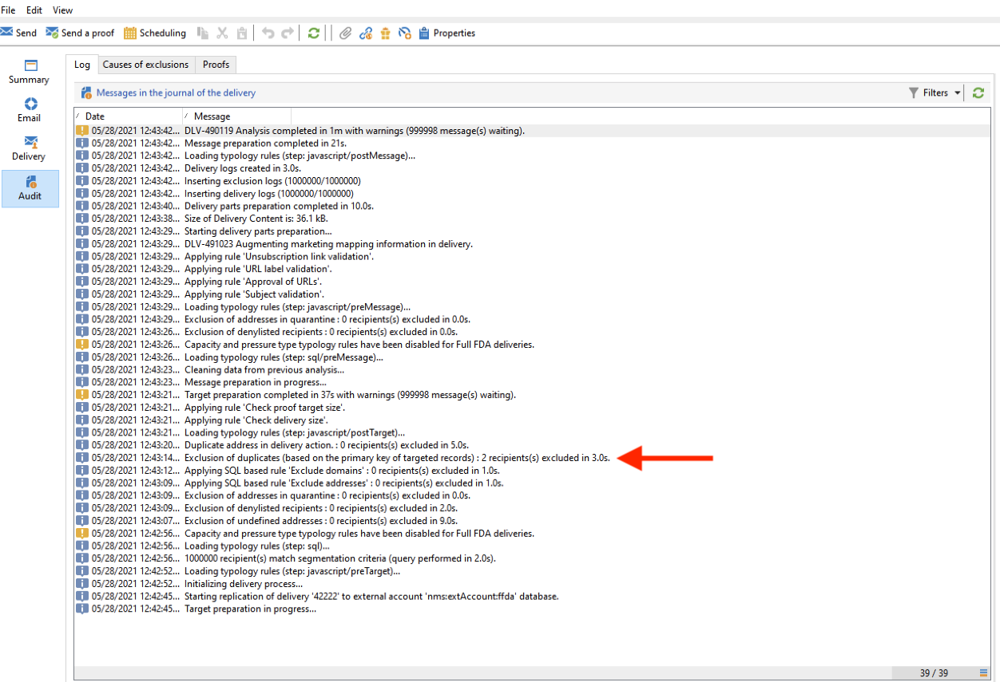

# Administración de claves y unicidad {#key-management}

En Campaign v8, la clave principal es un identificador único universal (UUID), que es una cadena de caracteres. Para crear este UUID, el elemento principal del esquema debe contener los atributos **autouuid** y **autopk** establecidos en **true**.

La campaña de Adobe v8 viene con el Snowflake como la base de datos principal. La arquitectura distribuida de la base de datos de Snowflake no proporciona mecanismos para administrar la unicidad de una clave dentro de una tabla: los usuarios finales son responsables de garantizar la coherencia de las claves dentro de la base de datos de Adobe Campaign.

Evitar duplicados en las claves, y especialmente en las claves principales, es obligatorio para preservar la coherencia de la base de datos relacional. Los duplicados en las claves principales producen problemas con las actividades de flujo de trabajo de administración de datos como Consulta, Reconciliación, Actualización, etc.

Adobe Campaign propone potentes herramientas de gestión de datos para reconciliar los datos, asegurarse de insertar o actualizar los datos según su presencia en la base de datos (Reconciliación) y eliminar duplicados antes de introducir los datos (Deduplicación). Como práctica recomendada, Adobe recomienda adoptar una estrategia [Detect](#detect-duplicates) y [Correcto](#correct-duplicates) como parte de su proceso general de gestión de datos, en caso de que se hayan cargado claves duplicadas en la base de datos.

## Detectar duplicados{#detect-duplicates}

Campaign viene con una nueva protección que elimina automáticamente cualquier UID duplicado de una audiencia durante la preparación del envío. Este nuevo mecanismo evita que se produzca cualquier error al preparar una entrega.

Como usuario final, puede comprobar esta información en los registros de envío: algunos destinatarios pueden excluirse del destinatario principal debido a la clave duplicada. En ese caso, se muestra la siguiente advertencia: `Exclusion of duplicates (based on the primary key or targeted records)`.



Cuando esto sucede, puede crear un flujo de trabajo para identificar las claves duplicadas. A continuación, podrá corregir estas claves. Para ello, siga los pasos a continuación:

1. Cree un nuevo flujo de trabajo.

   

1. Añadir una actividad **Query**
1. Seleccione la tabla **Recipient**

   

1. Agregue una actividad **Deduplication** y deduplique la clave principal (UUID). Mantenga solo un duplicado y marque la opción **Generate Complement** para crear una transición saliente para los duplicados.

   

1. Guarde los duplicados en una lista mediante una actividad List update .

   

Ahora, puede acceder a los destinatarios duplicados directamente desde la lista. Incluso si la transición contiene solo una de las filas duplicadas, todos los duplicados se registrarán en la lista.


## Corregir duplicados{#correct-duplicates}

Para corregir los duplicados, es necesario que los clientes actualicen los datos de Campaign. El tipo de acción está estrechamente vinculado a la naturaleza de los duplicados y a la implementación. Podemos enfrentarnos a múltiples casos que deberían requerir una estrategia de mitigación diferente (eliminar, combinar o actualizar).

>[!IMPORTANT]
>
>Las claves principales duplicadas impiden utilizar las actividades de flujo de trabajo integradas para seleccionar o actualizar una fila específica. Debido a la duplicación de UUID, la deduplicación de datos fallará y puede afectar a la integridad de la base de datos. Como consecuencia, se recomienda corregir los duplicados.

Por ejemplo:

* **Caso 1** : destinatarios duplicados con el mismo UUID e información de perfil (mismo correo electrónico, nombre, etc.) : los destinatarios parecen duplicados &quot;reales&quot; y la mitigación podría ser solo eliminar uno de los duplicados.
Otro enfoque podría ser combinar la información de un destinatario con la otra.

* **Caso 2** : destinatarios duplicados con el mismo UUID pero información de perfil diferente (correo electrónico, nombre, etc. diferentes):
esta vez, parece que hay diferentes perfiles y es posible que desee mantener ambos en la base de datos de Campaign, lo que significa que preferimos actualizar uno de los duplicados que genera un nuevo UUID. [Obtenga más información en este ejemplo](#deduplicate-sample).

Según su estrategia de mitigación, siempre puede consultar la lista desde otro flujo de trabajo y luego aplicar la actualización según sus necesidades. Para obtener más información, póngase en contacto con el Adobe.

### Muestra de deduplicación{#deduplicate-sample}

En el caso de los destinatarios duplicados, puede mantener ambos registros en la base de datos de Campaign. En ese caso, debe actualizar uno de ellos con un nuevo UUID.

Por lo tanto, para ejecutar una consulta de actualización SQL en la base de datos en la nube, puede utilizar la actividad de flujo de trabajo **SQL Data Management** y ejecutar la siguiente actualización SQL:

```sql
update nmsrecipient set urecipientid = uuid_string()
where semail = 'bretta37@adobe.com'
and urecipientid = 'c04d93f2-6012-4668-b523-88db1262cd46';
```


Una vez que la fila seleccionada se actualiza con un nuevo UUID, puede comprobar la fila actualizada desde la interfaz y observar que el UUID se ha actualizado según lo esperado. También puede detectar duplicados en la base de datos ejecutando el flujo de trabajo &quot;Detectar duplicados&quot; [como se explica aquí](#detect-duplicates).
