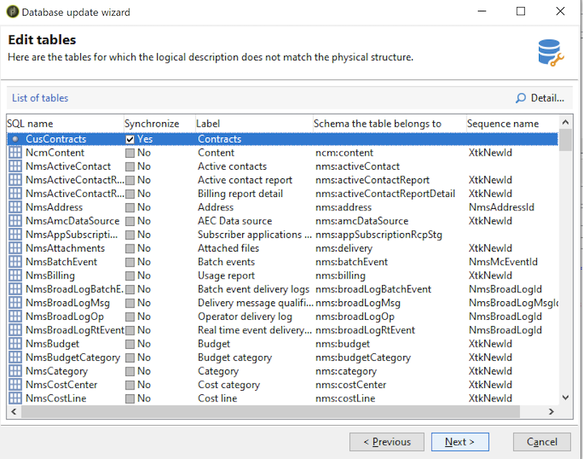
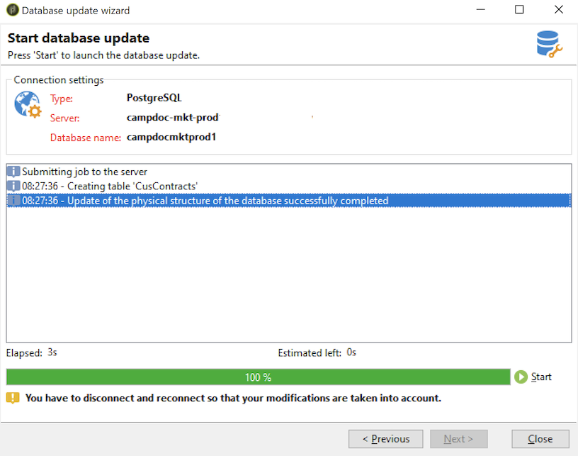

# Actualizar la estructura de la base de datos {#updating-the-database-structure}

Para aplicar las modificaciones realizadas en los esquemas, inicie el asistente de actualización de la base de datos. Se puede acceder a este asistente mediante **[!UICONTROL Tools > Advanced > Update database structure]**. Comprueba si la estructura física de la base de datos coincide con su descripción lógica y ejecuta los scripts de actualización de SQL.

Los módulos de la base de datos se rellenan y activan automáticamente.

Siga los pasos y vea el script SQL de actualización de la base de datos:

>[!NOTE]
>
>Se encuentra en un campo de edición y se puede modificar para eliminar o agregar código SQL.

A continuación, inicie la actualización de la base de datos:

