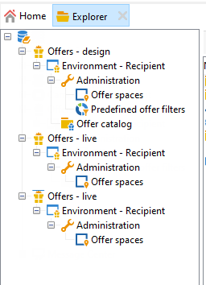
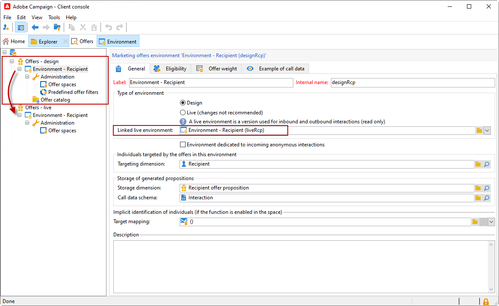
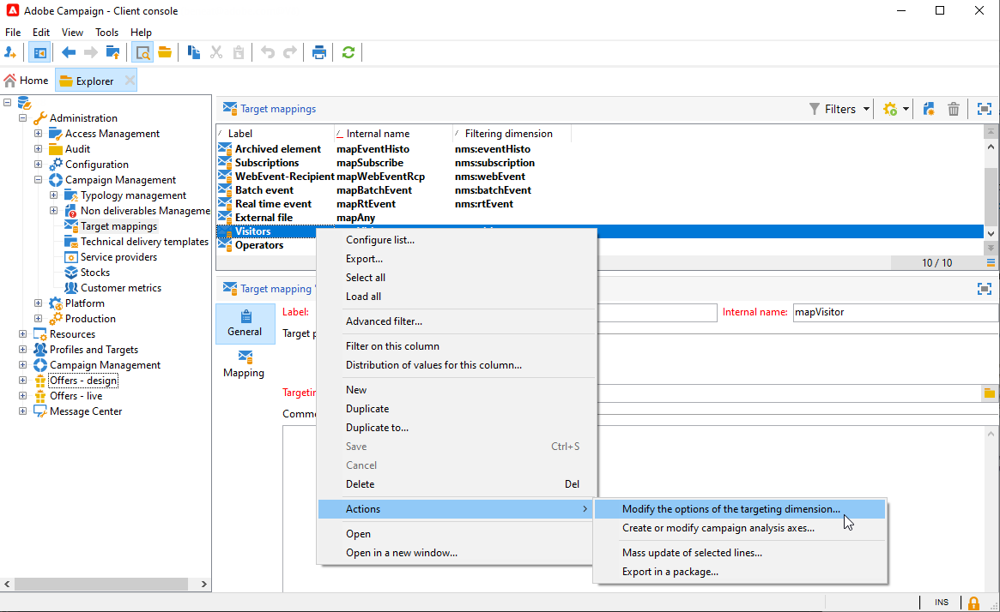
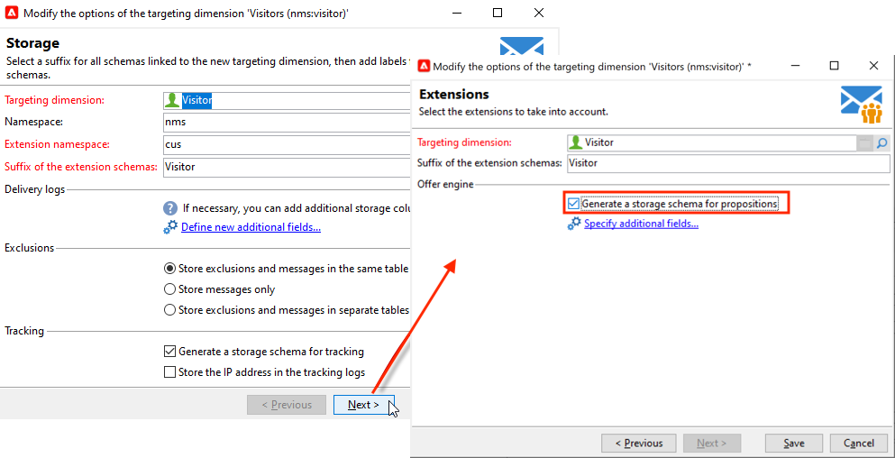
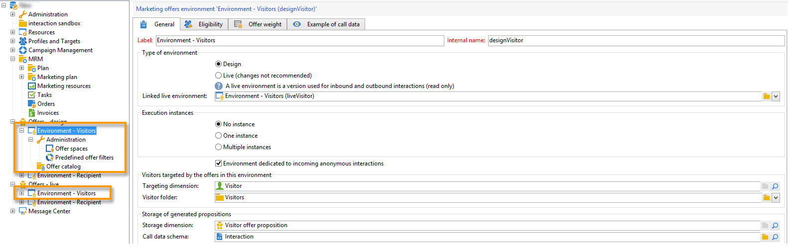

# Trabajo con entornos{#work-with-environments}

## Entornos en directo y de diseño{#live-design-environments}

La interacción funciona con dos tipos de entornos de oferta:

* Entornos de oferta **[!UICONTROL Design]** que incluyen ofertas que se están editando y pueden modificarse. Estas ofertas no han pasado a través del ciclo de aprobación y no se entregan a los contactos.
* Entornos de oferta **[!UICONTROL Live]** que incluyen ofertas aprobadas a medida que se presentan a los contactos. Las ofertas de este entorno son de solo lectura.

Cada entorno **[!UICONTROL Design]** está relacionado con un entorno **[!UICONTROL Live]**. Cuando se completa una oferta, sus reglas de contenido y de elegibilidad están sujetas a un ciclo de aprobación. Una vez completado este ciclo, la oferta correspondiente se implementa automáticamente en el entorno **[!UICONTROL Live]**. A partir de este momento, estará disponible para su envío.

De manera predeterminada, Campaign viene con un entorno **[!UICONTROL Design]** y un entorno **[!UICONTROL Live]** relacionado con él. Ambos entornos están preconfigurados para dirigirse a la [tabla de destinatarios integrada](../dev/datamodel.md#ootb-profiles).

>[!NOTE]
>
>Para dirigirse a la tabla de destinatarios, debe utilizar el asistente de asignación de destino para crear los entornos. [Más información](#creating-an-offer-environment).

Los administradores de envío solo pueden ver el entorno **[!UICONTROL Live]** y aprovechar las ofertas para enviarlas. Los administradores de ofertas pueden ver y utilizar el entorno **[!UICONTROL Design]**, así como ver el entorno **[!UICONTROL Live]**. [Más información](interaction-operators.md)

## Creación de un entorno para interacciones anónimas{#create-an-offer-environment}

De forma predeterminada, Campaign viene con un entorno integrado para dirigirse a la tabla de destinatarios (ofertas identificadas). Para dirigirse a otra tabla, como perfiles anónimos que visitan el sitio web para interacciones entrantes, debe actualizar la configuración.

Siga estos pasos:

1. Vaya a **[!UICONTROL Administration]** > **[!UICONTROL Campaign management]** > **[!UICONTROL Target mappings]**, haga clic con el botón derecho en la asignación de destino que desee utilizar y seleccione **[!UICONTROL Actions]** > **[!UICONTROL Modify the options of the targeting dimension]**.

   

1. Haga clic en **[!UICONTROL Next]**, seleccione la opción **[!UICONTROL Generate a storage schema for propositions]** y haga clic en **[!UICONTROL Save]**.

   

   >[!NOTE]
   >
   >Si la opción ya está marcada, anule la selección y vuelva a seleccionarla.

1. Adobe Campaign crea dos entornos - **[!UICONTROL Design]** y **[!UICONTROL Live]** - con información de direccionamiento de la asignación de destino habilitada anteriormente. El entorno está preconfigurado con la información de objetivo.

Si ha activado la asignación **[!UICONTROL Visitor]**, la casilla **[!UICONTROL Environment dedicated to incoming anonymous interactions]** se marca automáticamente en la pestaña **[!UICONTROL General]** del entorno.

Esta opción permite activar funciones específicas de interacción anónimas, especialmente al configurar espacios de oferta de entorno. También puede configurar opciones que le permiten cambiar de un entorno “identificado” a un entorno “anónimo”.

Por ejemplo, puede vincular un entorno de destinatario con espacio de ofertas (contacto identificado) con un espacio de oferta que coincida con un entorno de visitante (contacto no identificado). De esta manera, se ponen a disposición del contacto distintas ofertas en función de si está, o no, identificado. Para obtener más información, consulte [Creación de espacios de ofertas](interaction-offer-spaces.md).

>[!NOTE]
>
>Para obtener más información sobre interacciones anónimas en un canal entrante, consulte [Interacciones anónimas](anonymous-interactions.md).
