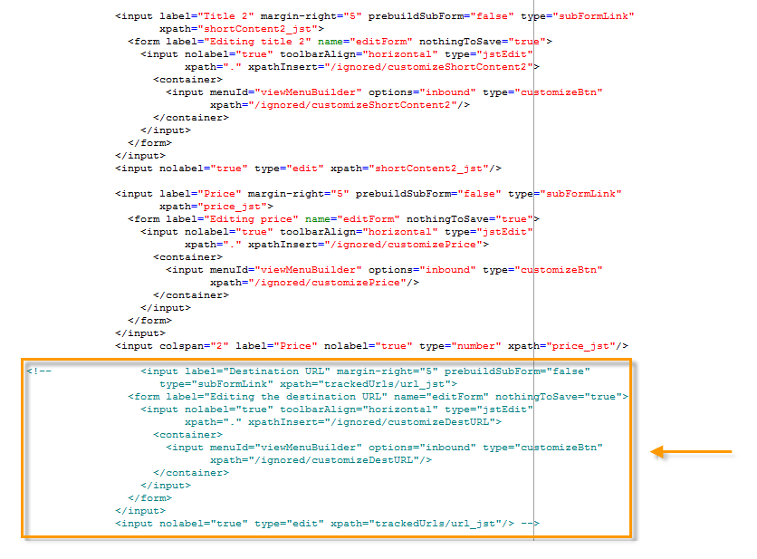

# Adición de una oferta en una página web{#add-an-offer-in-web}

Para llamar al motor de oferta en una página web, inserte una llamada a un código JavaScript directamente en la página. Esta llamada devuelve el contenido de la oferta en un elemento de destino.

La secuencia de comandos que llama a la URL tiene este aspecto:

```
<script id="interactionProposalScript" src="https://<SERVER_URL>/nl/interactionProposal.js?env=" type="text/javascript"></script>
```

El parámetro “**env**” recibe el nombre interno del entorno en directo dedicado a las interacciones anónimas.

Para presentar una oferta, se debe crear un entorno y un espacio de oferta en Adobe Campaign y, a continuación, configurar la página HTML.

Los siguientes casos de uso detallan las posibles opciones para integrar ofertas mediante JavaScript.

## Opción 1: modo HTML {#html-mode}

### Presentación de una oferta anónima {#presenting-an-anonymous-offer}

**Paso 1: Preparar el motor de oferta**

1. Abra la interfaz de Adobe Campaign y prepare un entorno anónimo.
1. Cree un espacio de oferta vinculado al entorno anónimo.
1. Cree una oferta y su representación vinculada al espacio de oferta.

**Paso 2: Actualizar el contenido de la página del HTML**

La página HTML debe incluir un elemento con un atributo @id con el valor del nombre interno del espacio de oferta creado (&quot;espacio de nombre i_internal&quot;). La oferta se insertará en este 
elemento mediante interacción.

En este ejemplo, el atributo @id recibe el valor “i_SPC12”, donde “SPC12” es el nombre interno del espacio de oferta creado anteriormente:

```
<div id="i_SPC12"></div>
```

En este ejemplo, la URL para llamar a la secuencia de comandos es la siguiente (“OE3” es el nombre interno del entorno en directo):

```
<script id="interactionProposalScript" src="https://instance.adobe.org:8080/nl/interactionProposal.js?env=OE3" type="text/javascript"></script>
```

>[!CAUTION]
>
>La etiqueta `<script>` no debe ser de cierre automático.

Esta llamada estática genera automáticamente una llamada dinámica que contiene todos los parámetros necesarios para el motor de oferta.

Este comportamiento permite utilizar varios espacios de oferta en la misma página, que se van a administrar mediante una sola llamada al motor de oferta.

**Paso 3: Mostrar los resultados en la página del HTML**

El motor de oferta devuelve el contenido de la representación de la oferta a la página del HTML:

```
<div id="banner_header">
 <div id="i_SPC12">
   <table>
    <tbody>
        <tr>
            <td><h3>Fly to Japan!</h3></td>
        </tr>
        <tr>
            <td></td>
            <td>
            <p>Discover Japan for 2 weeks at an unbelievable price!!</p>
            <p><b>2345 Dollars - All inclusive</b></p>
        </td>
        </tr>
    </tbody>
    </table>
 </div>
<script src="https://instance.adobe.org:8080/nl/interactionProposal.js?env=OE3" id="interactionProposalScript" type="text/javascript"></script>
</div>
```

### Presentación de una oferta identificada {#presenting-an-identified-offer}

Para presentar una oferta a un contacto identificado, el proceso es similar al detallado [en esta sección](#presenting-an-anonymous-offer).

En el contenido de la página web, se debe añadir la siguiente secuencia de comandos que identificará al contacto durante la llamada al motor de oferta:

```
<script type="text/javascript">
  interactionTarget = <contact_identifier>;
</script>
```

1. Vaya al espacio de oferta que la página web va a llamar, haga clic en **[!UICONTROL Advanced parameters]** y añada una o más claves de identificación.

   

   En este ejemplo, la clave de identificación está compuesta debido a que se basa en el mensaje de correo electrónico y el nombre del destinatario.

1. Durante la visualización de la página web, la evaluación de la secuencia de comandos permite pasar el ID de destinatario al motor de oferta. Si el ID está compuesto, las teclas se muestran en la misma secuencia como se utilizan en la configuración avanzada y se separan con un |.

   En el siguiente ejemplo, el contacto ha iniciado sesión en el sitio web y se reconoció durante la llamada al motor de oferta gracias a su correo electrónico y su nombre.

   ```
   <script type="text/javascript">
     interactionTarget = myEmail|myName;
   </script>
   ```

### Uso de una función de renderización de HTML {#using-an-html-rendering-function}

Para generar la representación de oferta HTML automáticamente, se puede utilizar una función de renderización.

1. Vaya al espacio de la oferta y haga clic en el vínculo **[!UICONTROL Edit functions]**.
1. Seleccione **[!UICONTROL Overload the HTML rendering function]**.
1. Vaya a la pestaña **[!UICONTROL HTML rendering]** e inserte las variables que coincidan con los campos definidos para el contenido de oferta en el espacio de oferta.

   

   En este ejemplo, la oferta se muestra en forma de anuncio en una página web y se compone de una imagen en la que se puede hacer clic y un título que coincide con los campos definidos en el contenido de la oferta.

## Opción 2: modo XML {#xml-mode}

### Presentación de una oferta {#presenting-an-offer}

Campaign **Interacción** Este módulo permite devolver un nodo XML a la página del HTML que llama al motor de oferta. Este nodo XML se puede procesar mediante funciones que se van a desarrollar en el lado del cliente.

La llamada al motor de oferta tiene este aspecto:

```
<script type="text/javascript" id="interactionProposalScript" src="https://<SERVER_URL>/nl/interactionProposal.js?env=&cb="></script>
```

* El parámetro “**env**” recibe el nombre interno del entorno en directo.

* El parámetro “**cb**” recibe el nombre de la función que va a leer el nodo XML devuelto mediante el motor que contiene la propuesta (devolución de llamada). Este parámetro es opcional.

* El parámetro “**t**” recibe el valor del destino, solo para una interacción identificada. Este parámetro también se puede pasar con la variable **interactionTarget.** Este parámetro es opcional.

* El parámetro “**c**” recibe la lista de nombres internos de las categorías. Este parámetro es opcional.

* El parámetro “**th**” recibe la lista de temas. Este parámetro es opcional.

* El parámetro “**gctx**” recibe los datos de llamada global (contexto) a toda la página. Este parámetro es opcional.

El nodo XML devuelto tiene el siguiente aspecto:

```
<propositions>
 <proposition id="" offer-id="" weight="" rank="" space="" div=""> //proposition identifiers
   ...XML content defined in Adobe Campaign...
 </proposition>
 ...
</propositions>
```

El caso de uso siguiente detalla las configuraciones que se deben realizar en Adobe Campaign para activar el modo XML y mostrar el resultado de la llamada al motor en la página del HTML.

1. **Creación de un entorno y un espacio de oferta**

   Para obtener más información sobre la creación de un entorno, consulte [esta página](interaction-env.md).

   Para obtener más información sobre la creación de un espacio de oferta, consulte [esta página](interaction-offer-spaces.md).

1. **Ampliación del esquema de oferta para añadir nuevos campos**

   Este esquema va a definir los siguientes campos: Título número 2 y precio.

   El nombre del esquema en el ejemplo es **cus:offer**

   ```
   <srcSchema _cs="Marketing offers (cus)" created="2013-01-18 17:14:20.762Z" createdBy-id="0"
              desc="" entitySchema="xtk:srcSchema" extendedSchema="nms:offer" img="nms:offer.png"
              label="Marketing offers" labelSingular="Marketing offers" lastModified="2013-01-18 15:20:18.373Z"
              mappingType="sql" md5="F14A7AA009AE1FCE31B0611E72866AC3" modifiedBy-id="0"
              name="offer" namespace="cus" xtkschema="xtk:srcSchema">
     <createdBy _cs="Administrator (admin)"/>
     <modifiedBy _cs="Administrator (admin)"/>
     <element img="nms:offer.png" label="Marketing offers" labelSingular="Marketing offer"
              name="offer">
       <element label="Content" name="view">
         <element label="Price" name="price" type="long" xml="true"/>
         <element label="Title 2" name="title2" type="string" xml="true"/>
   
         <element advanced="true" desc="Price calculation script." label="Script price"
                  name="price_jst" type="CDATA" xml="true"/>
         <element advanced="true" desc="Title calculation script." label="Script title"
                  name="title2_jst" type="CDATA" xml="true"/>
       </element>
     </element>
   </srcSchema>
   ```

   >[!CAUTION]
   >
   >Cada elemento debe definirse dos veces. Los elementos de tipo CDATA (“_jst”) pueden contener campos de personalización.
   >
   >Recuerde actualizar la estructura de la base de datos.

   Puede ampliar el esquema de oferta para añadir nuevos campos tanto en el lote como en el modo unitario, y en cualquier formato (texto, HTML y XML).

1. **Ampliación de la fórmula de oferta para editar nuevos campos y modificar un campo existente**

   Edite el formulario de entrada **Offer (nsm)**.

   En la sección “Views”, inserte los dos nuevos campos con el contenido siguiente:

   ```
   <input label="Title 2" margin-right="5" prebuildSubForm="false" type="subFormLink" xpath="title2_jst">
        <form label="Edit title 2" name="editForm" nothingToSave="true">
            <input nolabel="true" toolbarAlign="horizontal" type="jstEdit" xpath="." xpathInsert="/ignored/customizeTitle2">
            <container>
                <input menuId="viewMenuBuilder" options="inbound" type="customizeBtn" xpath="/ignored/customizeTitle2"/>
            </container>
            </input>
        </form>
    </input>
    <input nolabel="true" type="edit" xpath="title2_jst"/>
    <input label="Price" margin-right="5" prebuildSubForm="false" type="subFormLink" xpath="price_jst">
        <form label="Edit price" name="editForm" nothingToSave="true">
        <input nolabel="true" toolbarAlign="horizontal" type="jstEdit" xpath="." xpathInsert="/ignored/customizePrice">
            <container>
                <input menuId="viewMenuBuilder" options="inbound" type="customizeBtn" xpath="/ignored/customizePrice"/>
            </container>
        </input>
        </form>
    </input>
    <input colspan="2" label="Prix" nolabel="true" type="number" xpath="price_jst"/>
   ```

   Convierta en comentario el campo URL de destino:

   

   >[!CAUTION]
   >
   >Los campos del formulario (`<input>`) deben señalar a los elementos de tipo CDATA definidos en el esquema creado.

   La renderización en el formulario de representaciones de oferta tiene este aspecto:

   

   Se han añadido los campos **[!UICONTROL Title 2]** y **[!UICONTROL Price]** y ya no se muestra el campo **[!UICONTROL Destination URL]**.

1. **Creación de una oferta**

   Para obtener más información sobre la creación de ofertas, consulte [esta página](interaction-offer.md).

   En el siguiente caso de uso, la oferta se introduce de la siguiente manera:

   

1. **Aprobar la oferta**

   Apruebe una oferta o haga que la apruebe otra persona y, a continuación, actívela en el espacio de oferta creado en el último paso para que esté disponible en el entorno en directo vinculado.

1. **llamadas al motor y resultados en la página HTML**

   La llamada al motor de oferta en la página del HTML tiene este aspecto:

   ```
   <script id="interactionProposalScript" src="https://<SERVER_URL>/nl/interactionProposal.js?env=OE7&cb=alert" type="text/javascript">
   ```

   El valor del parámetro “**-**” es el nombre interno del entorno en directo.

   El valor del parámetro “**cb**” es el nombre de la función que necesita interpretar el nodo XML devuelto mediante el motor. En este ejemplo, la función llamada abre una ventana modal (función alerta()).

   El nodo XML devuelto mediante el motor de oferta tiene este aspecto:

   ```
   <propositions>
    <proposition id="a28002" offer-id="10322005" weight="1" rank="1" space="SPC14" div="i_SPC14">
     <xmlOfferView>
      <title>Travel to Russia</title>
      <price>3456</price>
      <description>Discover this vacation package!INCLUDES 10 nights. FEATURES buffet breakfast daily. BONUS 5th night free.</description>
      <image>
       <path>https://myinstance.com/res/Track/ae1d2113ed732d58a3beb441084e5960.jpg</path>
       <alt>Travel to Russia</alt>
      </image>
     </xmlOfferView>
    </proposition>
   </propositions>
   ```

### Uso de una función de renderización {#using-a-rendering-function-}

Es posible utilizar una función de renderización XML para crear una presentación de oferta. Esta función modifica el nodo XML que se devuelve a la página del HTML durante la llamada al motor de oferta.

1. Vaya al espacio de la oferta y haga clic en el vínculo **[!UICONTROL Edit functions]**.
1. Seleccione **[!UICONTROL Overload the XML rendering function]**.
1. Vaya a la pestaña **[!UICONTROL XML rendering]** e inserte la función deseada.

   La función puede tener este aspecto:

   ```
   function (proposition) {
     delete proposition.@id;
     proposition.@newAttribute = "newValue";
   } 
   ```


## Configuración de una integración de SOAP

Los servicios web SOAP proporcionados para la administración de ofertas son diferentes de los utilizados en Adobe Campaign. Se puede acceder a ellos a través de la dirección URL de interacción descrita en la sección anterior y permiten presentar o actualizar ofertas para un contacto determinado.

### Propuesta de oferta {#offer-proposition}

Para una propuesta de oferta mediante SOAP, añada el comando **nms:proposition#Propose** seguido de los parámetros siguientes:

* **targetId**: clave principal del destinatario (puede ser una clave compuesta).
* **maxCount**: especifica el número de propuestas de ofertas para el contacto.
* **context**: permite añadir información contextual en el esquema de espacio. Si el esquema utilizado es **nms:interaction**, se debe añadir **`<empty>`**.
* **categories**: especifica las categorías a las que las ofertas deben pertenecer.
* **themes**: especifica los tema a los que las ofertas deben pertenecer.
* **uuid**: valor de la cookie permanente de Adobe Campaign (“uuid230”).
* **nli**: valor de la cookie de sesión de Adobe Campaign (“nlid”).
* **noProp**: utilice el valor “true” para desactivar la inserción de propuestas.

>[!NOTE]
>
>Los ajustes **targetId** y **maxCount** son obligatorios. Los demás son opcionales.

Como respuesta a la consulta, el servicio SOAP devuelve los siguientes parámetros:

* **interactionld**: ID de la interacción.
* **propositions**: el elemento XML, contiene la lista de propuestas, cada una con su propio ID y representación HTML.

### Actualización de oferta {#offer-update}

Añada el comando **nms:interaction#UpdateStatus** a la dirección URL, seguido de estos parámetros:

* **proposition**: cadena de caracteres, contiene el ID de la propuesta dado como salida durante una propuesta de oferta. Consulte la [Propuesta de oferta](#offer-proposition).
* **status**: tipo cadena, especifica el nuevo estado de la oferta. Los valores posibles se mencionan en la enumeración **propositionStatus**, en el esquema **nms:common.** Por ejemplo, de forma predeterminada, el número 3 corresponde al estado **Accepted**.
* **context**: el elemento XML, permite añadir información contextual en el esquema de espacio. Si el esquema utilizado es **nms:interaction**, se debe añadir **`<empty>`**.

### Ejemplo de uso de una llamada a SOAP {#example-using-a-soap-call}

A continuación, se muestra un ejemplo de código para una llamada SOAP:

```
<%
  var space = request.parameters.sp
  var cnx = new HttpSoapConnection(
    "https://" + request.serverName + ":" + request.serverPort + "/interaction/" + env + "/" + space,
    "utf-8",
    HttpSoapConnection.SOAP_12)
  var session = new SoapService(cnx, "nms:interaction")
  var action = request.parameters.a
  if( action == undefined )
    action = 'propose'

  try
  {
    switch( action )
    {
    case "update":
      var proposition = request.parameters.p
      var status      = request.parameters.st
      session.addMethod("UpdateStatus", "nms:interaction#UpdateStatus",
       ["proposition", "string",
        "status",      "string",
        "context",     "NLElement"],
       [])
      session.UpdateStatus(proposition, status, <undef/>)
      var redirect = request.parameters.r
      if( redirect != undefined )
        response.sendRedirect(redirect)
      break;

    case "propose":
      var count = request.parameters.n
      var target = request.parameters.t
      var categorie = request.parameters.c
      var theme = request.parameters.th
      var layout = request.parameters.l
      if( count == undefined )
        count = 1
      session.addMethod("Propose", "nms:proposition#Propose",
       ["targetId",      "string",
        "maxCount",      "string",
         "categories",    "string",
         "themes",        "string",
        "context",       "NLElement"],
       ["interactionId", "string",
        "propositions",  "NLElement"])
      response.setContentType("text/html")
      var result = session.Propose(target, count, category, theme, <empty/>)
      var props = result[1]
  %><table><tr><%
      for each( var propHtml in props.proposition.*.mdSource )
      {
        %><td><%=propHtml%></td><%
      }
  %></tr></table><%
      break;
    }
  }
  catch( e )
  {
  }
  %>
```
