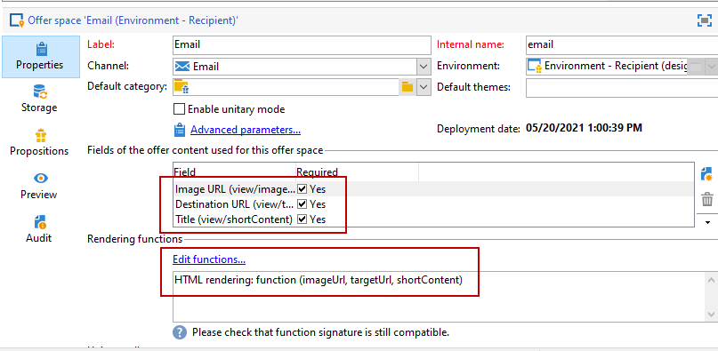

# Creación de espacios de oferta{#creating-offer-spaces}

El contenido del catálogo de ofertas se configura en espacios de oferta. De forma predeterminada, el contenido puede incluir los campos siguientes: **[!UICONTROL Title]**, **[!UICONTROL Destination URL]**, **[!UICONTROL Image URL]**, **[!UICONTROL HTML content]** y **[!UICONTROL Text content]**. La secuencia de campos se configura en el espacio de oferta.

Como **administrador técnico**, puede crear espacios de ofertas en el entorno Design. Debe tener acceso a la subcarpeta del espacio de ofertas. Una vez creados, estos espacios de oferta se duplican automáticamente en el entorno Live durante la aprobación de la oferta.

El procesamiento de HTML se crea mediante una función de procesamiento. La secuencia de los campos definidos en la función de renderización debe ser idéntica a la secuencia configurada en el contenido.



Para crear un nuevo espacio de oferta, siga los pasos a continuación:

1. En la lista de espacios de ofertas, haga clic en **[!UICONTROL New]**.

   

1. Seleccione el canal que desee utilizar y cambie la etiqueta del espacio de oferta.

   

1. Marque la opción **[!UICONTROL Enable unitary mode]**

1. Vaya a la ventana **[!UICONTROL Content field]** y haga clic en **[!UICONTROL Add]**.

   

1. Vaya al nodo **[!UICONTROL Content]** y seleccione los campos en el siguiente orden: **[!UICONTROL Title]**, luego **[!UICONTROL Image URL]**, **[!UICONTROL HTML content]**, y **[!UICONTROL Destination URL]**.

   

1. Marque la opción **[!UICONTROL Required]** para que cada campo sea obligatorio.

   >[!NOTE]
   >
   >Esta opción se utiliza en la vista previa y ofrece espacios de oferta no válidos al publicar si falta uno de los campos obligatorios en la oferta. Sin embargo, si una oferta ya está en directo en un espacio de oferta, estos criterios no se tienen en cuenta.

   

1. Haga clic en **[!UICONTROL Edit functions]** para crear una función de renderización.

   Estas funciones se utilizan para generar representaciones de oferta en un espacio de oferta. Existen varios formatos posibles: HTML o texto.

   **Nota**: el formato XML está restringido a interacciones entrantes que no están disponibles en esta versión del producto. [Más información](../start/v7-to-v8.md#gs-unavailable-features)

   _

1. Vaya a la pestaña **[!UICONTROL HTML rendering]** y seleccione **[!UICONTROL Overload the HTML rendering function]**.
1. Inserte la función de renderización.

   

## Estados de propuesta de oferta {#offer-proposition-statuses}

El estado de la propuesta de oferta varía en función de las interacciones con la población de destino. El módulo Campaign Interaction viene con un conjunto de valores que se pueden aplicar a la propuesta de oferta durante todo su ciclo de vida. Se debe configurar la plataforma para que el estado cambie cuando se cree y acepte la propuesta de oferta.

>[!NOTE]
>
>La actualización de estado es un proceso **asincrónico**. Se lleva a cabo mediante el flujo de trabajo de seguimiento, que se activa cada hora.

### Lista de estado de oferta {#status-list}

Los estados de oferta disponibles son:

* **[!UICONTROL Accepted]**
* **[!UICONTROL Scheduled]**
* **[!UICONTROL Generated]**
* **[!UICONTROL Interested]**
* **[!UICONTROL Presented]**
* **[!UICONTROL Rejected]**

Estos valores no se aplican de forma predeterminada: deben configurarse.

>[!NOTE]
>
>El estado de una propuesta de oferta se cambia automáticamente a “Presented” si la oferta está vinculada a una entrega con el estado “Sent”.

### Estado de la oferta cuando se crea la propuesta {#configuring-the-status-when-the-proposition-is-created}

Cuando se **crea** una propuesta de oferta, su estado se actualiza.

En el entorno **[!UICONTROL Design]**, para cada espacio de oferta, configure el estado para que se aplique cuando se cree una propuesta, según la información que desee mostrar en los informes de oferta.

Para realizar esto, siga los pasos a continuación:

1. Vaya a la pestaña **[!UICONTROL Storage]** del espacio deseado.
1. Seleccione el estado que se aplicará a la propuesta cuando se cree.

   

### Estado de la oferta cuando se acepta la propuesta {#configuring-the-status-when-the-proposition-is-accepted}

Una vez que se haya **aceptado** una propuesta de oferta, use uno de los valores proporcionados de forma predeterminada para configurar el nuevo estado de la propuesta. La actualización se aplica cuando un destinatario hace clic en un vínculo de la oferta.

Para realizar esto, siga los pasos a continuación:

1. Vaya a la pestaña **[!UICONTROL Storage]** del espacio deseado.
1. Seleccione el estado que desea aplicar a la propuesta cuando se acepte.

   


**Interacción entrante**

La pestaña **[!UICONTROL Storage]** permite definir los estados para oferta **proposed** y **accepted** únicamente. Para la interacción entrante, el estado de las propuestas de oferta debe especificarse directamente en la dirección URL para llamar al motor de oferta, en lugar de a través de la interfaz. De este modo, se puede especificar qué estado aplicar en otros casos, por ejemplo si se rechaza una propuesta de oferta.

```
<BASE_URL>?a=UpdateStatus&p=<PRIMARY_KEY_OF_THE_PROPOSITION>&st=<NEW_STATUS_OF_THE_PROPOSITION>&r=<REDIRECT_URL>
```

Por ejemplo, la propuesta (identificador **40004**) que coincide con la oferta de **Home insurance** mostrada en el sitio **Neobank** contiene la siguiente dirección URL:

```
<BASE_URL>?a=UpdateStatus&p=<40004>&st=<3>&r=<"http://www.neobank.com/insurance/subscribe.html">
```

En cuanto un visitante hace clic en la oferta y, por lo tanto, en la dirección URL, el estado **[!UICONTROL Accepted]** (valor **3**) se aplica a la propuesta y el visitante se redirige a una nueva página del sitio **Neobank** para obtener el contrato de seguro.

>[!NOTE]
>
>Si se desea especificar otro estado en la dirección URL (por ejemplo, si se rechaza una propuesta de oferta), se debe utilizar el valor correspondiente al estado deseado. Ejemplo: **[!UICONTROL Rejected]** = &quot;5&quot;, **[!UICONTROL Presented]** = &quot;1&quot; y así sucesivamente.
>
>Los estados y sus valores se pueden recuperar en el esquema de datos **[!UICONTROL Offer propositions (nms)]**. Para obtener más información, consulte [esta página](../dev/create-schema.md).

**Interacción saliente**

Puede aplicar automáticamente el estado **[!UICONTROL Interested]** a una propuesta de oferta cuando la entrega contenga un vínculo. Simplemente añada el valor **_urlType=&quot;11&quot;** al vínculo:

```
<a _urlType="11" href="<DEST_URL>">Link inserted into the delivery</a>
```

## Vista previa de oferta por espacio {#offer-preview-per-space}

En la pestaña **[!UICONTROL Preview]**, puede ver las ofertas para las que el destinatario es elegible mediante un método elegido. En el siguiente ejemplo, el destinatario es elegible para las tres propuestas de oferta por correo electrónico.


Si un destinatario no es elegible para ninguna oferta, esto se muestra en la vista previa.


La vista previa puede omitir los contextos cuando están restringidos a un espacio. Este es el caso cuando el esquema de interacción se ha ampliado para añadir campos a los que se hace referencia en un espacio mediante un canal entrante.

Para obtener más información, consulte este ejemplo en [Documentación de Campaign Classic v7](https://experienceleague.adobe.com/docs/campaign-classic/using/managing-offers/advanced-parameters/extension-example.html?lang=es){target="_blank"}.