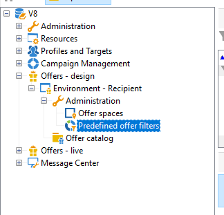

# Creación de filtros predefinidos{#creating-pre-defined-filters}

Cree filtros predefinidos para definir reglas de idoneidad para la población de destino que se pueda reutilizar fácilmente durante la creación de la oferta. Son específicos a cada entorno y toman en cuenta los parámetros de oferta.

>[!NOTE]
>
>La interfaz de usuario web de Adobe Campaign le ofrece una interfaz fácil de usar para administrar y personalizar sin esfuerzo los filtros predefinidos para satisfacer sus necesidades específicas. Debe crearla una sola vez y guardarla para usarla en el futuro. Para obtener más información sobre los filtros predefinidos para la interfaz de usuario web, consulte la [documentación de la interfaz de usuario web de Adobe Campaign](https://experienceleague.adobe.com/en/docs/campaign-web/v8/start/predefined-filters){target=_blank}.

Para crear un filtro predefinido, siga el siguiente proceso:

1. Vaya a la carpeta **[!UICONTROL Administration]** y seleccione **[!UICONTROL Pre-defined offer filters]**.

   

1. Haga clic en **[!UICONTROL New]**.

   

1. Cambie la etiqueta para poder identificar el filtro más adelante.

   

1. Seleccione el campo va a corresponder a la condición de filtrado.

   

1. Seleccione un operador y un valor si es necesario y, luego, guarde la consulta.

   

1. Haga clic en **[!UICONTROL Preview]** para ver el resultado del filtro.

   
