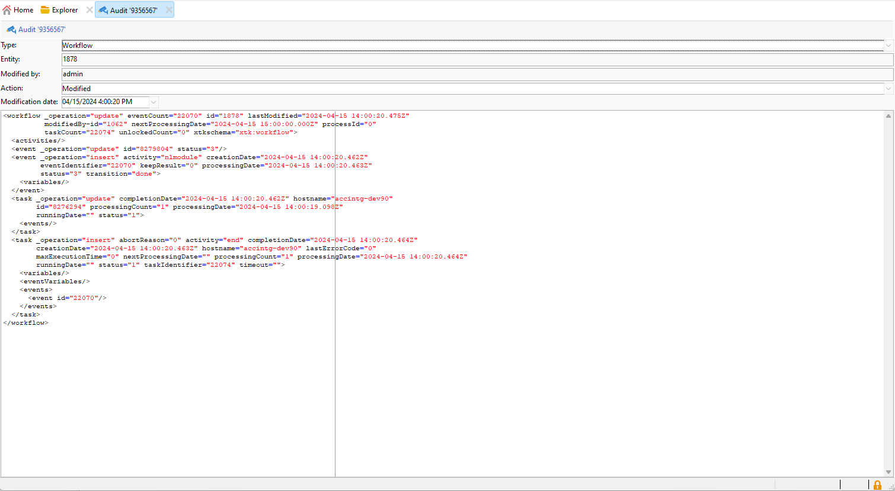

# Pista de auditoría{#audit-trail}

La funcionalidad **[!UICONTROL Audit trail]** en Adobe Campaign ofrece un registro granular de todas las modificaciones realizadas en entidades importantes dentro de su instancia, normalmente aquellas que afectan significativamente al funcionamiento sin problemas de la instancia. Funciona como un registro en tiempo real y captura una lista detallada de acciones y eventos a medida que se producen.

>[!NOTE]
>
>Adobe Campaign no audita los cambios realizados en los derechos de usuario, las plantillas, la personalización o las campañas.\
>Solo los administradores de la instancia pueden administrar la pista de auditoría.

+++ Más información sobre las Entidades disponibles de pista de auditoría

* **Registro de auditoría de esquemas**: permite explorar los cambios realizados en los esquemas, así como identificar quién realizó estas modificaciones y cuándo se produjeron.

  Para obtener información detallada sobre los esquemas, consulte [página](../dev/schemas.md).

* **Registro de auditoría de flujo de trabajo** rastrea todas las acciones relacionadas con sus flujos de trabajo, incluyendo:

   * Start
   * Pause
   * Stop
   * Restart
   * Limpieza igual al historial de purga de acciones
   * Simular, que es igual a la acción Iniciar en modo de simulación
   * Activación igual a la acción Ejecutar tareas pendientes ahora
   * Interrupción incondicional

  Para obtener más información sobre los flujos de trabajo, consulte esta [página](../../automation/workflow/about-workflows.md).

  Para obtener más información sobre cómo monitorizar los flujos de trabajo, consulte la [sección dedicada](../../automation/workflow/monitor-workflow-execution.md).

* **Seguimiento de auditoría de opciones** le permite comprobar las actividades y las últimas modificaciones realizadas en sus opciones.

  Para obtener más información sobre las opciones, consulte esta [página](https://experienceleague.adobe.com/es/docs/campaign-classic/using/installing-campaign-classic/appendices/configuring-campaign-options).

* **Registro de auditoría de envíos** le permite comprobar las actividades y las últimas modificaciones realizadas en los envíos.

  Para obtener más información sobre las entregas, consulte esta [página](../start/create-message.md).

* **Cuenta externa** le permite comprobar las modificaciones realizadas en cuentas externas, utilizadas por procesos técnicos como flujos de trabajo técnicos o flujos de trabajo de campañas.

  Para obtener más información sobre la cuenta externa, consulte esta [página](../config/external-accounts.md).

* **Asignación de entregas** le permite supervisar las actividades y las modificaciones recientes realizadas en sus Asignaciones de entregas.

  Para obtener más información sobre la asignación de envíos, consulte esta [página](../audiences/target-mappings.md).

* **Aplicación web** le permite comprobar las modificaciones realizadas en los formularios web de Campaign V8 que se usan para crear páginas con campos de entrada y selección, y que pueden incluir datos de la base de datos.

  Para obtener más información sobre la aplicación web, consulte esta [página](../dev/webapps.md).

* **Oferta** le permite comprobar las actividades y las últimas modificaciones realizadas en sus ofertas.

  Para obtener más información sobre la oferta, consulte esta [página](../interaction/interaction.md).

* **Operador** le permite supervisar las actividades y las modificaciones recientes realizadas en sus Operadores.

  Para obtener más información sobre los operadores, consulte esta [página](../interaction/interaction-operators.md).

+++

## Acceso a Pista de auditoría {#accessing-audit-trail}

Para acceder a **[!UICONTROL Audit trail]** de su instancia:

1. Acceda al menú **[!UICONTROL Explorer]** de su instancia.

1. En el menú **[!UICONTROL Administration]**, seleccione **[!UICONTROL Audit]** y luego **[!UICONTROL Audit Trail]**.

   

1. La ventana **[!UICONTROL Audit trail]** se abre con la lista de sus entidades. Adobe Campaign auditará las acciones de creación, edición y eliminación de las diferentes entidades.

   Seleccione una de las entidades para obtener más información sobre las últimas modificaciones.

1. La ventana **[!UICONTROL Audit entity]** le proporciona información más detallada sobre la entidad elegida, como:

   * **[!UICONTROL Type]**: flujo de trabajo, opciones, envíos o esquemas.
   * **[!UICONTROL Entity]**: nombre interno de sus actividades.
   * **[!UICONTROL Modified by]**: nombre de usuario de la última persona que modificó esta entidad por última vez.
   * **[!UICONTROL Action]**: última acción realizada en esta entidad, ya sea creada, modificada o eliminada.
   * **[!UICONTROL Modification date]**: fecha de la última acción realizada en esta entidad.

   

>[!NOTE]
>
>De manera predeterminada, el período de retención se establece en 180 días para **[!UICONTROL Audit logs]**. Este valor se puede modificar en el asistente de implementación.

## Habilitar/deshabilitar pista de auditoría {#enable-disable-audit-trail}

La pista de auditoría se puede activar o desactivar fácilmente para una actividad específica si, por ejemplo, desea ahorrar espacio en la base de datos.

Para ello:

1. Acceda al menú **[!UICONTROL Explorer]** de su instancia.

1. En el menú **[!UICONTROL Administration]**, seleccione **[!UICONTROL Platform]** y luego **[!UICONTROL Options]**.

1. Seleccione una de las siguientes opciones en función de la entidad que desee activar/desactivar:

   * Para el flujo de trabajo: **[!UICONTROL XtkAudit_Workflows]**
   * Para esquemas: **[!UICONTROL XtkAudit_DataSchema]**
   * Para las opciones: **[!UICONTROL XtkAudit_Option]**
   * Para los envíos: **[!UICONTROL XtkAudit_Delivery]**
   * Para la cuenta externa: **[!UICONTROL XtkAudit_ExtAccount]**
   * Para asignación de envío: **[!UICONTROL XtkAudit_DeliveryMapping]**
   * Para la aplicación web: **[!UICONTROL XtkAudit_WebApp]**
   * Para la oferta: **[!UICONTROL XtkAudit_Offer]**
   * Para el operador: **[!UICONTROL XtkAudit_Operator]**
   * Para cada entidad: **[!UICONTROL XtkAudit_Enable_All]**

   

1. Cambie **[!UICONTROL Value]** a 1 si desea habilitar la entidad o a 0 si desea deshabilitarla.

   

1. Haga clic en **[!UICONTROL Save]**.
