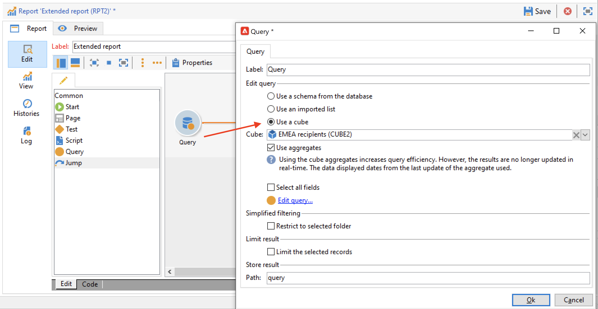
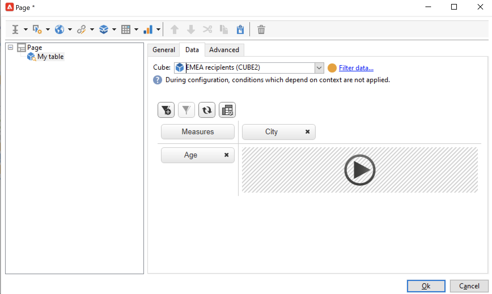

# Crear un cubo{#create-a-cube}

## Espacio de trabajo de cubos {#cube-workspace}

Para acceder a los cubos, vaya a **[!UICONTROL Administration > Configuration > Cubes]** desde el explorador de Campaign.

Con los cubos puede:

* Exporte los datos directamente en un informe, diseñado en la ficha **[!UICONTROL Reports]** de la plataforma Adobe Campaign.

  Para ello, cree un nuevo informe y seleccione el cubo que desee utilizar.

  

  Los cubos aparecen como plantillas basadas en los informes creados. Una vez que haya elegido una plantilla, haga clic en **[!UICONTROL Create]** para configurar y ver el nuevo informe.

  Puede adaptar las medidas, cambiar el modo de visualización o configurar la tabla y, a continuación, mostrar el informe usando el botón principal.

  

* Hacer referencia a un cubo en la casilla **[!UICONTROL Query]** de un informe para utilizar sus indicadores, como se muestra a continuación:

  

* Inserte una tabla dinámica basada en un cubo en cualquier página de un informe. Para ello, haga referencia al cubo que desee utilizar en la pestaña **[!UICONTROL Data]** de la tabla dinámica de la página correspondiente.

  

  Para obtener más información sobre esto, consulte [Exploración de los datos en un informe](cube-tables.md#explore-the-data-in-a-report).

>[!CAUTION]
>
>Se requieren permisos de administrador para crear cubos.
>

## Crear un cubo{#cube-create}

Antes de empezar a crear un informe de cubo, identifique las dimensiones y medidas relevantes y créelas en el cubo.

Para crear un cubo, siga los siguientes pasos:

1. Seleccione la tabla de trabajo. [Más información](#select-the-work-table).
1. Defina las dimensiones. [Más información](#define-dimensions).
1. Defina las medidas. [Más información](#build-indicators).
1. Cree acumulados (opcional). [Más información](customize-cubes.md#calculate-and-use-aggregates).

En el siguiente ejemplo, aprenda a crear rápidamente un cubo simple en un informe para exportar sus medidas.

### Seleccione la tabla de trabajo {#select-the-work-table}

Para crear un cubo, siga los pasos a continuación:

1. Haga clic en el botón **[!UICONTROL New]** situado sobre la lista de cubos.

   

1. Seleccione el esquema que contiene los elementos que desea explorar (también conocido como &quot;esquema de hechos&quot;). En este ejemplo, seleccione la tabla predeterminada **Destinatario**.
1. Haga clic en **[!UICONTROL Save]** para crear el cubo: se agrega a la lista de cubos. Ahora puede utilizar las pestañas para configurarlo.

1. Haga clic en **[!UICONTROL Filter the source data...]** para aplicar los cálculos de este cubo a los datos de la base de datos.

   

### Defina las dimensiones {#define-dimensions}

Una vez creado el cubo, defina sus dimensiones. Las dimensiones son los ejes de análisis definidos para cada cubo en función de su esquema de hechos relacionado. Estas son las dimensiones exploradas en el análisis, como el tiempo (año, mes, fecha), una clasificación de productos o contratos (familia, referencia, etc.), un segmento de población (por ciudad, grupo de edad, estado, etc.).

Para crear dimensiones, siga los pasos a continuación:

1. Vaya a la pestaña **[!UICONTROL Dimension]** del cubo y haga clic en el botón **[!UICONTROL Add]** para crear una nueva dimensión.
1. En **[!UICONTROL Expression field]**, haga clic en el icono **[!UICONTROL Edit expression]** para seleccionar el campo que contiene los datos relevantes.

   

1. En este ejemplo, se selecciona el destinatario **Age**. Para este campo, se puede definir el agrupamiento para reunir las edades y facilitar la lectura de la información. Se recomienda utilizar un agrupamiento cuando exista la probabilidad de que haya varios valores separados.

Para ello, marque la opción **[!UICONTROL Enable binning]**. [Más información](customize-cubes.md#data-binning).

1. Añada una dimensión de tipo **Fecha.** Aquí nos interesa mostrar las fechas de creación del perfil de destinatario. Para ello, haga clic en **[!UICONTROL Add]** y seleccione el campo **[!UICONTROL Creation date]** en la tabla de destinatarios.
Puede personalizar el modo de visualización de la fecha. Para ello, seleccione la jerarquía que se va a utilizar y los niveles que se van a generar:

En nuestro ejemplo, solo queremos mostrar años, meses y días. Tenga en cuenta que no puede trabajar con semanas y semestres/meses al mismo tiempo: estos niveles no son compatibles.

1. Cree otra dimensión para analizar los datos relacionados con la ciudad del destinatario. Para ello, añada una nueva dimensión y seleccione la ciudad en el nodo **[!UICONTROL Location]** del esquema de destinatarios.

Puede habilitar el agrupamiento para facilitar la lectura de la información y vincular los valores a una [enumeración](../config/enumerations.md).

Seleccione la enumeración en la lista desplegable. Observe que esta enumeración debe definirse como **[!UICONTROL Reserved for binning]**.

Solo se muestran los valores de la enumeración. Los demás se agrupan con la etiqueta definida en el campo **[!UICONTROL Label of the other values]**.

Para obtener más información, consulte [esta sección](customize-cubes.md#dynamically-manage-bins).

### Genere los indicadores {#build-indicators}

Una vez definidas las dimensiones, especifique un modo de cálculo para los valores que se van a mostrar en las celdas.

Para ello, cree los indicadores en la pestaña **[!UICONTROL Measures]**. Cree tantas medidas como columnas que desee mostrar en los informes basados en este cubo.

Para crear indicadores, siga los pasos a continuación:

1. Vaya a la ficha **[!UICONTROL Measures]** y haga clic en el botón **[!UICONTROL Add]**.
1. Seleccione el tipo de medida y la fórmula que desea aplicar. En este ejemplo, se cuenta el número de mujeres entre los destinatarios. La medición se basa en el esquema de hechos y utiliza el operador **[!UICONTROL Count]**.

   

   Use el vínculo **[!UICONTROL Filter the measure data...]** para seleccionar solo mujeres. [Más información](customize-cubes.md#define-measures).

   

1. Introduzca la etiqueta de la medida y guárdela.

   

1. Guarde el cubo.

Ahora puede crear un informe basado en este cubo. [Más información](cube-tables.md).
