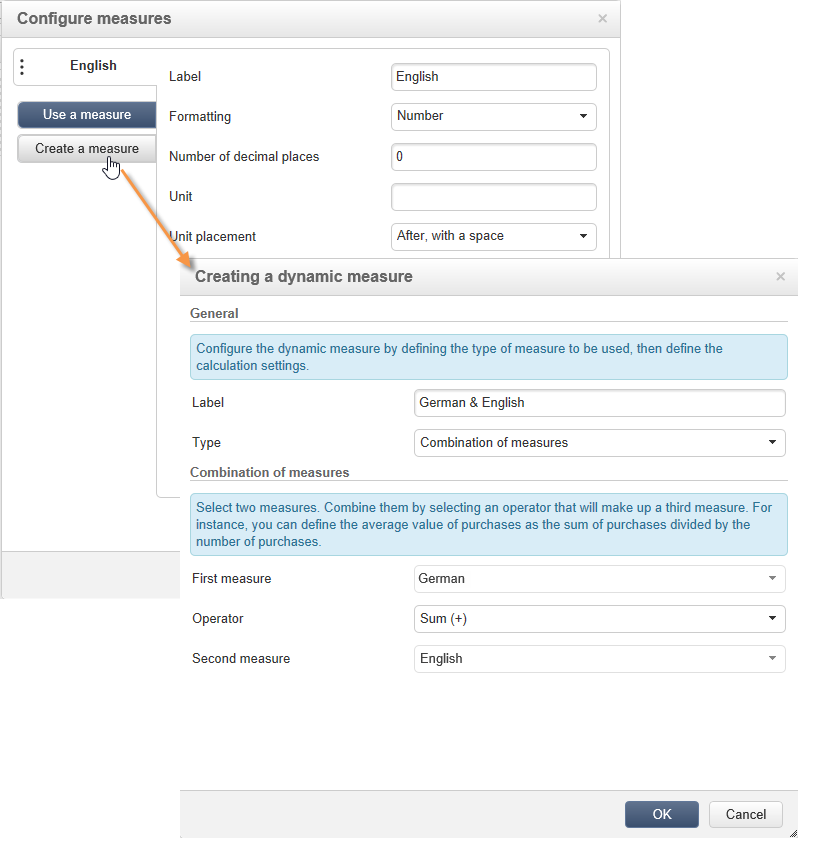
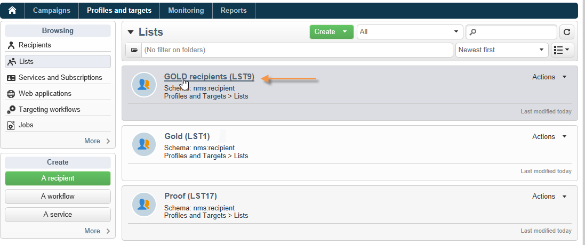

# Uso de cubos para explorar datos{#use-cubes-to-create-reports}

Utilice los cubos para crear informes e identificar y seleccionar datos de la base de datos. Puede hacer lo siguiente:

* Crear informes basados en cubos. [Más información](#explore-the-data-in-a-report).
* Recopilar los datos de la base de datos y agruparlos en listas, por ejemplo, para identificar y crear destinatarios y entregas. [Más información](#build-a-target-population).
* Inserte una tabla dinámica en un informe y haga referencia a un cubo existente en él. [Más información](#insert-a-pivot-table-into-a-report).

## Exploración de los datos de un informe {#explore-the-data-in-a-report}

### Paso 1: Creación de un informe basado en un cubo {#step-1---create-a-report-based-on-a-cube}

Una vez que [cubo configurado](cube-indicators.md), se puede utilizar como plantilla para crear un nuevo informe.

Para crear un informe basado en un cubo existente, siga los pasos a continuación:

1. En la pestaña **[!UICONTROL Reports]**, haga clic en el botón **[!UICONTROL Create]** y seleccione el cubo recién creado.

   

1. Haga clic en el botón **[!UICONTROL Create]** para confirmar: esto le lleva a la configuración del informe y a la página de visualización.

   De forma predeterminada, las dos primeras dimensiones disponibles se ofrecen en líneas y columnas, pero no se muestra ningún valor en la tabla. Para generar la tabla, haga clic en el icono principal:

   

1. Puede cambiar los ejes de la dimensión, eliminarlos, agregar nuevas medidas, etc. Para ello, utilice los iconos adecuados.

   

   Estas operaciones se detallan a continuación.

### Paso 2: Selección de líneas y columnas {#step-2---select-lines-and-columns}

La visualización predeterminada muestra las dos primeras dimensiones del cubo (edad y ciudad, en este caso).

Los botones **[!UICONTROL Add]** en cada eje permiten añadir dimensiones.

1. Seleccione las dimensiones que desea mostrar en las líneas y columnas de la tabla. Para ello, arrastre y suelte las dimensiones disponibles.
1. Seleccione las dimensiones que desee añadir a la tabla desde la lista:
   

1. Luego seleccione los parámetros de esta dimensión.

   

   Estos parámetros dependen del tipo de datos de la dimensión seleccionada.

   Por ejemplo, en el caso de las fechas, puede haber disponibles varios niveles. Para más información, consulte [Visualización de medidas](customize-cubes.md#display-measures).

   En ese caso, están disponibles las siguientes opciones:

   

   Puede:

   * Expandir los datos durante la carga: los valores se muestran de forma predeterminada cada vez que se actualiza el informe (valor predeterminado: no).
   * Mostrar el total al final de la línea: cuando los datos se muestran en columnas, una opción adicional permite mostrar el total al final de la línea: se añade una columna a la tabla (valor predeterminado: sí).
   * Aplicar una clasificación: los valores de la columna se pueden ordenar según el valor, la etiqueta o en función de una medida (valor predeterminado: por valor).
   * Mostrar los valores en orden ascendente (a-z, 0-9) o descendente (z-a, 9-0).
   * Cambiar el número de columnas que desea mostrar al cargar (número predeterminado: 200).

1. Haga clic en **[!UICONTROL Ok]** para confirmar que la dimensión se añada a las ya existentes.

   El aviso amarillo sobre la tabla indica que se han realizado cambios. Haga clic en el botón **[!UICONTROL Save]** para guardarlos.

   

### Paso 3: Configuración de las medidas que desea mostrar {#step-3---configure-the-measures-to-display}

Una vez definidas las líneas y las columnas, seleccione las medidas que desee mostrar. De forma predeterminada, solo se muestra una medida.

Para añadir y configurar medidas, siga los pasos a continuación:

1. Haga clic en el botón **[!UICONTROL Measures]**.

   

1. Con el **[!UICONTROL Use a measure]** , seleccione una de las medidas existentes.

   

   Elija la información que desea mostrar y las opciones de formato. La lista de opciones depende del tipo de medida.

   

   La configuración general de medidas también está disponible a través del icono **[!UICONTROL Edit the configuration of the pivot table]** del encabezado.

   

   A continuación puede elegir si desea mostrar o no las etiquetas de medida. [Más información](customize-cubes.md#configure-the-display).

1. Puede generar nuevas medidas basadas en las existentes. Para ello, haga clic en **[!UICONTROL Create a measure]** y configúrelo.

   

   Los siguientes tipos de medidas está disponibles:

   * Combinación de medidas: este tipo de medida permite crear la nueva medida utilizando las existentes:

     Los operadores disponibles son: suma, diferencia, multiplicación y tasa.

   * Proporción: este tipo de medida permite calcular el número de registros medidos para una dimensión determinada. Se puede calcular la proporcionalidad en función de una dimensión o subdimensión.
   * Variación: esta medida permite calcular la variación en valores de un nivel.
   * Desviación estándar: este tipo de medida permite calcular las desviaciones dentro de cada grupo de celdas en comparación con la media de los valores. Por ejemplo, se puede comparar el volumen de compra de todos los segmentos existentes.

   Una vez creada, la medida se añade al informe.

   

   Una vez creada una medida, puede editarla y cambiar su configuración. Para ello, haga clic en el **[!UICONTROL Measures]** y, a continuación, vaya a la pestaña de la medida que desea editar.

   A continuación, haga clic en **[!UICONTROL Edit the dynamic measure]** para acceder al menú de configuración.

## Creación de una población objetivo {#build-a-target-population}

Los informes creados con los cubos permiten recopilar datos de la tabla y guardarlos en una lista.

Para agrupar una población en una lista, siga los pasos a continuación:

1. Haga clic en las celdas que contienen los usuarios que quiera agrupar y selecciónelas. A continuación, haga clic en el icono **[!UICONTROL Add to cart]**.

   

   Haga esto las veces que sean necesarias para recopilar varios perfiles.

1. Haga clic en el botón **[!UICONTROL Show cart]** para ver su contenido antes de ejecutar la exportación.

   

1. Utilice el **[!UICONTROL Export]** para agrupar los elementos del carro en una lista.

   Introduzca el nombre de la lista y seleccione el tipo de exportación que desea realizar.

   

   Haga clic en **[!UICONTROL Start]** para ejecutar la exportación.

1. Una vez finalizada la exportación, un mensaje confirma su ejecución y el número de registros que se han procesado.

   

   Puede guardar el contenido del carro o vaciarlo.

   La nueva lista está disponible a través de **[!UICONTROL Profiles and targets]** pestaña.

   

## Inserción de una tabla dinámica en un informe {#insert-a-pivot-table-into-a-report}

Para crear una tabla y explorar los datos de un cubo, siga los pasos a continuación:

1. Cree un nuevo informe con una sola página e inserte una tabla dinámica.

   

1. En la pestaña **[!UICONTROL Data]** de la página, seleccione un cubo para procesar las dimensiones que contiene y mostrar las medidas calculadas.

   

   Esto permite generar el informe que se desea mostrar. Para obtener más información, consulte [Paso 2: Selección de líneas y columnas](#step-2---select-lines-and-columns).
