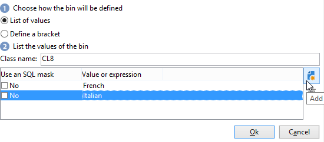
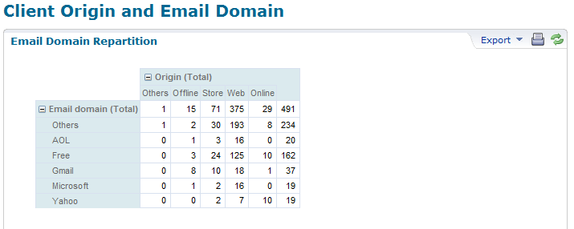
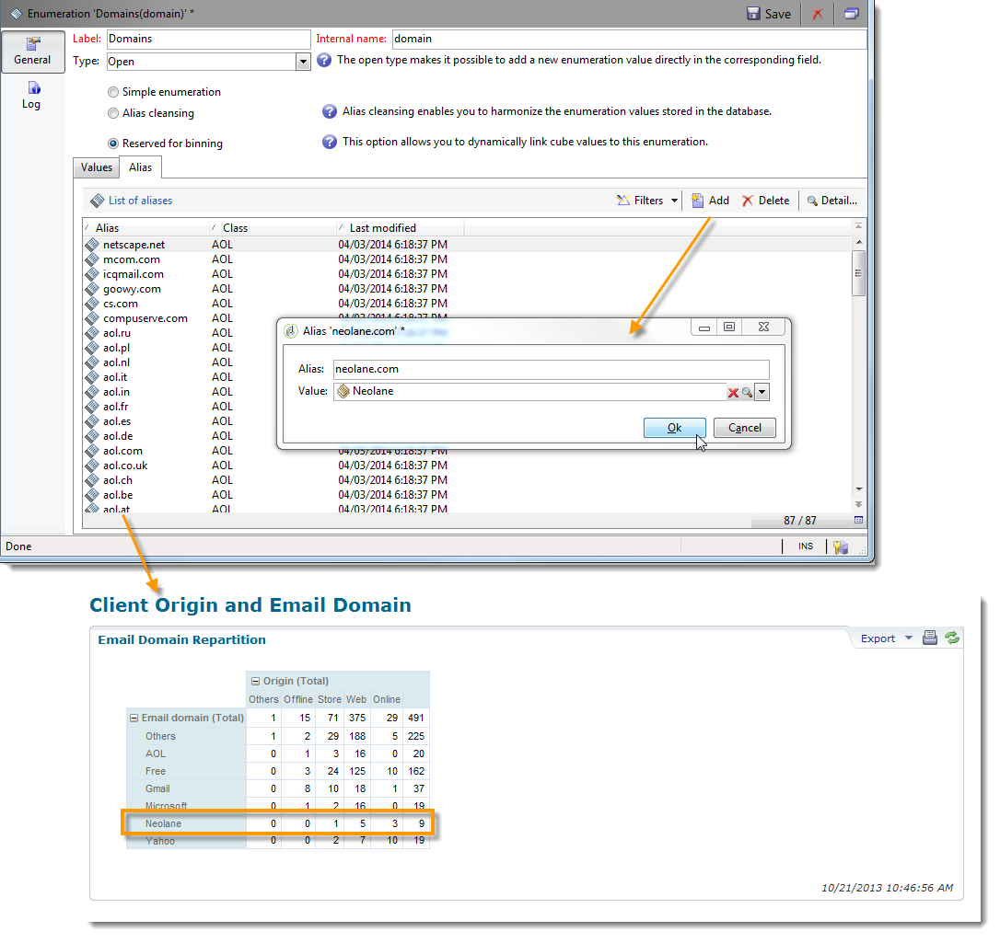
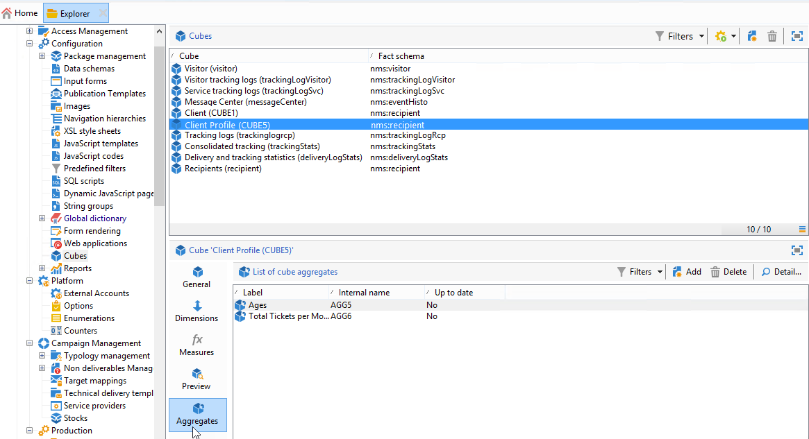

# Personalización de los cubos{#cube-custom}

## Agrupamiento de datos {#data-binning}

Utilice el agrupamiento de datos para simplificar la visualización de los datos agrupando valores según ciertos criterios. Según la información disponible, puede definir grupos de edad, agrupar dominios de correo electrónico, restringir a una enumeración de valores, restringir explícitamente los datos que desea mostrar y agrupar todos los demás datos en una línea o columna dedicada, etc.

En general, hay tres tipos de agrupamiento disponibles:

1. Uso de intervalos de valores definidos manualmente. Por ejemplo: edad, carro de compras promedio, número de envíos abiertos, etc.). Para obtener más información, consulte [Definición de cada grupo](#defining-each-bin).
1. De forma dinámica, dependiendo de los valores de una enumeración: solo se muestran los valores contenidos en la enumeración; los demás valores se agrupan en “Otros”. Para obtener más información, consulte [Administración dinámica de grupos](#dynamically-managing-bins).
1. Uso de intervalos de valores; todos los demás se agrupan. Por ejemplo, de 18 a 25 años de edad, de 26 a 59 años de edad y el resto. Para obtener más información, consulte [Creación de intervalos de calores](#creating-value-ranges).

Para activar el agrupamiento, marque la casilla adecuada al crear la dimensión.

Puede crear bandejas manualmente o enlazarlas a una enumeración existente.

Adobe Campaign también ofrece un asistente para el agrupamiento automático: los valores se pueden desglosar en “n” grupos o agrupar según los valores más frecuentes de la base de datos.

### Definición de cada grupo {#define-each-bin}

Para crear cada grupo individualmente, seleccione la opción **[!UICONTROL Define each bin]** y utilice la tabla para crear los distintos grupos.

Haga clic en el botón **[!UICONTROL Add]** para crear un nuevo grupo y enumere los valores que desea agrupar en dicho grupo.

En el siguiente ejemplo, los idiomas se agrupan en tres categorías: inglés/alemán/holandés, francés/italiano/español y otros.

Puede utilizar una máscara SQL para combinar varios valores en un filtro. Para ello, en la columna **[!UICONTROL Yes]**, marque **[!UICONTROL Use an SQL mask]** e introduzca el filtro SQL que desea aplicar en la columna **[!UICONTROL Value or expression]**.

<!--In the example below, all email domains that start with **yahoo** (yahoo.fr, yahoo.com, yahoo.be, etc.), or with **ymail** (ymail.com, ymail.eu, etc.) will be grouped under the label **YAHOO!**, as well as addresses with the **rocketmail.com** domain.-->

### Administrar grupos de forma dinámica {#dynamically-manage-bins}

Los valores se pueden administrar dinámicamente mediante enumeraciones. Esto significa que solo se muestran los valores contenidos en la enumeración. Cuando cambian los valores de la enumeración, el contenido del cubo se adapta automáticamente.

Para crear este tipo de agrupamiento de valores, siga los pasos siguientes:

1. Cree una nueva dimensión y habilite un agrupamiento.
1. Seleccione la opción **[!UICONTROL Dynamically link the values to an enumeration]** y seleccione la enumeración correspondiente.

   

   Siempre que se actualizan los valores de la lista desglosada, los grupos coincidentes se adaptan automáticamente.

### Creación de rangos de valores {#create-value-ranges}

Puede agrupar los valores en rangos basados en un intervalo deseado.

Para definir intervalos manualmente, haga clic en el botón **[!UICONTROL Add]** y seleccione **[!UICONTROL Define a range]**.

A continuación, especifique los límites inferior y superior y haga clic en **[!UICONTROL Ok]** para confirmar.

### Generación de grupos automáticamente {#generate-bins-automatically}

También es posible generar grupos automáticamente. Para ello, haga clic en el vínculo **[!UICONTROL Generate bins...]**.

Puede:

* **[!UICONTROL Recover the most frequently used values]**

   Si genera 4 grupos, se mostrarán los 4 valores utilizados con más frecuencia, mientras que los demás se contarán y agruparán en la categoría &quot;Otros&quot;.

* **[!UICONTROL Generate bins in the form of slots]**

   Para el mismo ejemplo, Adobe Campaign crea automáticamente 4 ranuras de valor del mismo tamaño para mostrar los valores en la base de datos.

En este caso, el filtro seleccionado en el esquema de hechos se omite.

### Enumeraciones {#enumerations}

Para mejorar la relevancia y legibilidad de un informe, Adobe Campaign permite crear enumeraciones específicas para reagrupar valores diferentes en el mismo grupo. Se hace referencia en los cubos a estas enumeraciones, reservadas para las agrupaciones, y después se muestran en los informes.

Adobe Campaign también ofrece una enumeración de dominios que permite mostrar una lista de los dominios de correo electrónico de todos los contactos de la base de datos, reagrupados por ISP, como se muestra en el siguiente ejemplo:

Se crea mediante la siguiente plantilla:

Para crear un informe con esta enumeración, cree un cubo con la dimensión **[!UICONTROL Email domain]**. Elija la opción **[!UICONTROL Enable binning]** luego **[!UICONTROL Dynamically link the values to an enumeration]**. A continuación, seleccione la enumeración **Dominios** como se muestra arriba. Todos los valores que no tengan un alias especificado se reagrupan con la etiqueta **Otros**.

Luego, cree un informe basado en este cubo para mostrar los valores.

Solo se debe modificar la enumeración para actualizar el informe relacionado. Por ejemplo, cree el valor **Adobe** y añada el alias **adobe.com**, y el informe se actualiza automáticamente con el valor de Adobe al nivel de la enumeración.

La enumeración **[!UICONTROL Domains]** se utiliza para generar informes integrados que muestran la lista de dominios. Para adaptar el contenido de estos informes, se puede editar esta lista.

Puede crear otras enumeraciones reservadas para agrupamiento y utilizarlas en otros cubos: todos los valores de alias se reagrupan en las bandejas especificadas en la primera pestaña de enumeración.

## Acumulados en cubos {#calculate-and-use-aggregates}

Los volúmenes de datos más grandes se pueden calcular en acumulados.

Los acumulados son útiles para manipular grandes volúmenes de datos. Se actualizan automáticamente según la configuración definida en la casilla de flujo de trabajo dedicado para integrar los datos recopilados recientemente en los indicadores.

Los acumulados se definen en la pestaña correspondiente de cada cubo.

>[!NOTE]
>
>El flujo de trabajo para actualizar los cálculos acumulados se puede configurar en el propio acumulado, o el acumulado se puede actualizar a través de un flujo de trabajo externo vinculado al cubo correspondiente.

Para crear un nuevo acumulado, siga los siguientes pasos:

1. Haga clic en la pestaña **[!UICONTROL Aggregates]** del cubo y, a continuación, haga clic en el botón **[!UICONTROL Add]**.
1. Introduzca una etiqueta del acumulado y añada las dimensiones que desea calcular.
1. Seleccione una dimensión y un nivel. Repita este proceso para cada dimensión y cada nivel.
1. Haga clic en la pestaña **[!UICONTROL Workflow]** para crear el flujo de trabajo de acumulación.

   * La actividad **[!UICONTROL Scheduler]** permite definir la frecuencia de las actualizaciones del cálculo. El planificador se detalla en [esta sección](../../automation/workflow/scheduler.md).
   * La actividad **[!UICONTROL Aggregate update]** permite seleccionar el modo de actualización que desea aplicar: completo o parcial.

      De forma predeterminada, se lleva a cabo una actualización completa durante cada cálculo. Para activar una actualización parcial, seleccione la opción correspondiente y defina las condiciones de actualización.

## Definición de medidas {#define-measures}

Los tipos de medidas se definen en la pestaña **[!UICONTROL Measures]** del cubo. Puede calcular sumas, promedios, desviaciones, etc.

Puede crear tantas medidas como sea necesario: después, seleccione la medida que desee mostrar u ocultar en la tabla. Para obtener más información, consulte [esta sección](#displaying-measures).

Para definir una nueva medida, siga los siguientes pasos:

1. Haga clic en el botón **[!UICONTROL Add]** situado encima de la lista de medidas y seleccione el tipo de medida y la fórmula que desea calcular.

   

1. Si es necesario, y dependiendo el operador, elija la expresión correspondiente a la operación.

   El botón **[!UICONTROL Advanced selection]** permite crear fórmulas de cálculo complejas. Para obtener más información, consulte [esta sección](../../automation/workflow/query.md).

1. El vínculo **[!UICONTROL Filter the measure data...]** permite restringir el campo de cálculo y aplicarlo solo a datos específicos de la base de datos.

   

1. Introduzca la etiqueta de la medida y añada una descripción; luego, haga clic en **[!UICONTROL Finish]** para crearla.

## Personalizar medidas {#display-measures}

Se puede configurar la visualización de las medidas en la tabla según sus necesidades:

* la secuencia de visualización de las medidas. [Más información](#display-sequence)
* la información que se va a mostrar u ocultar en el informe. [Más información](#configuring-the-display)
* qué medidas mostrar: porcentaje, total, número de decimales, etc. [Más información](#changing-the-type-of-measure-displayed)

### Secuencia de visualización {#display-sequence}

Las medidas calculadas en el cubo se configuran mediante el botón **[!UICONTROL Measures]**.

Mueva las líneas para cambiar la secuencia de visualización. En el ejemplo siguiente, los datos franceses se mueven al final de la lista: esto significa que se muestran en la última columna.

### Configuración de la visualización {#configuring-the-display}

La configuración de las medidas, líneas y columnas se puede realizar individualmente para cada medida o en general. Un icono específico permite acceder a la ventana de selección del modo de visualización.

* Haga clic en el icono **[!UICONTROL Edit the configuration of the pivot table]** para acceder a la ventana de configuración.

   Puede elegir si desea mostrar o no las etiquetas de las medidas, así como configurar su diseño (líneas o columnas).

Las opciones de color permiten resaltar valores importantes para facilitar la lectura.

### Modificación del tipo de medida mostrada {#changing-the-type-of-measure-displayed}

En cada medida, se puede definir la unidad y el formato que se va a aplicar.

## Uso compartido del informe {#share-a-report}

Una vez configurado el informe, puede guardarlo y compartirlo con otros operadores.

Para ello, haga clic en el icono **[!UICONTROL Show the report properties]** y active la opción **[!UICONTROL Share this report]**.

Especifique la categoría a la que pertenece el informe, así como su importancia. <!--For more on this, refer in [this page](../../reporting/using/configuring-access-to-the-report.md#report-display-context) to the **Display sequence** and **Defining the filtering options** sections.-->

Para confirmar estos cambios, debe guardar el informe.

## Creación de filtros {#create-filters}

Es posible crear filtros para ver una sección de los datos.

Para ello:

1. Haga clic en el icono **[!UICONTROL Add a filter]**.

   

1. Seleccione la dimensión del filtro correspondiente.

1. Seleccione el tipo de filtro y su nivel de precisión.

   

1. Una vez creado, el filtro se muestra encima del informe.

   Haga clic en el filtro para editarlo. Haga clic en la cruz para eliminarlo.

   Puede combinar tantos filtros como sea necesario: todos se muestran en esta área.

   

Cada vez que se modifica un filtro (añadir, eliminar, modificar), se debe volver a calcular el informe.

Los filtros también se pueden crear en función de una selección. Para ello, seleccione las celdas de origen, las líneas y las columnas y, a continuación, haga clic en el icono **[!UICONTROL Add a filter]**.

Para seleccionar una línea, columna o celda, haga clic en ella. Para anular la selección, haga clic de nuevo.

El filtro se aplica automáticamente y se añade a la zona de filtro encima del informe.

