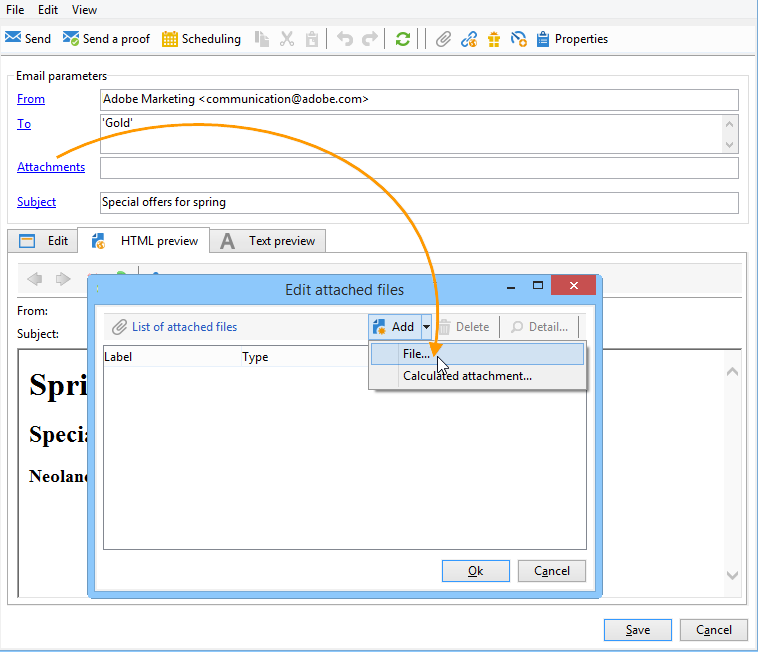
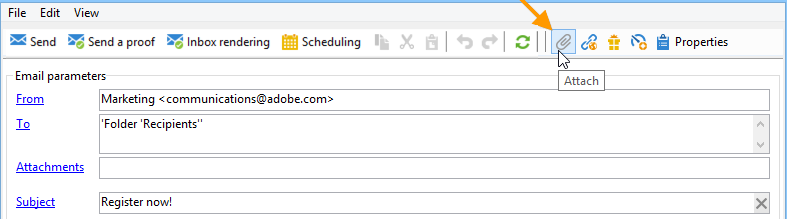

# Adjuntar archivos a un correo electrónico{#attaching-files}

## Acerca de los archivos adjuntos de correo electrónico {#about-email-attachments}

Puede adjuntar uno o varios archivos a una entrega de correo electrónico.

>[!NOTE]
>
>Para evitar problemas de rendimiento, se recomienda no incluir más de un archivo adjunto por correo electrónico. El umbral recomendado se puede configurar desde la lista de opciones de Campaign. Consulte la [documentación de Campaign Classic](https://experienceleague.adobe.com/docs/campaign-classic/using/installing-campaign-classic/appendices/configuring-campaign-options.html#delivery).

Hay dos casos posibles:

* Seleccione un archivo y adjúntelo a la entrega tal cual.
* Personalice el contenido del archivo adjunto para cada destinatario. En este caso, es necesario crear un archivo adjunto calculado: el nombre del archivo adjunto se calcula en el momento de la entrega de forma individual según cada mensaje en función del destinatario. **** El contenido también se puede personalizar y convertir en formato PDF en el momento de la entrega si tiene la opción **Impresión digital de variable**.

>[!NOTE]
>
>Este tipo de configuración se suele aplicar a las plantillas de envío. Para obtener más información, consulte la [documentación de Campaign Classic](https://experienceleague.adobe.com/docs/campaign-classic/using/sending-messages/using-delivery-templates/about-templates.html?lang=es).

## Mecanismos de protección {#attachments-guardrails}

Para evitar problemas de rendimiento, las imágenes incluidas en los correos electrónicos no pueden superar los 100 KB. Este límite, establecido de forma predeterminada, se puede cambiar desde la opción `NmsDelivery_MaxDownloadedImageSize`. Sin embargo, Adobe recomienda encarecidamente evitar imágenes grandes en los envíos de correo electrónico.

Adobe también recomienda limitar el tamaño y el número de archivos adjuntos. De forma predeterminada, solo puede agregar un archivo como archivo adjunto a un correo electrónico. Este umbral se puede configurar desde la opción `NmsDelivery_MaxRecommendedAttachments`.

Obtenga más información en la lista de opciones de Campaign en [Documentación de Campaign Classic](https://experienceleague.adobe.com/docs/campaign-classic/using/installing-campaign-classic/appendices/configuring-campaign-options.html#delivery).

## Adjuntar un archivo local {#attaching-a-local-file}

Para adjuntar un archivo local a una entrega, siga los pasos a continuación.

>[!NOTE]
>
>Puede adjuntar varios archivos a la entrega. Los archivos adjuntos pueden tener cualquier formato, incluido el formato compactado.

1. Haga clic en el vínculo **[!UICONTROL Attachments]**.
1. Haga clic en el botón **[!UICONTROL Add]**.
1. Haga clic en **[!UICONTROL File...]** para seleccionar el archivo que desea adjuntar al envío.

   

También puede arrastrar y soltar directamente el archivo en el campo **[!UICONTROL Attachments]** de envío o utilizar el icono **[!UICONTROL Attach]** de la barra de herramientas del asistente de envío.

Una vez seleccionado el documento, se sube inmediatamente al servidor para que esté disponible en el momento de la entrega. Se muestra en el campo **[!UICONTROL Attachments]** .

## Creación de archivos adjuntos calculados {#creating-a-calculated-attachment}

Al crear un archivo adjunto calculado, el nombre del archivo adjunto se puede calcular durante el análisis o la entrega de cada mensaje y puede depender del destinatario. También se puede personalizar y convertir a PDF.

Para crear un archivo adjunto personalizado, siga estos pasos:

1. Haga clic en el vínculo **[!UICONTROL Attachments]**.
1. Haga clic en el botón **[!UICONTROL Add]** y seleccione **[!UICONTROL Calculated attachment]**.
1. Seleccione el tipo de cálculo de **[!UICONTROL Type]** en la lista desplegable:

Estas son las opciones disponibles:

* **El nombre del archivo se especifica al crear la plantilla de envío.**
* **El contenido del archivo se personaliza y se convierte a PDF durante la entrega de cada mensaje.**
* **El nombre del archivo se calcula durante el análisis de la entrega (no puede depender del perfil del destinatario).**
* **El nombre del archivo se calcula en el momento de la entrega para cada destinatario (puede depender del destinatario).**

### Adjuntar un archivo local {#attach-a-local-file}

Si el archivo adjunto es un archivo local, seleccione la opción: **[!UICONTROL File name is specified when creating the delivery template]**. El archivo se selecciona localmente y se carga en el servidor. Siga estos pasos:

1. Seleccione el archivo que desea cargar en el campo **[!UICONTROL Local file]**.
1. Especifique la etiqueta si es necesario. La etiqueta sustituye al nombre de archivo cuando se visualiza en los sistemas de mensajería. Si no se especifica nada, se utiliza el nombre de archivo de forma predeterminada.

   

1. Si es necesario, seleccione **[!UICONTROL Upload file on the server]** y, a continuación, haga clic en **[!UICONTROL Update on server]** para iniciar la transferencia.

   

A continuación, el archivo está disponible en el servidor para asociarlo a las diferentes entregas creadas a partir de esta plantilla.

### Adjuntar un mensaje personalizado {#attach-a-personalized-message}

La opción **[!UICONTROL The file content is personalized and converted into PDF format at the time of delivery for each message]** permite seleccionar un archivo con campos de personalización, como el apellido y el nombre del destinatario deseado.

Para este tipo de archivos adjuntos, aplique los siguientes pasos de configuración:

1. Seleccione el archivo que desea subir.
1. Especifique la etiqueta si es necesario.
1. Seleccione **[!UICONTROL Upload file on the server]** y, a continuación, haga clic en **[!UICONTROL Update on server]** para iniciar la transferencia.
1. Puede mostrar una previsualización. Para ello, seleccione un destinatario.

   

1. Analice su envío y, a continuación, inícielo.

   Cada destinatario recibe un PDF personalizado adjunto a la entrega.

   

### Adjuntar un archivo calculado {#attach-a-calculated-file}

Puede calcular el nombre del archivo adjunto durante la preparación de la entrega. Para ello, seleccione la opción **[!UICONTROL The file name is calculated during delivery analysis (it cannot depend on the recipient)]**.

>[!NOTE]
>
>Esta opción solo se utiliza cuando la entrega se realiza mediante un proceso externo o un flujo de trabajo.

1. Especifique la etiqueta que desea aplicar al archivo adjunto.
1. Especifique la ruta de acceso del archivo y su nombre exacto en la ventana de definición.

   >[!IMPORTANT]
   >
   >El archivo debe estar presente en el servidor.

   

1. Analice y, a continuación, inicie su envío.

   El nombre de archivo se puede ver en el “log” de análisis.

   

### Adjuntar un archivo personalizado {#attach-a-personalized-file}

Al seleccionar los archivos adjuntos, puede elegir la opción **[!UICONTROL The file name is calculated during delivery for each recipient (it can depend on the recipient)]**. A continuación, puede asignar los datos de personalización del destinatario con el nombre del archivo que se va a enviar.

>[!NOTE]
>
>Esta opción solo se utiliza cuando la entrega se realiza mediante un proceso externo o un flujo de trabajo.

1. Especifique la etiqueta que desea aplicar al archivo adjunto.
1. Especifique la ruta de acceso del archivo y su nombre exacto en la ventana de definición. Si el nombre de archivo es personalizado, puede utilizar los campos personalizados para los valores relevantes.

   

   >[!IMPORTANT]
   >
   >El archivo debe estar presente en el servidor.

1. Analice y, a continuación, inicie su envío.

   En el ejemplo que se muestra a continuación, el archivo adjunto se eligió en función del nombre definido con los campos de combinación.

   

### Configuración de archivos adjuntos {#attachment-settings}

Para las dos primeras opciones, puede elegir **[!UICONTROL Upload file on the server]** al seleccionar la opción adecuada. El vínculo **[!UICONTROL Update the file on the server]** le permite iniciar la carga.

Un mensaje le informa de que el archivo se ha cargado en el servidor:

Al tratar de cambiar el archivo, aparece un mensaje de advertencia:

La pestaña **[!UICONTROL Advanced]** permite definir las opciones avanzadas de los archivos adjuntos:

* Puede definir opciones de filtro para evitar enviar el archivo adjunto a todos los destinatarios. La opción **[!UICONTROL Enable filtering of recipients who will receive the attachment]** activa un campo de entrada utilizado para definir una secuencia de comandos de selección de destinatarios que debe introducirse en JavaScript.
* Puede crear una secuencia de comandos del nombre del archivo para personalizarlo.

  Introduzca el texto en la ventana y utilice los campos personalizados disponibles en la lista desplegable. En el ejemplo siguiente, el nombre de archivo está personalizado para contener la fecha del día y el nombre del destinatario.

  
