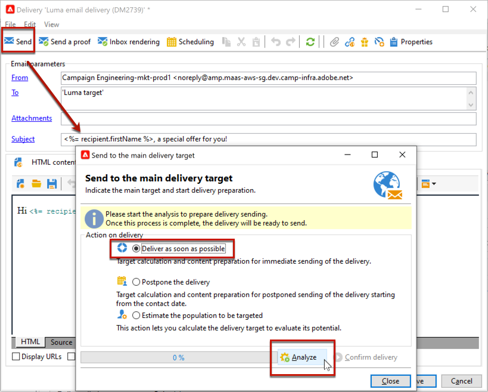
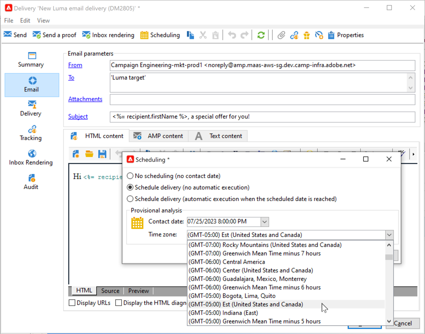

# Configuración y envío de la entrega {#configure-delivery}

Acceda a los parámetros de envío para configurar más ajustes y definir cómo enviar los mensajes. Puede definir la entrega [priority](#delivery-priority), configurar [waves](#sending-using-multiple-waves) y probar la entrega. Una vez completada esta configuración, puede confirmar el envío tal como se describe en [esta sección](#confirm-delivery). Los mensajes se envían inmediatamente o se basan en la entrega [programada](#schedule-delivery-sending).

## Definición de parámetros adicionales {#delivery-additional-parameters}

Antes de realizar el envío, se pueden definir los parámetros de envío en las propiedades de envío a través de la pestaña **[!UICONTROL Delivery]**.

### Prioridad de envío {#delivery-priority}

Utilice la opción **[!UICONTROL Delivery priority]** para cambiar el orden de envío de los envíos estableciendo su nivel de prioridad, de **[!UICONTROL Very low]** a **[!UICONTROL Very high]** (el valor predeterminado es **[!UICONTROL Normal]**).

### Cantidad de lotes {#delivery-batch-quantity}

Utilice la opción **[!UICONTROL Message batch quantity]** para definir el número de mensajes agrupados dentro del mismo paquete de envío XML. Si el parámetro se establece en 0, los mensajes se agrupan automáticamente. El tamaño del paquete se define mediante el cálculo `<delivery size>/1024`, con un mínimo de 8 y un máximo de 256 mensajes por paquete.

>[!IMPORTANT]
>
>Cuando se crea la entrega duplicando una existente, este parámetro se restablece.

### Prueba de los envíos de entregas

Utilice la opción **[!UICONTROL Test SMTP delivery]** para probar el envío a través de SMTP. La entrega se procesa hasta la conexión con el servidor SMTP, pero no se envía. Para cada destinatario de la entrega, Campaign se conecta al servidor del proveedor SMTP, ejecuta el comando RCPT TO del servidor de correo saliente (SMTP) y cierra la conexión antes del comando DATA del SMTP.

>[!NOTE]
>
>* Esta opción no debe configurarse en intermediario.
>
>* Obtenga más información acerca de la configuración del servidor SMTP en [Documentación de Campaign Classic v7](https://experienceleague.adobe.com/docs/campaign-classic/using/installing-campaign-classic/additional-configurations/configure-delivery-settings.html?lang=es#smtp-relay){target="_blank"}.

## Envío mediante múltiples olas {#sending-using-multiple-waves}

Para equilibrar la carga, se pueden dividir los envíos en varios lotes. Configure el número de lotes y su proporción con respecto a todo la entrega.

### Activar olas {#enable-waves}

Para definir las olas, siga estos pasos:

1. Abra las propiedades de entrega y vaya a la pestaña **[!UICONTROL Delivery]**.
1. Habilite la opción **[!UICONTROL Send using multiple waves]** y haga clic en el vínculo **[!UICONTROL Define waves...]**.

   

### Configuración de olas {#config-waves}

>[!NOTE]
>
>Solo se puede definir el tamaño y el retraso entre dos olas consecutivas. No se pueden configurar los criterios de selección de destinatarios para cada ola.

Puede definir el tamaño de cada ola o agregarlas a un calendario.

* **Defina el tamaño de cada ola**. Por ejemplo, si se introduce **[!UICONTROL 30%]** en el campo correspondiente, cada ola representa el 30 % de los mensajes incluidos en el envío, excepto el último, que representa el 10 % de los mensajes.

  En el campo **[!UICONTROL Period]** especifique el retardo entre el inicio de dos olas consecutivas. Por ejemplo, si se introduce **[!UICONTROL 2d]**, la primera ola comienza inmediatamente, la segunda ola comienza en dos días, la tercera ola en cuatro días, etc.

  

* **Defina un calendario para enviar cada ola**.  Por ejemplo, la primera ola representa el 25 % del número total de mensajes incluidos en la entrega y se inicia inmediatamente. Las dos olas siguientes completan la entrega y se establecen para comenzar a intervalos de seis horas.

  En la columna **[!UICONTROL Start]** especifique el retardo entre el inicio de dos olas consecutivas. En la columna **[!UICONTROL Size]**, introduzca un número fijo o un porcentaje.

  

### Comprobación de programación de olas {#check-waves}

Una regla de tipología específica, **[!UICONTROL Wave scheduling check]**, garantiza que la última ola se programe antes del límite de validez del envío. Las tipologías de campaña y sus reglas, configuradas en la pestaña **[!UICONTROL Typology]** de las propiedades de entrega, se muestran en [esta sección](../../automation/campaign-opt/campaign-typologies.md#typology-rules)<!--ref TBC-->.

>[!IMPORTANT]
>
>* Asegúrese de que las últimas olas no superen la fecha límite de envío, que se define en la pestaña **[!UICONTROL Validity]**. De lo contrario, es posible que algunos mensajes no se envíen. Obtenga más información acerca del período de validez de un envío en [esta sección](delivery-failures.md#valid-period).
>
>* También debe definir tiempo suficiente para los reintentos al configurar las últimas olas. Obtenga más información acerca de los reintentos en [esta sección](delivery-failures.md#retries).

### Monitorización de olas {#monitor-waves}

Para supervisar sus envíos, vaya a los registros de envío. Ver [esta página](send.md)

Se pueden ver los envíos que ya se han realizado en las olas procesadas (estado **[!UICONTROL Sent]**) y las que se envían en las olas restantes (estado **[!UICONTROL Pending]**).

### Muestras de olas {#samples-waves}

Los siguientes dos ejemplos son los casos más comunes para usar varias olas.

* **Durante el proceso de aceleración**

  Cuando se envían correos electrónicos utilizando una plataforma nueva, los proveedores de servicios de Internet (ISP) sospechan de las direcciones IP desconocidas. Si se envían, de repente, grandes volúmenes de correos electrónicos, los ISP suelen marcarlos como correo no deseado.

  Para evitar que se lo considere correo no deseado, puede aumentar progresivamente el volumen enviado mediante el uso de olas. Esto debería garantizar un desarrollo uniforme de la fase de inicio y permitir reducir la velocidad total de direcciones no válidas.

  Para ello, marque la opción **[!UICONTROL Schedule waves according to a calendar]**. Por ejemplo, defina la primera ola en 10 %, la segunda en 15 % y así sucesivamente.

  

* **Campañas con un centro de llamadas**

  Al administrar una campaña de lealtad por teléfono, su organización tiene una capacidad limitada para procesar el número de llamadas que debe realizar para contactar con los suscriptores.

  Mediante el uso de olas, es posible restringir el número de mensajes a 20 por día, por ejemplo, teniendo en cuenta la capacidad de procesamiento diaria de un centro de llamadas.

  Para ello, seleccione la opción **[!UICONTROL Schedule multiple waves of the same size]**. Introduzca **[!UICONTROL 20]** como tamaño de la ola y **[!UICONTROL 1d]** en el campo **[!UICONTROL Period]**.

  

## Confirmar la entrega {#confirm-delivery}

Una vez configurada la entrega y lista para enviarla, asegúrese de ejecutar el análisis de entrega antes de confirmar la entrega.

Para realizar esto, siga los pasos a continuación.

1. Haga clic en **[!UICONTROL Send]** y seleccione la acción que desee.

   * Para realizar la entrega inmediatamente, seleccione **[!UICONTROL Deliver as soon as possible]**.
   * Para programar el envío a una fecha posterior, seleccione **[!UICONTROL Postpone the delivery]**. [Más información](#schedule-delivery-sending)

1. Haga clic en **[!UICONTROL Analyze]**. Para obtener más información, consulte [esta sección](delivery-analysis.md).

   

1. Una vez finalizado, haga clic en **[!UICONTROL Confirm delivery]** para iniciar el envío de mensajes.

   

1. Puede cerrar el asistente de envíos y realizar un seguimiento de la ejecución del envío desde la pestaña **[!UICONTROL Delivery]**, a la que se puede acceder mediante el detalle del envío o a través de la lista de envíos.

   Para obtener más información, consulte las secciones siguientes:

   * [Seguimiento de una entrega](send.md)
   * [Comprensión de los errores de entrega](delivery-failures.md)

<!--About message tracking-->

## Programación de los envíos de entregas {#schedule-delivery-sending}

Puede retrasar la entrega de mensajes para programar su fecha o administrar la presión de ventas y evitar solicitar en exceso a una población.

1. Haga clic en el botón **[!UICONTROL Send]** y seleccione la opción **[!UICONTROL Postpone delivery]**.

1. En el campo **[!UICONTROL Contact date]** especifique una fecha de inicio.

   

1. Inicie el análisis de entrega y confirme la entrega de la entrega. Sin embargo, la entrega del envío no comenzará hasta la fecha indicada en el campo **[!UICONTROL Contact date]**.

   >[!IMPORTANT]
   >
   >Una vez iniciado el análisis, la fecha de contacto definida queda fijada. Si se modifica esta fecha, es necesario reiniciar el análisis para que se tengan en cuenta las modificaciones.

   

En la lista de envío, el envío aparecerá con el estado **[!UICONTROL Pending]**.

La programación se puede configurar en orden ascendente mediante el botón **[!UICONTROL Scheduling]** del envío.

Permite retrasar la entrega a una fecha posterior o guardar la entrega en el calendario provisional.

* La opción **[!UICONTROL Schedule delivery (no automatic execution)]** permite programar un análisis provisional del envío.

  Cuando se guarda esta configuración, el envío cambia al estado **[!UICONTROL Targeting pending]**. El análisis se inicia en la fecha especificada.

* La opción **[!UICONTROL Schedule delivery (automatic execution on planned date)]** permite especificar la fecha de envío.

  Haga clic en **[!UICONTROL Send]** y seleccione **[!UICONTROL Postpone delivery]** luego inicie el análisis y confirme la entrega. Cuando el análisis finalice, el destinatario de entrega está listo y los mensajes se envían automáticamente en la fecha especificada.

Las fechas y horas se expresan en el huso horario del operador actual. La lista desplegable **[!UICONTROL Time zone]** situada debajo del campo “fecha de contacto” permite convertir automáticamente la fecha y la hora introducidas al huso horario seleccionado.

Por ejemplo, si se programa una entrega para que se ejecute automáticamente a las 8 en punto, hora de Londres, la hora se convierte automáticamente al huso horario seleccionado:

<!--
## Adjust delivery failure management {#delivery-failure-management}

### Configure retries {#configure-retries}

Temporarily undelivered messages due to a **Soft** or **Ignored** error are subject to an automatic retry. The delivery failure types and reasons are presented in this [section](../../delivery/using/understanding-delivery-failures.md#delivery-failure-types-and-reasons).

>[!IMPORTANT]
>
>For hosted or hybrid installations, if you have upgraded to the [Enhanced MTA](../../delivery/using/sending-with-enhanced-mta.md), the retry settings in the delivery are no longer used by Campaign. Soft bounce retries and the length of time between them are determined by the Enhanced MTA based on the type and severity of the bounce responses coming back from the message's email domain.

For on-premise installations and hosted/hybrid installations using the legacy Campaign MTA, the central section of the **[!UICONTROL Delivery]** tab for delivery parameters indicates how many retries should be performed the day after the delivery and the minimum delay between retries.

By default, five retries are scheduled for the first day of the delivery with a minimum interval of one hour spread out over the 24 hours of the day. One retry per day is programmed after that and until the delivery deadline, which is defined in the **[!UICONTROL Validity]** tab (see [Defining validity period](#defining-validity-period)).

### Define the validity period {#define-validity-period}

When the delivery has been launched, the messages (and any retries) can be sent until the delivery deadline. This is indicated in the delivery properties, via the **[!UICONTROL Validity]** tab.

* The **[!UICONTROL Delivery duration]** field lets you enter the limit for global delivery retries. This means that Adobe Campaign sends the messages beginning on the start date, and then, for messages returning an error only, regular, configurable retries are performed until the validity limit is reached.

  You can also choose to specify dates. To do this, select **[!UICONTROL Explicitly set validity dates]**. In this case, the delivery and validity limit dates also let you specify the time. The current time is used by default, but you can modify this directly in the input field.

  >[!IMPORTANT]
  >
  >For hosted or hybrid installations, if you have upgraded to the [Enhanced MTA](../../delivery/using/sending-with-enhanced-mta.md), the **[!UICONTROL Delivery duration]** setting in your Campaign email deliveries will be used only if set to **3.5 days or less**. If you define a value higher than 3.5 days, it will not be taken into account.

* **Validity limit of resources**: The **[!UICONTROL Validity limit]** field is used for uploaded resources, mainly for the mirror page and images. The resources on this page are valid for a limited time (to save disk space).

  The values in this field can be expressed in the units listed in [this section](../../platform/using/adobe-campaign-workspace.md#default-units).
-->
