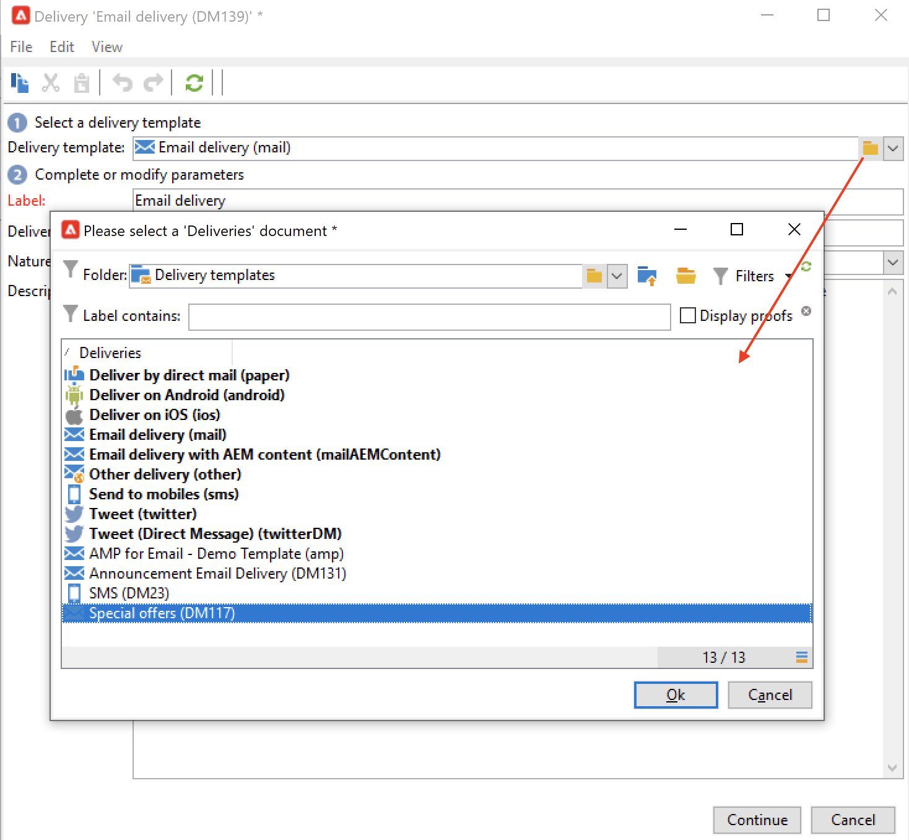

# Trabajar con plantillas de envío{#work-with-delivery-template}

Utilice plantillas de envío para estandarizar la apariencia creativa y así ejecutar y lanzar las campañas con mayor rapidez.

Una plantilla puede incluir:

* Tipologías
* Direcciones de remitente y respuesta
* Básico [bloques de personalización](../send/personalization-blocks.md)
* Vínculos a [páginas espejo](../send/mirror-page.md) y vínculos de baja
* Contenido, logotipo de una compañía o firma
* Otras propiedades del envío, como la validez de los recursos, los parámetros de reintento o la configuración de cuarentena.

 [Descubra esta funcionalidad en vídeo](#delivery-template-video)

## Creación de una plantilla{#create-a-delivery-template}

Para crear una plantilla de envíos, puede duplicar una plantilla integrada, convertir un envío existente en una plantilla o crear una plantilla de envíos desde cero.

### Duplicación de una plantilla existente{#copy-an-existing-template}

Campaign viene con un conjunto de plantillas integradas para cada canal: correo electrónico, push, SMS, correo directo y más.

La forma más sencilla de crear una plantilla de envíos es duplicar y personalizar una plantilla integrada.

Para duplicar una plantilla de envíos, siga estos pasos:

1. Navegar a **[!UICONTROL Resources > Templates > Delivery templates]** en el explorador de Adobe Campaign.
1. Seleccione una plantilla de envíos integrada. Las plantillas integradas aparecen en negrita en la lista.
1. Haga clic con el botón derecho y seleccione **[!UICONTROL Duplicate]**.

   

1. Defina la configuración de la plantilla y guarde la nueva plantilla.

   

La plantilla se añade a la lista de plantillas de envío. Ahora puede seleccionarlo al crear un nuevo envío.

### Conversión de un envío existente en una plantilla {#convert-an-existing-delivery}

Puede convertir un envío en una plantilla y usarla con las nuevas acciones de envío repetidas.

Para convertir un envío en una plantilla, siga los pasos a continuación:

1. Seleccione la entrega en la lista de entrega, a la que se puede acceder mediante las **[!UICONTROL Campaign management]** del explorador de Campaign.

1. Haga clic con el botón derecho y seleccione **[!UICONTROL Actions > Save as template...]**.

   

1. Edite las propiedades de la entrega y seleccione la carpeta donde debe guardarse la nueva plantilla (en el **[!UICONTROL Folder]** ) y la carpeta donde se deben crear los envíos basados en esta plantilla (en el campo **[!UICONTROL Execution folder]** field).

   

### Creación de una nueva plantilla {#create-a-new-template}

>[!NOTE]
>
>Para evitar errores de configuración, Adobe recomienda [duplicar una plantilla integrada](#copy-an-existing-template) y modificar sus propiedades en lugar de crear una nueva plantilla.

Para configurar una plantilla de envíos desde cero, siga los pasos a continuación:

1. Vaya a la **Recursos** en el explorador de Campaign y seleccione **Plantillas** entonces **Plantillas de envío**.
1. Haga clic en **Nueva** en la barra de herramientas para crear una nueva plantilla de envío.
1. Configure las variables **Etiqueta** y el **Nombre interno** de la carpeta.
1. Guarde la plantilla y vuelva a abrirla.
1. Desde el **Propiedades** , adapte la configuración.
1. En la pestaña **General**, confirme o cambie las ubicaciones seleccionadas en los menús desplegables **Carpeta de ejecución**, **Carpeta** y **Enrutamiento**.
1. Rellene la categoría **parámetros de correo electrónico** con el asunto del correo electrónico y la población objetivo.
1. Añada su **contenido de HTML** para personalizar la plantilla, puede mostrar un [vínculo de página espejo](../send/mirror-page.md) y un vínculo para darse de baja.
1. Seleccione la pestaña **Preview.** En el menú desplegable **Personalización de prueba**, seleccione **Destinatario** para previsualizar la plantilla como el perfil elegido.
1. Haga clic en **Save**. La plantilla ya está lista para utilizarse en una entrega.

## Uso de plantillas{#use-a-delivery-template}

### Crear un envío a partir de una plantilla{#create-a-delivery-from-a-template}

Para crear una entrega basada en una plantilla existente, seleccione la plantilla de la lista de plantillas de entrega disponibles.

Si no puede ver la plantilla, haga clic en **[!UICONTROL Select link]** a la derecha del campo para examinar las carpetas de Campaign.

Seleccione el directorio que desee en el campo **[!UICONTROL Folder]** o haga clic en el icono **[!UICONTROL Display sub-levels]** para mostrar el contenido de los directorios en los subárboles del directorio actual.

Seleccione la plantilla de envíos que va a utilizar y haga clic en **[!UICONTROL Ok]**.

### Ejecución de una plantilla {#execute-a-template}

Puede iniciar la ejecución de una plantilla directamente desde la lista de plantillas sin tener que crear primero un envío.

Para ello, seleccione la plantilla que desea ejecutar y haga clic con el botón derecho del ratón. Seleccione **[!UICONTROL Actions>Execute the delivery template...]**.

También puede usar **[!UICONTROL File>Actions>Execute the delivery template...]**.

Introduzca los parámetros de envío y haga clic en **[!UICONTROL Send]**.

Esta acción genera una entrega en la carpeta asociada a la plantilla. El nombre de este envío es el nombre de la plantilla de envío desde la que se creó.

## Tutoriales en vídeo {#delivery-template-video}

### Configuración de una plantilla de envíos

En el siguiente vídeo se muestra cómo configurar una plantilla para un envío ad hoc.

>[!VIDEO](https://video.tv.adobe.com/v/342082?quality=12)

### Configuración de propiedades de plantillas de envíos

El siguiente vídeo muestra cómo configurar las propiedades de las plantillas de envíos y explica cada propiedad en detalle.

>[!VIDEO](https://video.tv.adobe.com/v/338969?quality=12)

### Implementación de una plantilla de envíos ad-hoc

En este vídeo se explica cómo implementar una plantilla de envíos de correo electrónico ad-hoc, y se explica la diferencia entre un envío de correo electrónico y un flujo de trabajo de envío.

>[!VIDEO](https://video.tv.adobe.com/v/338965?quality=12)

Hay disponibles más vídeos de procedimientos para Campaign [aquí](https://experienceleague.adobe.com/docs/campaign-learn/tutorials/getting-started/introduction-to-adobe-campaign.html){target="_blank"}.
