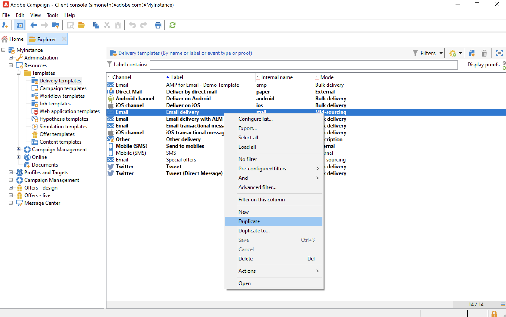

# Trabajo con plantillas de envío {#work-with-delivery-template}

## Introducción a las plantillas de entrega

Cada entrega se crea en función de una plantilla. Una plantilla es una configuración que se puede reutilizar para facilitar y estandarizar la implementación. Puede utilizar una plantilla integrada o personalizada.

Una plantilla puede incluir ajustes de configuración parciales o completos, como:

* [Reglas de tipología](../../automation/campaign-opt/campaign-typologies.md)
* Direcciones de remitente y respuesta
* [bloques de personalización](../send/personalization-blocks.md) básicos
* Vínculos a [páginas espejo](../send/mirror-page.md) y vínculos de baja
* Contenido, logotipo de una compañía o firma
* Otras propiedades del envío, como la validez de los recursos, los parámetros de reintento o la configuración de cuarentena.

 [Descubra esta funcionalidad en vídeo](#delivery-template-video)

Las plantillas de envío se almacenan en la carpeta **[!UICONTROL Resources > Templates > Delivery templates]** del explorador. En Adobe Campaign, puede trabajar con dos tipos de plantillas:

1. Plantillas de envío **incorporadas** de Adobe Campaign: las plantillas integradas están disponibles para cada canal. NO DEBEN modificarse ni eliminarse. Incluyen una configuración básica para cada canal de envío. Como administrador, puede establecer valores predeterminados o restringir determinadas funciones a los usuarios finales, como modificar los parámetros de seguimiento, las direcciones de correo electrónico del remitente, etc. Las plantillas integradas aparecen en negrita en la lista de plantillas.

1. **Plantillas de envío personalizadas**: como administrador de Adobe Campaign, puede crear nuevas plantillas de envío. Una práctica recomendada es duplicar y actualizar una plantilla integrada en lugar de crear una plantilla desde cero. Por ejemplo, se puede configurar una plantilla de envíos por correo electrónico. Cuando los usuarios creen un envío a partir de esta plantilla, solo tendrán que introducir el texto o el contenido del HTML. Todas las demás configuraciones ya están definidas.

>[!NOTE]
>
>Las plantillas disponibles dependen de los derechos de acceso, de la configuración de la instancia y del contexto. Por ejemplo, al crear un servicio informativo, puede vincular una plantilla de envío a los mensajes de confirmación: así solo puede acceder a las plantillas cuyo destino de mapeo sea la asignación de suscripción. Otras plantillas no son visibles en este contexto. Para obtener más información, consulte [Trabajar con asignaciones de destino](../audiences/target-mappings.md) y [Administrar suscripciones y bajas](../start/subscriptions.md).

## Creación de una plantilla {#create-a-delivery-template}

Para crear una plantilla de envío, puede duplicar una plantilla integrada o convertir una entrega existente en una plantilla. También puede crear una plantilla de envíos desde cero, pero no es recomendable. Estos métodos se detallan a continuación.

### Duplicación de una plantilla existente{#copy-an-existing-template}

Campaign viene con un conjunto de plantillas integradas para cada canal: correo electrónico, push, SMS, correo directo y más.

La forma más sencilla de crear una plantilla de envíos es duplicar y personalizar una plantilla integrada.

Para duplicar una plantilla de envíos, siga estos pasos:

1. Vaya a **[!UICONTROL Resources > Templates > Delivery templates]** en el explorador de Adobe Campaign.
1. Seleccione una plantilla de envíos integrada. Las plantillas integradas aparecen en negrita en la lista.
1. Haga clic con el botón derecho y seleccione **[!UICONTROL Duplicate]**.

   

1. Defina la configuración de la plantilla y guarde la nueva plantilla.

   

La plantilla se añade a la lista de plantillas de envío. Ahora puede seleccionarlo al crear un nuevo envío.

### Conversión de un envío existente en una plantilla {#convert-an-existing-delivery}

Puede convertir un envío en una plantilla y usarla con las nuevas acciones de envío repetidas.

Para convertir un envío en una plantilla, siga los pasos a continuación:

1. Seleccione la entrega en la lista de entrega, a la que se puede acceder mediante el nodo **[!UICONTROL Campaign management]** del explorador de Campaign.

1. Haga clic con el botón derecho y seleccione **[!UICONTROL Actions > Save as template...]**.

   

1. Edite las propiedades de la entrega y seleccione la carpeta donde debe guardarse la nueva plantilla (en el campo **[!UICONTROL Folder]**) y la carpeta donde deben crearse las entregas basados en esta plantilla (en el campo **[!UICONTROL Execution folder]**).

   

### Creación de una nueva plantilla {#create-a-new-template}

>[!NOTE]
>
>Para evitar errores de configuración, Adobe recomienda [duplicar una plantilla integrada](#copy-an-existing-template) y modificar sus propiedades en lugar de crear una nueva plantilla.

Para configurar una plantilla de envíos desde cero, siga los pasos a continuación:

1. Vaya a la carpeta **Resources** en el explorador de Campaign, seleccione **Templates** y luego **Delivery templates**.
1. Haga clic en **Nueva** en la barra de herramientas para crear una nueva plantilla de envío.
1. Establezca **Label** y **Internal name** de la carpeta.
1. Guarde la plantilla y vuelva a abrirla.
1. En el botón **Propiedades**, adapte la configuración.
1. En la pestaña **General**, confirme o cambie las ubicaciones seleccionadas en los menús desplegables **Carpeta de ejecución**, **Carpeta** y **Enrutamiento**.
1. Rellene la categoría **parámetros de correo electrónico** con el asunto del correo electrónico y la población objetivo.
1. Añada su **contenido de HTML** para personalizar su plantilla. Puede mostrar un [vínculo de página espejo](../send/mirror-page.md) y un vínculo para darse de baja.
1. Seleccione la pestaña **Preview.** En el menú desplegable **Personalización de prueba**, seleccione **Destinatario** para previsualizar la plantilla como el perfil elegido.
1. Haga clic en **Save**. La plantilla ya está lista para utilizarse en una entrega.

## Uso de plantillas {#use-a-delivery-template}

### Crear un envío a partir de una plantilla {#create-a-delivery-from-a-template}

Para crear una entrega basada en una plantilla existente, seleccione la plantilla de la lista de plantillas de entrega disponibles.

Si no puede ver la plantilla, haga clic en la carpeta **[!UICONTROL Select link]** a la derecha del campo para examinar las carpetas de Campaign.

Seleccione el directorio que desee en el campo **[!UICONTROL Folder]** o haga clic en el icono **[!UICONTROL Display sub-levels]** para mostrar el contenido de los directorios en los subárboles del directorio actual.

Seleccione la plantilla de envíos que va a utilizar y haga clic en **[!UICONTROL Ok]**.

### Ejecución de una plantilla {#execute-a-template}

Puede iniciar la ejecución de una plantilla directamente desde la lista de plantillas sin tener que crear primero una entrega. La plantilla de envío se puede ejecutar manualmente, como se detalla a continuación, o activarse mediante un evento (ejecutado a una hora determinada, cuando un archivo está disponible en el servidor, etc.), como se explica en [esta sección](https://experienceleague.adobe.com/es/docs/campaign/automation/workflows/wf-activities/action-activities/delivery).

Para ejecutar una plantilla manualmente, siga estos pasos:

1. Seleccione la plantilla que desea ejecutar y haga clic con el botón derecho del ratón. Seleccione **[!UICONTROL Actions>Execute the delivery template...]**.

   También puede usar **[!UICONTROL File>Actions>Execute the delivery template...]**.

   

1. Introduzca los parámetros de envío y haga clic en **[!UICONTROL Send]**.

Esta acción genera una entrega en la carpeta asociada a la plantilla. El nombre de este envío es el nombre de la plantilla de envío desde la que se creó.

## Tutoriales en vídeo {#delivery-template-video}

### Configuración de una plantilla de envíos

En el siguiente vídeo se muestra cómo configurar una plantilla para un envío ad hoc.

>[!VIDEO](https://video.tv.adobe.com/v/3409244?quality=12&captions=spa)

### Configuración de propiedades de plantillas de envíos

El siguiente vídeo muestra cómo configurar las propiedades de las plantillas de envíos y explica cada propiedad en detalle.

>[!VIDEO](https://video.tv.adobe.com/v/3443404?quality=12&captions=spa)

### Implementación de una plantilla de envíos ad-hoc

En este vídeo se explica cómo implementar una plantilla de envíos de correo electrónico ad-hoc, y se explica la diferencia entre un envío de correo electrónico y un flujo de trabajo de envío.

>[!VIDEO](https://video.tv.adobe.com/v/3444960?quality=12&captions=spa)

Hay disponibles [más vídeos de procedimientos para Campaign aquí](https://experienceleague.adobe.com/docs/campaign-learn/tutorials/getting-started/introduction-to-adobe-campaign.html?lang=es){target="_blank"}.
