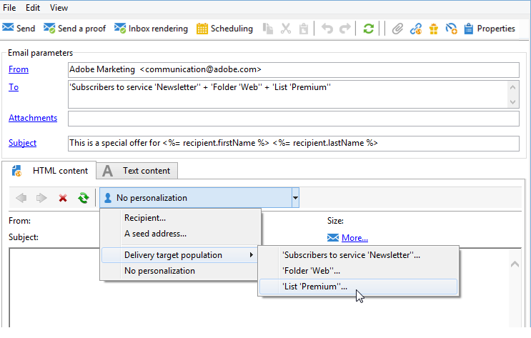
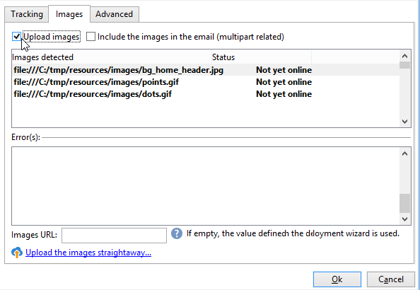

# Definición del contenido del correo electrónico {#defining-the-email-content}

## Remitente {#sender}

Para definir el nombre y la dirección del remitente que aparece en el encabezado de los mensajes enviados, haga clic en el vínculo **[!UICONTROL From]**.

Esta ventana permite introducir toda la información necesaria para crear los encabezados de los mensajes de correo electrónico. Dicha información puede personalizarse. Para ello, utilice los botones a la derecha de los campos de entrada para insertar campos personalizados.

Para saber cómo insertar y utilizar campos personalizados, consulte [esta sección](personalize.md).

>[!NOTE]
>
>* La dirección del remitente se utiliza en las respuestas de forma predeterminada.
>* Los parámetros de encabezado no deben estar vacíos. De forma predeterminada, contienen los valores introducidos al configurar el asistente de implementación.
>* La dirección del remitente es obligatoria para permitir que se envíe un mensaje de correo electrónico (estándar RFC).
>* Adobe Campaign comprueba la sintaxis de las direcciones de correo electrónico introducidas.

>[!CAUTION]
>
>Para evitar problemas de entregabilidad, las cuentas de correo electrónico que corresponden con las direcciones especificadas para envíos y respuestas deben existir y monitorizarse. Consulte con el administrador del sistema de mensajería.

## Asunto del mensaje {#message-subject}

El asunto del mensaje se configura en el campo correspondiente. Puede introducirlo directamente en el campo o hacer clic en el vínculo **[!UICONTROL Subject]** para introducir una secuencia de comandos. El vínculo personalizado permite insertar campos de base de datos en el asunto.

>[!IMPORTANT]
>
>El asunto del mensaje es obligatorio.

El contenido del campo se sustituye por el valor del perfil de destinatario cuando se envía el mensaje.

Por ejemplo, en el mensaje anterior, el asunto del mensaje está personalizado para cada destinatario con datos de su perfil.

>[!NOTE]
>
>El uso de los campos de personalización se presenta en [esta sección](personalize.md).

También puede insertar iconos gestuales en la línea de asunto con la ventana emergente **[!UICONTROL Insert emoticon]**.

## Contenido del mensaje {#message-content}

>[!IMPORTANT]
>
>Por razones de privacidad, recomendamos utilizar HTTPS para todos los recursos externos.

El contenido del mensaje se define en la sección inferior de la ventana de configuración de entrega.

Los mensajes se envían en formato HTML o texto de forma predeterminada, según las preferencias del destinatario. Se recomienda crear contenido en ambos formatos para garantizar que los mensajes se puedan visualizar correctamente en cualquier sistema de correo. Para obtener más información, consulte [Seleccionar formatos de mensajes](email-parameters.md#selecting-message-formats).

* Para importar un contenido HTML, usar el botón **[!UICONTROL Open]**. También puede pegar el código de fuente directamente en la subpestaña **[!UICONTROL Source]**.

  Si está usando el editor de contenido (DCE), consulte la [documentación de Campaign Classic](https://experienceleague.adobe.com/docs/campaign-classic/using/designing-content/editing-html-content/use-case-creating-an-email-delivery.html#step-3---selecting-a-content).

  >[!IMPORTANT]
  >
  >El contenido HTML debe crearse de antemano y luego importarse en Adobe Campaign. El editor HTML no está diseñado para creación de contenido.

  La subpestaña **[!UICONTROL Preview]** permite ver la renderización de cada contenido para un destinatario. Los campos personalizados y los elementos condicionales del contenido se sustituyen por la información correspondiente del perfil seleccionado.

  Los botones de la barra de herramientas proporcionan acceso a las acciones estándar y a los parámetros de formato de la página HTML.

  

  Puede insertar imágenes en mensajes desde un archivo local o desde una biblioteca de imágenes en Adobe Campaign. Para ello, haga clic en el icono **[!UICONTROL Image]** y seleccione las opciones deseadas.

  

  Se puede acceder a las imágenes de biblioteca a través de la carpeta **[!UICONTROL Resources>Online>Public resources]** en el árbol de carpetas. Consulte también [Añadir imágenes](#adding-images).

  El último botón de la barra de herramientas permite insertar campos personalizados.

  >[!NOTE]
  >
  >El uso de los campos de personalización se presenta en [esta sección](personalize.md).

  Las pestañas situadas en la parte inferior de la página permiten mostrar el código HTML de la página que se está creando y ver la renderización del mensaje con su personalización. Para iniciar esta pantalla, haga clic en **[!UICONTROL Preview]** y seleccione un destinatario con el botón **[!UICONTROL Test personalization]** de la barra de herramientas. Puede seleccionar un destinatario de los objetivos definidos o elegir otro destinatario.

  

  Puede validar el mensaje HTML. También puede ver el contenido del encabezado del correo electrónico.

  

* Para importar un contenido de texto, utilice el botón **[!UICONTROL Open]** o la pestaña **[!UICONTROL Text Content]** para introducir el contenido del mensaje cuando se muestre en formato de texto. Utilice los botones de la barra de herramientas para acceder a las acciones de los contenidos. El último botón permite insertar los campos personalizados.

  

  En cuanto al formato HTML, haga clic en la pestaña **[!UICONTROL Preview]** situada en la parte inferior de la página para ver la renderización del mensaje con su personalización.

  

## Definición del contenido interactivo {#amp-for-email-format}

Adobe Campaign le permite probar el nuevo formato [AMP interactivo para correo electrónico](https://amp.dev/es/about/email/), que permite enviar correos electrónicos dinámicos en ciertas condiciones.

Para obtener más información, consulte [esta sección](defining-interactive-content.md).

## Uso de la administración de contenido {#using-content-management}

Puede definir el contenido del envío mediante los formularios de administración de contenido directamente en el asistente de envíos. Para ello, debe hacer referencia a la plantilla de publicación de la gestión de contenido que se va a utilizar, en la pestaña **[!UICONTROL Advanced]** de las propiedades de entrega.

Una pestaña adicional permite introducir contenido que se integra y formatea automáticamente según las reglas de gestión de contenido.

>[!NOTE]
>
>Para obtener más información sobre la administración de contenido en Adobe Campaign, consulte la [documentación de Campaign Classic](https://experienceleague.adobe.com/docs/campaign-classic/using/sending-messages/content-management/about-content-management.html?lang=es).

## Inserción de emoticonos {#inserting-emoticons}

Puede insertar emoticonos en el contenido del correo electrónico.

1. Haga clic en el icono **[!UICONTROL Insert emoticon]**.
1. En la ventana emergente, seleccione un emoticono.

   

1. Haga clic en el botón **[!UICONTROL Close]** cuando termine.

Para personalizar la lista de emoticonos, consulte la [documentación de Campaign Classic](https://experienceleague.adobe.com/docs/campaign-classic/using/sending-messages/personalizing-deliveries/customizing-emoticon-list.html).

## Adición de imágenes {#adding-images}

Los envíos de correo electrónico de formato HTML pueden contener imágenes. Desde el asistente de envíos, puede importar una página HTML que contenga imágenes o insertar imágenes directamente utilizando el editor HTML mediante el icono **[!UICONTROL Image]**.

### Mecanismos de protección {#img-guardrails}

Para evitar problemas de rendimiento, las imágenes incluidas en los correos electrónicos no pueden superar los 100 KB. Este límite, establecido de forma predeterminada, se puede cambiar desde la opción `NmsDelivery_MaxDownloadedImageSize`. Sin embargo, Adobe recomienda encarecidamente evitar imágenes grandes en los envíos de correo electrónico.

Obtenga más información sobre la lista de opciones de Campaign en [Documentación de Campaign Classic](https://experienceleague.adobe.com/docs/campaign-classic/using/installing-campaign-classic/appendices/configuring-campaign-options.html#delivery).

### Tipos de imágenes {#img-types}

Las imágenes pueden ser:

* Una imagen local o una imagen obtenida desde un servidor
* Una imagen almacenada en la biblioteca de recursos públicos de Adobe Campaign

  Los recursos públicos son accesibles a través del nodo **[!UICONTROL Resources > Online]** de la jerarquía de Adobe Campaign. Se agrupan en una biblioteca y se pueden incluir en mensajes de correo electrónico, pero también se pueden utilizar para campañas o tareas, o para la gestión de contenido.

* Un recurso compartido con Adobe Experience Cloud. Consulte la [documentación de Campaign Classic](https://experienceleague.adobe.com/docs/campaign-classic/using/integrating-with-adobe-experience-cloud/asset-sharing/sharing-assets-with-adobe-experience-cloud.html).

### Inserción y administración de imágenes {#manage-images}

El asistente de envíos permite añadir imágenes locales o imágenes almacenadas en la biblioteca al contenido de los mensajes. Para ello, haga clic en el botón **[!UICONTROL Image]** en la barra de herramientas HTML.

>[!IMPORTANT]
>
>Para que los destinatarios puedan ver las imágenes incluidas en los mensajes que reciben, estos mensajes deben estar disponibles en un servidor accesible desde el exterior.

Para administrar las imágenes mediante el asistente de envíos:

1. En la barra de herramientas, haga clic en el icono **[!UICONTROL Tracking & Images]**.
   

1. Seleccione **[!UICONTROL Upload images]** en la **[!UICONTROL Images]** pestaña.
1. Puede elegir si desea incluir las imágenes en el mensaje de correo electrónico.
   

* Puede cargar imágenes manualmente sin esperar a la fase de análisis de entregas. Para ello, haga clic en el vínculo **[!UICONTROL Upload the images straightaway...]**.
* Puede especificar otra ruta para acceder a las imágenes en el servidor de seguimiento. Para ello, indíquela en el campo **[!UICONTROL Images URL]**. Este valor anula el valor definido en los parámetros del asistente de instalación.

Cuando se abre contenido HTML con imágenes incluidas en el asistente de envíos, un mensaje le da la opción de cargar las imágenes inmediatamente en función de los parámetros de envío.

>[!IMPORTANT]
>
> Las URL de imagen se modifican durante la carga manual o al enviar mensajes.
> 

### Caso de uso: envío de un mensaje con imágenes {#uc-images}

A continuación se muestra un ejemplo de envío con cuatro imágenes:

Estas imágenes provienen de un directorio local o sitio web que puede verificar desde la pestaña **[!UICONTROL Source]**.

Haga clic en el icono **[!UICONTROL Tracking & Images]** y, a continuación, en la pestaña **[!UICONTROL Images]** para comenzar a detectar imágenes en el mensaje.

Puede ver el estado de cada imagen detectada:

* Si una imagen se almacena localmente o se ubica en otro servidor, aunque este servidor sea visible desde el exterior (en un sitio de Internet, por ejemplo), se detecta como **[!UICONTROL Not yet online]**.
* Las imágenes se detectan como **[!UICONTROL Already online]** si se cargaron anteriormente antes de crear otro envío.
* En el asistente de implementación puede definir las direcciones URL para las que no se ha habilitado la detección de imágenes: la carga de estas imágenes pasa a estar **[!UICONTROL Skipped]**.

>[!NOTE]
>
>Las imágenes se identifican por su contenido y no por sus rutas de acceso. Esto significa que la imagen cargada previamente con un nombre diferente o en un directorio diferente se detecta como **[!UICONTROL Already online]**.

Durante la fase de análisis, las imágenes se cargan automáticamente en el servidor para poder acceder a ellas desde el exterior, excepto en las imágenes locales que deben cargarse de antemano.

Puede trabajar con previsión y cargar las imágenes para que puedan verlas otros operadores de Adobe Campaign. Esto resulta útil si trabaja de forma colaborativa. Para ello, haga clic en **[!UICONTROL Upload the images straightaway...]** para cargar las imágenes en el servidor.

>[!NOTE]
>
>A continuación, se modifican las URL de las imágenes del mensaje de correo electrónico, además de sus nombres, concretamente.

Una vez que las imágenes están en línea, puede ver los cambios en los nombres y en las rutas a través de la pestaña **[!UICONTROL Source]** del mensaje.

Si selecciona **[!UICONTROL Include the images in the email]** puede elegir las imágenes que desea incluir en la columna correspondiente.

>[!NOTE]
>
>Si las imágenes locales se incluyen en el mensaje, debe confirmar los cambios en el código de fuente del mensaje.

## Inserción de un código de barras personalizado{#insert-a-barcode}

El módulo de generación de códigos de barras permite crear varios tipos de códigos de barras que cumplan con muchos estándares habituales, incluidos códigos de barras 2D.

Es posible generar dinámicamente un código de barras como mapa de bits que utilice un valor definido con criterios de cliente. Se pueden incluir códigos de barras personalizados en las campañas de correo electrónico. El destinatario puede imprimir el mensaje y mostrarlo a la empresa emisora para escanearlo (por ejemplo, durante la comprobación).

Para insertar un código de barras en un correo electrónico, coloque el cursor en el contenido en el que desea mostrarlo y, a continuación, haga clic en el botón de personalización. Seleccione **[!UICONTROL Include > Barcode...]**.

A continuación, configure los siguientes elementos para adaptarlos a sus necesidades:

1. Seleccione el tipo de código de barras.

   * Para el formato 1D, los siguientes tipos están disponibles en Adobe Campaign: Codabar, Code 128, GS1-128 (anteriormente EAN-128), UPC-A, UPC-E, ISBN, EAN-8, Code39, Interleaved 2 de 5, POSTNET y Royal Mail (RM4SCC).

     Ejemplo de código de barras 1D:

     

   * Los tipos DataMatrix y PDF417 están relacionados con el formato 2D.

     Ejemplo de código de barras 2D:

     

   * Para insertar un código QR, seleccione este tipo e introduzca la tasa de corrección de errores que desee aplicar. Esta velocidad define la cantidad de información repetida y la tolerancia ante el deterioro.

     

     Ejemplo de código QR:

     

1. Introduzca el tamaño del código de barras que desea insertar en el correo electrónico: la configuración de la escala permite aumentar o reducir el tamaño del código de barras, de x1 a x10.
1. El campo **[!UICONTROL Value]** permite definir el valor del código de barras. Un valor puede coincidir con una oferta especial y puede ser la función de un criterio, puede ser el valor de un campo de base de datos vinculado a los clientes.

   Este ejemplo muestra un código de barras de tipo EAN-8 al que se ha añadido el número de cuenta de un destinatario. Para ello, haga clic en el botón de personalización a la derecha del campo **[!UICONTROL Value]** y seleccione **[!UICONTROL Recipient > Account number]**:

   

1. El campo **[!UICONTROL Height]** permite configurar la altura del código de barras sin cambiar su anchura, modificando la cantidad de espacio entre cada barra.

   No hay ningún control de entrada restrictivo en función del tipo de código de barras. Si un valor de código de barras es incorrecto, solo se puede ver en el modo de **Preview** donde el código de barras aparece tachado en rojo.

   >[!NOTE]
   >
   >El valor asignado a un código de barras depende de su tipo. Por ejemplo, un tipo EAN-8 debe tener exactamente 8 números.
   >
   >El botón de personalización situado a la derecha del campo **[!UICONTROL Value]** permite añadir datos además del propio valor. Esto enriquece el código de barras, siempre que el estándar de código de barras lo acepte.
   >
   >Por ejemplo, si está utilizando un código de barras de tipo GS1-128 y desea introducir el número de cuenta de un destinatario además del valor, haga clic en el botón de personalización y seleccione **[!UICONTROL Recipient > Account number]**. Si el número de cuenta del destinatario seleccionado se introduce correctamente, el código de barras lo tiene en cuenta.

Una vez configurados estos elementos, puede finalizar su el correo electrónico y enviarlo. Para evitar errores, asegúrese siempre de que el contenido se muestra correctamente antes de realizar una entrega haciendo clic en la pestaña **[!UICONTROL Preview]**.

>[!NOTE]
>
>Si el valor de un código de barras es incorrecto, su mapa de bits se muestra tachado en rojo.

