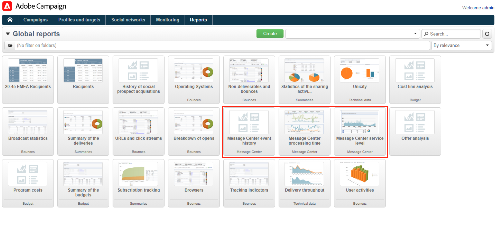
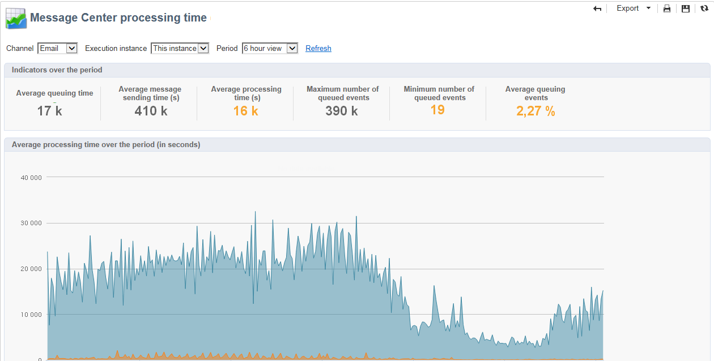

# Envío y monitorización de mensajes transaccionales {#delivery-execution}

## Envío de mensajes{#send-transactional-msg}

Una vez completado el enriquecimiento y vinculada una plantilla de envío al evento, la entrega se realiza desde la instancia de ejecución.

>[!NOTE]
>
>Los mensajes transaccionales tienen prioridad sobre cualquier otro envío.

Todos los envíos se agrupan en la carpeta **[!UICONTROL Administration > Production > Message Center > Default > Deliveries]**.

De forma predeterminada, se clasifican en subcarpetas por mes de envío. Esto se puede cambiar en las propiedades de la plantilla de mensaje.

## Monitorización de mensajes {#monitor-transactional-msg}

Para supervisar los mensajes transaccionales, compruebe los [registros de envío](send.md).

Los envíos transaccionales enviados desde la instancia de ejecución se sincronizan con la instancia de control a través de un flujo de trabajo técnico (**[!UICONTROL Message Center execution instance]**) que se ejecuta cada hora.

>[!NOTE]
>
>Los envíos acumulan semanalmente los eventos en función de la actualización de eventos más reciente y no en la fecha de creación del evento. Por lo tanto, al extraer registros de envío de mensajería transaccional de la instancia de control, el ID de envío asociado con cada ID de registro de envío puede cambiar con el tiempo a medida que se actualiza el registro (por ejemplo, cuando se recibe una devolución de entrada para el evento).

<!--
To monitor the activity and running of the execution instance(s), see [Transactional messaging reports](transactional-messaging-reports.md).-->

## Creación de informes{#reporting-transactional-msg}

Adobe Campaign ofrece varios informes que permiten controlar la actividad y la ejecución continua de las instancias de ejecución.

Se puede acceder a estos informes del centro de mensajería desde la pestaña **[!UICONTROL Reports]****de la instancia de control**.

### Historial de eventos del centro de mensajes {#history-events}

El **[!UICONTROL Message Center event history]** Este informe muestra una descripción general de la actividad del módulo Message Center, es decir, el número de eventos procesados y enviados como mensajes transaccionales.

Cuando se abre el informe, la información que se muestra por defecto coincide con la velocidad de los mensajes transaccionales enviados correctamente. Para ver más niveles, puede abrir los distintos nodos y colocar el cursor en el nivel adecuado para seleccionarlo.

Puede ver los datos específicos para cada tipo de evento por periodo. La columna **[!UICONTROL Events]** corresponde al número de eventos recibidos por cada instancia de control. El número de eventos transformados en mensajes transaccionales personalizados se detalla en la columna **[!UICONTROL Sent]**.

### Tiempo de procesamiento del Centro de mensajería {#processing-time}

El **[!UICONTROL Message Center processing time]** muestra los indicadores principales relacionados con la cola de tiempo real. También se puede acceder a este informe a través de la **[!UICONTROL Monitoring]** en la instancia de control.

Puede elegir mostrar las estadísticas globales o las relativas a una instancia de ejecución determinada. También puede filtrar los datos por canal y por un periodo específico.

Los indicadores que se muestran en la sección **[!UICONTROL Indicators over the period]** se calculan en el periodo seleccionado:

* **[!UICONTROL Average queuing time]**: el tiempo promedio que permanecen los eventos procesados correctamente en el Centro de mensajes. Solo se tiene en cuenta el tiempo de procesamiento.
* **[!UICONTROL Average message sending time (s)]**: el tiempo promedio que permanecen los eventos procesados correctamente en el Centro de mensajes. Solo se tiene en cuenta el tiempo de envío de mta.
* **[!UICONTROL Average processing time (s)]**: el tiempo promedio que permanecen los eventos procesados correctamente en el Centro de mensajes. El cálculo toma en cuenta el tiempo de procesamiento y el tiempo de envío de mta.
* **[!UICONTROL Maximum number of queued events]**: número máximo de eventos presentes en la cola del Centro de mensajes en un momento determinado.
* **[!UICONTROL Minimum number of queued events]**: número mínimo de eventos presentes en la cola del Centro de mensajes en un momento determinado.
* **[!UICONTROL Average number of queued events]**: número promedio de eventos presentes en la cola del Centro de mensajes en un momento determinado.

>[!NOTE]
>
>Los umbrales de los indicadores de advertencia (naranja) y alerta (rojo) pueden configurarse en el Asistente para la implementación de Adobe Campaign. Consulte [Umbrales de monitorización](#thresholds).

### Nivel de servicio del Centro de mensajería {#service-level}

El **[!UICONTROL Message Center service level]** Este informe muestra las estadísticas de envío relacionadas con los mensajes transaccionales y el desglose de errores. Puede hacer clic en un tipo de error para mostrar sus detalles.

También se puede acceder a este informe a través de la **[!UICONTROL Monitoring]** en la instancia de control.

Puede elegir mostrar las estadísticas globales o las relativas a una instancia de ejecución determinada. También puede filtrar los datos por canal y por un periodo específico.

Los indicadores que se muestran en la sección **[!UICONTROL Indicators over the period]** se calculan en el periodo seleccionado:

* **[!UICONTROL Incoming (throughput event/h)]**: número promedio de eventos introducidos por hora en la cola del Centro de mensajes.
* **[!UICONTROL Incoming (event vol)]**: número de eventos introducidos en la cola del Centro de mensajería.
* **[!UICONTROL Outgoing (throughput msg/h)]**: número promedio por hora de eventos del Centro de mensajería salientes correctos (por envío).
* **[!UICONTROL Outgoing (msg vol)]**: número de eventos de Centro de mensajería salientes correctos (por envío).
* **[!UICONTROL Average sending time (seconds)]** : tiempo promedio empleado en el Centro de mensajería para los eventos procesados correctamente. El cálculo toma en cuenta el tiempo de procesamiento y el tiempo de envío de mta.
* **[!UICONTROL Error rate]**: número de eventos con errores comparados con el número de eventos que se han introducido en la cola del Centro de mensajes. Los siguientes errores se tienen en cuenta: error de enrutamiento, evento caducado (evento que ha estado en la cola demasiado tiempo), error de envío, omitido por la entrega (cuarentena, etc.).

>[!NOTE]
>
>Los umbrales de los indicadores de advertencia (naranja) y alerta (rojo) pueden configurarse en el Asistente para la implementación de Adobe Campaign. Consulte [Umbrales de monitorización](#thresholds).

### Umbrales de monitorización {#thresholds}

Puede configurar los umbrales de advertencia (naranja) y alerta (rojo) de los indicadores que aparecen en la **Nivel de servicio del Centro de mensajes** y **Tiempo de procesamiento del centro de mensajes** informes.

Para realizar esto, siga los pasos a continuación:

1. Abra el asistente de implementación en la **instancia de ejecución** y vaya a la **[!UICONTROL Message Center]** página.
1. Utilice las flechas para modificar los umbrales.

   
