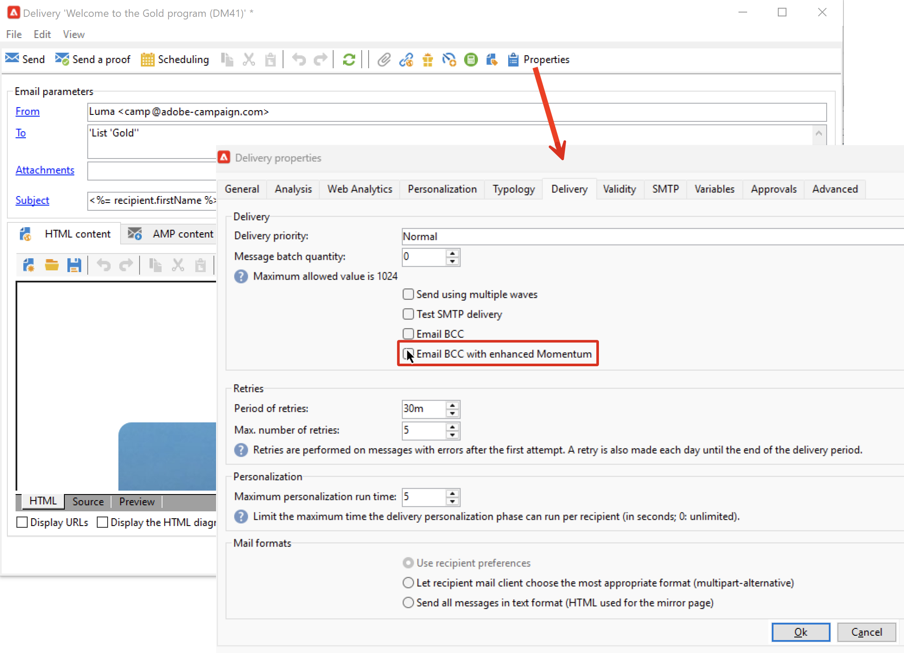

# Parámetros del correo electrónico {#email-parameters}

Esta sección presenta las opciones y los parámetros disponibles en las propiedades de envío específicas de la entrega por correo electrónico.

## Usar CCO del correo electrónico {#email-bcc}

<!--
>[!NOTE]
>
>This capability is available starting Campaign v8.3. To check your version, refer to [this section](../start/compatibility-matrix.md#how-to-check-your-campaign-version-and-buildversion)-->

Puede configurar Adobe Campaign para que conserve una copia de los correos electrónicos enviados desde su plataforma.

Adobe Campaign no administra los archivos archivados. Le permite enviar los mensajes que elija a una dirección de correo electrónico específica de CCO (copia oculta), desde la que se pueden procesar y archivar mediante un sistema externo. Los archivos .eml correspondientes a los correos electrónicos enviados se pueden transferir a un servidor remoto, como un servidor de correo electrónico SMTP.

>[!CAUTION]
>
>Por motivos de privacidad, los correos electrónicos CCO deben procesarse mediante un sistema de archivado capaz de almacenar información de identificación personal (PII) de forma segura.

El destino de archivado es la dirección de correo electrónico CCO que elija, que permanece invisible para los destinatarios de la entrega.

  Como usuario de Managed Cloud Services, [Adobe de contacto](../start/campaign-faq.md#support){target="_blank"} para comunicar la dirección de correo electrónico CCO que se utilizará para el archivado.

Una vez definida la dirección de correo electrónico de CCO, debe habilitar la opción dedicada en el nivel de entrega.

>[!CAUTION]
>
>**[!UICONTROL Email BCC]** no está activada de forma predeterminada. Debe habilitarlo manualmente en la entrega de correo electrónico o en la plantilla de envíos.

Para realizar esto, siga los pasos a continuación:

1. Ir a **[!UICONTROL Campaign Management]** > **[!UICONTROL Deliveries]**, o **[!UICONTROL Resources]** > **[!UICONTROL Templates]** > **[!UICONTROL Delivery templates]**.
1. Seleccione la entrega que desee o duplique el de forma predeterminada **[!UICONTROL Email delivery]** plantilla y, a continuación, seleccione la plantilla duplicada.
1. Haga clic en el botón **[!UICONTROL Properties]**.
1. Seleccione la pestaña **[!UICONTROL Delivery]** .
1. Marque la opción **[!UICONTROL Email BCC]**.

   

1. Seleccione **[!UICONTROL Ok]**.

Se enviará una copia de todos los mensajes enviados para cada envío en función de esta plantilla a la dirección de CCO de correo electrónico que se haya configurado.

Tenga en cuenta las siguientes especificidades y recomendaciones:

* Solo puede utilizar una dirección de correo electrónico CCO.

* Asegúrese de que la dirección de CCO tenga suficiente capacidad de recepción para archivar todos los correos electrónicos enviados.

* Correo electrónico CCO <!--with Enhanced MTA--> envía a la dirección de correo electrónico CCO antes de enviar a los destinatarios, lo que puede dar como resultado que se envíen mensajes CCO aunque los envíos originales puedan haber rebotado. Para obtener más información sobre las devoluciones, consulte [Comprensión de errores de entrega](delivery-failures.md).

* Si se abren y se hace clic en los correos electrónicos enviados a la dirección de CCO, esto se tiene en cuenta en el cálculo de **[!UICONTROL Total opens]** y **[!UICONTROL Clicks]** en el análisis de envío, lo cual podría provocar algunos cálculos erróneos.

<!--Only successfully sent emails are taken in account, bounces are not.-->

## Seleccionar formatos de mensaje {#selecting-message-formats}

Puede cambiar el formato de los mensajes de correo electrónico enviados. Para ello, edite las propiedades de la entrega y haga clic en la pestaña **[!UICONTROL Delivery]**.

Seleccione el formato del correo electrónico en la sección inferior de la ventana:

* **[!UICONTROL Use recipient preferences]** (modo predeterminado)

  El formato de mensaje se define según los datos almacenados en el perfil de destinatario y se almacena de forma predeterminada en el campo **[!UICONTROL email format]** (@emailFormat). Si un destinatario desea recibir mensajes en un formato determinado, este es el formato enviado. Si el campo no está rellenado, se envía un mensaje multipart-alternative (consulte a continuación).

* **[!UICONTROL Let recipient mail client choose the most appropriate format]**

  El mensaje contiene ambos formatos: texto y HTML. El formato que se muestra al recibirlo depende de la configuración del software de correo del destinatario (multipart-alternative).

  >[!IMPORTANT]
  >
  >Esta opción incluye ambas versiones del documento. Por lo tanto, reduce el rendimiento de entrega, ya que el tamaño del mensaje es bueno.

* **[!UICONTROL Send all messages in text format]**

  El mensaje se envía en formato de texto. El formato HTML no se envía, pero se utiliza solo para la página espejo cuando el destinatario hace clic en el mensaje.

<!--
>[!NOTE]
>
>For more on defining the email content, see [this section]().-->

## Establecer codificación de caracteres {#character-encoding}

En la pestaña **[!UICONTROL SMTP]** de los parámetros de entrega, la sección **[!UICONTROL Character encoding]** le permite establecer una codificación específica.

La codificación predeterminada es UTF-8. Si algunos de los proveedores de correo electrónico de los destinatarios no admiten la codificación estándar UTF-8, es posible que desee configurar una codificación específica para que muestre correctamente los caracteres especiales a los destinatarios de los mensajes de correo electrónico.

Por ejemplo, desea enviar un correo electrónico que contenga caracteres japoneses. Para asegurarse de que todos los caracteres se mostrarán correctamente a los destinatarios en Japón, es posible que desee utilizar una codificación que admita los caracteres japoneses en lugar de la codificación UTF-8 estándar.

Para ello, seleccione la opción **[!UICONTROL Force the encoding used for messages]** en la sección **[!UICONTROL Character encoding]** y elija una codificación en la lista desplegable que se muestra.

## Administrar correos electrónicos rechazados {#managing-bounce-emails}

El **[!UICONTROL SMTP]** de las propiedades de entrega también permite configurar la gestión de los correos electrónicos rechazados.

* **[!UICONTROL Errors-to-address]**: De forma predeterminada, los correos electrónicos rechazados se reciben en el cuadro de error predeterminado de la plataforma, pero se puede definir una dirección de error específica para un envío.

* **[!UICONTROL Bounce address]**: También puede definir otra dirección a la que se reenvían los correos electrónicos rechazados sin procesar. Esta dirección permite investigar las razones de la devolución cuando la aplicación no pudo calificar automáticamente los correos electrónicos.

Cada uno de estos campos se puede personalizar mediante el icono dedicado. Obtenga más información sobre los campos de personalización en [esta sección](personalization-fields.md).

Para obtener más información sobre la gestión de correo rechazado, consulte [esta sección](delivery-failures.md#bounce-mail-management).

## Añadir encabezados SMTP {#adding-smtp-headers}

Es posible añadir encabezados SMTP a las entregas. Para ello, utilice la sección correspondiente en la pestaña **[!UICONTROL SMTP]** de la entrega.

La secuencia de comandos introducida en esta ventana debe hacer referencia a un encabezado por línea en el siguiente formulario **name:value**.

Los valores se codifican automáticamente si es necesario.

>[!IMPORTANT]
>
>La adición de secuencias de comandos para insertar encabezados SMTP se reserva para usuarios avanzados.
>
>La sintaxis de esta secuencia de comandos debe cumplir con los requisitos de este tipo de contenido: no dejar espacios sin utilizar, ninguna línea vacía, etc.

<!--
## Generate mirror page {#generating-mirror-page}

The mirror page is an HTML page accessible online via a web browser. Its content is identical to the email. It can be useful if your recipients are experiencing rendering issues or broken images when trying to view your email in their inbox.

Learn how to insert a link to the mirror page in [this section](mirror-page.md).-->