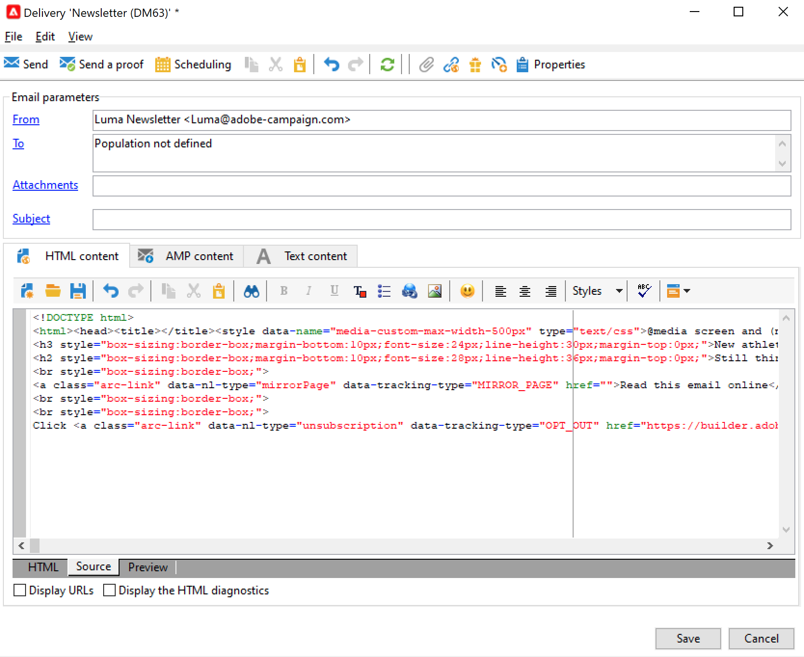
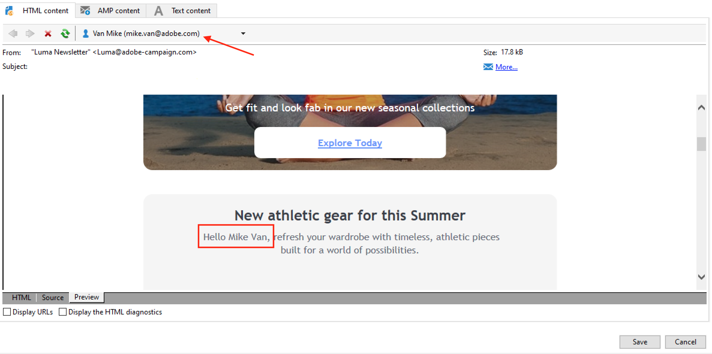

# Diseño y envío de correos electrónicos

Los envíos de correo electrónico le permiten enviar correos electrónicos personalizados a la población objetivo.

 Obtenga más información en la [documentación de Campaign Classic v7](https://experienceleague.adobe.com/docs/campaign-classic/using/sending-messages/sending-emails/about-email-channel.html).

## Creación de la primera entrega de correo electrónico

Cree correos electrónicos personalizados y relevantes para el contexto que sean coherentes con el resto de la experiencia del cliente.

En el siguiente ejemplo, aprenderá los pasos para diseñar una entrega por correo electrónico en Adobe Campaign que contenga datos personalizados, vínculos a una URL externa y un vínculo a la página espejo.

1. **Creación de la entrega**

   Para crear un nuevo envío, vaya a la **Campañas** , haga clic en **Entregas** y haga clic en el botón **Crear** situado encima de la lista de envíos existentes.

   

1. **Seleccione la plantilla**

   Seleccione una plantilla de envío y asigne un nombre a la entrega. Este nombre solo está visible para los usuarios de la consola de Adobe Campaign y no para los destinatarios. Sin embargo, este título se muestra en la lista de envíos. Haga clic en **[!UICONTROL Continue]**.

   

1. **Importar el contenido**

   Haga clic en el **Fuente** para pegar el contenido del HTML.

   

1. **Personalización del mensaje**

   * Añadir el nombre y los apellidos de los destinatarios

      Para insertar el nombre y los apellidos de los perfiles de destino en el contenido del mensaje, coloque el cursor donde desee insertarlos y haga clic en el último icono de la barra de herramientas y, a continuación, haga clic en **[!UICONTROL Include]** y seleccione **[!UICONTROL Greetings]**.

      

      Vaya a la pestaña Preview para comprobar la personalización seleccionando un destinatario.

      

   * Inserción de un vínculo rastreado

      Para transferir los destinatarios de envíos a una dirección externa a través de una imagen o un texto, selecciónelos y haga clic en el botón **[!UICONTROL Add a link]** en la barra de herramientas.

      Introduzca la dirección URL del vínculo en el campo **URL** con el formato **https://www.myURL.com** y, a continuación, confirme la acción.

      

   * Adición de una página espejo

      Para permitir a los destinatarios ver el contenido de la entrega en un navegador web, añada un vínculo a la página espejo del mensaje.

      Sitúe el cursor donde desee insertar este vínculo, haga clic en el último icono de la barra de herramientas y, a continuación, haga clic en **[!UICONTROL Include]** y seleccione **[!UICONTROL link to mirror page]**.
   Una vez que el contenido esté listo, haga clic en **Guardar**: ahora se muestra en la lista de envíos, en la variable **[!UICONTROL Campaigns > Deliveries]** pestaña . Su primer envío de correo electrónico está listo. Ahora debe definir la audiencia, validar la entrega y enviarlo.

Obtenga más información en estas secciones de la documentación de Campaign Classic v7:

* Diseño de un correo electrónico en Campaign
    [Aprenda a diseñar un correo electrónico](https://experienceleague.adobe.com/docs/campaign-classic/using/sending-messages/sending-emails/defining-the-email-content.html)
* Importación de contenido de correo electrónico
    [Caso de uso: Creación de un flujo de trabajo para cargar un contenido de envío](https://experienceleague.adobe.com/docs/campaign-classic/using/automating-with-workflows/use-cases/deliveries/loading-delivery-content.html)
* Creación y uso de una plantilla de correo electrónico
    [Más información acerca de las plantillas de correo electrónico](https://experienceleague.adobe.com/docs/campaign-classic/using/sending-messages/using-delivery-templates/about-templates.html?lang=es)
* Seleccione la audiencia del correo electrónico
    [Obtenga información sobre cómo definir la población objetivo](https://experienceleague.adobe.com/docs/campaign-classic/using/sending-messages/key-steps-when-creating-a-delivery/steps-defining-the-target-population.html)
* Validación de una entrega y envío de pruebas
    [Conozca los pasos clave para validar una entrega](https://experienceleague.adobe.com/docs/campaign-classic/using/sending-messages/key-steps-when-creating-a-delivery/steps-validating-the-delivery.html)
* Agregar [direcciones semilla](https://experienceleague.adobe.com/docs/campaign-classic/using/sending-messages/using-seed-addresses/about-seed-addresses.html)

## Comprobación y validación de los correos electrónicos

Campaign ofrece varias formas de probar y validar los correos electrónicos antes de enviarlos a las audiencias.

 [Aplique las prácticas recomendadas enumeradas en la documentación de Campaign Classic v7](https://experienceleague.adobe.com/docs/campaign-classic/using/sending-messages/key-steps-when-creating-a-delivery/delivery-bestpractices/check-before-sending.html)

Puede hacer lo siguiente:

* Comprobar registros de análisis de envío
* Envío de pruebas
* Adición de direcciones semilla
* Uso de grupos de control
* Compruebe la renderización del correo electrónico

 [Obtenga más información en la documentación de Campaign Classic v7](https://experienceleague.adobe.com/docs/campaign-classic/using/sending-messages/key-steps-when-creating-a-delivery/steps-validating-the-delivery.html)

## Supervisión de los correos electrónicos

Una vez enviado, compruebe su estado de entrega en el panel de entregas y acceda a los registros de envío y a los informes para confirmar que los mensajes se han enviado correctamente.

 [Obtenga más información en la documentación de Campaign Classic v7](https://experienceleague.adobe.com/docs/campaign-classic/using/sending-messages/key-steps-when-creating-a-delivery/delivery-bestpractices/track-and-monitor.html)
