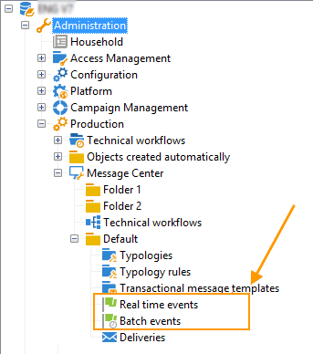

# Procesamiento de eventos {#event-processing}

En el contexto de los mensajes transaccionales, un evento se genera mediante un sistema de información externa y se envía a Adobe Campaign a través del evento **[!UICONTROL PushEvent]** y **[!UICONTROL PushEvents]** métodos. Estos métodos se describen en [esta sección](event-description.md).

Este evento contiene datos vinculados al evento, como:

* its [type](transactional.md#create-event-types): confirmación de pedido, creación de cuenta en un sitio web, etc.,
* la dirección de correo electrónico o el número de teléfono,
* cualquier otra información para enriquecer y personalizar el mensaje transaccional antes de la entrega: información de contacto del cliente, idioma del mensaje, formato de correo electrónico, etc.

Ejemplo de datos de eventos:

Para procesar los eventos de mensajería transaccional, se aplican los siguientes pasos a las instancias de ejecución:

1. [Recopilación de eventos](#event-collection)
1. [Transferencia de eventos a una plantilla de mensajes](#routing-towards-a-template)
1. Enriquecimiento de eventos con datos de personalización
1. [Ejecución de entrega](delivery-execution.md)
1. [Reciclaje de eventos](#event-recycling) cuya entrega vinculada ha dado error (a través de un flujo de trabajo de Adobe Campaign)

Una vez realizados todos los pasos, cada destinatario objetivo recibe un mensaje personalizado.

## Recopilar eventos {#event-collection}

Los eventos que genera el sistema de información se pueden recopilar de dos modos:

* Las llamadas a métodos SOAP permiten insertar eventos en Adobe Campaign: el método PushEvent permite enviar un evento a la vez, mientras que el método PushEvents permite enviar varios a la vez. [Más información](event-description.md).

* La creación de un flujo de trabajo permite recuperar eventos mediante la importación de archivos o mediante una puerta de enlace SQL, con la variable [Acceso de datos federado](../connect/fda.md) módulo.

Una vez recopilados, los eventos se desglosan por flujos de trabajo técnicos entre colas en tiempo real y por lotes de las instancias de ejecución, mientras esperan vincularse a una [plantilla de mensaje](transactional-template.md).

>[!NOTE]
>
>En las instancias de ejecución, las carpetas **[!UICONTROL Real time events]** o **[!UICONTROL Batch events]** no deben configurarse como vistas, ya que esto podría provocar problemas con el derecho de acceso. Para obtener más información sobre la configuración de una carpeta como vista, consulte [esta sección](../audiences/folders-and-views.md#turn-a-folder-to-a-view).

## Transferencia de un evento a una plantilla {#event-to-template}

Una vez que la plantilla de mensaje se publica en las instancias de ejecución, se generan dos plantillas automáticamente: uno que se vinculará a un evento en tiempo real y otro que se vinculará a un evento por lotes.

El paso de enrutamiento consiste en vincular un evento a la plantilla de mensaje correspondiente, basándose en:

* El tipo de evento especificado en las propiedades del propio evento:

   

* El tipo de evento especificado en las propiedades de la plantilla de mensaje:

   

De forma predeterminada, el enrutamiento se basa en la siguiente información:

* El tipo de evento
* El canal que se va a utilizar (predeterminado: correo electrónico)
* La plantilla de envío más reciente, en función de la fecha de publicación

## Comprobar el estado del evento {#event-statuses}

Todos los eventos procesados se agrupan en una sola vista, en la **Historial de eventos** o Explorer. Pueden clasificarse por tipo de evento o por **estado**.

Los estados posibles son:

* **Pendiente**

   * Un evento pendiente puede ser un evento que se acaba de recopilar y que aún no se ha procesado. La columna **[!UICONTROL Number of errors]** muestra el valor 0. La plantilla de correo electrónico aún no se ha vinculado.
   * Un evento pendiente también puede ser un evento procesado pero cuya confirmación es errónea. La columna **[!UICONTROL Number of errors]** muestra un valor que no es 0. Para saber cuándo se volverá a procesar este evento, consulte la columna **[!UICONTROL Process requested on]**.

* **Entrega pendiente**
El evento se procesó y la plantilla de envío está vinculada. El correo electrónico está pendiente de envío y se aplica el proceso de entrega clásico. Abra la entrega para obtener más información.
* **Enviado**, **Ignorado** y **Error de entrega**
Estos estados de entrega se recuperan mediante la variable 
**updateEventsStatus** flujo de trabajo. Para obtener más información, se puede abrir la entrega correspondiente.
* **Evento no cubierto**
Error en la fase de enrutamiento de mensajería transaccional. Por ejemplo, Adobe Campaign no encontró el correo electrónico que actúa como plantilla para el evento.
* **Evento caducado**
Se ha alcanzado el número máximo de intentos de envío. El evento se considera nulo.

## Eventos de reciclaje {#event-recycling}

Si falla el envío de un mensaje en un canal específico, Adobe Campaign puede reenviar el mensaje con un canal diferente. Por ejemplo, si un envío del canal SMS falla, el mensaje se reenvía mediante el canal de correo electrónico.

Para ello, es necesario configurar un flujo de trabajo que vuelva a crear todos los eventos con el estado **Error de entrega** y les asigne un canal diferente.

>[!CAUTION]
>
>Este paso solo se puede llevar a cabo con un flujo de trabajo y, por lo tanto, se reserva para usuarios expertos. Para obtener más información, póngase en contacto con su administrador de cuentas de Adobe.

