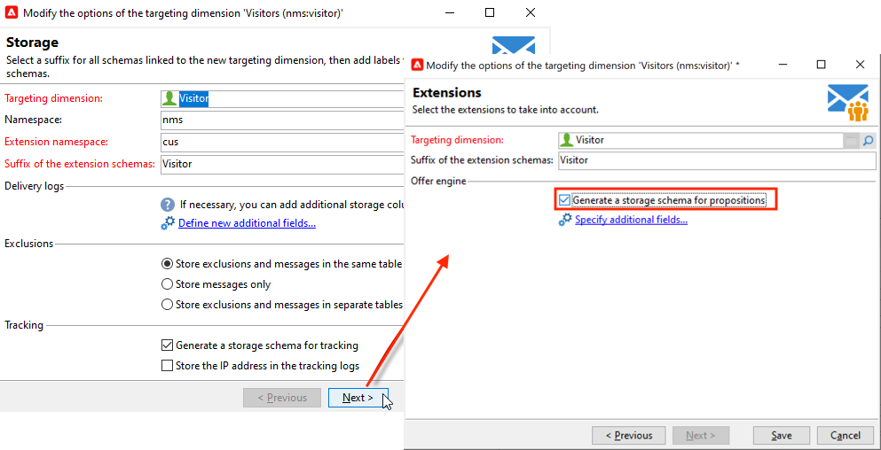

# Entornos en directo y de diseño{#live-design-environments}

La interacción funciona con dos tipos de entornos de oferta:

* Entornos de oferta **[!UICONTROL Design]** que incluyen ofertas que se están editando y pueden modificarse. Estas ofertas no han pasado a través del ciclo de aprobación y no se entregan a los contactos.
* Entornos de oferta **[!UICONTROL Live]** que incluyen ofertas aprobadas a medida que se presentan a los contactos. Las ofertas de este entorno son de solo lectura.

Cada entorno **[!UICONTROL Design]** está relacionado con un entorno **[!UICONTROL Live]**. Cuando se completa una oferta, sus reglas de contenido y de idoneidad están sujetas a un ciclo de aprobación. Una vez completado este ciclo, la oferta correspondiente se implementa automáticamente en el entorno **[!UICONTROL Live]**. A partir de este momento, estará disponible para su envío.

De forma predeterminada, Campaign viene con un entorno **[!UICONTROL Design]** y un entorno **[!UICONTROL Live]** vinculado a él. Ambos entornos están preconfigurados para dirigirse a la [tabla de destinatarios integrada](../dev/datamodel.md#ootb-profiles).

>[!NOTE]
>
>Para la tabla de destinatarios de destino, debe utilizar el asistente de asignación de destino para crear los entornos. [Más información](#creating-an-offer-environment).

Los administradores de envío solo pueden ver el entorno **[!UICONTROL Live]** y aprovechar las ofertas para enviarlas. Los administradores de ofertas pueden ver y utilizar el entorno **[!UICONTROL Design]** y ver el entorno **[!UICONTROL Live]**. [Más información](interaction-operators.md).

## Crear un entorno de oferta {#creating-an-offer-environment}

De forma predeterminada, Campaign viene con un entorno integrado para dirigirse a la tabla de destinatarios (ofertas identificadas). Para dirigirse a otra tabla, siga los pasos a continuación:

1. Vaya a **[!UICONTROL Administration]** > **[!UICONTROL Campaign management]** > **[!UICONTROL Delivery mappings]**, haga clic con el botón derecho en la asignación de envío que desee utilizar y seleccione **[!UICONTROL Actions]** > **[!UICONTROL Modify the options of the targeting dimension]**.

   

1. Haga clic en **[!UICONTROL Next]**, seleccione la opción **[!UICONTROL Generate a storage schema for propositions]** y haga clic en **[!UICONTROL Save]**.

   

   >[!NOTE]
   >
   >Si la opción ya está marcada, desmarque y vuelva a seleccionarla.

1. Adobe Campaign crea dos entornos - **[!UICONTROL Design]** y **[!UICONTROL Live]** - con información de objetivo de la asignación de destino habilitada anteriormente. El entorno está preconfigurado con la información de objetivo.
