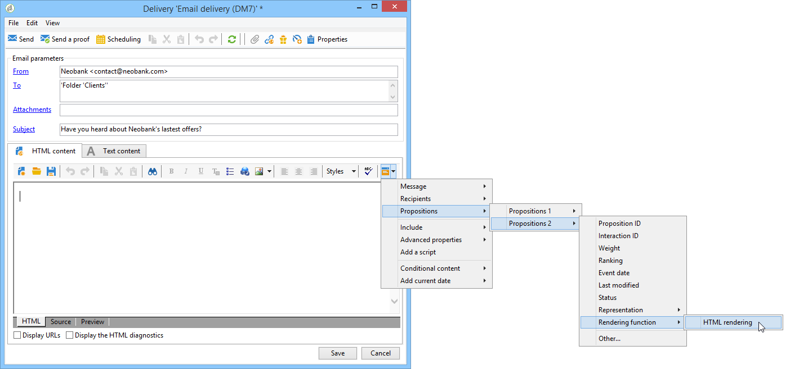
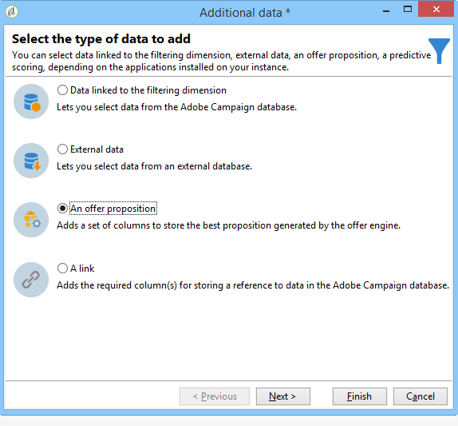

# Enviar una oferta

Para que el motor de oferta pueda seleccionar una oferta, esta se ha aprobado y está disponible en un entorno **Live**. [Obtenga más información](interaction-offer.md#approve-offers)

La presentación de ofertas a través de un canal de comunicación saliente se realiza mediante correo postal, correo electrónico o envíos móviles. También puede utilizar el modo unitario con mensajes transaccionales (Centro de mensajes).

## Inserción de una oferta en un envío {#offer-into-a-delivery}

Para insertar propuestas de oferta en una entrega, siga los pasos a continuación:

1. En la ventana de envío, haga clic en el icono **Offers**.

   

1. Seleccione el espacio que coincida con el entorno de la oferta.

   

1. Para perfeccionar la elección de las ofertas de motor, seleccione la categoría desde la que se presentan las ofertas, o bien uno o varios temas. Solo se recomienda utilizar uno de estos campos a la vez para evitar sobrecargar las restricciones.

   

   

1. Especifique el número de ofertas que desea insertar en el cuerpo de la entrega.

   

1. Seleccione la opción **[!UICONTROL Exclude non-eligible recipients]** si es necesario. [Más información](#parameters-for-calling-offer-engine).

   

1. Si es necesario, seleccione la opción **[!UICONTROL Do not display anything if no offers are selected]** . [Más información](#parameters-for-calling-offer-engine).

   

1. Inserte las propiedades en el contenido de la entrega mediante los campos combinados. El número de propuestas disponibles depende del modo en que se configura la visualización del motor y su orden depende de la prioridad de las ofertas.

   

1. Finalice el contenido, pruebe y realice la entrega.

   

### Parámetros del motor de oferta {#parameters-for-calling-offer-engine}

* **[!UICONTROL Space]** : espacio del entorno de oferta que debe seleccionarse para activar el motor de oferta.
* **[!UICONTROL Category]** : carpeta específica en la que se ordenan las ofertas. Si no se especifica ninguna categoría, el motor de oferta llevará a cabo todas las ofertas contenidas en el entorno, a menos que se seleccione un tema.
* **[!UICONTROL Themes]** : las palabras clave se definen hacia arriba en las categorías. Estos actúan como un filtro y permiten refinar la cantidad de ofertas que se presentarán seleccionándolas de un conjunto de categorías.
* **[!UICONTROL Number of propositions]** : número de ofertas que devuelve el motor que se puede insertar en el cuerpo del envío. Si no se insertan en el mensaje, las ofertas se generarán, pero no se presentarán.
* **[!UICONTROL Exclude non-eligible recipients]** : esta opción permite activar o desactivar la exclusión de destinatarios para los que no haya suficientes ofertas aptas. El número de propuestas puede ser inferior al número solicitado de propuestas. Si se selecciona este cuadro, los destinatarios que no tengan suficientes propuestas se excluirán de la entrega. Si no selecciona esta opción, estos destinatarios no se excluirán, pero no tendrán el número solicitado de propuestas.
* **[!UICONTROL Do not display anything if no offer is selected]** : esta opción le permite elegir cómo se procesará el mensaje en caso de que una de las propuestas no exista. Cuando se activa esta casilla, no se muestra la representación de la propuesta que falta y no aparecerá ningún contenido en el mensaje para esta propuesta. Si el cuadro no está activado, el mensaje en sí se cancela durante la entrega y los destinatarios ya no recibirán ningún mensaje.

## Enviar ofertas en flujos de trabajo

Varias actividades de flujo de trabajo permiten definir la forma en que se presentan las ofertas:

* Enriquecimiento
* Motor de oferta
* Ofertas por celda

### Enriquecimiento {#enrichment}

La actividad **Enrichment** permite añadir ofertas o vínculos a ofertas para los destinatarios del envío.

[!DNL :arrow_upper_right:] Para obtener más información sobre la actividad de Enriquecimiento, consulte la documentación de  [Campaign Classic v7 .](https://experienceleague.adobe.com/docs/campaign-classic/using/automating-with-workflows/targeting-activities/enrichment.html)

Por ejemplo, puede ampliar los datos de una consulta al destinatario antes de una entrega.

Existen dos métodos para especificar propuestas de oferta.

* Especificación de una oferta o acceso al motor de oferta.
* Referencia al vínculo de una oferta.

#### Especifique una oferta o una llamada al motor de oferta {#specifying-an-offer-or-a-call-to-the-offer-engine}

Después de configurar su actividad **Query**:

1. Agregue y abra una actividad **Enrichment**.
1. En la pestaña **[!UICONTROL Enrichment]**, seleccione **[!UICONTROL Add data]**.
1. Seleccione **[!UICONTROL An offer proposition]** en los tipos de datos que desea añadir.

   

1. Especifique un identificador y una etiqueta para la propuesta a añadir.
1. Especifique la selección de la oferta. Hay dos formas de hacerlo:

   * **[!UICONTROL Search for the best offer in a category]**: marque esta opción y especifique los parámetros de recurso del motor de oferta (espacio de oferta, categoría o temas, fecha de contacto, cantidad de ofertas que desea mantener). Según estos parámetros, el motor calculará automáticamente las ofertas a agregar. Se recomienda completar el campo **[!UICONTROL Category]** o el campo **[!UICONTROL Theme]** en vez de ambos al mismo tiempo.

      

   * **[!UICONTROL A predefined offer]** : marque esta opción y especifique un espacio de oferta, una oferta específica y una fecha de contacto para configurar directamente la oferta que desee añadir, sin recurrir al motor de oferta.

      

1. A continuación, configure una actividad de entrega que corresponda al canal elegido. [Más información](#offer-into-a-delivery).

   >[!NOTE]
   >
   >El número de propuestas disponibles para la vista previa depende de la configuración realizada en la actividad de enriquecimiento y no de cualquier configuración realizada directamente en la entrega.

#### Hacer referencia a un vínculo de oferta {#referencing-a-link-to-an-offer}

También puede hacer referencia a un vínculo de oferta en una actividad **Enrichment**.

Para realizar esto, siga los pasos a continuación:

1.  En la pestaña **[!UICONTROL Enrichment]** de la actividad, seleccione **[!UICONTROL Add data]**.
1. En la ventana donde se elige el tipo de datos a añadir, seleccione **[!UICONTROL A link]**.
1. Seleccione el tipo de vínculo que desea establecer y su destino. En este caso, el destino es el esquema de oferta.

   

1. Especifique el vínculo entre los datos de la lista entrante en la actividad de ampliación (lista de destinatarios) y la lista de oferta. Por ejemplo, se puede vincular un código de oferta a un destinatario.

   

1. A continuación, configure una actividad de entrega que corresponda al canal elegido. [Más información](#offer-into-a-delivery).

   >[!NOTE]
   >
   >El número de propuestas disponibles para la vista previa depende de la configuración realizada en la entrega.

#### Almacene clasificaciones y consideraciones de ofertas {#storing-offer-rankings-and-weights}

De forma predeterminada, cuando se utiliza una actividad **Enrichment** para entregar ofertas, sus clasificaciones y sus consideraciones no se almacenan en la tabla de propuestas.

>[!NOTE]
>
>La actividad **[!UICONTROL Offer engine]** almacena esta información de forma predeterminada.

Sin embargo, se puede almacenar esta información de la siguiente manera:

1. Cree un recurso al motor de oferta en una actividad ampliada colocada después de una consulta y antes de una actividad de entrega. [Más información](#specifying-an-offer-or-a-call-to-the-offer-engine).
1. En la ventana principal de la actividad, seleccione **[!UICONTROL Edit additional data...]**

   

1. Añada las columnas **[!UICONTROL @rank]** para la clasificación y **[!UICONTROL @weight]** para las ponderaciones de la oferta.

   

1. Confirme su adición y guarde el flujo de trabajo.

La entrega almacena automáticamente la clasificación y las consideraciones de las ofertas. Esta información está visible en la pestaña de la entrega **[!UICONTROL Offers]**.

### Motor de oferta {#offer-engine}

La actividad **[!UICONTROL Offer engine]** también permite definir el acceso al motor de oferta antes de una entrega.

[!DNL :arrow_upper_right:] Para obtener más información sobre la  **actividad de** ingeniería de ofertas, consulte la documentación de  [Campaign Classic v7](https://experienceleague.adobe.com/docs/campaign-classic/using/automating-with-workflows/targeting-activities/offer-engine.html)

Esta actividad funciona con el mismo principio que la actividad **Enrichment** con acceso al motor, al enriquecer los datos de población entrantes con una oferta calculada por el motor antes de un envío.

Después de configurar su actividad **Query**:

1. Añada y abra una actividad **[!UICONTROL Offer engine]**.
1. Complete los diferentes campos disponibles para especificar el uso de los parámetros del motor de oferta (ofrecer espacio, categoría o tema, fecha de contacto, número de ofertas que desea mantener). Según estos parámetros, el motor calculará automáticamente las ofertas a agregar.

   >[!CAUTION]
   >
   >Si utiliza esta actividad, solo se almacenará la oferta que se haya utilizado en la entrega.

   

1. A continuación, configure una actividad de entrega que corresponda al canal elegido. [Más información](#inserting-an-offer-proposition-into-a-delivery).

### Ofertas por celda {#offers-by-cell}

La actividad **[!UICONTROL Offers by cell]** permite distribuir la población entrante (desde una consulta por ejemplo) en varios segmentos y especificar una oferta para presentar a cada uno de estos segmentos.

[!DNL :arrow_upper_right:] Para obtener más información sobre la actividad  **Offer by** cellactivity, consulte la documentación de  [Campaign Classic v7](https://experienceleague.adobe.com/docs/campaign-classic/using/automating-with-workflows/targeting-activities/offers-by-cell.html)

Para ello, utilice el proceso siguiente:

1. Una vez que haya especificado la población destinataria, añada la actividad **[!UICONTROL Offers by cell]** y ábrala.
1. En la pestaña **[!UICONTROL General]**, seleccione el espacio de oferta en el que desea presentar las ofertas.
1. En la pestaña **[!UICONTROL Cells]**, especifique los diferentes subconjuntos con el botón **[!UICONTROL Add]**:

   * Especifique la población del subconjunto utilizando las reglas de filtrado y limitación disponibles.
   * A continuación, seleccione la oferta que desea presentar al subconjunto. Las ofertas disponibles son las admitidas en el entorno de oferta seleccionado en el paso anterior.

      

1. A continuación, configure una actividad de entrega que corresponda al canal elegido.

<!--

## Delivering with delivery outlines {#delivering-with-delivery-outlines}

You can also present offers in a delivery using delivery outlines.

For more information on delivery outlines, refer to the Campaign - MRM guide.

1. Create a new campaign or access an existing campaign.
1. Access the delivery outlines via the campaign's **[!UICONTROL Edit]** > **[!UICONTROL Documents]** tab.
1. Add an outline then insert as many offers as you like into it by right-clicking on the outline and selecting **[!UICONTROL New]** > **[!UICONTROL Offer]**, then save the campaign.

1. Create a delivery whose delivery outlines you have access to (for example, a direct mail delivery).
1. When editing the delivery, click **[!UICONTROL Select a delivery outline]**.

   >[!NOTE]
   >
   >Depending on the type of delivery, this option can be found in the **[!UICONTROL Properties]** > **[!UICONTROL Advanced]** menu (for email deliveries for example).

1. Using the **[!UICONTROL Offers]** button, you can then configure the offer space as well as the number of offers to present in the delivery.

1. Add the propositions into the delivery body using the personalization fields (for more on this, refer to the [Inserting an offer proposition into a delivery](#inserting-an-offer-proposition-into-a-delivery) section), or in the case of a direct mail delivery, by editing the extraction file format.

   Propositions will be selected from the offers referenced in the delivery outline.

   >[!NOTE]
   >
   >Information regarding the offer rankings and weights is only saved in the proposition table if the offers are generated directly in the delivery.
-->
