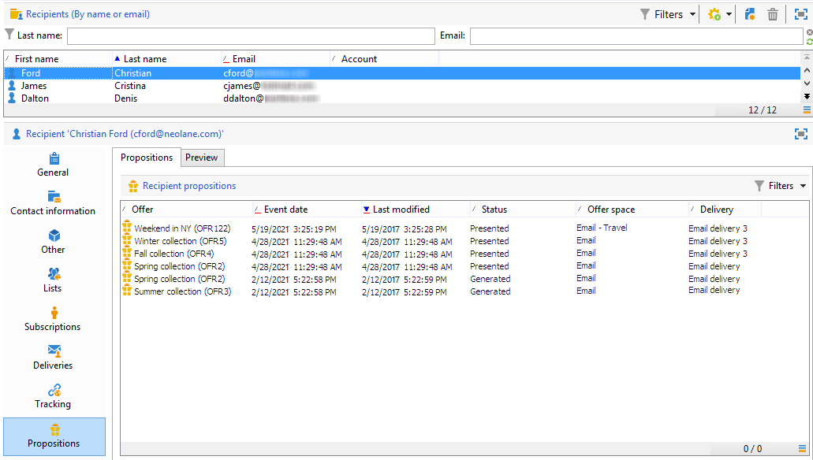

# Historial de interacción en tiempo real e informes

>[!NOTE]
>
>Estas funcionalidades solo son visibles en línea y solo para el **Administradores de envío**.

## Historial de propuesta de oferta{#offer-proposition-history}

Una vez que se hayan realizado las propuestas de oferta, podrá visualizar el historial de presentación.

* En el nivel de oferta, en la pestaña **[!UICONTROL Edit]**, haga clic en **[!UICONTROL Propositions]**.

   

* En el perfil de un destinatario, haga clic en la pestaña **[!UICONTROL Propositions]**.

   

* En el nivel de espacio de oferta, haga clic en la pestaña **[!UICONTROL Propositions]**.

   

## Informe de análisis de oferta{#offer-analysis-report}

El informe **[!UICONTROL Offer analysis]** proporciona un resumen del número de las propuestas aceptadas o rechazadas.

Las estadísticas se clasifican según tres criterios:

* Por fecha:

   

* Por espacio:

   

* Por entrega:

   

Los datos se pueden filtrar según los distintos criterios disponibles en la sección superior del informe. Una vez que haya seleccionado los criterios deseados, haga clic en el enlace **[!UICONTROL Refresh]** para aplicarlos al informe.
