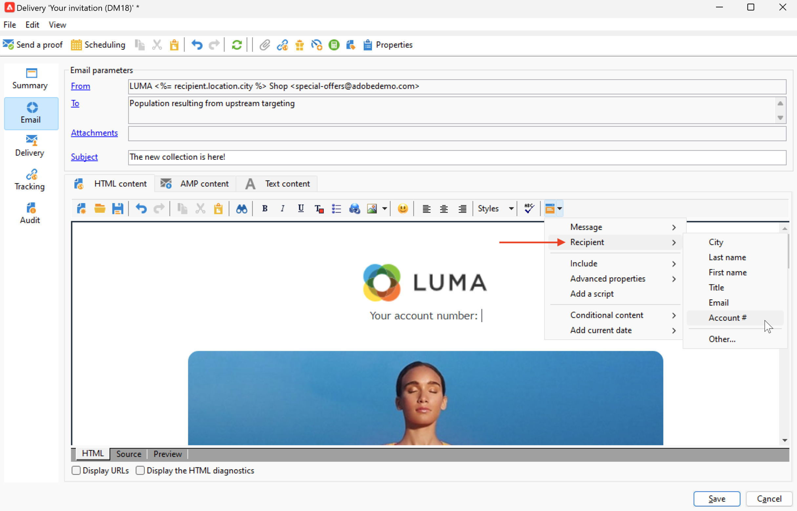

# Fuentes de datos personalizadas{#personalization-data}

Los datos de personalización se pueden recuperar desde varios tipos de fuentes: Fuente de datos de base de datos de Campaign, fuente de datos de archivo externo o fuente de datos de base de datos externa.

## Fuente de datos de la base de datos de Campaign

En el caso más común, los datos de personalización se almacenan en la base de datos. Por ejemplo, &quot;campos personalizados de destinatario&quot; son todos los campos definidos en la tabla de destinatarios, campos estándar (normalmente: apellidos, nombre, dirección, ciudad, fecha de nacimiento, etc.) o campos personalizados.

## Fuente de datos de archivos externos

Puede utilizar un archivo externo que contenga todos los campos definidos en las columnas. Este archivo se utiliza como entrada durante una definición de envío de mensaje. Puede elegir insertar esos perfiles en la base de datos o no.

Para seleccionar el archivo que desea utilizar como fuente de datos, vaya al vínculo To en la ventana de creación de mensajes y seleccione la opción **Definido en un archivo externo** . Una vez cargado el archivo, acceda a los datos de destinatario en las opciones de personalización, desde el **Campos del archivo** entrada.

## Fuente de datos FDA

Los datos de personalización se pueden extraer de una tabla externa a través de [Acceso de datos federado](../connect/fda.md).  Si desea personalizar las entregas utilizando datos de la base de datos externa, recopile los datos para utilizarlos en un flujo de trabajo para que estén disponibles en una tabla temporal.

Para ello, agregue una **Consulta** actividad en el flujo de trabajo de objetivos y utilice el **Agregar datos...** para seleccionar la base de datos externa. El proceso detallado está disponible en [esta sección](../../automation/workflow/query.md#adding-data).

A continuación, utilice los datos de la tabla temporal para personalizar su envío. Una vez configurada la actividad de consulta, acceda a los datos externos en las opciones de personalización, desde el **Extensión de Target** entrada.

Al utilizar datos externos a los que se accede en FDA, se recomienda procesar previamente la personalización de mensajes en un flujo de trabajo dedicado mediante el **Preparación de los datos de personalización con un flujo de trabajo** como se detalla a continuación.

### Optimización de la personalización {#optimize-personalization}

Puede optimizar la personalización mediante una opción dedicada: **[!UICONTROL Prepare the personalization data with a workflow]**, disponible en la pestaña **[!UICONTROL Analysis]** de las propiedades de envío.

Durante el análisis de envío, esta opción crea y ejecuta automáticamente un flujo de trabajo que almacena todos los datos vinculados con el objetivo en una tabla temporal, incluidos los datos de tablas vinculadas en FDA.

Marcar esta opción puede mejorar el rendimiento del análisis de envío cuando se procesan muchos datos, especialmente si los datos de personalización proceden de una tabla externa a través de FDA. [Más información](../connect/fda.md).

Para utilizar esta opción, siga los pasos a continuación:

1. Cree una campaña.
1. En la pestaña **[!UICONTROL Targeting and workflows]** de la campaña, añada una actividad **Query** al flujo de trabajo.
1. Añada una actividad de **[!UICONTROL Email delivery]** al flujo de trabajo y ábrala.
1. Vaya a la pestaña **[!UICONTROL Analysis]** de la **[!UICONTROL Delivery properties]** y seleccione la opción **[!UICONTROL Prepare the personalization data with a workflow]**.
1. Configure la entrega e inicie el flujo de trabajo para iniciar el análisis.

Una vez finalizado el análisis, los datos de personalización se almacenan en una tabla temporal a través de un flujo de trabajo técnico temporal que se crea sobre la marcha durante el análisis.

Este flujo de trabajo no es visible desde la interfaz de Adobe Campaign. Solo pretende ser un medio técnico para almacenar y gestionar rápidamente los datos de personalización.

Una vez completado el análisis, vaya al flujo de trabajo **[!UICONTROL Properties]** y seleccione la pestaña **[!UICONTROL Variables]**. Se puede ver el nombre de la tabla temporal que puede utilizar para realizar una llamada SQL con el fin de mostrar los ID que contiene.

## Personalización de datos en un flujo de trabajo

Cuando se crea una entrega en el contexto de un flujo de trabajo, se pueden utilizar los datos de la tabla de flujo de trabajo temporal. Los datos almacenados en la tabla de trabajo temporal del flujo de trabajo están disponibles para las tareas de personalización. Los datos se pueden utilizar en los campos personalizados.

Estos datos se agrupan en el menú **[!UICONTROL Target extension]**. Para obtener más información, consulte [esta sección](../../automation/workflow/use-workflow-data.md#target-data).

