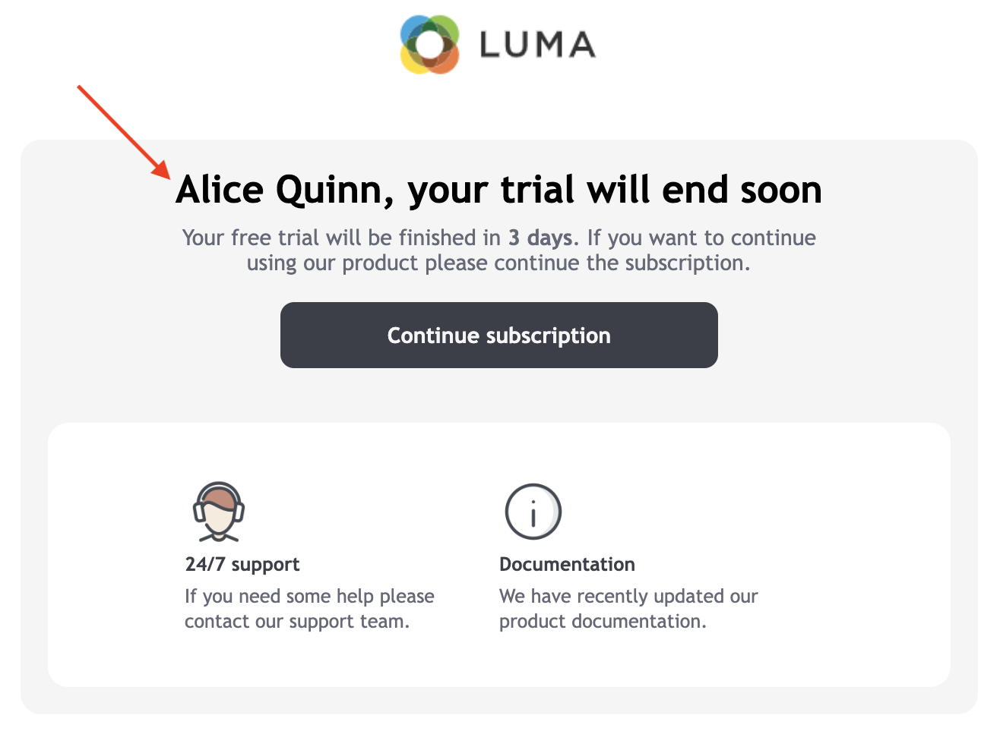

# Añadir campos personalizados{#personalization-fields}

Utilice los campos de personalización para enviar contenido personalizado de forma individual, en función de las reglas que establezca para cada destinatario.

Un campo de personalización es una referencia de campo de datos única que se utiliza al personalizar un envío para un destinatario específico. El valor real de los datos se inserta durante la fase de análisis del envío.

## Sintaxis

Una etiqueta de personalización siempre utiliza la siguiente sintaxis: `<%=table.field%>`.

Por ejemplo, para insertar el nombre del destinatario, almacenado en la tabla de destinatarios, el campo personalizado utiliza la variable `<%= recipient.lastName %>` sintaxis.

>[!CAUTION]
>
>El contenido de los campos de personalización no puede superar los 1024 caracteres.

## Insertar un campo personalizado {#insert-a-personalization-field}

Para insertar campos personalizados, haga clic en el icono desplegable al que se puede acceder desde cualquier campo de encabezado, asunto o cuerpo del mensaje.

Los campos personalizados se insertan y están listos para que Adobe Campaign los interprete: durante la preparación del mensaje, los campos se sustituyen por su valor para un destinatario determinado.

Este reemplazo se puede probar en la variable **[!UICONTROL Preview]** pestaña .

<!--Learn more about message preview in [this page]().-->

## Caso de uso: personalización del asunto del correo electrónico {#personalization-fields-uc}

En el siguiente caso de uso, aprenda a personalizar un asunto y un cuerpo de correo electrónico con datos de destinatario:

1. Cree un nuevo envío o abra un envío de correo electrónico existente.
1. Vaya a la **[!UICONTROL Subject]** para editar el asunto del mensaje.
1. Introduzca “**Special offer for**” y utilice el botón de la barra de herramientas para insertar un campo de personalización. Seleccione **[!UICONTROL Recipients>Title]**.
1. Repita la operación para insertar el nombre del destinatario. Inserte espacios entre todos los campos personalizados.
1. Haga clic en **[!UICONTROL OK]** para validar.
1. Inserte la personalización en el cuerpo del mensaje. Para ello, haga clic en el contenido del mensaje y haga clic en el botón de inserción de campo.
1. Seleccione **[!UICONTROL Recipient>Other...]**.
1. Seleccione el campo con la información que se va a mostrar y haga clic en **[!UICONTROL OK]**.
1. Haga clic en la pestaña **[!UICONTROL Preview]** para ver el resultado personalizado. Se debe seleccionar un destinatario para mostrar el mensaje de dicho destinatario.

## Tutorial en vídeo {#personalization-field-video}

Aprenda a añadir un campo de personalización a la línea de asunto y el contenido de una entrega de correo electrónico en el siguiente vídeo.

>[!VIDEO](https://video.tv.adobe.com/v/24925?quality=12)

