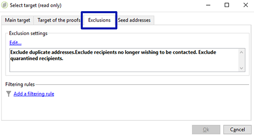

# Cupones personalizados{#personalized-coupons}

Añadir cupones a las entregas puede proporcionar aumentar el valor de los productos y servicios para sus destinatarios. Se puede utilizar el módulo de cupones de Campaign para crear un conjunto de cupones que pretenda añadir a las próximas ofertas de marketing. Cuando esté preparado para crear una entrega, asigne los cupones aplicables. Dado que los cupones son válidos durante un periodo determinado, un cupón asignado se enlaza exclusivamente a su mensaje de envío. Además, Campaign confirma que hay suficientes cupones para la cantidad de mensajes antes de realizar la entrega.

>[!AVAILABILITY]
>
>La administración de cupones no está disponible en Campaign v8 en el contexto de una implementación de Enterprise (FDAC). Obtenga más información en [Documentación de Campaign v8](../architecture/enterprise-deployment.md).

La administración de cupones se basa en un paquete que debe instalarse. Para confirmar que tiene instalado el administrador de cupones, marque **[!UICONTROL Administration > Configuration > Package management > Installed packages.]**

Los datos de cupones se pueden importar y exportar en los formatos CSV y XML. [Más información](../start/import.md).

## Creación de un cupón {#creating-a-coupon}

El módulo de administración de cupones ofrece dos opciones al crear cupones:

* **Anonymous**: Un cupón genérico para destinatarios seleccionados o listas de destinatarios.
* **Individual**: Un cupón personalizado para destinatarios seleccionados.

Antes de iniciar los pasos siguientes, asegúrese de saber el tipo de cupón que desea crear.

1. En el árbol de Campaign, vaya a **[!UICONTROL Resources > Campaign management > Coupons]**.

   

1. Haga clic en el botón **[!UICONTROL New]**.
1. Introduzca el nombre del cupón en el campo **[!UICONTROL Label]**. Se ha introducido automáticamente un código único en **[!UICONTROL Coupon code]**. Puede mantener el código o introducir uno nuevo.

   

1. Seleccione **[!UICONTROL Start date]** y **[!UICONTROL End date]** para configurar el periodo de validez del cupón.
1. En **[!UICONTROL Coupon type]**, seleccione Anonymous o Individual.

   **[!UICONTROL Anonymous coupons]** : Un cupón anónimo es idéntico para todos los destinatarios. Confirme que ha seleccionado Anónimo en el menú **Coupon type** y haga clic en **Save** para generar el cupón.

   **[!UICONTROL Individual coupons]**: Un cupón individual puede personalizarse aún más con códigos de cupones adicionales. Por ejemplo, se crea un cupón individual para una venta en un almacén de equipación deportiva. Sin embargo, la lista de destinatarios es larga y no comparten el mismo entusiasmo por un único deporte. Se puede añadir nombres de código para el cupón individual en función de un deporte (por ejemplo, fútbol, fútbol americano, béisbol, etc.) y enviar cada código a los destinatarios correspondientes.

   1. Al elegir Individual, aparece una pestaña nueva, Cupones, en la esquina inferior izquierda. Vaya a la pestaña **[!UICONTROL Coupons]** y haga clic en **[!UICONTROL Add]**.
   1. Introduzca un código único para el cupón individual cuando lo solicite la ventana emergente.
   1. Haga clic en **[!UICONTROL Save]** para generar el cupón.

   Para obtener más información acerca de la pestaña Cupones, consulte [Configuración de cupones individuales](#configuring-individual-coupons).

   >[!NOTE]
   >
   >Los cupones individuales se pueden importar de forma masiva. Para obtener información sobre la importación y la exportación, consulte [esta sección](../start/import.md).

### Configuración de cupones individuales {#configuring-individual-coupons}

La pestaña Cupones solo está disponible con cupones individuales. Tras asociar un cupón a una entrega, la pestaña Cupones proporciona los siguientes detalles:

* **[!UICONTROL Status]** : Disponibilidad de cupones.
* **[!UICONTROL Redeemed on]** : La fecha en la que se canjea el cupón.
* **[!UICONTROL Channel]**: El canal utilizado para enviar el cupón.
* **[!UICONTROL Address]** : Las direcciones de correo electrónico de los destinatarios.

Los valores de **[!UICONTROL channel]**, **[!UICONTROL status]** y **[!UICONTROL address]** se rellenan automáticamente. Sin embargo, Campaign no recupera los valores de **[!UICONTROL redeemed on]**. Se pueden rellenar importando un archivo con los detalles del canje de cupones.

## Inserción de un cupón en una entrega de correo electrónico {#inserting-a-coupon-into-an-email-delivery}

En el siguiente ejemplo, la entrega se crea desde la página principal. Para obtener instrucciones detalladas sobre cómo crear una entrega, consulte [esta sección](email.md)
1. Vaya a **[!UICONTROL Campaigns]** y elija **[!UICONTROL Deliveries]**.
1. Haga clic en **[!UICONTROL Create]**.

   

1. Introduzca un nombre en **[!UICONTROL Label]** y haga clic en **[!UICONTROL Continue]**.
1. Haga clic en **[!UICONTROL To]** para añadir destinatarios.
1. Haga clic en **[!UICONTROL Add]** para seleccionar destinatarios para la entrega. Una vez seleccionados los destinatarios, haga clic en **[!UICONTROL Ok]** para regresar a la entrega.

   

1. Introduzca un asunto y añada contenido al mensaje.

   

1. En la barra de herramientas, haga clic en **[!UICONTROL Properties]** y seleccione la pestaña **[!UICONTROL Advanced]**.
1. Haga clic en el icono de la carpeta de **[!UICONTROL Coupon management]**.

   

1. Seleccione el cupón y haga clic en **[!UICONTROL Ok]**. Haga clic en **[!UICONTROL Ok]** de nuevo.

   

1. Haga clic en el mensaje para elegir dónde desea colocar el cupón.

   

1. Haga clic en el icono de personalización para elegir una de las siguientes opciones en función del tipo de cupón:

   * Cupón anónimo: **[!UICONTROL Coupon > Coupon code]**

     

   * Cupón individual: **[!UICONTROL Coupon value > Coupon code]**

     

     El cupón se inserta en el mensaje como código en lugar de hacerlo como el nombre asignado. El código se utiliza en el modelo de datos listo para usarse de Campaign.

   

1. Ejecute una prueba para confirmar el nombre asignado al cupón. Vaya a la pestaña **[!UICONTROL Preview]** y haga clic en **[!UICONTROL Test personalization]**. Seleccione un destinatario para la prueba.

   

   Después de la prueba, el cupón debe aparecer con el nombre asignado en lugar de como código.

   

1. En la barra de herramientas, haga clic en **[!UICONTROL Send]** (parte superior izquierda) y seleccione cómo desea realizar la entrega.

   

1. Haga clic en **[!UICONTROL Analyze]**. Si el registro de análisis confirma que hay suficientes cupones para todos los destinatarios, haga clic en **[!UICONTROL Confirm delivery]** para enviarlo.

   

>[!NOTE]
>
>Para obtener instrucciones sobre la administración de cupones insuficientes para una entrega, consulte [Administración de cupones insuficientes](#managing-insufficient-coupons).

Para confirmar que la entrega se realizó correctamente:

1. Vaya a **[!UICONTROL Explorer > Resources > Campaign management > Coupons]**.
1. Haga clic en la pestaña **[!UICONTROL Deliveries]**.

   

   El estado se ve como **[!UICONTROL Finished]** si la entrega se ha realizado correctamente.

>[!NOTE]
>
>De manera predeterminada, el módulo de administración de cupones usa una tabla **nms:recipient**. [Más información](../dev/datamodel.md#ootb-profiles).
>
>Aprenda a utilizar una tabla de destinatarios personalizada [en esta página](../dev/custom-recipient.md).

## Administración de cupones insuficientes {#managing-insufficient-coupons}

El análisis de envío se detiene si hay menos cupones que mensajes. En tal caso, puede importar más cupones o restringir la cantidad de mensajes. Siga las instrucciones que se indican a continuación si desea limitar la cantidad de mensajes.

1. Vaya a la ventana de envío de correo electrónico.
1. Haga clic en **[!UICONTROL To]**.
1. En **[!UICONTROL Select target]**, vaya a la pestaña **[!UICONTROL Exclusions]**.

   

1. En la sección de configuración de exclusión, haga clic en **[!UICONTROL Edit]**.
1. En **[!UICONTROL Limit delivery to...messages]**, introduzca el número de mensajes que desea enviar y haga clic en **[!UICONTROL Ok]**. Puede realizar la entrega.

   

>[!NOTE]
>
>Al administrar un número limitado de cupones, un flujo de trabajo de envío permite dividir la entrega en función de ciertos criterios. Es una buena opción si desea enviar cupones a una población determinada sin restringir el objetivo.
