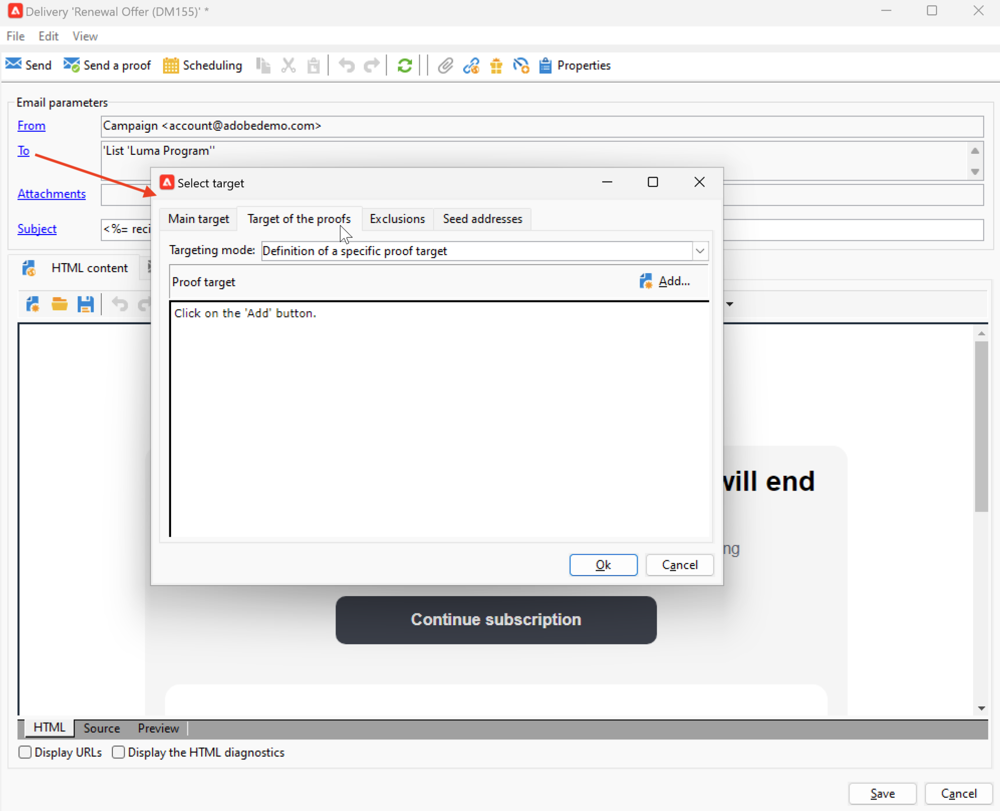

# Previsualización y prueba del correo electrónico {#preview-test}

Una vez definido el contenido del mensaje, puede utilizar perfiles de prueba para previsualizarlo y probarlo. Si ha insertado [contenido personalizado](personalize.md), puede comprobar cómo se muestra este contenido en el mensaje con los datos del perfil de prueba. Además, para detectar posibles errores en el contenido del mensaje o en la configuración de personalización, envíe pruebas a los perfiles de prueba. Se debe enviar una prueba cada vez que se realiza un cambio para validar el contenido más reciente.

## Previsualización de contenido {#preview-content}

Antes de enviar pruebas, una práctica recomendada es comprobar el contenido del mensaje en la sección de vista previa de la ventana de entrega.

Para obtener una vista previa del contenido del mensaje, siga los pasos a continuación:

1. Vaya a la pestaña **Vista previa** del envío.
1. Haga clic en el botón **[!UICONTROL Test personalization]** para seleccionar un perfil y rellenar los datos de personalización. Puede elegir un destinatario específico en la base de datos, una dirección semilla o seleccionar un perfil de la población de destinatarios, si ya se ha definido. También puede comprobar el contenido sin personalización.

   

1. La previsualización se genera para que pueda comprobar la renderización del mensaje. En la vista previa del mensaje, los elementos personalizados se sustituyen por los datos del perfil de prueba seleccionado.

   

1. Seleccione otros perfiles de prueba para previsualizar el procesamiento de correo electrónico para cada variante del mensaje.

## Envío de pruebas {#send-proofs}

En el caso de los envíos por correo electrónico, puede enviar pruebas para validar el contenido del mensaje. El envío de pruebas le permite comprobar el vínculo de no participación, la página espejo y cualquier otro vínculo, validar el mensaje, comprobar que se muestran las imágenes, detectar posibles errores, etc. También es posible que desee comprobar el diseño y el procesamiento en distintos dispositivos.

Una prueba es un mensaje específico que le permite probar un mensaje antes de enviarlo al público principal. Los destinatarios de la prueba se encargan de aprobar el mensaje: procesamiento, contenido, valores de ajuste de personalización, configuración.

### Destinatarios de prueba {#proofs-recipients}

El objetivo de la prueba se puede definir en la plantilla de envíos o puede ser específico de un envío. En ambos casos, vaya a la pantalla de definición de destino desde el vínculo **[!UICONTROL To]** y seleccione la pestaña **[!UICONTROL Target of the proofs]**.

El tipo de destino de prueba está seleccionado en la lista desplegable **[!UICONTROL Targeting mode]**.

* Utilice la opción **[!UICONTROL Definition of a specific proof target]** para seleccionar destinatarios en la base de datos como destino de la prueba.
* Utilice la opción **[!UICONTROL Substitution of the address]** para introducir direcciones de correo electrónico y utilizar los datos del destinatario de destino para validar el contenido. Las direcciones de sustitución se pueden introducir manualmente o seleccionar en la lista desplegable. La [enumeración](../config/enumerations.md) asociada es **Dirección de sustitución (rcpAddress)**.

  De forma predeterminada, la sustitución se realiza de forma aleatoria, pero se puede seleccionar un destinatario específico del destino principal mediante el icono **[!UICONTROL Detail]**.

  {width="800" align="left"}

  Elija la opción **[!UICONTROL Select a profile (must be included in the target)]** y seleccione un destinatario.

  {width="800" align="left"}

* Utilice la opción **[!UICONTROL Seed addresses]** para usar las direcciones semilla como destino de prueba. Estas direcciones pueden importarse desde un archivo o introducirse manualmente.

  >[!NOTE]
  >
  >Las direcciones semilla no pertenecen a la tabla de destinatarios predeterminada (nms:recipient), sino que se crean en una tabla independiente. Si se amplía la lista de distribución con nuevos datos, debe ampliar la lista de direcciones sembradas con los mismos datos.

  Obtenga más información acerca de las direcciones semilla en [esta sección](../audiences/test-profiles.md).

* Utilice la opción **[!UICONTROL Specific target and Seed addresses]** para combinar direcciones semilla y direcciones de correo electrónico específicas. Las configuraciones relacionadas se definen en dos subpestañas independientes.

### Envío de una prueba {#proofs-send}

Para enviar pruebas de mensajes, siga los pasos a continuación:

1. En la pantalla de definición del mensaje, haga clic en el botón **[!UICONTROL Send a proof]**.
1. En la ventana **[!UICONTROL Send a proof]**, compruebe los destinatarios de prueba.
1. Haga clic en **[!UICONTROL Analyze]** para iniciar la preparación del mensaje de prueba.

   {width="800" align="left"}

1. Una vez completada la preparación del envío, use **[!UICONTROL Confirm delivery]** para empezar a enviar mensajes de prueba.

Vaya a la pestaña **[!UICONTROL Audit]** de la entrega para comprobar la entrega de las copias de prueba.

Se recomienda enviar pruebas después de cada modificación al contenido del mensaje.

>[!NOTE]
>
>En la prueba enviada, el vínculo a la página espejo no está activo. Solo se activa en los mensajes finales.

### Propiedades de revisión {#proofs-properties}

Las propiedades de prueba se establecen en la pestaña **[!UICONTROL Advanced]** de las ventanas de propiedades de entrega. Vaya al vínculo **[!UICONTROL Proof properties...]** para definir los parámetros y la etiqueta de las pruebas. Puede optar por mantener:

* Duplicar direcciones en la prueba
* Incluir en la lista de bloqueados Direcciones en la prueba
* Direcciones en cuarentena en la prueba

De manera predeterminada, los mensajes de prueba se identifican mediante la mención `Proof #N` en el asunto, donde `N` es el número de prueba. Este número se incrementa con cada análisis de entrega de prueba. Puede cambiar el prefijo `proof` según sea necesario.

{width="800" align="left"}

## Vídeos explicativos {#video-proof}

Obtenga información sobre cómo enviar y validar una prueba para un envío de correo electrónico.

>[!VIDEO](https://video.tv.adobe.com/v/333404)
