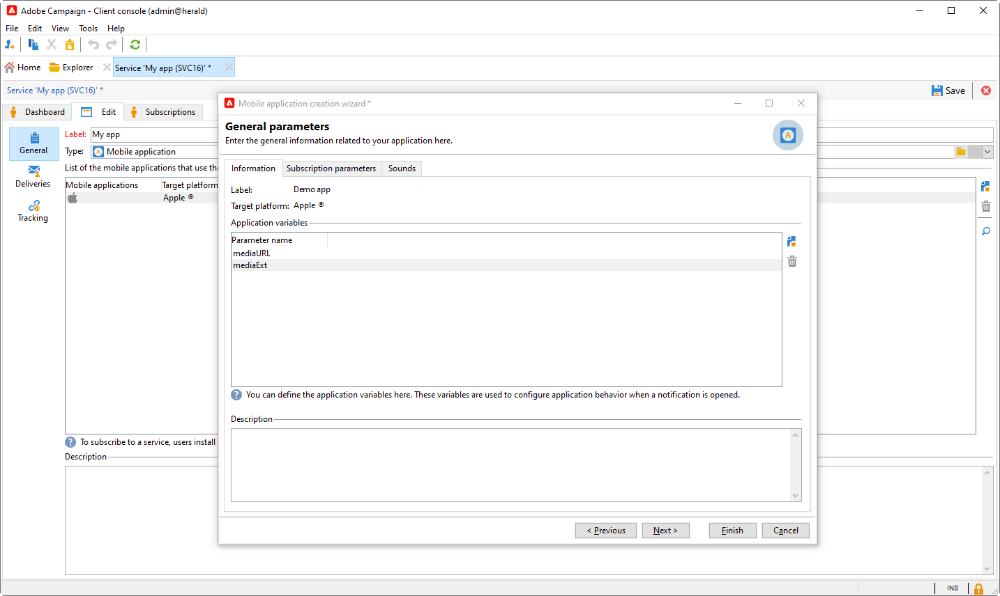

# Configuración de notificaciones push revisada {#push-notifications-config}

La versión 8.5 de Campaign presenta nuestro último servicio de notificaciones push, con una estructura sólida basada en una tecnología moderna de vanguardia. Este servicio está diseñado para desbloquear nuevos niveles de escalabilidad, lo que garantiza que las notificaciones puedan llegar a una audiencia más grande con una eficiencia perfecta. Con nuestra infraestructura mejorada y los procesos optimizados, puede esperar una mayor escala y fiabilidad, lo que le permite interactuar y conectarse con los usuarios de sus aplicaciones móviles como nunca antes.

>[!AVAILABILITY]
>
> Esta función es accesible exclusivamente para los nuevos clientes a partir de la versión 8.5 de Campaign y se implementa progresivamente en un conjunto de clientes seleccionados. Si su entorno se aprovisionó antes de junio de 2023, esta página no se aplica a usted y debe seguir los procedimientos detallados [en esta página](push-settings.md).

En el contexto de esta implementación actualizada, para enviar notificaciones push en Adobe Campaign, siga estos pasos:

1. [Crear una superficie de aplicación en la recopilación de datos de Adobe Experience Platform](#create-app-surface)

1. [Configuración de la aplicación en Adobe Campaign](#push-config-campaign)

1. [Creación y configuración de una propiedad móvil en la recopilación de datos de Adobe Experience Platform](#create-mobile-property)

1. [Agregar extensión de Adobe Adobe Experience Platform Assurance](https://developer.adobe.com/client-sdks/documentation/platform-assurance-sdk/){target="_blank"}(recomendado)

1. [Añada Campaign Classic a su aplicación móvil](#campaign-mobile-ap)

1. [Cree una entrega para iOS y Android](##push-create)

>[!NOTE]
>
> La recopilación de datos no es compatible con FCM y APNS p12 heredados.

## Crear una superficie de aplicación en la recopilación de datos de Adobe Experience Platform {#create-app-surface}

Debe agregar sus credenciales de inserción de la aplicación móvil en [!DNL Adobe Experience Platform Data Collection].

Se requiere el registro de credenciales push de aplicaciones móviles para autorizar a Adobe a enviar notificaciones push en su nombre. Consulte los pasos detallados a continuación:

1. En [!DNL Adobe Experience Platform Data Collection], seleccione la ficha **[!UICONTROL App Surfaces]** en el panel izquierdo.

1. Haga clic en **[!UICONTROL Create App Surface]** para crear una nueva configuración.

   

1. Escriba un **[!UICONTROL Name]** para la configuración.

1. En **[!UICONTROL Mobile Application Configuration]**, seleccione el sistema operativo:

>[!BEGINTABS]

>[!TAB iOS]

1. Escriba la aplicación móvil **Id. de paquete** en el campo **[!UICONTROL App ID (iOS Bundle ID)]**.

   El identificador del paquete de aplicaciones se encuentra en la ficha **General** del destino principal en **XCode** de tu cuenta de desarrollador de Apple.

1. Active **[!UICONTROL Push Credentials]** para agregar sus credenciales.

1. Arrastre y suelte su archivo .p8 de clave de autenticación de notificaciones push de Apple.

   Esta clave se puede adquirir desde las páginas de **Certificados**, **Identificadores** y **Perfiles** de su cuenta de desarrollador de Apple.

1. Proporcione la **ID de clave**. Es una cadena de 10 caracteres asignada durante la creación de la clave de autenticación p8.

       Se encuentra en la ficha **Keys** de la página **Certificates**, **Identifiers** y **Profiles** de su cuenta de desarrollador de Apple.
   
1. Proporcione el **ID de equipo**. Es un valor de cadena que se encuentra en la ficha **Pertenencia**.

1. Haga clic en **[!UICONTROL Save]** para crear la configuración de su aplicación.

>[!TAB Android]

1. Proporcione **[!UICONTROL App ID (Android package name)]**. Normalmente, el nombre del paquete es el ID de la aplicación que hay en el archivo `build.gradle`.

1. Cambie **[!UICONTROL Push Credentials]** para agregar sus credenciales.

1. Arrastre y suelte las credenciales push de FCM. Para obtener más información sobre cómo obtener las credenciales push, consulte [Documentación de Google](https://firebase.google.com/docs/admin/setup#initialize-sdk){target="_blank"}.

1. Haga clic en **[!UICONTROL Save]** para crear la configuración de su aplicación.

>[!ENDTABS]

## Configuración de la aplicación en Adobe Campaign{#push-config-campaign}

### Crear un servicio {#create-service}

Antes de enviar notificaciones push, debe definir la configuración de las aplicaciones de iOS y Android en Adobe Campaign.

Las notificaciones push se envían a los usuarios de la aplicación a través de un servicio dedicado. Cuando los usuarios instalan la aplicación, se suscriben a este servicio: Adobe Campaign depende de este servicio para dirigirse únicamente a los suscriptores de la aplicación. En este servicio, debe agregar sus aplicaciones de iOS y Android para enviarlas en dispositivos iOS y Android.

Para crear un servicio para enviar notificaciones push, siga los pasos a continuación:

1. Vaya a la ficha **[!UICONTROL Profiles and Targets > Services and Subscriptions]** y haga clic en **[!UICONTROL Create]**.

   {width="800" align="left"}

1. Escriba **[!UICONTROL Label]** y **[!UICONTROL Internal name]** y seleccione un tipo **[!UICONTROL Mobile application]**.

   >[!NOTE]
   >
   >La asignación de destino predeterminada **[!UICONTROL Subscriber applications (nms:appSubscriptionRcp)]** está relacionada con la tabla de destinatarios. Si desea utilizar una asignación de destinatario diferente, debe crear una nueva e introducirla en el campo **[!UICONTROL Target mapping]** del servicio. Obtenga más información acerca de las asignaciones de destino en [esta página](../audiences/target-mappings.md).

1. A continuación, utilice el icono **[!UICONTROL Add]** de la derecha para definir las aplicaciones móviles que utilizan este servicio.

   

### Creación de una aplicación móvil {#create-sapp}

Después de crear el servicio, debe definir las aplicaciones móviles que lo utilizarán.

>[!BEGINTABS]

>[!TAB iOS]

Para crear una aplicación para dispositivos iOS, siga estos pasos:

1. En su servicio, haga clic en **[!UICONTROL Add]** y seleccione **[!UICONTROL Create an iOS application]**. Haga clic en **[!UICONTROL Next]**.

   

1. En la ventana **[!UICONTROL Launch app configurations list]**, seleccione la superficie de aplicación creada anteriormente en esta sección. Haga clic en **[!UICONTROL Next]**.

   

1. (opcional) Puede enriquecer el contenido de un mensaje push con **[!UICONTROL Application variables]**. Son totalmente personalizables y una parte de la carga útil de mensajes se envía al dispositivo móvil.

   En el ejemplo siguiente, se agregan las variables **mediaURl** y **mediaExt** para crear notificaciones push enriquecidas y, a continuación, se proporciona a la aplicación la imagen que se mostrará en la notificación.

   

1. Vaya a la pestaña **[!UICONTROL Subscription parameters]** para definir la asignación con una extensión del esquema **[!UICONTROL Subscriber applications (nms:appsubscriptionRcp)]**.

1. Vaya a la ficha **[!UICONTROL Sounds]** para definir un sonido para reproducir. Haga clic en **[!UICONTROL Add]** y rellene el campo **[!UICONTROL Internal name]** que debe contener el nombre del archivo incrustado en la aplicación o el nombre del sonido del sistema.

1. Haga clic en **[!UICONTROL Next]** para comenzar a configurar la aplicación de desarrollo.

1. **[!UICONTROL Integration key]** es específico de cada aplicación. Vincula la aplicación móvil a Adobe Campaign y se utiliza al configurar la extensión de Campaign.

   Asegúrese de que se ha definido el mismo **[!UICONTROL Integration key]** en Adobe Campaign y en el código de la aplicación a través de SDK.

   Obtenga más información en [la documentación para desarrolladores](https://developer.adobe.com/client-sdks/documentation/adobe-campaign-classic/#configuration-keys){target="_blank"}

   >[!NOTE]
   >
   > **[!UICONTROL Integration key]** es totalmente personalizable con un valor de cadena, pero debe ser exactamente igual al especificado en el SDK.
   >
   > No puede utilizar el mismo certificado para la versión de desarrollo (entorno limitado) y la versión de producción de la aplicación.

   

1. Seleccione el icono del campo **[!UICONTROL Application icon]** para personalizar la aplicación móvil en el servicio.

1. Haga clic en **[!UICONTROL Next]** para comenzar a configurar la aplicación de producción y siga los mismos pasos detallados anteriormente. Tenga en cuenta que no puede usar el mismo **[!UICONTROL Integration key]** para la versión de desarrollo (entorno limitado) y la versión de producción de la aplicación.

1. Haga clic en **[!UICONTROL Finish]**.

La aplicación de iOS ya está lista para su uso en Campaign.

>[!TAB Android]

Para crear una aplicación para dispositivos Android, siga estos pasos:

1. En su servicio, haga clic en **[!UICONTROL Add]** y seleccione **[!UICONTROL Create an Android application]**. Haga clic en **[!UICONTROL Next]**.

   

1. En la ventana **[!UICONTROL Launch app configurations list]**, seleccione la superficie de aplicación creada en esta sección y haga clic en **[!UICONTROL Next]**.

   

1. La clave de integración es específica para cada aplicación. Vincula la aplicación móvil a Adobe Campaign y se utiliza al configurar la extensión de Campaign.

   Asegúrese de que se ha definido el mismo **[!UICONTROL Integration key]** en Adobe Campaign y en el código de la aplicación a través de SDK.

   Obtenga más información en [la documentación para desarrolladores](https://developer.adobe.com/client-sdks/documentation/adobe-campaign-classic/#configuration-keys){target="_blank"}

   >[!NOTE]
   >
   > **[!UICONTROL Integration key]** es totalmente personalizable con un valor de cadena, pero debe ser exactamente igual al especificado en el SDK.

   

1. Seleccione el icono del campo **[!UICONTROL Application icon]** para personalizar la aplicación móvil en el servicio.

1. (opcional) Si es necesario, puede enriquecer el contenido de un mensaje push con **[!UICONTROL Application variables]**. Son totalmente personalizables y una parte de la carga útil de mensajes se envía al dispositivo móvil.

1. Vaya a la pestaña **[!UICONTROL Subscription parameters]** para definir la asignación con una extensión del esquema **[!UICONTROL Subscriber applications (nms:appsubscriptionRcp)]**.

1. Haga clic en **[!UICONTROL Finish]** y luego en **[!UICONTROL Save]**.

La aplicación de Android ya está lista para su uso en Campaign.

>[!ENDTABS]

A continuación se muestran los nombres de carga útil de FCM para personalizar aún más la notificación push:

| Tipo de mensaje | Elemento de mensaje configurable (nombre de carga útil de FCM) | Opciones configurables (nombre de carga útil de FCM) |
|:-:|:-:|:-:|
| mensaje de datos | N/A | validate_only |
| mensaje de notificación | title, body, android_channel_id, icon, sound, tag, color, click_action, image, ticker, sticky, visibility, notification_priority, notification_count   | validate_only |

## Configuración de una propiedad móvil en la recopilación de datos de Adobe Experience Platform {#create-mobile-property}

1. En la página de inicio de la recopilación de datos, acceda al menú Etiquetas.

1. Haga clic en **[!UICONTROL New Property]**.

   

1. Escriba un nombre para la propiedad y seleccione **[!UICONTROL Mobile]** como plataforma.

   

1. Haga clic en **[!UICONTROL Save]** para crear la propiedad móvil.

1. Acceda a la propiedad móvil recién creada.

1. Desde el panel de propiedades móviles, acceda al menú **[!UICONTROL Extensions]** y luego a la pestaña **[!UICONTROL Catalog]**.

   

1. Instale la extensión **[!DNL Adobe Campaign Classic]**. [Más información sobre la extensión de Campaign](https://developer.adobe.com/client-sdks/documentation/adobe-campaign-classic/#configure-campaign-classic-extension)

   

1. Rellene los detalles de la instancia:

   * Las direcciones URL **[!UICONTROL Registration endpoint]** o **[!UICONTROL Tracking endpoint]** se pueden encontrar en el menú **[!UICONTROL Tools]** > **[!UICONTROL Advanced]** > **[!UICONTROL Deployment wizard]** de Campaign.
   * **[!UICONTROL Integration keys]** se encuentra en la aplicación móvil configurada en [esta sección](#create-app).

   

1. Haga clic en **[!UICONTROL Save]**.

1. Ahora necesita publicar la configuración desde el menú **[!UICONTROL Publishing flow]**. [Más información](https://developer.adobe.com/client-sdks/documentation/getting-started/create-a-mobile-property/#publish-the-configuration)

Su propiedad móvil ahora se sincronizará automáticamente con el flujo de trabajo técnico de **[!UICONTROL Adobe Experience Platform Data Collection]**. [Más información](../../automation/workflow/technical-workflows.md#list-technical-workflows)

## Añada Campaign Classic a su aplicación móvil {#campaign-mobile-app}

El SDK móvil de Adobe Experience Platform impulsa las soluciones y los servicios Experience Cloud de Adobe en sus aplicaciones móviles. La configuración de los SDK se administra mediante la IU de recopilación de datos para una configuración flexible e integraciones ampliables basadas en reglas.

[Obtenga más información en la documentación de Adobe Developer](https://developer.adobe.com/client-sdks/documentation/adobe-campaign-classic/#add-campaign-classic-to-your-app){target="_blank"}.

## Creación de la notificación push{#push-create}

Una vez que haya configurado correctamente la aplicación móvil en Recopilación de datos, ahora puede crear y enviar notificaciones push en Adobe Campaign.

Consulte [esta página](push.md#push-create) para ver los elementos detallados específicos para el envío de notificaciones de iOS y Android.
