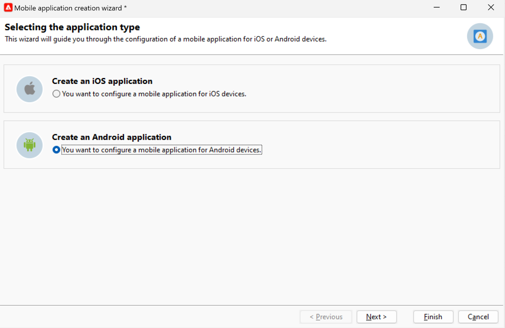

# Configuración de canal de notificaciones push {#push-notification-configuration}

Para enviar notificaciones push con Adobe Campaign, primero debe configurar el entorno y la aplicación como se detalla en esta página. En Adobe Campaign, el canal para enviar notificaciones push es el canal de aplicaciones móviles.

>[!CAUTION]
>
>Algunos cambios importantes en el servicio Android Firebase Cloud Messaging (FCM) se lanzarán en 2024 y pueden afectar a la implementación de Adobe Campaign. Es posible que sea necesario actualizar la configuración de los servicios de suscripción para los mensajes push de Android a fin de que admitan este cambio. Ya puede comprobar y realizar acciones. [Más información](../../technotes/upgrades/push-technote.md).

Antes de empezar a enviar notificaciones push con Adobe Campaign, debe asegurarse de que las configuraciones y integraciones estén implementadas en la aplicación móvil y para las etiquetas en Adobe Experience Platform. El SDK de Adobe Experience Platform Mobile proporciona API de integración del lado del cliente para sus móviles a través de SDK compatibles con Android y iOS.

Para configurar la aplicación con los SDK para móviles de Adobe Experience Platform, siga estos pasos:

1. Marque [requisitos previos](#before-starting).
1. Configuración de un [propiedad de etiqueta móvil](#launch-property) en Recopilación de datos de Adobe Experience Platform.
1. Obtenga el SDK de Adobe Experience Platform Mobile tal como se detalla [en esta página](https://developer.adobe.com/client-sdks/documentation/getting-started/get-the-sdk/){target="_blank"}.
1. (Opcional) Habilite el registro y las métricas del ciclo vital, tal como se detalla a continuación [en esta página](https://developer.adobe.com/client-sdks/documentation/getting-started/enable-debug-logging/){target="_blank"}.
1. (opcional) Agregar [Adobe Experience Platform Assurance en la aplicación](https://developer.adobe.com/client-sdks/documentation/getting-started/validate/){target="_blank"} to validate your implementation. Learn how to implement Adobe Experience Platform Assurance extension [in this page](https://developer.adobe.com/client-sdks/documentation/platform-assurance-sdk/){target="_blank"}.
1. Configure los servicios móviles de iOS y Android en Adobe Campaign según se detalla [en esta página](#push-service).
1. Instalación y configuración [Extensión de Adobe Campaign](#configure-extension) en su propiedad móvil.
1. Seguir [Documentación del SDK de Adobe Experience Platform Mobile](https://developer.adobe.com/client-sdks/documentation/getting-started/){target="_blank"} para configurar los SDK de Adobe Experience Platform Mobile en la aplicación.

## Requisitos previos {#before-starting}

### Configuración de permisos {#setup-permissions}

Antes de crear una aplicación móvil, primero debe asegurarse de que tiene o asigna los permisos de usuario correctos para las etiquetas en Adobe Experience Platform. Los permisos de usuario para las etiquetas en Adobe Experience Platform se asignan a los usuarios a través de Adobe Admin Console. Obtenga más información en [Documentación de etiquetas](https://experienceleague.adobe.com/docs/experience-platform/tags/admin/user-permissions.html){target="_blank"}.

>[!CAUTION]
>
>La configuración push la debe realizar un usuario experto. Según el modelo de implementación y las personas involucradas en esta implementación, es posible que tenga que asignar el conjunto completo de permisos a un único perfil de producto o compartir permisos entre el desarrollador de aplicaciones y **Adobe Campaign** administrador.

Para asignar **Propiedad** y **Compañía** derechos, siga los pasos a continuación:

1. Acceda a la **[!DNL Admin Console]**.
1. Desde el **[!UICONTROL Products]** , seleccione la pestaña **[!UICONTROL Adobe Experience Platform Data Collection]** Tarjeta de.
1. Seleccionar un existente **[!UICONTROL Product Profile]** o cree uno nuevo con la variable **[!UICONTROL New profile]** botón. Obtenga información sobre cómo crear un nuevo **[!UICONTROL New profile]** en el [Documentación de Admin Console](https://experienceleague.adobe.com/docs/experience-platform/access-control/ui/create-profile.html#ui){target="_blank"}.
1. En la pestaña **[!UICONTROL Permissions]**, seleccione **[!UICONTROL Property Rights]**.
1. Haga clic en **[!UICONTROL Add all]**. Esto añadirá el siguiente derecho a su perfil de producto:
   * **[!UICONTROL Approve]**
   * **[!UICONTROL Develop]**
   * **[!UICONTROL Edit Property]**
   * **[!UICONTROL Manage Environments]**
   * **[!UICONTROL Manage Extensions]**
   * **[!UICONTROL Publish]**

   Estos permisos son necesarios para instalar y publicar la extensión de Adobe Campaign y publicar la propiedad de la aplicación en **SDK de Adobe Experience Platform Mobile**.

1. A continuación, seleccione **[!UICONTROL Company rights]** en el menú de la izquierda.
1. Añada los siguientes derechos:

   * **[!UICONTROL Manage App Configurations]**
   * **[!UICONTROL Manage Properties]**

   Estos permisos son necesarios para que el desarrollador de aplicaciones móviles pueda configurar las credenciales push en **Recopilación de datos de Adobe Experience Platform**.

1. Haga clic en **[!UICONTROL Save]**.

Para asignar esto **[!UICONTROL Product profile]** para los usuarios de, siga los pasos a continuación:

1. Acceda a la **[!DNL Admin Console]**.
1. Desde el **[!UICONTROL Products]** , seleccione la pestaña **[!UICONTROL Adobe Experience Platform Data Collection]** Tarjeta de.
1. Seleccione el **[!UICONTROL Product profile]** configurado anteriormente.
1. En la pestaña **[!UICONTROL Users]**, haga clic en **[!UICONTROL Add user]**.
1. Escriba el nombre o la dirección de correo electrónico del usuario y seleccione el usuario. A continuación, haga clic en **[!UICONTROL Save]**.

   >[!NOTE]
   >
   >Si el usuario no se ha creado anteriormente en Admin Console, consulte la [Documentación de Adición de usuarios](https://helpx.adobe.com/enterprise/using/manage-users-individually.html#add-users){target="_blank"}.

### Configurar su aplicación {#configure-app}

La configuración técnica implica una estrecha colaboración entre el desarrollador de la aplicación y el administrador empresarial. Antes de empezar a enviar notificaciones push con [!DNL Adobe Campaign], debe definir la configuración en [!DNL Adobe Experience Platform Data Collection] e integre su aplicación móvil con los SDK para móviles de Adobe Experience Platform.

Siga los pasos de implementación detallados en los vínculos siguientes:

* Para **Apple iOS**: Obtenga información sobre cómo registrar la aplicación con APNS en [Documentación de Apple](https://developer.apple.com/documentation/usernotifications/registering_your_app_with_apns){target="_blank"}
* Para **Google Android**: Obtenga información sobre cómo configurar una aplicación cliente de Firebase Cloud Messaging en Android en [Documentación de Google](https://firebase.google.com/docs/cloud-messaging/android/client){target="_blank"}

<!--
## Add your app push credentials in Adobe Experience Platform Data Collection {#push-credentials}

After granting the correct user permissions, you now need to add your mobile application push credentials in Adobe Experience Platform Data Collection. 

The mobile app push credential registration is required to authorize Adobe to send push notifications on your behalf. Refer to the steps detailed below:

1. From [!DNL Adobe Experience Platform Data Collection], browse to **[!UICONTROL App Surfaces]** in the left rail.

1. Click **[!UICONTROL Create App Surface]** to create a new configuration.

1. Enter a **[!UICONTROL Name]** for the configuration.

1. From **[!UICONTROL Mobile Application Configuration]**, select the system and enter settings.

    * **For iOS**

        1. Enter the mobile app **Bundle Id** in the **[!UICONTROL App ID (iOS Bundle ID)]** field. The app Bundle ID can be found in the **General** tab of the primary target in **XCode**.
        
        1. Switched on the **[!UICONTROL Push Credentials]** button to add your credentials.
        
        1. Drag and drop your .p8 Apple Push Notification Authentication Key file. This key can be acquired from the **Certificates**, **Identifiers** and **Profiles** page.

        1. Provide the **Key ID**. This is a 10 character string assigned during the creation of p8 auth key. It can be found under **Keys** tab in **Certificates**, **Identifiers** and **Profiles** page.
        
        1. Provide the **Team ID**. This is a string value which can be found under the Membership tab.

    * **For Android**

        1. Provide the **[!UICONTROL App ID (Android package name)]**: usually the package name is the app id in your `build.gradle` file.

        1. Switched on the **[!UICONTROL Push Credentials]** button to add your credentials.

        1. Drag and drop the FCM push credentials. For more details on how to get the push credentials refer to [Google Documentation](https://firebase.google.com/docs/admin/setup#initialize-sdk){target="_blank"}.
    

1. Click **[!UICONTROL Save]** to create your app configuration.
-->

## Configuración de una propiedad de etiquetas móviles en la recopilación de datos de Adobe Experience Platform {#launch-property}

La configuración de una propiedad móvil permite al desarrollador o al experto en marketing de la aplicación móvil configurar los SDK móviles. Normalmente, creará una propiedad móvil para cada aplicación móvil que desee administrar. Obtenga información sobre cómo crear y configurar una propiedad móvil en [Documentación del SDK de Adobe Experience Platform Mobile](https://developer.adobe.com/client-sdks/documentation/getting-started/create-a-mobile-property/){target="_blank"}.
<!--
To get the SDKs needed for push notification to work you will need the following SDK extensions, for both Android and iOS:

* **[!UICONTROL Mobile Core]** (installed automatically)
* **[!UICONTROL Profile]** (installed automatically)
* **[!UICONTROL Adobe Experience Platform Edge]**
* **[!UICONTROL Adobe Experience Platform Assurance]**, optional but recommended to debug the mobile implementation.
-->

Más información sobre [!DNL Adobe Experience Platform Data Collection] etiquetas en [Documentación de Adobe Experience Platform](https://experienceleague.adobe.com/docs/platform-learn/implement-mobile-sdk/initial-configuration/configure-tags.html){target="_blank"}.

Una vez creada, abra la nueva propiedad de etiqueta y cree una biblioteca. Para ello, haga lo siguiente:

1. Navegar a **Flujo de publicación** en el panel de navegación izquierdo y seleccione **Añadir biblioteca**.
1. Introduzca el nombre de la biblioteca y seleccione el entorno.
1. Seleccionar **Añadir todos los recursos modificados**, y **Guardar y generar en desarrollo**.
1. Finalmente, establezca esta biblioteca como su biblioteca de trabajo desde el **Seleccionar una biblioteca de trabajo** botón.

## Configuración de los servicios móviles en Campaign {#push-service}

Una vez configurada la aplicación móvil en en, [!DNL Adobe Experience Platform Data Collection], debe crear dos servicios (uno para dispositivos iOS y otro para Android) desde los que poder enviar notificaciones push **[!DNL Adobe Campaign]**.

Las notificaciones push se envían a los usuarios de la aplicación a través de un servicio dedicado. Cuando los usuarios instalan la aplicación, se suscriben a este servicio: Adobe Campaign depende de este servicio para dirigirse únicamente a los suscriptores de la aplicación. En este servicio, debe agregar sus aplicaciones de iOS y Android para enviarlas en dispositivos iOS y Android.

Para crear un servicio para enviar notificaciones push, siga los pasos a continuación:

1. Navegar a **[!UICONTROL Profiles and Targets > Services and Subscriptions]** y haga clic en **[!UICONTROL Create]**.

   {width="800" align="left"}

1. Introduzca una **[!UICONTROL Label]** y un **[!UICONTROL Internal name]** y seleccione una **[!UICONTROL Mobile application]** escriba.

   >[!NOTE]
   >
   >La asignación de destino predeterminada **[!UICONTROL Subscriber applications (nms:appSubscriptionRcp)]** está relacionada con la tabla de destinatarios. Si desea utilizar una asignación de destinatario diferente, debe crear una nueva asignación de destino e introducirla en el campo **[!UICONTROL Target mapping]** del servicio. Obtenga más información sobre las asignaciones de destino en [esta página](../audiences/target-mappings.md).

1. A continuación, utilice el **[!UICONTROL Add]** en la parte derecha para definir las aplicaciones móviles que utilizan este servicio.

>[!BEGINTABS]

>[!TAB iOS]

Para crear una aplicación para dispositivos iOS, siga estos pasos:

1. Seleccione **[!UICONTROL Create an iOS application]** y haga clic en **[!UICONTROL Next]**.

   {width="600" align="left"}

1. Introduzca el nombre de su aplicación en la **[!UICONTROL Label]** field.
1. (opcional) Puede enriquecer el contenido de un mensaje push con **[!UICONTROL Application variables]**. Son totalmente personalizables y una parte de la carga útil de mensajes se envía al dispositivo móvil.

   En el ejemplo siguiente, la variable **mediaURl** y **mediaExt** Las variables de se agregan para crear notificaciones push enriquecidas y, a continuación, proporcionan a la aplicación la imagen que se mostrará en la notificación.

   {width="600" align="left"}

1. Vaya a la **[!UICONTROL Subscription parameters]** para definir la asignación con una extensión del **[!UICONTROL Subscriber applications (nms:appsubscriptionRcp)]** esquema.

1. Vaya a la **[!UICONTROL Sounds]** para definir un sonido para reproducir. Haga clic en **[!UICONTROL Add]** y rellene el campo **[!UICONTROL Internal name]** que debe contener el nombre del archivo incrustado en la aplicación o el nombre del sonido del sistema.

1. Haga clic en **[!UICONTROL Next]** para comenzar a configurar la aplicación de desarrollo.

1. La clave de integración es específica para cada aplicación. Vincula la aplicación móvil a Adobe Campaign.

   Asegúrese de que es el mismo **[!UICONTROL Integration key]** se define en Adobe Campaign y en el código de la aplicación a través del SDK.

   Obtenga más información en [la documentación para desarrolladores](https://developer.adobe.com/client-sdks/documentation/adobe-campaign-classic/#configuration-keys){target="_blank"}

   >[!NOTE]
   >
   > **[!UICONTROL Integration key]** es totalmente personalizable con un valor de cadena, pero debe ser exactamente igual al especificado en el SDK.
   >
   > No puede utilizar el mismo certificado para la versión de desarrollo (entorno limitado) y la versión de producción de la aplicación.

1. Seleccione el icono de la **[!UICONTROL Application icon]** para personalizar la aplicación móvil en el servicio.

1. Seleccione el **[!UICONTROL Authentication mode]**. Hay dos modos disponibles:

   * (Recomendado) **[!UICONTROL Token-based authentication]**: complete la configuración de conexión de APNS **[!UICONTROL Key Id]**, **[!UICONTROL Team Id]** y **[!UICONTROL Bundle Id]** a continuación, seleccione el certificado p8 haciendo clic en **[!UICONTROL Enter the private key...]**. Para obtener más información sobre **[!UICONTROL Token-based authentication]**, consulte [Documentación de Apple](https://developer.apple.com/documentation/usernotifications/setting_up_a_remote_notification_server/establishing_a_token-based_connection_to_apns){target="_blank"}.

   * **[!UICONTROL Certificate-based authentication]**: haga clic en **[!UICONTROL Enter the certificate...]**  a continuación, seleccione la clave p12 e introduzca la contraseña proporcionada por el desarrollador de aplicaciones móviles. Tenga en cuenta que este certificado viene con una fecha de caducidad y debe renovarse anualmente. Para evitar interrupciones en el servicio para los usuarios, actualice los certificados antes de que caduquen. Los certificados son válidos durante un año y debe actualizarlos para seguir comunicándose con APNS.

1. Utilice el **[!UICONTROL Test the connection]** para validar la configuración.

1. Haga clic en **[!UICONTROL Next]** para configurar la aplicación de producción y siga los mismos pasos detallados anteriormente.

1. Haga clic en **[!UICONTROL Finish]**.

La aplicación de iOS ya está lista para su uso en Campaign.

>[!TAB Android]

Para crear una aplicación para dispositivos Android, siga estos pasos:

1. Seleccione **[!UICONTROL Create an Android application]** y haga clic en **[!UICONTROL Next]**.

   {width="600" align="left"}

1. Introduzca el nombre de su aplicación en la **[!UICONTROL Label]** field.
1. La clave de integración es específica para cada aplicación. Vincula la aplicación móvil a Adobe Campaign.

   Asegúrese de que es el mismo **[!UICONTROL Integration key]** se define en Adobe Campaign y en el código de la aplicación a través del SDK.

   Obtenga más información en [la documentación para desarrolladores](https://developer.adobe.com/client-sdks/documentation/adobe-campaign-classic/#configuration-keys){target="_blank"}

   >[!NOTE]
   >
   > **[!UICONTROL Integration key]** es totalmente personalizable con un valor de cadena, pero debe ser exactamente igual al especificado en el SDK.
   >

1. Seleccione el icono de la **[!UICONTROL Application icon]** para personalizar la aplicación móvil en el servicio.
1. Seleccionar **HTTP v1** in  **[!UICONTROL API version]** lista desplegable.
1. Clic **[!UICONTROL Load project json file to extract project details...]** para cargar el archivo con clave JSON. Para obtener más información sobre cómo extraer el archivo JSON, consulte [Documentación de Google Firebase](https://firebase.google.com/docs/admin/setup#initialize-sdk){target="_blank"}.

   También puede introducir manualmente los siguientes detalles:
   * **[!UICONTROL Project Id]**
   * **[!UICONTROL Private Key]**
   * **[!UICONTROL Client Email]**

1. Utilice el **[!UICONTROL Test the connection]** para validar la configuración.

   >[!CAUTION]
   >
   >El **[!UICONTROL Test connection]** no comprueba si el servidor MID tiene acceso al servidor FCM.

1. (opcional) Puede enriquecer el contenido de un mensaje push con **[!UICONTROL Application variables]** si es necesario. Son totalmente personalizables y una parte de la carga útil de mensajes se envía al dispositivo móvil.

1. Haga clic en **[!UICONTROL Finish]**, luego en **[!UICONTROL Save]**. La aplicación de Android ya está lista para su uso en Campaign.

A continuación se muestran los nombres de carga útil de FCM para personalizar aún más la notificación push:

| Tipo de mensaje | Elemento de mensaje configurable (nombre de carga útil de FCM) | Opciones configurables (nombre de carga útil de FCM) |
|:-:|:-:|:-:|
| mensaje de datos | N/A | validate_only |
| mensaje de notificación | title, body, android_channel_id, icon, sound, tag, color, click_action, image, ticker, sticky, visibility, notification_priority, notification_count   | validate_only |

>[!ENDTABS]

## Configuración de la extensión de Adobe Campaign en la propiedad móvil {#configure-extension}

El **Extensión de Adobe Campaign Classic** para los SDK de Adobe Experience Platform Mobile alimenta las notificaciones push de sus aplicaciones móviles y le ayuda a recopilar tokens push de usuario y a gestionar la medición de interacciones con los servicios de Adobe Experience Platform.

Esta extensión, que se aplica tanto a Campaign Classic v7 como a Campaign v8, está preinstalada en el entorno y debe configurarse. Para configurar la extensión para la propiedad de etiquetas móviles, siga estos pasos:

1. Abra la propiedad de etiquetas que creó anteriormente.
1. En el panel de navegación izquierdo, vaya a **Extensiones** y abra el **Catálogo** pestaña. Utilice el campo de búsqueda para encontrar la variable **Adobe Campaign Classic** extensión.
1. En la tarjeta de Campaign Classic, haga clic en **Instalar** botón.
1. Introduzca la configuración tal como se describe en [Documentación del SDK de Adobe Experience Platform Mobile](https://developer.adobe.com/client-sdks/documentation/adobe-campaign-classic/){target="_blank"}.

Ahora puede añadir Campaign a la aplicación, tal como se detalla en  [Documentación del SDK de Adobe Experience Platform Mobile](https://developer.adobe.com/client-sdks/documentation/adobe-campaign-classic/#add-campaign-classic-to-your-app){target="_blank"}.
