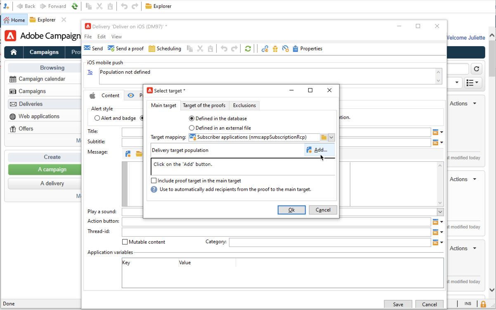

# Creación y envío de notificaciones push

Los envíos de aplicaciones móviles permiten enviar notificaciones a sistemas iOS y Android.

Para enviar notificaciones push en Adobe Campaign, debe:

1. Configuración del entorno de Campaign
1. Cree un servicio de información de tipo aplicación móvil para su aplicación móvil.
1. Añada a este servicio las versiones de iOS y Android de la aplicación.
1. Cree un envío tanto para iOS como para Android.

 Obtenga información sobre cómo empezar a usar la aplicación móvil en la documentación de  [Campaign Classic v7](https://experienceleague.adobe.com/docs/campaign-classic/using/sending-messages/sending-push-notifications/about-mobile-app-channel.html){target=&quot;_blank&quot;}

## Integración con el SDK de Adobe

### Integración del SDK de Campaign

El SDK de Campaign facilita la integración de la aplicación móvil en la plataforma Adobe Campaign.

Las versiones compatibles del SDK se enumeran en la [Matriz de compatibilidad de Campaign](../start/compatibility-matrix.md#MobileSDK).

 Aprenda a integrar los SDK para iOS y Android de Campaign con su aplicación en  [esta sección](../config/push-config.md)

### Configurar la extensión de Campaign en Launch

Puede integrar el SDK de Launch de Adobe Experience Platform con Campaign, aprovechando la extensión de Campaign Classic.

 Obtenga más información en la documentación  [del SDK móvil de Adobe](https://aep-sdks.gitbook.io/docs/using-mobile-extensions/adobe-campaignclassic){target=&quot;_blank&quot;}

## Configuración de la aplicación en Campaign

Debe definir la configuración de las aplicaciones de iOS y Android en Adobe Campaign.

 Las directrices de configuración para iOS se detallan en la documentación de  [Campaign Classic v7](https://experienceleague.adobe.com/docs/campaign-classic/using/sending-messages/sending-push-notifications/configure-the-mobile-app/configuring-the-mobile-application.html?lang=es#sending-messages){target=&quot;_blank&quot;}

 Las directrices de configuración para Android se detallan en la documentación de  [Campaign Classic v7](https://experienceleague.adobe.com/docs/campaign-classic/using/sending-messages/sending-push-notifications/configure-the-mobile-app/configuring-the-mobile-application-android.html?lang=en#sending-messages){target=&quot;_blank&quot;}

## Creación de la primera notificación push

En esta sección se detallan los elementos específicos para la entrega de notificaciones en iOS y Android.

>[!CAUTION]
>
>Con Campaign v8, el registro móvil ahora es **asíncrono**. [Más información](../dev/staging.md)

Para crear un nuevo envío, vaya a la pestaña **[!UICONTROL Campaigns]** , haga clic en **[!UICONTROL Deliveries]** y haga clic en el botón **[!UICONTROL Create]** situado encima de la lista de envíos existentes.

 Para obtener información global sobre cómo crear una entrega, consulte la documentación de  [Campaign Classic v7](https://experienceleague.adobe.com/docs/campaign-classic/using/sending-messages/key-steps-when-creating-a-delivery/steps-about-delivery-creation-steps.html?lang=en#sending-messages){target=&quot;_blank&quot;}

### Envío de notificaciones en iOS {#send-notifications-on-ios}

1. Seleccione la plantilla de envío **[!UICONTROL Deliver on iOS]** y haga clic en **[!UICONTROL Continue]**.

   

1. Para definir el objetivo de la notificación, haga clic en el enlace **[!UICONTROL To]** y, luego, en **[!UICONTROL Add]**.

   

1. Seleccione **[!UICONTROL Subscribers of an iOS mobile application (iPhone, iPad)]**, seleccione el servicio correspondiente a su aplicación móvil y, a continuación, seleccione la versión de iOS de la aplicación.

   

1. Seleccione el tipo de notificación: **[!UICONTROL Alert]**, **[!UICONTROL Badge]**, **[!UICONTROL Alert and badge]** o **[!UICONTROL Silent Push]**.

   

1. En el campo **[!UICONTROL Title]**, introduzca la etiqueta del título que desea que aparezca en la notificación.

1. Introduzca **[!UICONTROL Message]** y **[!UICONTROL Value of the badge]** en función del tipo de notificación elegido.

1. También puede definir los siguientes elementos:

   * **[!UICONTROL Action button]** le permite definir una etiqueta para el botón de acción que aparece en las notificaciones de alerta (campo **action_loc_key** de la carga útil).

   * En el campo **[!UICONTROL Play a sound]**, seleccione el sonido que el terminal móvil debe reproducir cuando reciba la notificación.

   * En el campo **[!UICONTROL Application variables]**, introduzca el valor de cada variable. Por ejemplo, puede configurar una pantalla de aplicación específica para que se muestre cuando el usuario active la notificación.

1. Una vez configurada la notificación, haga clic en la pestaña **[!UICONTROL Preview]** para previsualizar la notificación.

   

### Envío de notificaciones en Android {#send-notifications-on-android}

1. Seleccione la plantilla de envíos **[!UICONTROL Deliver on Android (android)]**.

   

1. Para definir el objetivo de la notificación, haga clic en el enlace **[!UICONTROL To]** y, luego, en **[!UICONTROL Add]**.

   

1. Seleccione **[!UICONTROL Subscribers of an Android mobile application]**, elija el servicio correspondiente a su aplicación móvil (Neotrips, en este caso), y luego seleccione la versión de Android de la aplicación.

   

1. A continuación, introduzca el contenido de la notificación.

   

1. Haga clic en el icono **[!UICONTROL Insert emoticon]** para insertar emoticonos en la notificación push.

1. En el campo **[!UICONTROL Application variables]**, introduzca el valor de cada variable. Por ejemplo, puede configurar una pantalla de aplicación específica para que se muestre cuando el usuario active la notificación.

1. Una vez configurada la notificación, haga clic en la pestaña **[!UICONTROL Preview]** para previsualizar la notificación.

   <!---->

## Prueba, envío y monitorización de las notificaciones push

Para enviar una prueba y realizar la entrega final, utilice el mismo proceso que en las entregas por correo electrónico. Obtenga más información en la documentación de Campaign Classic v7:

* Validación de una entrega y envío de pruebas
    [Conozca los pasos clave para validar un envío](https://experienceleague.adobe.com/docs/campaign-classic/using/sending-messages/key-steps-when-creating-a-delivery/steps-validating-the-delivery.html){target=&quot;_blank&quot;}

* Confirmar y realizar la entrega
    [Conozca los pasos clave para enviar una entrega](https://experienceleague.adobe.com/docs/campaign-classic/using/sending-messages/key-steps-when-creating-a-delivery/steps-sending-the-delivery.html?lang=en){target=&quot;_blank&quot;}

Después de enviar mensajes, puede monitorizar y realizar un seguimiento de las entregas. Obtenga más información en la documentación de Campaign Classic v7:

* Cuarentenas de notificaciones push
    [Obtenga más información sobre la cuarentena de notificaciones push](https://experienceleague.adobe.com/docs/campaign-classic/using/sending-messages/monitoring-deliveries/understanding-quarantine-management.html?lang=en#push-notification-quarantines){target=&quot;_blank&quot;}

* Resolución de problemas
    [Obtenga información sobre cómo solucionar problemas de las notificaciones push](https://experienceleague.adobe.com/docs/campaign-classic/using/sending-messages/sending-push-notifications/troubleshooting.html?lang=en){target=&quot;_blank&quot;}
