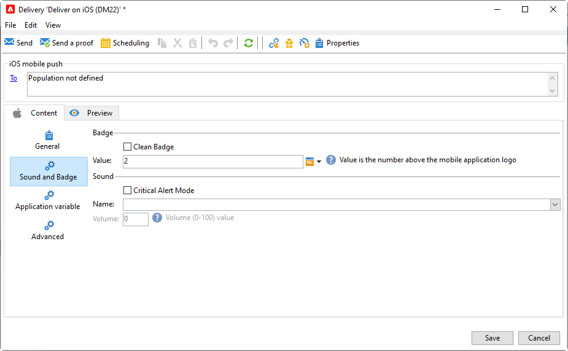

# Creación y envío de notificaciones push{#push-notifications-create}

Los envíos de aplicaciones móviles permiten enviar notificaciones a sistemas iOS y Android.

Para enviar notificaciones push en Adobe Campaign, debe:

1. Configuración del entorno de Campaign
1. Cree un servicio de información de tipo aplicación móvil para su aplicación móvil.
1. Añada a este servicio las versiones de iOS y Android de la aplicación.
1. Cree un envío tanto para iOS como para Android.

 Obtenga información sobre cómo empezar a usar la aplicación móvil en [Documentación de Campaign Classic v7](https://experienceleague.adobe.com/docs/campaign-classic/using/sending-messages/sending-push-notifications/about-mobile-app-channel.html){target="_blank"}

## Integración del SDK {#push-sdk}

Puede utilizar el SDK de Adobe Experience Platform Mobile configurando la extensión de Adobe Campaign en la interfaz de usuario de recopilación de datos. El SDK móvil de Adobe Experience Platform impulsa las soluciones y los servicios Experience Cloud de Adobe en sus aplicaciones móviles. La configuración de los SDK se administra mediante la interfaz de usuario de recopilación de datos para lograr una configuración flexible e integraciones ampliables basadas en reglas. [Obtenga más información en la documentación de Adobe Developer](https://developer.adobe.com/client-sdks/documentation/adobe-campaign-classic){target="_blank"}.

Obtenga información acerca de cómo configurar e instalar el SDK móvil de Adobe Experience Platform [en este vídeo](https://experienceleague.adobe.com/docs/campaign-classic-learn/tutorials/sending-messages/push-channel/configure-push-using-aep-mobile-sdk.html?lang=es){target="_blank"}.

También puede integrar el SDK de Campaign para facilitar la integración de la aplicación móvil en la plataforma Adobe Campaign. Las versiones compatibles del SDK se enumeran en [Matriz de compatibilidad de Campaign](../start/compatibility-matrix.md#MobileSDK).

Obtenga información sobre cómo integrar los SDK de iOS y Android de Campaign con su aplicación en [esta página](../config/push-config.md)

## Configuración de la aplicación en Campaign{#push-config}

Debe definir la configuración de las aplicaciones de iOS y Android en Adobe Campaign.

 Las directrices de configuración para iOS se detallan en [Documentación de Campaign Classic v7](https://experienceleague.adobe.com/docs/campaign-classic/using/sending-messages/sending-push-notifications/configure-the-mobile-app/configuring-the-mobile-application.html?lang=es#sending-messages){target="_blank"}

 Las directrices de configuración para Android se detallan en [Documentación de Campaign Classic v7](https://experienceleague.adobe.com/docs/campaign-classic/using/sending-messages/sending-push-notifications/configure-the-mobile-app/configuring-the-mobile-application-android.html?lang=en#sending-messages){target="_blank"}

## Creación de la primera notificación push{#push-create}

En esta sección se detallan los elementos específicos para la entrega de notificaciones en iOS y Android.

>[!CAUTION]
>
>En el contexto de un [Implementación empresarial (FFDA)](../architecture/enterprise-deployment.md), el registro móvil está ahora **asincrónico**. [Más información](../architecture/staging.md)

Para crear un nuevo envío, vaya a la **[!UICONTROL Campaigns]** , haga clic en **[!UICONTROL Deliveries]** y haga clic en el botón **[!UICONTROL Create]** situado encima de la lista de envíos existentes.

 Para obtener información global sobre cómo crear una entrega, consulte [Documentación de Campaign Classic v7](https://experienceleague.adobe.com/docs/campaign-classic/using/sending-messages/key-steps-when-creating-a-delivery/steps-about-delivery-creation-steps.html?lang=en#sending-messages){target="_blank"}

### Envío de notificaciones en iOS {#send-notifications-on-ios}

>[!NOTE]
>
>Esta capacidad está disponible a partir de la versión 8.3 de Campaign. Para comprobar su versión, consulte [esta sección](../start/compatibility-matrix.md#how-to-check-your-campaign-version-and-buildversion)

1. Seleccione la plantilla de envíos **[!UICONTROL Deliver on iOS]**.

   

1. Para definir el objetivo de la notificación, haga clic en el enlace **[!UICONTROL To]** y, luego, en **[!UICONTROL Add]**.

   

1. Select **[!UICONTROL Subscribers of an iOS mobile application (iPhone, iPad)]**, seleccione el servicio correspondiente a su aplicación móvil y, a continuación, seleccione la versión de iOS de la aplicación.

   

1. Elija su **[!UICONTROL Notification type]** entre **[!UICONTROL General notification (Alert, Sound, Badge)]** o **[!UICONTROL Silent notification]**.

   

   >[!NOTE]
   >
   >El modo **Push silenciosa** permite enviar una notificación “silenciosa” a una aplicación móvil. No se avisa al usuario de la llegada de la notificación. Esta se transfiere directamente a la aplicación.

1. En el campo **[!UICONTROL Title]**, introduzca la etiqueta del título que desea que aparezca en la lista de notificaciones disponibles en el centro de notificaciones.

   Este campo permite definir el valor del parámetro **title** de la carga útil de notificación de iOS.

1. Puede añadir un **[!UICONTROL Subtitle]**, valor del parámetro subtítulo de la carga útil de notificación de iOS.****

1. Introduzca el contenido del mensaje en la sección **[!UICONTROL Message content]** del asistente.

1. En la pestaña **[!UICONTROL Sound and Badge]**, puede editar las siguientes opciones:

   * **[!UICONTROL Clean Badge]**: active estas opciones para actualizar el valor del distintivo.

   * **[!UICONTROL Value]**: establezca un número que se utilizará para mostrar directamente en el icono de la aplicación la cantidad de información nueva no leída.

   * **[!UICONTROL Critical alert mode]**: habilite esta opción para agregar sonido a la notificación, incluso si el teléfono del usuario está activado o si el iPhone está silenciado.

   * **[!UICONTROL Name]**: seleccione el sonido que el terminal móvil debe reproducir cuando reciba la notificación.

   * **[!UICONTROL Volume]**: volumen de su sonido de 0 a 100.

      >[!NOTE]
      > 
      >Los sonidos deben incluirse en la aplicación y definirse cuando se cree el servicio.
      >
      >Las directrices de configuración para iOS se detallan en [Documentación de Campaign Classic v7](https://experienceleague.adobe.com/docs/campaign-classic/using/sending-messages/sending-push-notifications/configure-the-mobile-app/configuring-the-mobile-application.html){target="_blank"}.
   

1. En la pestaña **[!UICONTROL Application variables]**, **[!UICONTROL Application variables]** se añaden automáticamente. Permiten definir el comportamiento de las notificaciones: por ejemplo, se puede configurar una pantalla específica de la aplicación que aparece cuando el usuario activa la notificación.

   Para obtener más información, consulte la [documentación de Campaign Classic v7](https://experienceleague.adobe.com/docs/campaign-classic/using/sending-messages/sending-push-notifications/configure-the-mobile-app/configuring-the-mobile-application.html){target="_blank"}.

1. En la pestaña **[!UICONTROL Advanced]**, puede editar las siguientes opciones generales:

   * **[!UICONTROL Mutable content]**: active esta opción para permitir que la aplicación móvil descargue contenido multimedia.

   * **[!UICONTROL Thread-id]**: identificador utilizado para agrupar las notificaciones relacionadas.

   * **[!UICONTROL Category]**: nombre de su ID de categoría que mostrará botones de acción. Estas notificaciones proporcionan al usuario una forma más rápida de realizar distintas tareas en respuesta a una notificación sin necesidad de abrir ni navegar por la aplicación.

   

1. Para las notificaciones con distinción de tiempo, puede especificar las siguientes opciones:

   * **[!UICONTROL Target content ID]**: identificador utilizado para destinar la ventana de aplicación que se reenvía cuando se abre la notificación.

   * **[!UICONTROL Launch image]**: nombre del archivo de imagen de lanzamiento que se va a mostrar. Si el usuario decide iniciar la aplicación, se mostrará la imagen seleccionada en lugar de la pantalla de inicio de la aplicación.

   * **[!UICONTROL Interruption level]**:

      * **[!UICONTROL Active]**: de forma predeterminada, el sistema presenta la notificación inmediatamente, ilumina la pantalla y puede reproducir un sonido. Las notificaciones no rompen los modos de Enfoque.

      * **[!UICONTROL Passive]**: el sistema agrega la notificación a la lista de notificaciones sin iluminar la pantalla ni reproducir un sonido. Las notificaciones no rompen los modos de Enfoque.

      * **[!UICONTROL Time sensitive]** el sistema presenta la notificación inmediatamente, enciende la pantalla, puede reproducir un sonido y atravesar los modos de Enfoque. Este nivel no requiere un permiso especial de Apple.

      * **[!UICONTROL Critical]** el sistema presenta la notificación inmediatamente, enciende la pantalla y evita el interruptor silencioso o los modos de enfoque. Tenga en cuenta que este nivel requiere un permiso especial de Apple.
   * **[!UICONTROL Relevance score]**: establezca una puntuación de relevancia de 0 a 100. El sistema utiliza esto para ordenar las notificaciones en el resumen de notificaciones.

   

1. Una vez configurada la notificación, haga clic en la pestaña **[!UICONTROL Preview]** para previsualizar la notificación.

   

### Envío de notificaciones en Android {#send-notifications-on-android}

1. Seleccione la plantilla de envíos **[!UICONTROL Deliver on Android (android)]**.

   

1. Para definir el objetivo de la notificación, haga clic en el enlace **[!UICONTROL To]** y, luego, en **[!UICONTROL Add]**.

   

1. Seleccione **[!UICONTROL Subscribers of an Android mobile application]**, elija el servicio correspondiente a su aplicación móvil (Neotrips, en este caso), y luego seleccione la versión de Android de la aplicación.

   

1. A continuación, introduzca el contenido de la notificación.

   

1. Haga clic en el icono **[!UICONTROL Insert emoticon]** para insertar emoticonos en la notificación push.

1. En el campo **[!UICONTROL Application variables]**, introduzca el valor de cada variable. Por ejemplo, puede configurar una pantalla de aplicación específica para que se muestre cuando el usuario active la notificación.

1. Una vez configurada la notificación, haga clic en la pestaña **[!UICONTROL Preview]** para previsualizar la notificación.

   <!---->

## Prueba, envío y monitorización de las notificaciones push

Para enviar una prueba y realizar la entrega final, utilice el mismo proceso que en las entregas por correo electrónico. Obtenga más información en la documentación de Campaign Classic v7:

* Validación de una entrega y envío de pruebas
    [Conozca los pasos clave para validar una entrega](https://experienceleague.adobe.com/docs/campaign-classic/using/sending-messages/key-steps-when-creating-a-delivery/steps-validating-the-delivery.html?lang=es){target="_blank"}

* Confirmar y realizar la entrega
    [Conozca los pasos clave para realizar una entrega](https://experienceleague.adobe.com/docs/campaign-classic/using/sending-messages/key-steps-when-creating-a-delivery/steps-sending-the-delivery.html){target="_blank"}

Después de enviar mensajes, puede monitorizar y realizar un seguimiento de las entregas. Obtenga más información en la documentación de Campaign Classic v7:

* Cuarentenas de notificaciones push
    [Obtenga más información sobre la cuarentena de notificaciones push](https://experienceleague.adobe.com/docs/campaign-classic/using/sending-messages/monitoring-deliveries/understanding-quarantine-management.html#push-notification-quarantines){target="_blank"}

* Resolución de problemas
    [Obtenga información sobre cómo solucionar problemas de las notificaciones push](https://experienceleague.adobe.com/docs/campaign-classic/using/sending-messages/sending-push-notifications/troubleshooting.html){target="_blank"}
