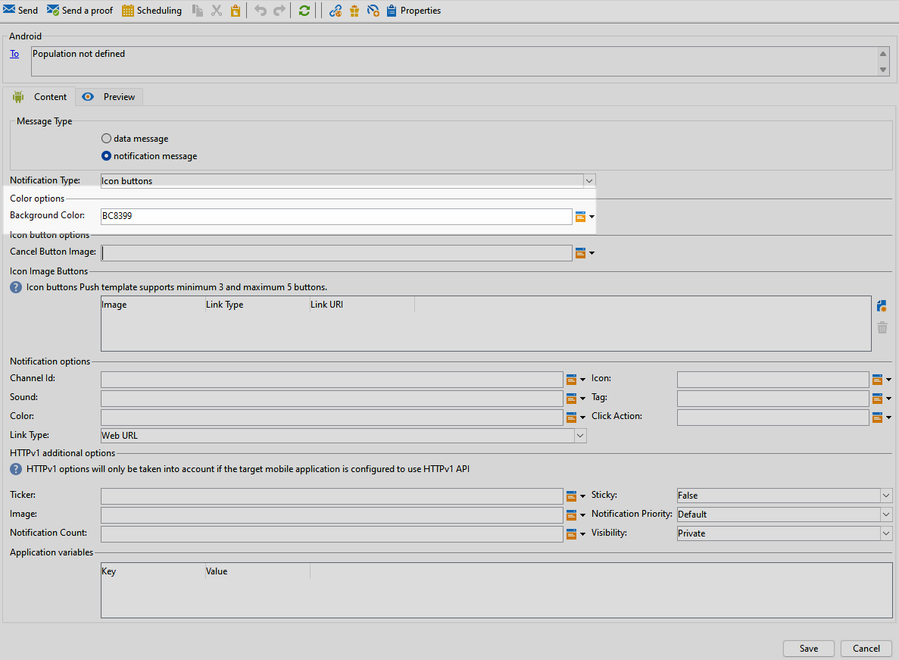
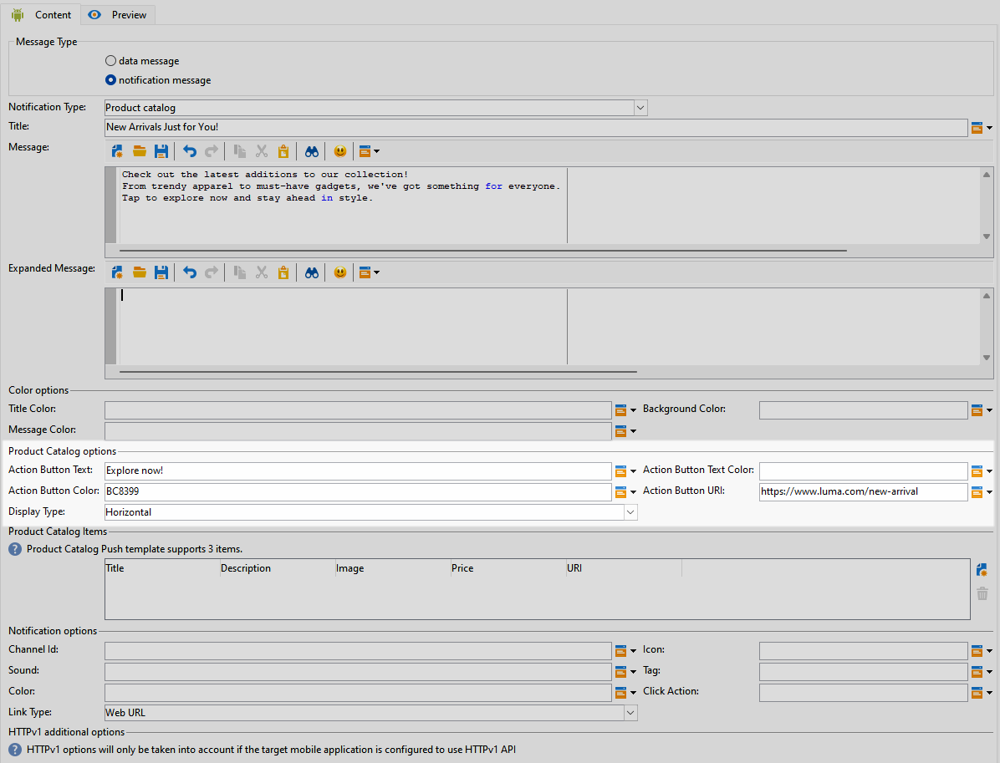
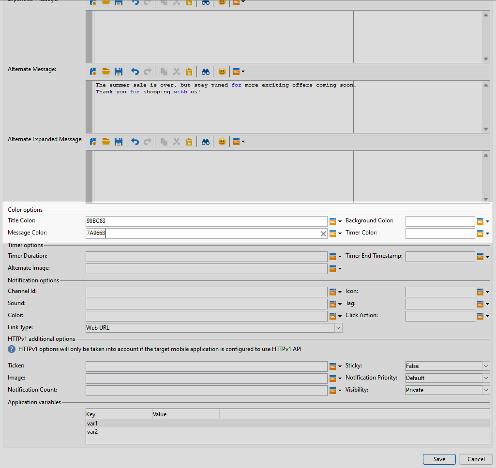

# Diseño de un envío push enriquecido para Android {#rich-push}

>[!IMPORTANT]
>
>Antes de diseñar una notificación push enriquecida, primero debe configurar el conector V2. Consulte [esta página](https://experienceleague.adobe.com/es/docs/campaign-classic/using/sending-messages/sending-push-notifications/configure-the-mobile-app/configuring-the-mobile-application-android#configuring-external-account-android) para ver el procedimiento detallado.

Con Firebase Cloud Messaging, puede elegir entre dos tipos de mensajes:

* La aplicación cliente administra **[!UICONTROL Data message]**. Estos mensajes se envían directamente a la aplicación móvil, que genera y muestra una notificación de Android en el dispositivo. Los mensajes de datos solo contienen las variables de aplicación personalizadas.

* El **[!UICONTROL Notification message]**, gestionado automáticamente por FCM SDK. FCM muestra automáticamente el mensaje en los dispositivos de los usuarios en nombre de la aplicación del cliente. Los mensajes de notificación contienen un conjunto predefinido de parámetros y opciones, pero pueden personalizarse aún más con las variables de aplicación personalizadas.

Si la barra de desplazamiento está deshabilitada en la interfaz, obtenga acceso a **[!UICONTROL Administration]** `>` **[!UICONTROL Platform]** `>` **[!UICONTROL Options]** y establezca la opción **[!UICONTROL XtkUseScrollBar]** en 1.

## Definición del contenido de una notificación de Android {#push-message}

Una vez creado el envío push, puede definir su contenido con una de las siguientes plantillas:

* **Predeterminado** le permite enviar notificaciones con un icono simple y una imagen adjunta.

* **Básico** puede incluir texto, imágenes y botones en las notificaciones.

* **Carrusel** le permite enviar notificaciones con texto e imágenes múltiples que los usuarios pueden deslizar.

* **Botones de icono** le permite enviar notificaciones con un icono y una imagen correspondiente.

* **Cuadro de entrada** recopila datos proporcionados por el usuario y comentarios directamente a través de la notificación.

* **El catálogo de productos** muestra una variedad de imágenes de productos.

* **Clasificación del producto** permite que los usuarios proporcionen comentarios y valoren los productos.

* **Timer** incluye un temporizador de cuenta atrás activo en tus notificaciones.

* **Bisel cero** usa toda la superficie de fondo para una imagen, con texto superpuesto sin problemas.

Desplácese por las pestañas siguientes para obtener más información sobre cómo personalizar estas plantillas.

>[!BEGINTABS]

>[!TAB Predeterminado]

1. Del desplegable **[!UICONTROL Notification type]**, seleccione **[!UICONTROL Default]**.

   

1. Para redactar el mensaje, escriba el texto en los campos **[!UICONTROL Title]** y **[!UICONTROL Message]**.

   

1. Utilice campos de personalización dinámicos para definir contenido, personalizar datos y agregar contenido dinámico. [Más información](../send/personalize.md)

1. Para personalizar aún más la notificación push, configure **[!UICONTROL Notification options]** y **[!UICONTROL HTTPv1 additional options]** de la notificación push. [Más información](#push-advanced)

   

Una vez definido el contenido del mensaje, puede utilizar los suscriptores de prueba para previsualizar y probar el mensaje.

>[!TAB Básico]

1. Del desplegable **[!UICONTROL Notification Type]**, seleccione **[!UICONTROL Basic]**.

   

1. Para redactar el mensaje, escriba el texto en los campos **[!UICONTROL Title]**, **[!UICONTROL Message]** y **[!UICONTROL Expanded message]**.

   El texto **[!UICONTROL Message]** aparece en la vista contraída mientras que **[!UICONTROL Expanded message]** se muestra cuando se expande la notificación.

   

1. Utilice campos de personalización dinámicos para definir contenido, personalizar datos y agregar contenido dinámico. [Más información](../send/personalize.md)

1. En el menú **[!UICONTROL Color options]**, escriba los códigos de color hexadecimales para **[!UICONTROL Title]**, **[!UICONTROL Message]** y **[!UICONTROL Background]**.

1. Agregue un(a) **[!UICONTROL Remind later button]** si es necesario. Escriba su **[!UICONTROL Reminder Text]** y **Fecha** en los campos correspondientes.

   El campo **[!UICONTROL Reminder Date]** espera un valor que represente una época en segundos.

1. Haga clic en **[!UICONTROL Add button]** y rellene los campos siguientes:

   * **[!UICONTROL Label]**: texto mostrado en el botón.
   * **[!UICONTROL Link URI]**: especifique el URI que se ejecutará al hacer clic en el botón.

   Tiene la opción de incluir hasta tres botones en la notificación push. Si opta por **[!UICONTROL Remind later button]**, solo puede incluir un máximo de dos botones.

1. Seleccione **[!UICONTROL Link type]** de la URL vinculada al botón:

   * **[!UICONTROL Web URL]**: las direcciones URL web dirigen a los usuarios al contenido en línea. Al hacer clic en, se solicita al explorador web predeterminado del dispositivo que abra y navegue hasta la dirección URL designada.

   * **[!UICONTROL Deeplink]**: los vínculos profundos son direcciones URL que guían a los usuarios a secciones específicas dentro de una aplicación aunque esta esté cerrada. Al hacer clic en él, puede aparecer un cuadro de diálogo que permite a los usuarios elegir entre varias aplicaciones capaces de gestionar el vínculo.

   * **[!UICONTROL Open App]**: las direcciones URL de aplicaciones abiertas le permiten conectarse directamente al contenido de una aplicación. Permite a la aplicación establecerse como controlador predeterminado para un tipo específico de vínculo, omitiendo el cuadro de diálogo de desambiguación.

   Para obtener más información sobre cómo administrar los vínculos de la aplicación de Android, consulte [Documentación para desarrolladores de Android](https://developer.android.com/training/app-links).

   

1. Para personalizar aún más la notificación push, configure **[!UICONTROL Notification options]** y **[!UICONTROL HTTPv1 additional options]** de la notificación push. [Más información](#push-advanced)

   

Una vez definido el contenido del mensaje, puede utilizar los suscriptores de prueba para previsualizar y probar el mensaje.

>[!TAB Carrusel]

1. Del desplegable **[!UICONTROL Notification Type]**, seleccione **[!UICONTROL Carousel]**.

   

1. Para redactar el mensaje, escriba el texto en los campos **[!UICONTROL Title]**, **[!UICONTROL Message]** y **[!UICONTROL Expanded message]**.

   El texto **[!UICONTROL Message]** aparece en la vista contraída mientras que **[!UICONTROL Expanded message]** se muestra cuando se expande la notificación.

   

1. Utilice el Editor de expresiones para definir contenido, personalizar datos y agregar contenido dinámico. [Más información](../send/personalize.md)

1. En el menú **[!UICONTROL Color options]**, escriba los códigos de color hexadecimales para **[!UICONTROL Title]**, **[!UICONTROL Message]** y **[!UICONTROL Background]**.

1. Elija cómo funciona **[!UICONTROL Carousel]**:

   * **[!UICONTROL Auto]**: recorre automáticamente las imágenes como diapositivas, realizando la transición a intervalos predefinidos.
   * **[!UICONTROL Manual]**: permite a los usuarios deslizar manualmente entre diapositivas para navegar por las imágenes.

1. En la lista desplegable **[!UICONTROL Layout]**, seleccione la opción **[!UICONTROL Filmstrip]** para incluir vistas previas de las imágenes anterior y siguiente junto a la diapositiva principal.

1. Haga clic en **[!UICONTROL Add image]** e introduzca la URL de imagen, el texto y la URL de acción.

   Asegúrese de incluir un mínimo de tres imágenes y un máximo de cinco.

   

1. Para personalizar aún más la notificación push, configure **[!UICONTROL Notification options]** y **[!UICONTROL HTTPv1 additional options]** de la notificación push. [Más información](#push-advanced)

   

Una vez definido el contenido del mensaje, puede utilizar los suscriptores de prueba para previsualizar y probar el mensaje.

>[!TAB Botones de icono]

1. Del desplegable **[!UICONTROL Notification Type]**, seleccione **[!UICONTROL Icon buttons]**.

   

1. En el menú **[!UICONTROL Color options]**, escriba los códigos de color hexadecimales de su **[!UICONTROL Background]**.

   

1. Proporcione la dirección URL para **[!UICONTROL Cancel button image]**.

1. En **[!UICONTROL Icon image buttons]**, haga clic en **[!UICONTROL Add image]**. A continuación, introduzca **Image URL**, **Link type** y **Link URI**.

   Asegúrese de incluir un mínimo de tres imágenes y un máximo de cinco botones.

   

1. Para personalizar aún más la notificación push, configure **[!UICONTROL Notification options]** y **[!UICONTROL HTTPv1 additional options]** de la notificación push. [Más información](#push-advanced)

   

Una vez definido el contenido del mensaje, puede utilizar los suscriptores de prueba para previsualizar y probar el mensaje.

>[!TAB Cuadro de entrada]

1. Del desplegable **[!UICONTROL Notification Type]**, seleccione **[!UICONTROL Input box]**.

   

1. Para redactar el mensaje, escriba el texto en los campos **[!UICONTROL Title]**, **[!UICONTROL Message]** y **[!UICONTROL Expanded message]**.

   El texto **[!UICONTROL Message]** aparece en la vista contraída mientras que **[!UICONTROL Expanded message]** se muestra cuando se expande la notificación.

   

1. En el menú **[!UICONTROL Color options]**, escriba los códigos de color hexadecimales para **[!UICONTROL Title]**, **[!UICONTROL Message]** y **[!UICONTROL Background]**.

1. En el menú **[!UICONTROL Input box options]**, rellene la siguiente opción:

   * **[!UICONTROL Input receiver name]**: escriba el nombre o identificador del receptor de la entrada.
   * **[!UICONTROL Input text]**: escriba el texto para el **cuadro de entrada**.
   * **[!UICONTROL Feedback text]**: escriba el texto que se mostrará después de una respuesta.
   * **[!UICONTROL Feedback image]**: agregue la dirección URL de la imagen mostrada después de una respuesta.

   

1. Para personalizar aún más la notificación push, configure **[!UICONTROL Notification options]** y **[!UICONTROL HTTPv1 additional options]** de la notificación push. [Más información](#push-advanced)

   

Una vez definido el contenido del mensaje, puede utilizar los suscriptores de prueba para previsualizar y probar el mensaje.

>[!TAB Catálogo de productos]

1. Del desplegable **[!UICONTROL Notification Type]**, seleccione **[!UICONTROL Product catalog]**.

   

1. Para redactar el mensaje, escriba el texto en los campos **[!UICONTROL Title]**, **[!UICONTROL Message]** y **[!UICONTROL Expanded message]**.

   El texto **[!UICONTROL Message]** aparece en la vista contraída mientras que **[!UICONTROL Expanded message]** se muestra cuando se expande la notificación.

   

1. En el menú **[!UICONTROL Color options]**, escriba los códigos de color hexadecimales para **[!UICONTROL Title]**, **[!UICONTROL Message]** y **[!UICONTROL Background]**.

1. En el menú **[!UICONTROL Product catalog options]**, rellene las opciones siguientes:

   * **[!UICONTROL Action button text]**: texto mostrado en el botón.
   * **[!UICONTROL Action button text color]**: color del texto del botón Acción.
   * **[!UICONTROL Action button color]**: color del botón Acción.
   * **[!UICONTROL Action button URI]**: especifique el URI que se ejecutará al hacer clic en el botón.
   * **[!UICONTROL Display type]**: elija entre la visualización vertical u horizontal.

   

1. En el menú **[!UICONTROL Product catalog items]**, haga clic en **[!UICONTROL Add]** e introduzca los siguientes detalles para cada elemento:

   * **[!UICONTROL Title]**
   * **[!UICONTROL Description]**
   * **[!UICONTROL Image URL]**
   * **[!UICONTROL Price]**
   * **[!UICONTROL URI]**

   Asegúrese de incluir un máximo de tres elementos.

   

1. Para personalizar aún más la notificación push, configure **[!UICONTROL Notification options]** y **[!UICONTROL HTTPv1 additional options]** de la notificación push. [Más información](#push-advanced)

Una vez definido el contenido del mensaje, puede utilizar los suscriptores de prueba para previsualizar y probar el mensaje.

>[!TAB Clasificación del producto]

1. Del desplegable **[!UICONTROL Notification Type]**, seleccione **[!UICONTROL Product rating]**.

   

1. Para redactar el mensaje, escriba el texto en los campos **[!UICONTROL Title]**, **[!UICONTROL Message]** y **[!UICONTROL Expanded message]**.

   El texto **[!UICONTROL Message]** aparece en la vista contraída mientras que **[!UICONTROL Expanded message]** se muestra cuando se expande la notificación.

   

1. En el menú **[!UICONTROL Color options]**, escriba los códigos de color hexadecimales para **[!UICONTROL Title]**, **[!UICONTROL Message]** y **[!UICONTROL Background]**.

1. En el menú **[!UICONTROL Product rating options]**, escriba las direcciones URL de **[!UICONTROL Rating icon in unselected state]** y **[!UICONTROL Rating icon in selected state]**.

   

1. En el menú **[!UICONTROL Product rating items]**, haga clic en **[!UICONTROL Add]**, escriba su **[!UICONTROL Link URI]** y elija su **[!UICONTROL Link type]**.

   * **[!UICONTROL Web URL]**: las direcciones URL web dirigen a los usuarios al contenido en línea. Al hacer clic en, se solicita al explorador web predeterminado del dispositivo que abra y navegue hasta la dirección URL designada.

   * **[!UICONTROL Deeplink]**: los vínculos profundos son direcciones URL que guían a los usuarios a secciones específicas dentro de una aplicación aunque esta esté cerrada. Al hacer clic en él, puede aparecer un cuadro de diálogo que permite a los usuarios elegir entre varias aplicaciones capaces de gestionar el vínculo.

   * **[!UICONTROL Open App]**: las direcciones URL de aplicaciones abiertas le permiten conectarse directamente al contenido de una aplicación. Permite a la aplicación establecerse como controlador predeterminado para un tipo específico de vínculo, omitiendo el cuadro de diálogo de desambiguación.

   * **[!UICONTROL Dismiss]**: no hay ninguna dirección URL asociada al botón; al hacer clic en se cierra simplemente el cuadro de diálogo o la interfaz.

   Asegúrese de incluir un mínimo de tres valores y un máximo de cinco.

   

1. Para personalizar aún más la notificación push, configure **[!UICONTROL Notification options]** y **[!UICONTROL HTTPv1 additional options]** de la notificación push. [Más información](#push-advanced)

   

Una vez definido el contenido del mensaje, puede utilizar los suscriptores de prueba para previsualizar y probar el mensaje.

>[!TAB Temporizador]

1. Del desplegable **[!UICONTROL Notification Type]**, seleccione **[!UICONTROL Timer]**.

   

1. Para redactar el mensaje, escriba el texto en los campos **[!UICONTROL Title]**, **[!UICONTROL Message]** y **[!UICONTROL Expanded message]**.

   El texto **[!UICONTROL Message]** aparece en la vista contraída mientras que **[!UICONTROL Expanded message]** se muestra cuando se expande la notificación.

   

1. Escriba el texto que se mostrará después de que caduque el temporizador en los campos **[!UICONTROL Alternate title]**, **[!UICONTROL Alternate message]** y **[!UICONTROL Alternate expanded message]**.

1. En el menú **[!UICONTROL Color options]**, escriba los códigos de color hexadecimales para **[!UICONTROL Title]**, **[!UICONTROL Message]**, **[!UICONTROL Background]** y **[!UICONTROL Timer]**.

   

1. Establezca su **[!UICONTROL Timer duration]** en segundos o el **[!UICONTROL Timer end timestamp]** a una marca de tiempo epoch específica y agregue la URL **[!UICONTROL Alternate image]** que se mostrará después de que caduque el temporizador.

   

1. Para personalizar aún más la notificación push, configure **[!UICONTROL Notification options]** y **[!UICONTROL HTTPv1 additional options]** de la notificación push. [Más información](#push-advanced)

Una vez definido el contenido del mensaje, puede utilizar los suscriptores de prueba para previsualizar y probar el mensaje.

>[!TAB Bisel cero]

1. Del desplegable **[!UICONTROL Notification Type]**, seleccione **[!UICONTROL Zero bezel]**.

   

1. Para redactar el mensaje, escriba el texto en los campos **[!UICONTROL Title]**, **[!UICONTROL Message]** y **[!UICONTROL Expanded message]**.

   El texto **[!UICONTROL Message]** aparece en la vista contraída mientras que **[!UICONTROL Expanded message]** se muestra cuando se expande la notificación.

   

1. En el menú **[!UICONTROL Color options]**, escriba los códigos de color hexadecimales para **[!UICONTROL Title]**, **[!UICONTROL Message]** y **[!UICONTROL Background]**.

1. En el menú **[!UICONTROL Zero bezel options]**, agregue la URL de la imagen en el campo **[!UICONTROL Collapsed notification style]**.

   

1. Para personalizar aún más la notificación push, configure **[!UICONTROL Notification options]** y **[!UICONTROL HTTPv1 additional options]** de la notificación push. [Más información](#push-advanced)

Una vez definido el contenido del mensaje, puede utilizar los suscriptores de prueba para previsualizar y probar el mensaje.

>[!ENDTABS]

## Configuración avanzada de notificación push {#push-advanced}

### Opciones de notificación {#notification-options}

| Parámetro | Descripción |
|---------|---------|
| **[!UICONTROL Channel ID]** | Establezca el ID de canal de la notificación. La aplicación debe crear un canal con este ID de canal antes de recibir cualquier notificación. |
| **[!UICONTROL Icon]** | Configure el icono de la notificación para que se muestre en los dispositivos de sus perfiles. |
| **[!UICONTROL Sound]** | Configure el sonido para que se reproduzca cuando el dispositivo reciba la notificación. |
| **[!UICONTROL Tag]** | Establezca un identificador utilizado para reemplazar las notificaciones existentes en el cajón de notificaciones. Esto ayuda a evitar la acumulación de varias notificaciones y garantiza que solo se muestre la notificación relevante más reciente. |
| **[!UICONTROL Color]** | Establezca el color del icono de la notificación con un código de color hexadecimal. |
| **[!UICONTROL Click action]** | Configure la acción asociada con un clic del usuario en la notificación. |
| **[!UICONTROL Notification background color]** | Establece el color de tu fondo de notificación con tus códigos de color hexadecimales. |
| **[!UICONTROL Link type]** | <ul><li>URL web: las URL web dirigen a los usuarios al contenido en línea. Al hacer clic en, se solicita al explorador web predeterminado del dispositivo que abra y navegue hasta la dirección URL designada.</li><li>Vínculos profundos: Los vínculos profundos son direcciones URL que guían a los usuarios a secciones específicas de una aplicación aunque esta esté cerrada. Al hacer clic en él, puede aparecer un cuadro de diálogo que permite a los usuarios elegir entre varias aplicaciones capaces de gestionar el vínculo.</li><li> Abrir aplicación: Las direcciones URL de Abrir aplicación permiten conectarse directamente al contenido de una aplicación. Permite a la aplicación establecerse como controlador predeterminado para un tipo específico de vínculo, omitiendo el cuadro de diálogo de desambiguación.</li></ul> |

### Opciones adicionales de HTTPv1 {#additional-options}

| Parámetro | Descripción |
|---------|---------|
| **[!UICONTROL Ticker]** | Configure el texto del valor de la notificación. Solo está disponible para dispositivos configurados con Android 5.0 Lollipop. |
| **[!UICONTROL Sticky]** | Cuando se activa, la notificación permanece visible incluso después de que el usuario haga clic en ella.  Si está desactivada, la notificación se descarta automáticamente cuando el usuario interactúa con ella. El comportamiento adhesivo permite que las notificaciones importantes persistan en la pantalla durante períodos más largos. |
| **[!UICONTROL Image]** | Configure la dirección URL de la imagen para que se muestre en la notificación. |
| **[!UICONTROL Notification Priority]** | Defina el nivel de prioridad de la notificación, que puede ser predeterminado, mínimo, bajo o alto. El nivel de prioridad determina la importancia y la urgencia de la notificación, lo que influye en cómo se muestra y si puede omitir determinada configuración del sistema. Para más información, consulte la [documentación de FCM](https://firebase.google.com/docs/reference/fcm/rest/v1/projects.messages#notificationpriority). |
| **[!UICONTROL Notification Count]** | Configure el número de información nueva no leída que se mostrará directamente en el icono de la aplicación. Esto permite al usuario ver rápidamente el número de notificaciones pendientes. |
| **[!UICONTROL Visibility]** | Defina el nivel de visibilidad de la notificación, que puede ser pública, privada o secreta. El nivel de visibilidad determina la cantidad de contenido de la notificación que se muestra en la pantalla de bloqueo y en otras áreas confidenciales. Para obtener más información, consulte la [documentación de FCM](https://firebase.google.com/docs/reference/fcm/rest/v1/projects.messages#visibility). |
| **[!UICONTROL Application variables]** | Permite definir el comportamiento de las notificaciones. Estas variables son totalmente personalizables y se incluyen, ya que una parte de la carga útil de mensajes se envía al dispositivo móvil. |
