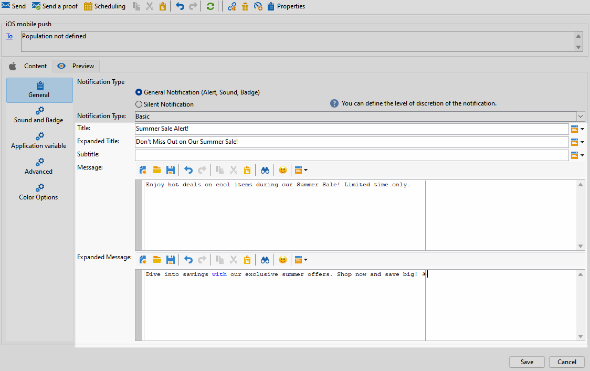

# Diseño de una entrega push enriquecida con iOS {#rich-push}

>[!IMPORTANT]
>
>Antes de diseñar una notificación push enriquecida, primero debe configurar el conector V2. Consulte [esta página](https://experienceleague.adobe.com/es/docs/campaign-classic/using/sending-messages/sending-push-notifications/configure-the-mobile-app/configuring-the-mobile-application) para ver el procedimiento detallado.

## Definición del contenido de una notificación de iOS {#push-message}

Una vez creado el envío push, puede definir su contenido con una de las siguientes plantillas:

* **Predeterminado** le permite enviar notificaciones con un icono simple y una imagen adjunta.

* **Básico** puede incluir texto, imágenes y botones en las notificaciones.

* **Carrusel** le permite enviar notificaciones con texto e imágenes múltiples que los usuarios pueden deslizar.

Desplácese por las pestañas siguientes para obtener más información sobre cómo personalizar estas plantillas.

>[!BEGINTABS]

>[!TAB Predeterminado]

1. Elija **[!UICONTROL General notification (Alert, Sound, Badge)]** como su **[!UICONTROL Notification type]**.

1. Del desplegable **[!UICONTROL Notification Type]**, seleccione **[!UICONTROL Default]**.

   

1. En el campo **[!UICONTROL Title]**, introduzca la etiqueta del título que desea que aparezca en la lista de notificaciones disponibles en el centro de notificaciones.

   Este campo permite definir el valor del parámetro **title** de la carga útil de notificación de iOS.

1. Opcionalmente, agregue **[!UICONTROL Subtitle]**, que corresponde al parámetro **subtitle** de la carga útil de notificaciones de iOS.

1. Escriba el contenido del mensaje en la sección **[!UICONTROL Message content]** del asistente.

   

1. Vaya a la pestaña **[!UICONTROL Sound and Badge]** para personalizar configuraciones adicionales, como opciones de sonido e insignias para las notificaciones. [Más información](#sound-badge)

   

1. En la pestaña **[!UICONTROL Application variables]**, **[!UICONTROL Application variables]** se añaden automáticamente. Permiten definir el comportamiento de las notificaciones: por ejemplo, se puede configurar una pantalla específica de la aplicación que aparece cuando el usuario activa la notificación.

1. Para seguir personalizando, explore **[!UICONTROL Advanced options]** disponibles para sus notificaciones push. [Más información](#push-advanced)

   

1. Una vez configurada la notificación, haga clic en la pestaña **[!UICONTROL Preview]** para previsualizar la notificación.

>[!TAB Básico]

1. Elija **[!UICONTROL General notification (Alert, Sound, Badge)]** como su **[!UICONTROL Notification type]**.

1. Del desplegable **[!UICONTROL Notification Type]**, seleccione **[!UICONTROL Basic]**.

   

1. Para redactar el mensaje, escriba el texto en los campos **[!UICONTROL Title]**, **[!UICONTROL Expanded message]**, **[!UICONTROL Message]** y **[!UICONTROL Expanded message]**.

   El texto **[!UICONTROL Message]** aparece en la vista contraída mientras que **[!UICONTROL Expanded message]** se muestra cuando se expande la notificación.

   

1. Opcionalmente, agregue **[!UICONTROL Subtitle]**, que corresponde al parámetro **subtitle** de la carga útil de notificaciones de iOS.

1. Vaya a la pestaña **[!UICONTROL Sound and Badge]** para personalizar configuraciones adicionales, como opciones de sonido e insignias para las notificaciones. [Más información](#sound-badge)

1. En la pestaña **[!UICONTROL Application variables]**, **[!UICONTROL Application variables]** se añaden automáticamente. Permiten definir el comportamiento de las notificaciones: por ejemplo, se puede configurar una pantalla específica de la aplicación que aparece cuando el usuario activa la notificación.

1. Para seguir personalizando, explore **[!UICONTROL Advanced options]** disponibles para sus notificaciones push. [Más información](#push-advanced)

   

1. En el menú **[!UICONTROL Color options]**, escriba códigos de color hexadecimales para **[!UICONTROL Title]**, **[!UICONTROL Message]** y **[!UICONTROL Background]**.

   

Una vez definido el contenido del mensaje, puede utilizar los suscriptores de prueba para previsualizar y probar el mensaje.

>[!TAB Carrusel]

1. Elija **[!UICONTROL General notification (Alert, Sound, Badge)]** como su **[!UICONTROL Notification type]**.

1. Del desplegable **[!UICONTROL Notification Type]**, seleccione **[!UICONTROL Carousel]**.

   

1. Para redactar el mensaje, escriba el texto en los campos **[!UICONTROL Title]**, **[!UICONTROL Expanded Title]** y **[!UICONTROL Message]**.

   

1. Vaya a la pestaña **[!UICONTROL Sound and Badge]** para personalizar configuraciones adicionales, como opciones de sonido e insignias para las notificaciones. [Más información](#sound-badge)

1. En la pestaña **[!UICONTROL Application variables]**, **[!UICONTROL Application variables]** se añaden automáticamente. Permiten definir el comportamiento de las notificaciones: por ejemplo, se puede configurar una pantalla específica de la aplicación que aparece cuando el usuario activa la notificación.

   

1. Para seguir personalizando, explore **[!UICONTROL Advanced options]** disponibles para sus notificaciones push. [Más información](#push-advanced)

1. En el menú **[!UICONTROL Color options]**, escriba códigos de color hexadecimales para **[!UICONTROL Title]**, **[!UICONTROL Message]** y **[!UICONTROL Background]**.

1. Elija cómo funciona **[!UICONTROL Carousel]** en la ficha **[!UICONTROL Carousel options]**:

   * **[!UICONTROL Auto]**: recorre automáticamente las imágenes como diapositivas, realizando la transición a intervalos predefinidos.
   * **[!UICONTROL Manual]**: permite a los usuarios deslizar manualmente entre diapositivas para navegar por las imágenes.

1. Haga clic en **[!UICONTROL Add image]** e introduzca sus **[!UICONTROL Image URL]**, **[!UICONTROL Text]** y **[!UICONTROL Action URL]**.

   Asegúrese de incluir un mínimo de tres imágenes y un máximo de cinco.

   

Una vez definido el contenido del mensaje, puede utilizar los suscriptores de prueba para previsualizar y probar el mensaje.

>[!TAB Temporizador]

1. Elija **[!UICONTROL General notification (Alert, Sound, Badge)]** como su **[!UICONTROL Notification type]**.

1. Del desplegable **[!UICONTROL Notification Type]**, seleccione **[!UICONTROL Timer]**.

   

1. Para redactar el mensaje, escriba el texto en los campos **[!UICONTROL Title]**, **[!UICONTROL Expanded title]**, **[!UICONTROL Message]** y **[!UICONTROL Expanded message]**.

   El texto **[!UICONTROL Message]** aparece en la vista contraída mientras que **[!UICONTROL Expanded message]** se muestra cuando se expande la notificación.

   

1. Opcionalmente, agregue **[!UICONTROL Subtitle]**, que corresponde al parámetro **subtitle** de la carga útil de notificaciones de iOS.

1. Vaya a la pestaña **[!UICONTROL Sound and Badge]** para personalizar configuraciones adicionales, como opciones de sonido e insignias para las notificaciones. [Más información](#sound-badge)

1. En la pestaña **[!UICONTROL Application variables]**, **[!UICONTROL Application variables]** se añaden automáticamente. Permiten definir el comportamiento de las notificaciones: por ejemplo, se puede configurar una pantalla específica de la aplicación que aparece cuando el usuario activa la notificación.

1. Para seguir personalizando, explore **[!UICONTROL Advanced options]** disponibles para sus notificaciones push. [Más información](#push-advanced)

1. En el menú **[!UICONTROL Color options]**, escriba códigos de color hexadecimales para **[!UICONTROL Title]**, **[!UICONTROL Message]** y **[!UICONTROL Background]**.

   

1. En la ficha **[!UICONTROL Timer]**, establezca su **[!UICONTROL Timer duration]** en segundos o el **[!UICONTROL Timer end timestamp]** en una marca de tiempo de época específica.

1. Escriba el texto y la imagen que se mostrarán después de que caduque el temporizador en los campos **[!UICONTROL Alternate title]**, **[!UICONTROL Alternate message]** y **[!UICONTROL Alternate image]**.

   

Una vez definido el contenido del mensaje, puede utilizar los suscriptores de prueba para previsualizar y probar el mensaje.

>[!ENDTABS]

## Configuración avanzada de notificación push {#push-advanced}

### Opciones de sonido e insignia {#sound-badge}

| Parámetro | Descripción |
|---------|---------|
| **[!UICONTROL Clean Badge]** | Active estas opciones para actualizar el valor del distintivo. |
| **[!UICONTROL Value]** | Establezca un número que se utilizará para mostrar directamente en el icono de la aplicación la cantidad de información nueva no leída. |
| **[!UICONTROL Critical alert mode]** | Active esta opción para agregar sonido a la notificación, incluso si el teléfono del usuario está activado o si el iPhone está silenciado. |
| **[!UICONTROL Name]** | Seleccione el sonido que el terminal móvil debe reproducir cuando reciba la notificación. |
| **[!UICONTROL Volume]** | Establece el volumen del sonido de 0 a 100. Los sonidos deben incluirse en la aplicación y definirse cuando se cree el servicio. |

### Opciones avanzadas {#notification-options}

| Parámetro | Descripción |
|---------|---------|
| **[!UICONTROL Mutable content]** | Active esta opción para permitir que la aplicación móvil descargue contenido multimedia. |
| **[!UICONTROL Thread-id]** | Establezca el identificador utilizado para agrupar las notificaciones relacionadas. |
| **[!UICONTROL Category]** | Establezca el nombre de su ID de categoría, que mostrará botones de acción. Estas notificaciones proporcionan al usuario una forma más rápida de realizar distintas tareas en respuesta a una notificación sin necesidad de abrir ni navegar por la aplicación. |
| **[!UICONTROL Target content ID]** | Establezca un identificador utilizado para destinar la ventana de aplicación que se reenvía cuando se abre la notificación. |
| **[!UICONTROL Launch image]** | Defina el nombre del archivo de imagen de lanzamiento que desea mostrar. Si el usuario decide iniciar la aplicación, se mostrará la imagen seleccionada en lugar de la pantalla de inicio de la aplicación. |
| **[!UICONTROL Click action]** | Configure la acción asociada con un clic del usuario en la notificación. |
| **[!UICONTROL Interruption level]** | <ul><li>Activo: de forma predeterminada, el sistema presenta la notificación inmediatamente, ilumina la pantalla y puede reproducir un sonido. Las notificaciones no rompen los modos de Enfoque.</li><li>Pasivo: el sistema añade la notificación a la lista de notificaciones sin iluminar la pantalla ni reproducir un sonido. Las notificaciones no rompen los modos de Enfoque.</li><li> Con distinción de tiempo: el sistema presenta la notificación inmediatamente, enciende la pantalla, puede reproducir un sonido y atravesar los modos de Enfoque. Este nivel no requiere un permiso especial de Apple.</li><li>Esencial: el sistema presenta la notificación inmediatamente, enciende la pantalla y evita el interruptor silencioso o los modos de enfoque. Tenga en cuenta que este nivel requiere un permiso especial de Apple.</li></ul> |
| **[!UICONTROL Relevance score]** | Establezca una puntuación de relevancia de 0 a 100. El sistema utiliza esto para ordenar las notificaciones en el resumen de notificaciones. |

