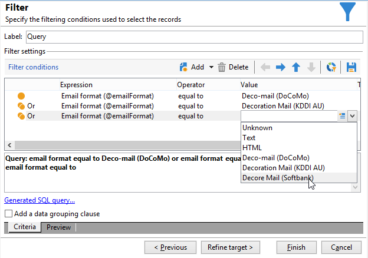
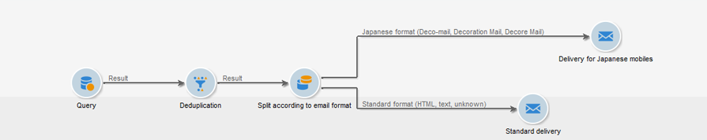

# Envío de correos electrónicos en móviles japoneses {#sending-emails-on-japanese-mobiles}

## Formatos de correo electrónico para móviles japoneses {#email-formats-for-japanese-mobiles}

Adobe Campaign administra tres formatos japoneses específicos para el correo electrónico en móviles: **Deco-mail** (móviles DoCoMo), **Decore Mail** (móviles Softbank) y **Decoration Mail** (móviles KDDI AU). Estos formatos imponen restricciones particulares de codificación, estructura y tamaño. Obtenga más información sobre las limitaciones y recomendaciones en [esta sección](#limitations-and-recommendations).

Para que el destinatario reciba mensajes correctamente en uno de estos formatos, se recomienda seleccionar **[!UICONTROL Deco-mail (DoCoMo)]**, **[!UICONTROL Decore Mail (Softbank)]** o **[!UICONTROL Decoration Mail (KDDI AU)]** en el perfil correspondiente:

Sin embargo, si deja la opción **[!UICONTROL Email format]** como **[!UICONTROL Unknown]**, **[!UICONTROL HTML]** o **[!UICONTROL Text]**, Adobe Campaign detecta (cuando envíe el correo electrónico) el formato japonés que debe usar de modo que el mensaje se muestre correctamente.

Este sistema de detección automática se basa en la lista de dominios predefinidos definidos en el conjunto de reglas de correo **[!UICONTROL Management of Email Formats]**. Para obtener más información sobre la administración de formatos de correo electrónico, consulte la [documentación de Campaign Classic](https://experienceleague.adobe.com/docs/campaign-classic/using/installing-campaign-classic/additional-configurations/email-deliverability.html?lang=es#managing-email-formats).

## Limitaciones y recomendaciones {#limitations-and-recommendations}

Se aplican una serie de restricciones en la entrega de correos electrónico que se pueden leer en un móvil gestionado por un proveedor japonés (Softbank, DoCoMo, KDDI AU).

Por lo tanto, debe:

* Usar imágenes en formato JPEG o GIF.
* Crear una entrega con secciones de texto y HTML que sean inferiores a los 10 000 bytes (para KDDI AU y DoCoMo).
* Utilizar imágenes con un tamaño total inferior a 100 KB (antes de la codificación).
* No utilizar más de 20 imágenes por mensaje.
* Utilizar un formato HTML de tamaño reducido (hay un número limitado de etiquetas disponibles para cada operador).

>[!NOTE]
>
>Al crear el mensaje, se deben tener en cuenta las restricciones específicas de cada operador. Consulte la documentación del producto.

## Prueba del contenido de correo electrónico {#testing-the-email-content}

### Previsualización del mensaje {#previewing-the-message}

Adobe Campaign le permite comprobar que su formato de mensaje está adaptado a un móvil japonés.

Una vez que haya definido el contenido y haya introducido el asunto del correo electrónico, puede comprobar la visualización y el formato cuando se cree el mensaje.

En la pestaña **[!UICONTROL Preview]** de la ventana de edición de contenido, hacer clic en **[!UICONTROL More... > Deco-mail diagnostic]** le permite:

* Comprobar que las etiquetas de contenido HTML cumplan las restricciones de formato japonés
* Comprobar que el número de imágenes del mensaje no supere el límite impuesto por el formato (20 imágenes)
* Comprobar el tamaño total del mensaje (menor que 100 kB)

  

### Ejecución de la regla de tipología {#running-typology-rule}

Además del diagnóstico de la previsualización, se realiza una segunda comprobación al enviar una prueba o una entrega: una regla de tipología específica, **[!UICONTROL Deco-mail check]**, se inicia durante el análisis.

>[!IMPORTANT]
>
>Esta regla de tipología solo se ejecuta si al menos uno de los destinatarios está configurado para recibir correos electrónicos en formato **[!UICONTROL Deco-mail (DoCoMo)]**, **[!UICONTROL Decore Mail (Softbank)]** o **[!UICONTROL Decoration Mail (KDDI AU)]**.

Esta regla de tipología le permite asegurarse de que la entrega respeta las [limitaciones de formato](#limitations-and-recommendations) definidas por los operadores japoneses, especialmente en relación con el tamaño total del correo electrónico, el tamaño de las secciones HTML y de texto, el número de imágenes de los mensajes y las etiquetas del contenido HTML.

### Envío de pruebas {#sending-proofs}

Puede realizar pruebas para probar su entrega. Cuando envíe la prueba, si utiliza direcciones de sustitución, introduzca direcciones que correspondan al formato de correo electrónico del perfil utilizado.

Por ejemplo, puede reemplazar la dirección de un perfil por test@softbank.ne.jp si el formato de correo electrónico de este perfil se ha definido previamente en **[!UICONTROL Decore Mail (Softbank)]**.

## Envío de mensajes {#sending-messages}

Para enviar un correo electrónico a los destinatarios con formatos de correo electrónico japoneses con Campaign, existen dos opciones:

* Crear dos entregas: uno solo para los destinatarios japoneses y otro para otros destinatarios. Consulte [esta sección](#designing-a-specific-delivery-for-japanese-formats).
* Crear una única entrega, y Adobe Campaign detecta automáticamente el formato que debe utilizar. Consulte [esta sección](#designing-a-delivery-for-all-formats).

### Diseño de una entrega específica para formatos japoneses {#designing-a-specific-delivery-for-japanese-formats}

Puede crear un flujo de trabajo que contenga dos entregas: uno para su lectura en un dispositivo móvil japonés y otro para los destinatarios con un formato de correo electrónico estándar.

Para ello, utilice la actividad **[!UICONTROL Split]** de su flujo de trabajo y defina los formatos de correo electrónico japoneses (Deco-mail, Decoration Mail y Decore Mail) como condiciones de filtrado.

### Diseño de una entrega para todos los formatos {#designing-a-delivery-for-all-formats}

Cuando Adobe Campaign administra de forma dinámica los formatos según el dominio (perfiles con formatos de correo electrónico definidos como **[!UICONTROL Unknown]**, **[!UICONTROL HTML]** o **[!UICONTROL Text]** ), puede realizar el mismo envío a todos los destinatarios.

El mensaje de contacto se muestra correctamente para los usuarios de móviles japoneses del mismo modo que para los destinatarios estándar.

>[!IMPORTANT]
>
>Asegúrese de respetar las funciones especiales asociadas a cada formato de correo electrónico japonés (Deco-mail, Decoration Mail y Decore Mail). Para obtener más información sobre las limitaciones, consulte [esta sección](#limitations-and-recommendations).
