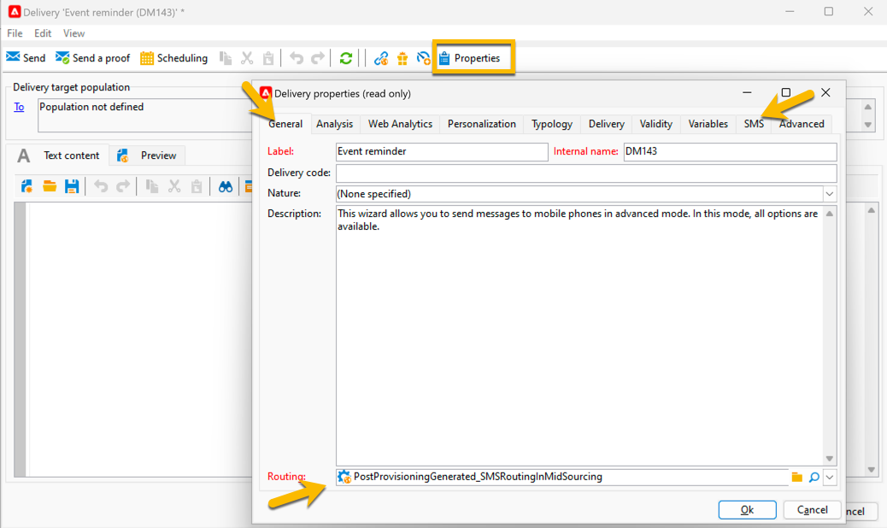

# Creación de su primer envío de SMS {#sms-delivery}

Para diseñar un envío de SMS nuevo, siga los pasos a continuación:

1. Cree una nueva entrega y seleccione la [plantilla de envíos de SMS](sms-mid-sourcing.md#sms-delivery-template) que creó para sus envíos de SMS.

   {zoomable="yes"}

   Los pasos de creación de entregas se detallan en [esta página](../../start/create-message.md).

<!--
 * For standalone instance,  [learn more here](sms-standalone-instance.md#sms-delivery-template).
* For mid-sourcing infrastructure,
-->

1. Cambie el nombre de la entrega en el campo **[!UICONTROL Label]** y agregue información en el campo **[!UICONTROL Delivery code]** y en la lista **[!UICONTROL Nature]** si es necesario para el seguimiento. También puede agregar un(a) **[!UICONTROL Description]** a su entrega.

1. Haga clic en el botón **[!UICONTROL Continue]**. Ahora, tiene todos los ajustes de la plantilla en su envío.

1. Puede comprobar en el botón **[!UICONTROL Properties]** que todo está configurado según sea necesario. [Más información sobre la ficha SMS](sms-delivery-settings.md#sms-tab)

   {zoomable="yes"}

1. [Defina el contenido](sms-content.md) de su envío.

1. [Seleccione la audiencia](sms-audience.md).

Los pasos para definir una audiencia se detallan en [esta página](../../audiences/create-audiences.md).

## Validación y envío de SMS {#sms-validate}

Después de la creación de la entrega, puede:

1. [Enviar pruebas](sms-proofs.md) para validar la representación y el contenido,

1. A continuación, [enviar a la audiencia final](sms-send.md).

## Monitorización y seguimiento de SMS {#sms-monitor}

Después del envío, [aprenderá a monitorizar y rastrear su SMS](sms-monitor.md).
