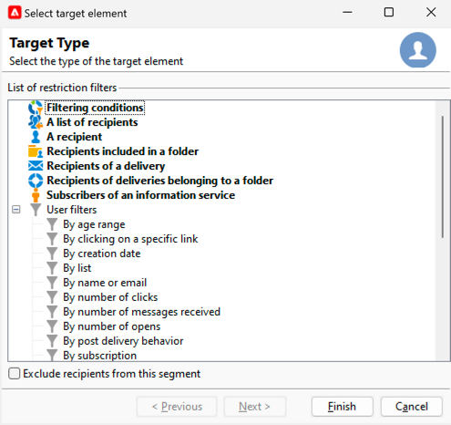

# Selección de la audiencia de envío de SMS {#sms-audience}

Antes de seleccionar la audiencia, [obtenga más información acerca de la audiencia aquí](../../audiences/gs-audiences.md).

En la mayoría de los casos, el objetivo principal de una entrega se extrae de la base de datos de Adobe Campaign (modo predeterminado). Sin embargo, la audiencia también se puede almacenar en un archivo externo. [Obtenga más información en esta sección](#external-audience).

## Audiencia en Adobe Campaign

Para seleccionar la audiencia de su envío, siga los pasos a continuación:

1. En el editor de envíos, haga clic en el vínculo **[!UICONTROL To]**. Se abrirá una ventana de **[!UICONTROL Select target]**

1. Dado que la audiencia está almacenada en la base de datos de Adobe Campaign, en la pestaña **[!UICONTROL Main target]**, elija la opción **[!UICONTROL Defined in the database]**.

   {zoomable="yes"}

1. Seleccione **[!UICONTROL Target mapping]** en la lista desplegable. La asignación de destino predeterminada de Adobe Campaign es Recipients, según el esquema **[!UICONTROL nms:recipient]**.

   Están disponibles otras asignaciones de destino, y algunos pueden relacionarse con la configuración específica. Para obtener más información sobre las asignaciones de destino, consulte [Trabajar con asignaciones de destino](../../audiences/target-mappings.md).

1. Haga clic en el botón **[!UICONTROL Add]** para definir los filtros de restricción.

   A continuación, se puede seleccionar el tipo de filtrado que desee aplicar:

   {zoomable="yes"}

   Para usar un tipo de destino, selecciónelo y haga clic en el botón **[!UICONTROL Next]**.

   Estos son los tipos de objetivos ofrecidos de forma predeterminada:

   * **[!UICONTROL Filtering conditions]**: permite definir una consulta y mostrar el resultado.
   * **[!UICONTROL A list of recipients]**: le permite seleccionar una lista que haya preparado y que contenga su audiencia
   * **[!UICONTROL A recipient]**: permite seleccionar directamente un destinatario en la tabla.
   * **[!UICONTROL Recipients included in a folder]**: permite seleccionar una carpeta en el árbol de navegación del explorador
   * **[!UICONTROL Recipients of a delivery]**: permite seleccionar la audiencia de un envío anterior
   * **[!UICONTROL Recipients of deliveries belonging to a folder]**: permite seleccionar la audiencia de todas las entregas de una carpeta determinada
   * **[!UICONTROL Subscribers of an information service]**: esta opción permite seleccionar un boletín informativo al que se deben suscribir los destinatarios para ser objetivos de la entrega que se está creando.
   * **[!UICONTROL User filters]**: permite utilizar los filtros predefinidos.

   La opción **[!UICONTROL Exclude recipients from this segment]** permite dirigirse a los destinatarios que no cumplan con los criterios de objetivo definidos. Para utilizar esta opción, seleccione el cuadro apropiado y, a continuación, aplique los objetivos, según lo definido anteriormente, para excluir los perfiles resultantes.

1. Escriba el nombre de la audiencia en el campo de etiqueta y haga clic en el botón **[!UICONTROL Finish]** para validar la audiencia.

   {zoomable="yes"}

   Puede agregar la población objetivo tantas como necesite al hacer clic de nuevo en el botón **[!UICONTROL Add]**. También puede eliminar algunos de ellos haciendo clic en la cruz situada después de su etiqueta.

## Audiencia en un archivo externo {#external-audience}

Puede utilizar Adobe Campaign para realizar una entrega a una audiencia que no esté en su base de datos, sino en un archivo externo.

Estos son los pasos para esto:

1. En el editor de envíos, haga clic en el vínculo **[!UICONTROL To]**. Se abrirá una ventana de **[!UICONTROL Select target]**

1. Elija la opción **[!UICONTROL Defined in an external file]**.

   {zoomable="yes"}

1. De forma predeterminada, los destinatarios se importan en la base de datos. Debe seleccionar **[!UICONTROL Target mapping]** en ese caso. Para obtener más información sobre las asignaciones de destino, consulte [Trabajar con asignaciones de destino](../../audiences/target-mappings.md).

   De lo contrario, también puede elegir **[!UICONTROL Do not import the recipients into the database]**.

1. Al importar el archivo, haga clic en el vínculo **[!UICONTROL File format definition…]** para seleccionar y configurar el archivo externo.

1. Haga clic en el botón **[!UICONTROL Finish]** para validar la audiencia.
