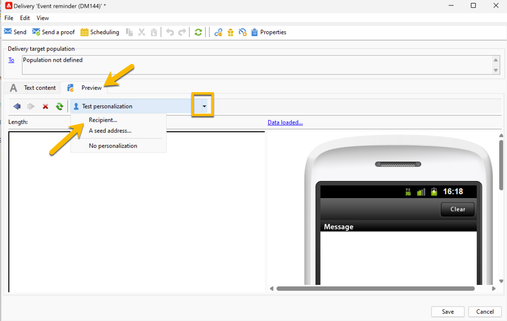

# Definición del contenido del SMS {#sms-content}

Para configurar el contenido de su envío de SMS:

1. Escriba el contenido del mensaje en la ficha **[!UICONTROL Text content]**.

   {zoomable="yes"}

1. Puede personalizar el mensaje insertando campos personalizados (por ejemplo, añadiendo el nombre) o insertando bloques personalizados predefinidos (por ejemplo, añadiendo los saludos). Haga clic en el botón de personalización para añadir lo siguiente:

   {zoomable="yes"}

   Por ejemplo, después de hacer clic en **[!UICONTROL Recipient]** > **[!UICONTROL First name]**, el contenido del SMS se actualiza con el campo de personalización, como se muestra a continuación:

   {zoomable="yes"}

   Obtenga más información acerca de la personalización en Adobe Campaign en [esta sección](../personalize.md).

1. Puede obtener una vista previa del contenido de su envío desde la pestaña **[!UICONTROL Preview]**. Para comprobar la configuración de personalización, haga clic en la lista desplegable **[!UICONTROL Test personalization]** y seleccione un destinatario.

   {zoomable="yes"}

   Puede comprobar la previsualización de su SMS con la personalización:

   {zoomable="yes"}

>[!NOTE]
>
>* Los mensajes SMS se limitan a una longitud de 160 caracteres si se utiliza la página de códigos Latin-1 (ISO-8859-1). Si el mensaje se escribe en Unicode, no debe exceder los 70 caracteres. Algunos caracteres especiales pueden afectar la longitud del mensaje. Para obtener más información sobre la longitud del mensaje, consulte la sección [Transliteración de caracteres SMS](smpp-external-account.md#smpp-channel-settings).
>
>* Cuando hay campos de personalización o campos de contenido condicionados, el tamaño del mensaje varía según el destinatario. La longitud del mensaje debe evaluarse cuando se haya realizado la personalización.
>
>* Al iniciar el análisis, se comprueba la longitud de los mensajes y se muestra una advertencia en caso de desbordamiento.

Después de crear el contenido de tu envío, puedes [seleccionar tu audiencia](sms-audience.md).
