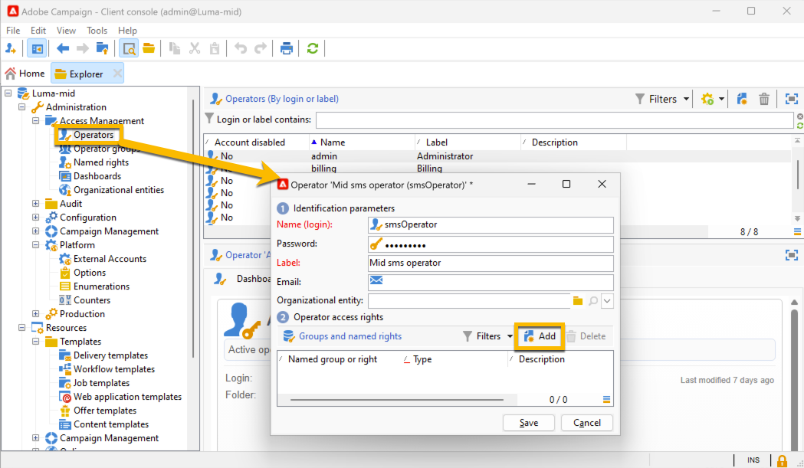

# SMS en una infraestructura intermediaria {#sms-mid}

>[!IMPORTANT]
>
>Esta documentación es para Adobe Campaign 8.7.2 y posterior.
>
>Para las versiones anteriores, lea la [documentación de Campaign Classic v7](https://experienceleague.adobe.com/en/docs/campaign-classic/using/sending-messages/sending-messages-on-mobiles/sms-set-up/sms-set-up).

El envío de envíos SMS con una infraestructura intermediaria requiere lo siguiente:

1. Un operador SMS en el servidor central. [Aprenda a crearlo aquí](#sms-operator-mid)
1. Una cuenta externa SMS en el servidor de marketing que utilizará el operador creado anteriormente. [Aprenda a crearlo aquí](#sms-external-account)
1. Una cuenta externa SMPP en el servidor intermediario, que especifica el modo de envío de canal y intermediario. [Aprenda a crearlo aquí](#smpp-external-account-mid)
1. Una plantilla de envío que hace referencia a la cuenta externa para racionalizar el proceso de envío. [Aprenda a crearlo aquí](#sms-delivery-template)

## Creación del operador SMS en el servidor intermediario {#sms-operator-mid}

En primer lugar, debe crear un operador SMS en el servidor intermediario, que utilizará la cuenta externa SMS en el servidor de marketing.

Para crear su operador SMS, siga los pasos a continuación:

1. En **[!UICONTROL Administration]** > **[!UICONTROL Access management]** > **[!UICONTROL Operators]**, haga clic en **[!UICONTROL New]** y rellene el formulario en la nueva ventana abierta.

   * **[!UICONTROL Name (login)]** y **[!UICONTROL Label]** son obligatorios.
   * La contraseña no es obligatoria, pero es muy recomendable para la seguridad.

   Tenga en cuenta que el nombre (inicio de sesión) se utilizará más adelante para asignar un nombre a la cuenta externa de SMPP en el servidor intermediario.

   {zoomable="yes"}

1. En la parte **[!UICONTROL Groups and named rights]**, haga clic en el botón **[!UICONTROL Add]**.
En la nueva ventana abierta, elija **[!UICONTROL Named rights]** en la lista **[!UICONTROL Folder]** y seleccione **[!UICONTROL ADMINISTRATION]** en la lista derecha.

1. Haga clic en el botón **[!UICONTROL Ok]**.

   {zoomable="yes"}

1. Haga clic en el botón **[!UICONTROL Save]** para finalizar la creación de su operador de SMS.

   {zoomable="yes"}

Ahora puede verlo en la lista de operadores.

{zoomable="yes"}

## Creación de una cuenta externa SMS en el servidor de marketing {#sms-external-account}

En una infraestructura intermedia, debe crear una cuenta externa de SMS en el servidor de marketing como se muestra a continuación

>[!IMPORTANT]
>
>El uso de la misma cuenta y contraseña para varias cuentas externas de SMS puede provocar conflictos y superposición entre las cuentas. Más información en [página de solución de problemas de SMS](smpp-connection.md#sms-troubleshooting).

1. En **[!UICONTROL Administration]** > **[!UICONTROL Platform]** > **[!UICONTROL External Accounts]**, haga clic en el icono **[!UICONTROL New]**

   {zoomable="yes"}

1. Configure **[!UICONTROL Label]** y **[!UICONTROL Internal name]** de su cuenta externa. Defina el tipo de cuenta como **[!UICONTROL Routing]**, marque la casilla **[!UICONTROL Enabled]**, seleccione **[!UICONTROL Mobile (SMS)]** para el canal y **[!UICONTROL Mid-sourcing]** para el modo de envío.

   {zoomable="yes"}

1. En la pestaña **[!UICONTROL Mid-sourcing]**, rellene el formulario con la URL del servidor intermediario y el operador SMS creado anteriormente en el servidor intermediario.

   Confirme la conexión haciendo clic en el botón **[!UICONTROL Test the connection]**.

   {zoomable="yes"}

1. Haga clic en **[!UICONTROL Save]**.

## Creación de una cuenta externa SMPP en el servidor intermediario {#smpp-external-account-mid}

>[!IMPORTANT]
>
>El uso de la misma cuenta y contraseña para varias cuentas externas de SMS puede provocar conflictos y superposición entre las cuentas. Consulte la [Página de solución de problemas de SMS](smpp-connection.md#sms-troubleshooting).

El objetivo ahora es establecer la cuenta externa SMPP en el servidor intermediario.

Para realizar esto, siga los pasos a continuación:

1. En **[!UICONTROL Administration]** > **[!UICONTROL Platform]** > **[!UICONTROL External Accounts]** del servidor intermediario, haga clic en el icono **[!UICONTROL New]**

1. Configure **[!UICONTROL Label]** y **[!UICONTROL Internal name]** de su cuenta externa.

   >[!WARNING]
   >
   >Al asignar un nombre interno, asegúrese de seguir la convención de nombres especificada: `SMS Operator Name_Internal Name of the Marketing SMS external account`.
   >

   Defina el tipo de cuenta como **[!UICONTROL Routing]**, marque la casilla **[!UICONTROL Enabled]**, seleccione **[!UICONTROL Mobile (SMS)]** para el canal y **[!UICONTROL Bulk delivery]** para el modo de envío.
   {zoomable="yes"}

1. En la ficha **[!UICONTROL Mobile]**, mantenga a **[!UICONTROL Extended generic SMPP]** en la lista desplegable **[!UICONTROL Connector]**.

   La casilla **[!UICONTROL Send messages through a dedicated process]** está marcada de manera predeterminada.

   {zoomable="yes"}

   Para configurar la conexión, debe rellenar las pestañas de este formulario. Para obtener más información, [obtenga más información sobre la cuenta externa SMPP](smpp-external-account.md#smpp-connection-settings).

## Configuración de la plantilla de envíos {#sms-delivery-template}

Para facilitar la creación de su envío SMS, cree una plantilla de envíos SMS donde se haga referencia a toda la configuración.

En **[!UICONTROL Resources]** > **[!UICONTROL Templates]** > **[!UICONTROL Delivery templates]** en el servidor de marketing, haga clic con el botón derecho en la plantilla de entrega móvil existente y elija **[!UICONTROL Duplicate]**.

{zoomable="yes"}

Cambie **[!UICONTROL Label]** y **[!UICONTROL Internal name]** de la plantilla para reconocerlo fácilmente y haga clic en el botón **[!UICONTROL Properties]**.

{zoomable="yes"}

En la ficha **[!UICONTROL General]**, en **[!UICONTROL Routing]**, seleccione su cuenta externa SMPP.

{zoomable="yes"}

En la ficha **[!UICONTROL SMS]**, puede agregar parámetros opcionales a la plantilla.

{zoomable="yes"}

[Más información sobre esta configuración de ficha de SMS](sms-delivery-settings.md).
