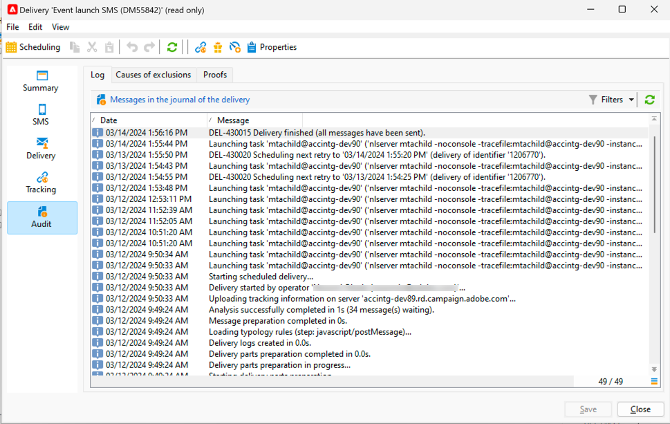

# Monitorización y seguimiento de un SMS

Es importante monitorizar la entrega de SMS para asegurarse de que las campañas de marketing sean eficientes.

Aquí las posibilidades que tiene para saber lo que sucede después de la entrega de su entrega

## Comprensión del panel de envío de SMS

El panel de envío le proporciona mucha información sobre su SMS.

Para acceder al panel, haga doble clic en su entrega en la lista de envíos.

En la ficha **[!UICONTROL Summary]**, tiene los datos principales, como el número de mensajes procesados y el número de mensajes correctos.

{zoomable="yes"}

Después de enviar el SMS, ya no se puede acceder a la pestaña **[!UICONTROL SMS]**, que trata sobre el contenido de la entrega, para variar.

En la ficha **[!UICONTROL Delivery]**, tiene la información sobre los registros de envío. Para cada dirección contactada, puede ver si el SMS se ha enviado o no

{zoomable="yes"}

Puede ver en la pestaña **[!UICONTROL Exclusions]** los detalles de por qué algunas direcciones se excluyen del destino.

{zoomable="yes"}

La ficha **[!UICONTROL Tracking]** trata sobre el seguimiento. A continuación, se muestra el ejemplo de una dirección URL rastreada en el contenido del SMS.

{zoomable="yes"}

Y por último, la pestaña **[!UICONTROL Audit]** con todos los detalles durante el inicio de la entrega:

{zoomable="yes"}

## Comprender los errores de SMS

Los tipos de errores y los motivos del error para SMS son los mismos que para los correos electrónicos.

Obtenga más información sobre [errores de entrega](../delivery-failures.md) y, específicamente, sobre [cuarentenas de SMS](../delivery-failures.md#sms-quarantines).
