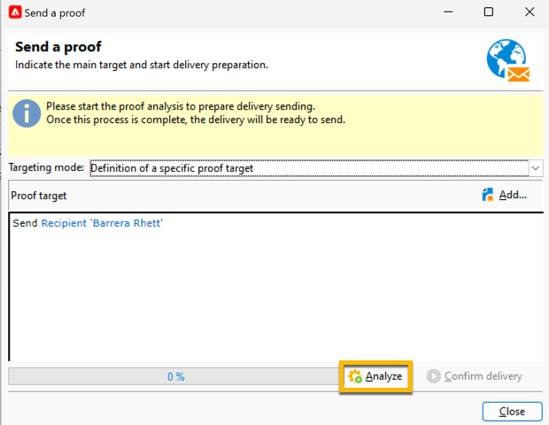

# Envío de una prueba de un envío de SMS {#sms-proof}

Adobe recomienda encarecidamente configurar un ciclo de validación de envíos. Asegúrese de que el contenido se aprueba antes de enviarlo a su audiencia.

Puede enviar una prueba para su envío de SMS para validarlo:

1. Haga clic en el botón **[!UICONTROL Send a proof]** para abrir una ventana

   {zoomable="yes"}

   Tiene varios modos para enviar una prueba:

   * **[!UICONTROL Definition of a specific proof target]**: permite consultar con filtros las direcciones de la base de datos como destino de la prueba
   * **[!UICONTROL Substitution of the address]**: permite introducir las direcciones de prueba y utilizar los datos del destinatario de destino para validar el contenido. Las direcciones de sustitución se pueden introducir manualmente o seleccionar en la lista desplegable. La enumeración asociada es **[!UICONTROL Substitution address (rcpAddress)]**.
De forma predeterminada, la sustitución se realiza de forma aleatoria, pero se puede seleccionar un destinatario específico del destino principal mediante el icono **[!UICONTROL Detail]**.
   * **[!UICONTROL Seed addresses]**: permite acceder a las direcciones semilla para ser el destino de la prueba. Estas direcciones pueden importarse desde un archivo o introducirse manualmente.
   * **[!UICONTROL Specific target and Seed addresses]**: permite combinar direcciones semilla y direcciones de destinatario.

1. Después de elegir su **[!UICONTROL Targeting mode]**, agregue las direcciones de revisión según corresponda

   En el ejemplo siguiente, elegimos **[!UICONTROL Definition of a specific proof target]** y agregamos un destinatario:

   {zoomable="yes"}

1. Haga clic en el botón **[!UICONTROL Analyze]**.
Adobe Campaign realizará todo el control antes de validar el envío de la prueba. Al final del análisis, se podrá hacer clic en el botón **[!UICONTROL Confirm delivery]**.

   {zoomable="yes"}

1. Para enviar la prueba de su envío de SMS, haga clic en el botón **[!UICONTROL Confirm delivery]**.

Si todo está bien en este momento, puedes continuar y [enviar tu envío de SMS a la audiencia](sms-audience.md).
