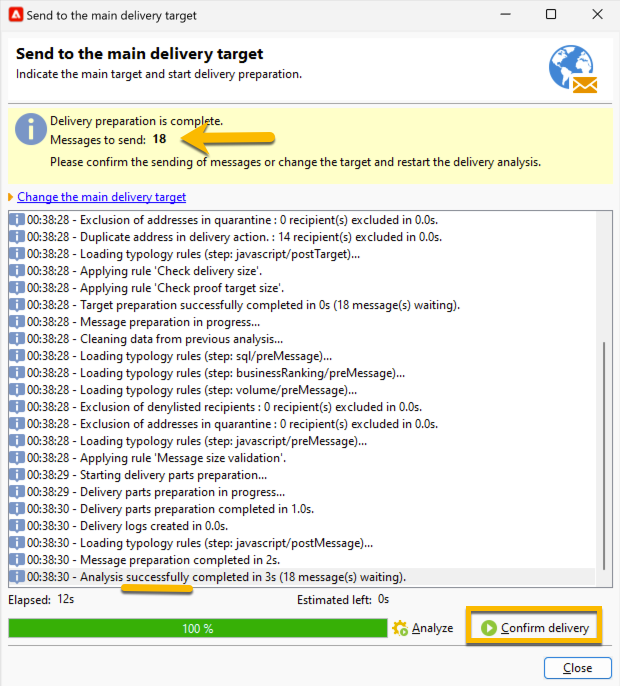

# Envíe su envío de SMS a la audiencia {#sms-send-audience}

Cuando se valida el SMS, ahora puede enviarlo a su audiencia.

1. Haga clic en el botón **[!UICONTROL Send]**.
En la ventana abierta, elija la acción que mejor se adapte a sus necesidades.

   En el ejemplo siguiente, elegimos **[!UICONTROL Deliver it as soon as possible]**, cuando apareció el botón **[!UICONTROL Analyze]**. Hacemos clic en ese botón **[!UICONTROL Analyze]**.

   {zoomable="yes"}

   Adobe Campaign realizará todo el control antes de validar el envío de la prueba. Ahí verá el volumen real de la audiencia. Al final del análisis, se podrá hacer clic en el botón **[!UICONTROL Confirm delivery]**.

   {zoomable="yes"}

1. Para enviar su envío de SMS a su audiencia, haga clic en el botón **[!UICONTROL Confirm delivery]**.
