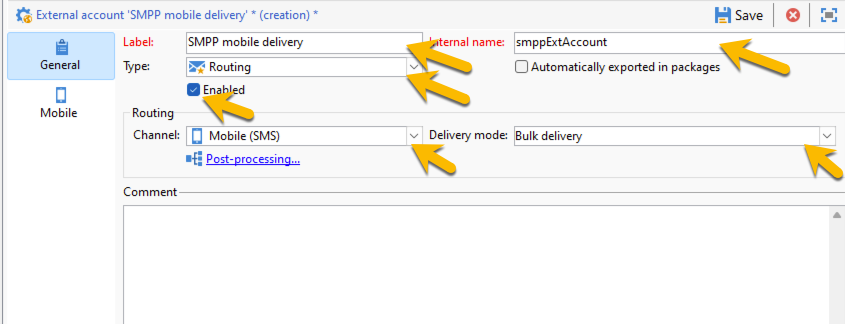
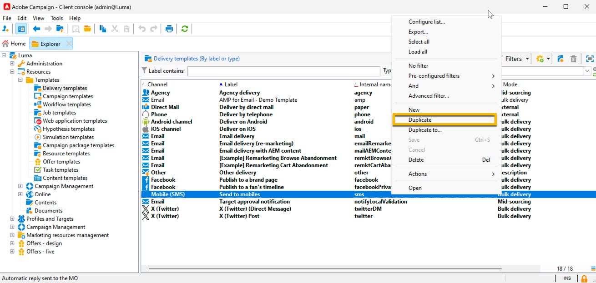

# SMS en una instancia independiente {#sms-standalone}

>[!IMPORTANT]
>
>Esta documentación es para Adobe Campaign 8.7.2 y posterior.
>
>Para las versiones anteriores, lea la [documentación de Campaign Classic v7](https://experienceleague.adobe.com/en/docs/campaign-classic/using/sending-messages/sending-messages-on-mobiles/sms-set-up/sms-set-up).

En una instancia independiente, la entrega de un SMS requiere lo siguiente:

1. Cuenta externa **1} que especifica un conector y el tipo de mensaje, [obtenga más información aquí](#external-account)**

1. Una **plantilla de envíos** en la que se hace referencia a esta cuenta externa, [obtenga más información aquí](#sms-delivery-template)

## Creación de una cuenta externa {#external-account}

>[!IMPORTANT]
>
>El uso de la misma cuenta y contraseña para varias cuentas externas de SMS puede provocar conflictos y superposición entre las cuentas. Más información en [página de solución de problemas de SMS](smpp-connection.md#sms-troubleshooting).

Estos son los pasos para crear la cuenta externa SMPP:

1. En **[!UICONTROL Administration]** > **[!UICONTROL Platform]** > **[!UICONTROL External Accounts]**, haga clic en el icono **[!UICONTROL New]**

   {zoomable="yes"}

1. Configure **[!UICONTROL Label]** y **[!UICONTROL Internal name]** de su cuenta externa. Defina el tipo de cuenta como **[!UICONTROL Routing]**, marque la casilla **[!UICONTROL Enabled]**, seleccione **[!UICONTROL Mobile (SMS)]** para el canal y **[!UICONTROL Bulk delivery]** para el modo de envío.

   {zoomable="yes"}

1. En la ficha **[!UICONTROL Mobile]**, mantenga a **[!UICONTROL Extended generic SMPP]** en la lista desplegable **[!UICONTROL Connector]**.
La casilla **[!UICONTROL Send messages through a dedicated process]** está marcada de manera predeterminada.

   {zoomable="yes"}

   Para configurar la conexión, debe rellenar las pestañas de este formulario. Para obtener más información, [obtenga más información sobre la cuenta externa SMPP](smpp-external-account.md#smpp-connection-settings).

## Configuración de la plantilla de envíos {#sms-delivery-template}

Para facilitar la creación de su envío SMS, cree una plantilla de envíos SMS donde se haga referencia a su cuenta externa SMPP.

En **[!UICONTROL Resources]** > **[!UICONTROL Templates]** > **[!UICONTROL Delivery templates]**, haga clic con el botón derecho en la plantilla de envíos móviles existente y elija **[!UICONTROL Duplicate]**.

{zoomable="yes"}

Cambie **[!UICONTROL Label]** y **[!UICONTROL Internal name]** de la plantilla para reconocerlo fácilmente y haga clic en el botón **[!UICONTROL Properties]**.

{zoomable="yes"}

En la ficha **[!UICONTROL General]**, en **[!UICONTROL Routing]**, seleccione su cuenta externa SMPP.

{zoomable="yes"}

En la ficha **[!UICONTROL SMS]**, puede agregar parámetros opcionales a la plantilla.

{zoomable="yes"}

[Más información sobre esta configuración de ficha de SMS](sms-delivery-settings.md).
