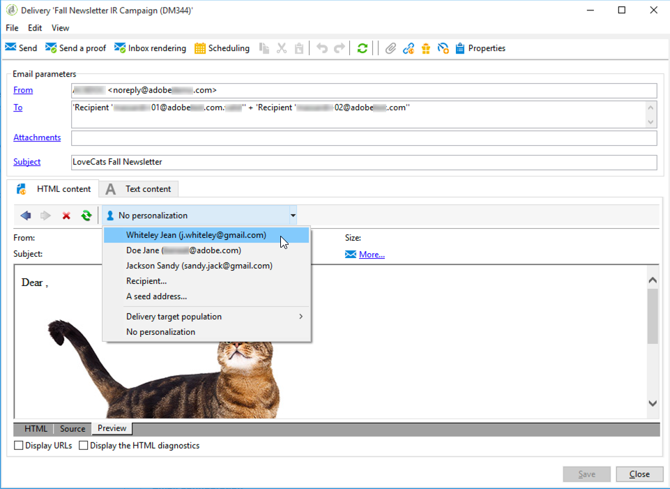

# SpamAssassin{#spamassassin}

Adobe Campaign se puede configurar para que funcione con [SpamAssassin](https://spamassassin.apache.org){target="_blank"}, un servicio de terceros que se utiliza para el filtrado masivo de correo no deseado. Esto le permite puntuar correos electrónicos para determinar si un mensaje corre el riesgo de que las herramientas de filtrado de correo no deseado utilizadas durante la recepción lo consideren como no deseado.

SpamAssassin aprovecha diversas técnicas de detección de correo no deseado para ahorrar tiempo, entre las que se incluyen:

* Detección de correo no deseado basado en DNS y en suma de comprobación incorrecta
* Filtrado bayesiano
* Programas externos
* Listas de bloqueados
* Bases de datos en línea

>[!NOTE]
>
>SpamAssassin debe instalarse y configurarse en el servidor de aplicaciones de Adobe Campaign. Para obtener más información, póngase en contacto con su representante de Adobe.
>
>Las reglas que rigen si un elemento es correo no deseado o no se administran mediante SpamAssassin y un administrador con privilegios puede editarlas.

## Uso de SpamAssassin en Campaign {#using-spamassassin}

Una vez que haya creado su envío de correo electrónico y haya definido su contenido, siga los pasos a continuación para evaluar los riesgos.

Para obtener más información sobre la creación y configuración de los servicios de información, consulte [esta sección](defining-the-email-content.md).

1. Vaya a la pestaña **[!UICONTROL Preview]**.
1. Seleccione un destinatario para obtener una previsualización de la entrega.

   

   >[!NOTE]
   >
   >Si no selecciona ningún destinatario, no se puede realizar la comprobación de correo no deseado.

1. Un mensaje de advertencia le muestra el resultado de la prueba. Si se detecta un alto nivel de riesgo, se muestra el siguiente mensaje de advertencia:

   

1. Haga clic en el vínculo **[!UICONTROL More...]** situado junto a la advertencia.
1. Seleccione la pestaña **[!UICONTROL Anti-spam checking]** .
1. Vaya a la sección **[!UICONTROL Points / Rule / Description]** para ver las causas de este riesgo.

   

>[!NOTE]
>
>Cada vez que hace clic en **[!UICONTROL Anti-spam checking]**, se llama al servicio SpamAssassin y se vuelve a analizar la detección del mensaje como correo no deseado. Compruebe que ha modificado el contenido antes de volver a ejecutar el análisis de correo no deseado.
