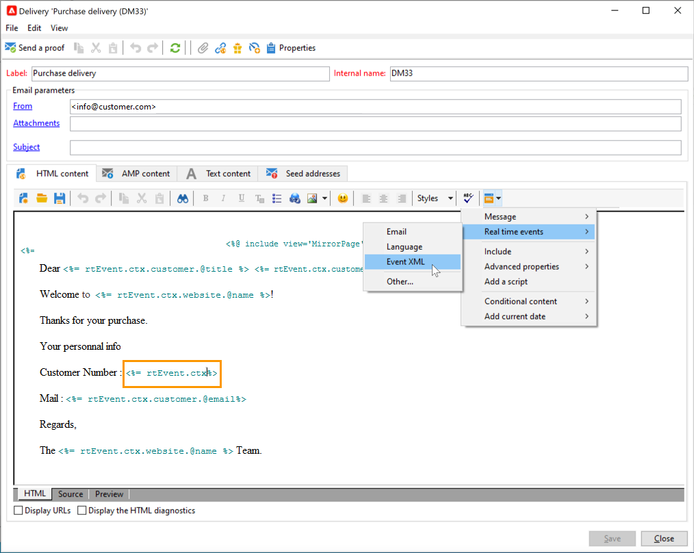
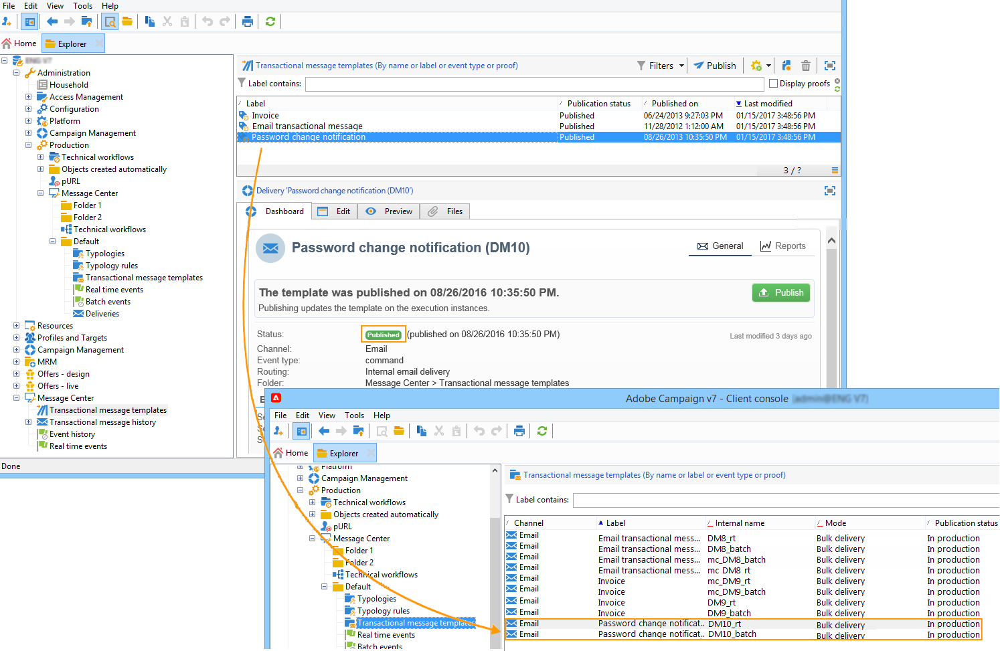

# Crear y publicar una plantilla para la mensajería transaccional{#template-transactional-messages}

Cada evento puede almacenar en déclencheur un mensaje personalizado. Para que esto suceda, debe crear una plantilla de mensaje para que coincida con cada tipo de evento. Las plantillas contienen la información necesaria para personalizar el mensaje transaccional. También puede utilizar plantillas para probar la vista previa del mensaje y enviar pruebas utilizando las direcciones semilla antes de enviar al destinatario final.

## Creación de la plantilla{#create-message-template}

Para crear una plantilla de mensaje, siga los pasos a continuación:

1. Vaya a la carpeta **[!UICONTROL Message Center >Transactional message templates]** en el árbol de Adobe Campaign.
1. En la lista de las plantillas de mensajes transaccionales, haga clic con el botón derecho y seleccione **[!UICONTROL New]** en el menú desplegable o haga clic en el botón **[!UICONTROL New]** situado sobre la lista de las plantillas de mensajes transaccionales.

   

1. En la ventana de envío, seleccione la plantilla de envío adecuada para el canal que desee utilizar.

   

1. Cambie la etiqueta si es necesario.
1. Seleccione el tipo de evento que coincida con el mensaje que desea enviar. Los tipos de eventos que Adobe Campaign va a procesar deben crearse de antemano. [Más información](#create-event-types)

   

   >[!CAUTION]
   >
   >Evite relacionar un tipo de evento a más de una plantilla.

1. Escriba una característica y una descripción y, a continuación, haga clic en **[!UICONTROL Continue]** para crear el cuerpo del mensaje.

## Creación del contenido{#create-message-content}

La definición del contenido del mensaje transaccional es la misma que para todas las entregas en Adobe Campaign. Por ejemplo, para una entrega de correo electrónico, puede crear contenido en formato HTML o texto, añadir archivos adjuntos o personalizar el objeto de envío. [Más información](../start/create-message.md).

>[!CAUTION]
>
>Las imágenes incluidas en el mensaje deben ser de fácil acceso público. Adobe Campaign no proporciona ningún mecanismo de carga de imágenes para los mensajes transaccionales.\
>A diferencia de JSSP o webApp, `<%=` no tiene ningún escape predeterminado.
>
>Debe omitir correctamente todos los datos procedentes del evento. Esta omisión depende de cómo se utilice este campo. Por ejemplo, dentro de una URL, utilice encodeURIComponent. Para mostrar en HTML, puede utilizar escapeXMLString.

Una vez definido el contenido del mensaje, puede integrar la información del evento en el cuerpo del mensaje y personalizarlo. La información del evento se inserta en el cuerpo del texto gracias a las etiquetas de personalización.

* Todos los campos de personalización proceden de la carga útil.
* Es posible hacer referencia a uno o varios bloques de personalización en un mensaje transaccional. <!--The block content will be added to the delivery content during the publication to the execution instance.-->

Para insertar etiquetas de personalización en el cuerpo de un mensaje de correo electrónico, aplique los siguientes pasos:

1. En la plantilla de mensaje, haga clic en la pestaña que coincida con el formato de correo electrónico (HTML o texto).
1. Introduzca el cuerpo del mensaje.
1. En el cuerpo del texto, inserte la etiqueta utilizando los menús **[!UICONTROL Real time events>Event XML]**.

   

1. Complete la etiqueta con la siguiente sintaxis: **element name**.@**attribute name** como se muestra a continuación.

   

## Prueba de la plantilla de mensaje transaccional {#test-message-template}

### Adición de direcciones semilla{#add-seeds}

Una dirección semilla permite mostrar una previsualización del mensaje, enviar una prueba y probar la personalización del mensaje antes de enviarlo. Las direcciones semilla están vinculadas a la entrega y no se pueden utilizar para otros envíos.

1. En la plantilla de mensaje transaccional, haga clic en la pestaña **[!UICONTROL Seed addresses]** y, a continuación, haga clic en el botón **[!UICONTROL Add]**.

   

1. Asigne una etiqueta para facilitar la selección posterior e introduzca la dirección semilla (correo electrónico o teléfono móvil según el canal de comunicación).

1. Introduzca el identificador externo: este campo opcional permite introducir una clave comercial (ID única, nombre + correo electrónico, etc.) que es común a todas las aplicaciones del sitio web y es utilizada para identificar los perfiles. Si este campo también está presente en la base de datos de marketing de Adobe Campaign, puede reconciliar un evento con un perfil de la base de datos.

   

1. Insertar datos de prueba. Consulte [esta sección](#personalization-data).

   

1. Haga clic en **[!UICONTROL Ok]** para confirmar la creación de la dirección semilla.

1. Repita el proceso para crear todas las direcciones que sean necesarias.

   

Una vez creadas las direcciones, puede acceder a su vista previa y personalización.

<!--

### Add personalization data{#personalization-data}

You can add data in the message template to test transactional message personalization. This will allow you to generate a preview or send a proof. If you install the **Deliverability** module, this data allows you to display a rendering of the messages for various desktop, web or mobile clients.

The purpose of this data is to test your messages before their final delivery. These messages do not coincide with actual data to be processed by Message Center.

However, the XML structure must be identical to that of the event stored in the execution instance, as shown below. 

This information enables you to personalize message content using personalization tags.

1. In the message template, click the **[!UICONTROL Seed addresses]** tab.
1. In the event content, enter the test information in XML format.

   
-->

### Previsualización del mensaje transaccional{#transactional-message-preview}

Una vez que haya creado una o varias direcciones semilla y el cuerpo del mensaje, puede obtener una previsualización del mensaje y comprobar su personalización.

1. En la plantilla del mensaje, haga clic en la ficha **[!UICONTROL Preview]** y, a continuación, seleccione **[!UICONTROL A seed address]** en la lista desplegable.

   

1. Seleccione la dirección semilla creada anteriormente para mostrar el mensaje personalizado.

   

### Envío de una prueba {#send-proof}

Puede probar la entrega de mensajes enviando una prueba a una dirección semilla creada anteriormente.

El envío de una prueba implica realizar el mismo proceso que para cualquier entrega.

Obtenga más información acerca de las revisiones en [esta sección](../send/preview-and-proof.md#proofs-send).

Sin embargo, para enviar una prueba de un mensaje transaccional, debe realizar las siguientes operaciones:

* Cree una o más [direcciones semilla](#add-seeds) con datos de prueba de personalización
* Creación del contenido del mensaje

Para enviar la prueba:

1. Haga clic en el botón **[!UICONTROL Send a proof]** de la ventana envío.
1. Analice la entrega.
1. Corrija los errores y confirme la entrega.

   

1. Compruebe que el mensaje se haya enviado a la dirección semilla y que su contenido cumpla con su configuración.

   

Se puede acceder a las pruebas en cada plantilla a través de la pestaña **[!UICONTROL Audit]**.

#### Transición desde [!DNL Campaign Classic] v7 {#transition-from-v7}

Si está [realizando la transición desde Campaign Classic v7](../start/v7-to-v8.md), todas las entregas pasan al servidor intermediario.

Sin embargo, al crear una plantilla de mensaje transaccional, el enrutamiento necesario para que la plantilla se utilice correctamente es **envío de correo electrónico interno**. Este enrutamiento evita que envíe pruebas.

Por lo tanto, para enviar una prueba para la plantilla de mensaje transaccional, debe cambiar el enrutamiento de envío de correo electrónico interno a **cuenta de enrutamiento intermediaria**.

Una vez enviadas las pruebas, debe cambiar el enrutamiento de nuevo a envío de correo electrónico interno antes de publicar la plantilla de mensaje transaccional.

## Publish la plantilla {#publish-message-template}

Cuando la plantilla de mensaje creada<!-- on the control instance--> esté completa, puede publicarla, lo que le permitirá enviar mensajes vinculados a los eventos en tiempo real y por lotes.

<!--This process will also publish it on all execution instances.

NOTE: When publishing transactional message templates, typology rules are also automatically published on the execution instances.

Publication lets you automatically create two message templates on the execution instances, which will allow you to send messages linked to real-time and batch events.-->

>[!CAUTION]
>
>Siempre que realice cambios en una plantilla, asegúrese de publicarla de nuevo para que estos cambios sean efectivos durante el envío del mensaje transaccional.

1. Vaya a la carpeta **[!UICONTROL Message Center > Transactional message templates]** del árbol.
1. Seleccione la plantilla que desea publicar<!--on your execution instances-->.
1. Haga clic en **[!UICONTROL Publish]**.

   

Una vez terminada la publicación, las dos plantillas de mensaje que se aplican a los eventos de tipo por lotes y en tiempo real se crean en la carpeta **[!UICONTROL Administration > Production > Message Center Execution> Default > Transactional message templates]**.

Una vez publicada una plantilla, si se activa el evento correspondiente, Adobe Campaign<!--execution instance--> recibirá el evento, lo vinculará a la plantilla transaccional y enviará el mensaje transaccional correspondiente a cada destinatario.

<!--
>[!NOTE]
>
>If you replace an existing field of the transactional message template, such as the sender address, with an empty value, the corresponding field on the execution instance(s) will not be updated once the transactional message is published again. It will still contain the previous value.
>
>However, if you add a non-empty value, the corresponding field will be updated as usual after the next publication.
-->

## Cancelar la publicación de una plantilla

Una vez publicada una plantilla de mensaje <!--on the execution instances-->, se puede cancelar su publicación.

* De hecho, se puede seguir llamando a una plantilla publicada si se activa el evento correspondiente: si ya no utiliza una plantilla de mensaje, se recomienda cancelar la publicación. Esto es para evitar enviar un mensaje transaccional no deseado por error.

  Por ejemplo, ha publicado una plantilla de mensaje que solo utiliza para campañas de Navidad. Tal vez quiera cancelar la publicación después de que termine el período de Navidad y publicarla nuevamente el año que viene.

* Tampoco puede eliminar una plantilla de mensaje transaccional que tenga el estado **[!UICONTROL Published]**. Primero debe cancelar la publicación.

Para cancelar la publicación de una plantilla de mensaje transaccional, siga los pasos a continuación.

1. Examine la carpeta **[!UICONTROL Message Center > Transactional message templates]**.
1. Seleccione la plantilla para cancelar la publicación.
1. Haga clic **[!UICONTROL Unpublish]**.
1. Haga clic **[!UICONTROL Start]**.

El estado de la plantilla de mensaje transaccional cambia de **[!UICONTROL Published]** a **[!UICONTROL Being edited]**.

Una vez finalizada la cancelación de la publicación:

* Ambas plantillas de mensaje (aplicadas a eventos de tipo por lotes y en tiempo real) se eliminaron<!-- from each execution instance-->.

  Ya no aparecen en la carpeta **[!UICONTROL Administration > Production > Message Center Execution > Default > Transactional message templates]**.

* Una vez cancelada la publicación de una plantilla, puede eliminarla<!-- from the control instance-->.

  Para ello, selecciónela en la lista y haga clic en el botón **[!UICONTROL Delete]** situado en la parte superior derecha de la pantalla.
