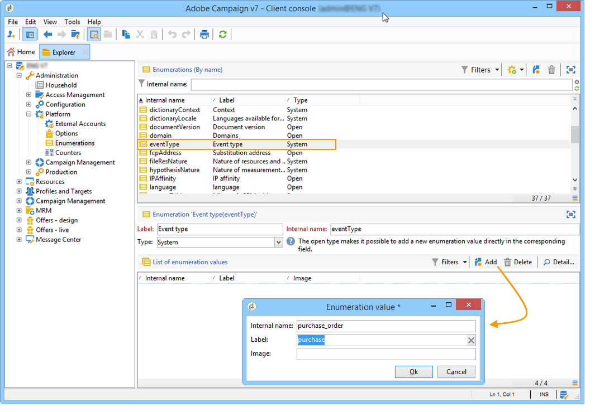

# Introducción a la mensajería transaccional{#send-transactional-messages}

La mensajería transaccional (Centro de Mensajes) es un módulo de Campaign diseñado para gestionar mensajes de activación. Estas notificaciones se generan a partir de eventos activados desde sistemas de información y pueden ser: factura, confirmación de pedido, confirmación de envío, cambio de contraseña, notificación de no disponibilidad del producto, extracto de cuenta, creación de cuenta en el sitio web, etc.

>[!NOTE]
>
>Como usuario de Cloud Services administrados, [póngase en contacto con Adobe](../start/campaign-faq.md#support){target="_blank"} para configurar la mensajería transaccional de Campaign en su entorno.

Los mensajes transaccionales se utilizan para enviar:

* notificaciones, como confirmaciones de pedidos o restablecimientos de contraseña, por ejemplo
* una respuesta individual en tiempo real a una acción del cliente
* contenido no promocional

La configuración de la mensajería transaccional se detalla en [esta sección](../config/transactional-msg-settings.md).

Comprender la arquitectura de mensajería transaccional en [esta página](../architecture/architecture.md#transac-msg-archi).

## Principio operativo de mensajería transaccional {#transactional-messaging-operating-principle}

El módulo de Mensajería transaccional de Adobe Campaign está integrado en un sistema de información que devuelve eventos que se deben modificar en mensajes transaccionales personalizados. Estos mensajes se pueden enviar por separado o en serie por correo electrónico, SMS o notificaciones push.

Por ejemplo, imaginemos que es una compañía con un sitio web en el que los clientes pueden comprar productos.

Adobe Campaign le permite enviar un correo electrónico de notificación a los clientes que han añadido productos al carro de compras. Cuando uno de ellos abandona el sitio web sin finalizar sus compras (evento externo que activa un evento de Campaign), se les envía automáticamente un correo electrónico de abandono del carro de compras (entrega de mensaje transaccional).

Los pasos principales para ponerlo en práctica se detallan a continuación:

1. [Cree un tipo de evento](#create-event-types).
1. [Cree y diseñe la plantilla de mensaje](transactional-template.md#create-message-template). Debe vincular un evento al mensaje durante este paso.
1. [Pruebe el mensaje](transactional-template.md#test-message-template).
1. [Publique la plantilla de mensaje](transactional-template.md#publish-message-template).

Una vez que haya diseñado y publicado la plantilla de mensaje transaccional, si se activa un evento correspondiente, los datos relevantes se envían a Campaign mediante los [métodos SOAP](../send/event-description.md) PushEvent y PushEvents, y la entrega se realiza a los destinatarios objetivo.

## Creación de tipos de eventos {#create-event-types}

Para asegurarse de que cada evento se pueda cambiar a un mensaje personalizado, primero debe crear **tipos de eventos**.

Al [crear una plantilla de mensaje](#create-message-template), debe seleccionar el tipo de evento que coincida con el mensaje que desea enviar.

>[!CAUTION]
>
>Debe crear tipos de eventos antes de poder utilizarlos en plantillas de mensajes.

Para crear tipos de eventos que Adobe Campaign procesará, siga los pasos a continuación:

1. Vaya a la carpeta **[!UICONTROL Administration > Platform > Enumerations]** del explorador de Campaign.
1. Seleccione la enumeración **[!UICONTROL Event type]** de la lista.
1. Haga clic en **[!UICONTROL Add]** para crear un valor de enumeración. Puede ser una confirmación de pedido, cambio de contraseña o de envío de pedido, etc.

   

   >[!CAUTION]
   >
   >Cada tipo de evento coincide con un valor de enumeración **[!UICONTROL Event type]**.

1. Una vez que se hayan creado los valores de la lista desglosada, cierre la sesión y vuelva a la instancia para que la creación sea eficaz.

>[!NOTE]
>
>Más información sobre [enumeraciones](../config/enumerations.md).

Para el siguiente paso, aprende a [crear y publicar tu plantilla para mensajes transaccionales](transactional-template.md).
