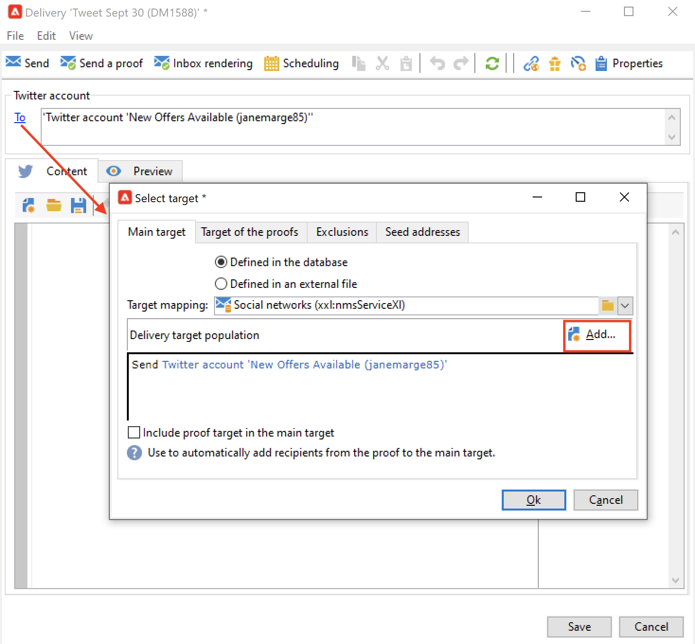

# Publicación de mensajes en el Twitter con Adobe Campaign {#post-tw-messages}

Adobe Campaign incluye un **Marketing social** módulo que le permite interactuar con sus clientes y clientes potenciales mediante el Twitter.

Una vez configurada la integración, puede:

* Envíe mensajes directos a sus seguidores
* Publica tweets en tu cuenta de Twitter
* Recopile nuevos contactos mediante la recuperación de los datos de perfil, lo que le permite llevar a cabo campañas de objetivos y, cuando sea posible, implementar estrategias multicanal. Esta acción requiere el consentimiento del usuario.

Los pasos de configuración para integrar su cuenta de Twitter con Adobe Campaign se describen en [esta página](../connect/ac-tw.md).

## Creación y publicación de una publicación de Twitter {#publish-on-tw}

Siga los pasos a continuación para publicar un mensaje en su cuenta de Twitter:

1. Creación de una entrega de Twitter

   Cree una nueva entrega basada en la plantilla de envíos de **[!UICONTROL Tweet (twitter)]**.

   

1. Selección del objetivo principal

   Seleccione las cuentas a las que desee enviar tuits.

   

   1. Haga clic en el vínculo **[!UICONTROL To]**.
   1. Haga clic en el botón **[!UICONTROL Add]**.
   1. Seleccione **[!UICONTROL A Twitter account]**.
   1. En el campo **[!UICONTROL Folder]**, seleccione la carpeta de servicio que contiene la cuenta de Twitter. A continuación, seleccione la cuenta de Twitter a la que desee enviar el tuit.

1. Selección del destino de la prueba

   La pestaña **[!UICONTROL Target of the proofs]** le permite definir la cuenta de Twitter que se utiliza para las entregas de prueba antes de la entrega final.

   Como se detalla en la [pasos de configuración](../connect/ac-tw.md#tw-test-account), debe crear una cuenta privada de Twitter de prueba específica para la entrega de pruebas.

   >[!NOTE]
   >
   >Si utiliza la misma cuenta de prueba de Twitter para todas las entregas, puede guardar el objetivo de prueba en la plantilla de entrega de **[!UICONTROL Tweet]**, a la que se accede mediante el nodo **[!UICONTROL Resources > Templates > Delivery templates]**. El objetivo de la prueba se especifica de forma predeterminada para cada nueva entrega.

1. Defina el contenido de su publicación

   Introduzca el contenido de la publicación en **[!UICONTROL Content]** pestaña.

   

   >[!CAUTION]
   >
   >Al publicar en el Twitter, se aplican las siguientes limitaciones:
   >
   >* El mensaje no puede superar los 140 caracteres.
   >* No se admite el formato de HTML.
   >

1. Previsualice la publicación

   Examine la **[!UICONTROL Preview]** para comprobar la renderización de la publicación.

   

   1. Seleccione la pestaña **[!UICONTROL Preview]**.
   1. Haga clic en el menú desplegable **[!UICONTROL Test personalization]** y seleccione **[!UICONTROL Service]**.
   1. En el campo **[!UICONTROL Folder]**, seleccione la carpeta de servicio que contiene su cuenta de Twitter.

1. Envío de una prueba

   Antes de publicar el tweet, asegúrese de validarlo enviando una prueba de su publicación: a continuación, puede obtener una representación exacta de la publicación en una página de prueba de Twitter privado.

1. Publicar el mensaje

   1. Una vez aprobado el contenido, haga clic en el botón **[!UICONTROL Send]**.
   1. Seleccione **[!UICONTROL Deliver as soon as possible]** y haga clic en el botón **[!UICONTROL Analyze]**.
   1. Una vez finalizado el análisis, compruebe el resultado.
   1. Haga clic en **[!UICONTROL Confirm delivery]**, luego en **[!UICONTROL Yes]**.

## Envío de mensajes directos a los seguidores {#direct-tw-messages}

El **[!UICONTROL Synchronize Twitter accounts]** flujo de trabajo técnico recupera la lista de seguidores de Twitter para que pueda enviarles mensajes directos. [Más información](../connect/ac-tw.md#synchro-tw-accounts)

Para enviar mensajes directos a sus seguidores, siga los pasos a continuación:

1. Cree una entrega de Twitter basado en la variable **[!UICONTROL Tweet (Direct Message)]** plantilla de envíos integrada.

1. Selección del objetivo principal

   

   1. Seleccione el **[!UICONTROL To]** y el vínculo **[!UICONTROL Add]** botón.

   1. Elija un tipo de objetivo

      * Seleccionar **[!UICONTROL Twitter subscribers]** para enviar un mensaje directo a todos sus seguidores.

      * Seleccione **[!UICONTROL Filter conditions]** para definir una consulta y ver su resultado. Obtenga información sobre cómo crear un filtro en [esta sección](../audiences/create-filters.md#advanced-filters).

1. Seleccione el objetivo de la prueba en **[!UICONTROL Target of the proofs]** pestaña: esta cuenta recibe la prueba del mensaje directo.

   Como se detalla en la [pasos de configuración](../connect/ac-tw.md#tw-test-account), debe crear una cuenta privada de Twitter de prueba específica para la entrega de pruebas.

   >[!NOTE]
   >
   >Si desea enviar todas las pruebas de los mensajes directos a la misma cuenta de Twitter, puede guardar el objetivo de prueba en la **[!UICONTROL Tweet (Direct Message)]** plantilla de envíos, a la que se accede mediante **[!UICONTROL Resources > Templates > Delivery templates]** nodo.

1. Introduzca el contenido del mensaje en la **[!UICONTROL Content]** pestaña.

   

   Los campos de personalización se pueden usar del mismo modo que para los envíos por correo electrónico, por ejemplo, para agregar el nombre del seguidor en el cuerpo del mensaje. Obtenga más información en [esta sección](../send/personalize.md).

1. Previsualice el mensaje

   Examine la **[!UICONTROL Preview]** para comprobar la renderización de la publicación.

   

   1. Seleccione la pestaña **[!UICONTROL Preview]**.
   1. Haga clic en el menú desplegable **[!UICONTROL Test personalization]** y seleccione **[!UICONTROL Visitor Subscription]**.
   1. Elija una cuenta de Twitter con la que desee probar la vista previa.

1. Envío de una prueba

   Antes de enviar el mensaje, asegúrese de validarlo haciendo lo siguiente [envío de una prueba a una cuenta de prueba](../send/preview-and-proof.md): a continuación, puede obtener una renderización exacta del mensaje en una cuenta de Twitter privada y comprobar el contenido y la personalización.

1. Envío del mensaje directo

   1. Una vez aprobado el contenido, haga clic en el botón **[!UICONTROL Send]**.
   1. Seleccione **[!UICONTROL Deliver as soon as possible]** y haga clic en el botón **[!UICONTROL Analyze]**.
   1. Una vez finalizado el análisis, compruebe el resultado.
   1. Haga clic en **[!UICONTROL Confirm delivery]**, luego en **[!UICONTROL Yes]**.

>[!CAUTION]
>
>No puede enviar más de 250 mensajes directos al día. Para evitar superar este umbral, puede realizar envíos en olas. Para obtener más información, consulte la [documentación de Campaign Classic v7](https://experienceleague.adobe.com/docs/campaign-classic/using/sending-messages/key-steps-when-creating-a-delivery/steps-sending-the-delivery.html#sending-using-multiple-waves){target="_blank"}.

## Acceso a datos de seguimiento {#tw-tracking}

En el complemento integrado **[!UICONTROL Tweet]** plantilla de envío, el seguimiento está habilitado de forma predeterminada.

Los datos de seguimiento pueden verse en los informes de envío y en la **[!UICONTROL Edit > Tracking]** de la entrega y el servicio.

La configuración de seguimiento es la misma que para una entrega de correo electrónico. Obtenga más información en la [documentación de Campaign Classic v7](https://experienceleague.adobe.com/docs/campaign-classic/using/sending-messages/monitoring-deliveries/about-delivery-monitoring.html?lang=es){target="_blank"}.

