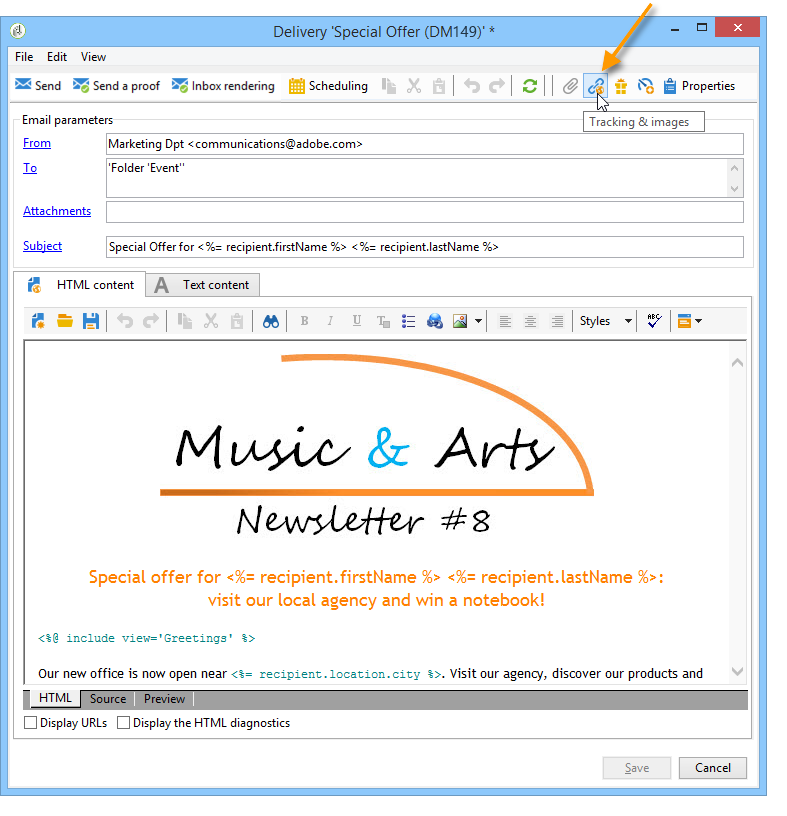

# Configuración de las opciones de seguimiento de URL {#personalizing-url-tracking}

Es posible acceder a la configuración avanzada de seguimiento de mensajes mediante el icono **[!UICONTROL Tracking & Images]** de la barra de herramientas del asistente de envíos.

>[!NOTE]
>
>La administración de imágenes en correos electrónicos también se configura en esta ventana. Consulte [Adición de imágenes](defining-the-email-content.md#adding-images).

Puede configurar las opciones de seguimiento:

* Activación/Desactivación del seguimiento de URL para todos los mensajes.

  >[!CAUTION]
  >
  >Cuando el seguimiento no está activado en una entrega (es decir, la opción **[!UICONTROL Activate tracking]** no está seleccionada), los informes y los datos relacionados con el seguimiento no están disponibles: se abre, los informes de clics activos y URL seguidos no mostrarán ningún dato, y **[!UICONTROL Tracking logs]** no se mostrarán para esta entrega.

* Activación/Desactivación del seguimiento de las aperturas de mensaje.

Las direcciones URL rastreadas se enumeran en la ventana central del formulario de árbol.

Puede activar o desactivar el seguimiento individualmente para cada dirección URL del mensaje. Para obtener más información, consulte [esta sección](tracked-links.md).

La pestaña **[!UICONTROL Advanced]** permite personalizar las fórmulas de cálculo de las direcciones URL y apertura de la URL.

>[!CAUTION]
>
>Los usuarios expertos pueden modificar la configuración de esta pestaña.

