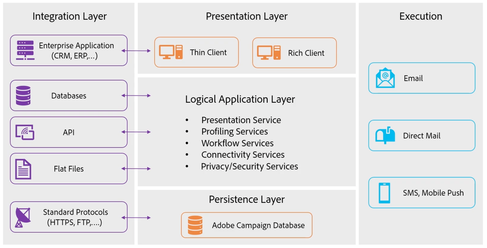

# Explicación de los procesos y componentes de Campaign {#components-and-processes}

Adobe Campaign es una solución de marketing en canales múltiples que automatiza las campañas de correo electrónico, móviles, sociales y sin conexión. Adobe Campaign proporciona un lugar central para acceder a los datos y perfiles de sus clientes. Utilice Adobe Campaign para organizar experiencias coherentes para sus clientes, diseñar, ejecutar y personalizar su marketing en todos los canales, a la vez que mejora las experiencias de los clientes en cada dispositivo y punto de contacto. Con Adobe Campaign, puede administrar varias fuentes de datos, definir segmentos de audiencia y planificar y ejecutar campañas multicanal de varios pasos mediante una interfaz de flujo de trabajo visual de arrastrar y soltar.

Obtenga más información sobre las funcionalidades clave de Campaign en [esta página](../start/get-started.md).

## Componentes de campaña {#ac-components}

A continuación se describen los componentes de Adobe Campaign y la arquitectura global.

### Capa de presentación{#presentation-layer}

Puede acceder a Adobe Campaign a través de un cliente enriquecido, un cliente ligero o una integración de API.

* Cliente enriquecido

   El cliente enriquecido de Campaign es una aplicación nativa que se comunica con el servidor de aplicaciones de Adobe Campaign a través de protocolos de Internet estándar, como SOAP y HTTP.

   La consola del cliente de Campaign centraliza todas las capacidades y configuraciones, y requiere un ancho de banda mínimo, ya que depende de una caché local. Diseñada para una implementación sencilla, la consola del cliente de Campaign se puede implementar desde un explorador de Internet, se puede actualizar automáticamente y no requiere ninguna configuración de red específica, ya que solo genera tráfico HTTP(S).

    [Obtenga más información sobre la consola del cliente de Campaign](../start/connect.md).

* Cliente ligero

   Las funciones de acceso web de Adobe Campaign le permiten acceder a un subconjunto de funciones de Campaign con un explorador web mediante la interfaz de usuario del HTML. Utilice esta interfaz web para acceder a informes, controlar y validar mensajes, acceder a tableros de monitorización y mucho más.

    [Obtenga más información acerca de Campaign Web Access](../start/connect.md).

* Aplicaciones externas con API

   En algunos casos, se puede llamar al sistema desde aplicaciones externas mediante las API de servicios web expuestas mediante el protocolo SOAP.

    [Obtenga más información sobre las API de Campaign](../dev/api.md).

### Capa de persistencia{#persistance-layer}

Las bases de datos de Campaign se utilizan como capas de persistencia y contienen casi toda la información y los datos administrados por Adobe Campaign. Esto incluye: datos funcionales, como perfiles, suscripciones, contenido; datos técnicos, como trabajos de envío y registros, registros de seguimiento; y datos de trabajo (compras, posibles clientes).

La fiabilidad de la base de datos es de suma importancia, ya que la mayoría de los componentes de Adobe Campaign necesitan acceder a la base de datos para realizar sus tareas (excepto el módulo de redirección).

### Capa de aplicación lógica{#logical-app-layer}

La capa de aplicación lógica de campaña es fácilmente configurable para satisfacer complejas necesidades comerciales. Puede utilizar Campaign como plataforma única con diferentes aplicaciones que se combinan para crear una arquitectura abierta y escalable. Cada instancia de Campaign es una colección de procesos en la capa de la aplicación, algunos de los cuales se comparten y otros están dedicados.

## Managed Services de campaña{#ac-managed-services}

Adobe Campaign v8 está implementado as a Managed Service: todos los componentes de Adobe Campaign, incluida la interfaz de usuario, el motor de administración de ejecución y las bases de datos de Campaign, están totalmente alojados por Adobe, incluida la ejecución de correo electrónico, las páginas espejo, el servidor de seguimiento y los componentes web externos, como la cancelación de la suscripción al centro de páginas/preferencias y las páginas de aterrizaje.

## Procesos de campaña

El servidor web de Campaign controla el acceso a los procesos web de Campaign. Javascript es el lenguaje del lado del servidor que se utiliza para las características principales del producto y la personalización. Tomcat es el motor back-end y está incrustado en el producto de Campaign como parte del proceso web. Javascript se utiliza, por ejemplo, en páginas JSP o JSSP para procesar contenido dinámico.

La consola del cliente de Campaign se conecta al servidor web mediante SOAP XML a través de HTTP. El servidor web proporciona la capa de seguridad, pasa las solicitudes a la capa de aplicación mediante Javascript y el acceso a los procesos internos de Campaign a la base de datos mediante SQL.

La comunicación general entre los procesos de Campaign se describe en el siguiente diagrama de implementación independiente: todos los componentes de Campaign están instalados en el mismo equipo.

El usuario se conecta al servidor de aplicaciones de Campaign mediante el HTTP. Todos los datos y la información se administran en la base de datos de Campaign. Si un desarrollador de Campaign realiza cualquier cambio de configuración, este se captura en la base de datos. Si un especialista en marketing crea una nueva campaña, toda la información y los datos relacionados con esta nueva campaña también se administran en la base de datos. Cuando un especialista en marketing ejecuta una campaña, las entregas por correo electrónico se envían a perfiles desde el servidor de Campaign a través del servidor SMTP. A medida que los perfiles interactúan con los envíos de correo electrónico, como abrir el correo electrónico, esos datos de seguimiento se envían de nuevo al servidor de seguimiento.

 [Descubra más información sobre los procesos de Campaign](../architecture/general-architecture.md#dev-env).
