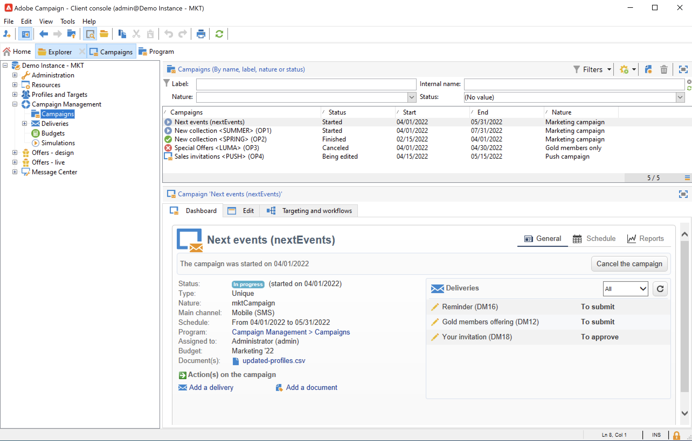

# Interfaz de usuario de Discover Campaign

## Acceso a IU de Campaign{#ui-access}

El espacio de trabajo de Campaign está disponible a través de la [consola del cliente](../architecture/general-architecture.md).

Obtenga información sobre cómo instalar y configurar la consola del cliente de Campaign en [esta sección](../start/connect.md).

También puede utilizar un explorador web para acceder a Campaign. En este contexto, solo está disponible un subconjunto de las funcionalidades de Campaign. [Más información](#web-browser)

## Exploración de la IU{#ui-browse}

Una vez que esté conectado a Campaign, accede a la página principal. Examine los vínculos para acceder a las funcionalidades de. El conjunto de funcionalidades disponibles en la IU depende de las opciones y permisos.

Desde la sección central de la página principal, utilice vínculos para acceder a los materiales de ayuda de Campaign, a la comunidad y al sitio web de asistencia.

Utilice las pestañas de la sección superior para examinar las funciones clave de Campaign:

>[!NOTE]
>
>La lista de funciones principales a las que puede acceder depende de los permisos y de la implementación.

Para cada capacidad, puede acceder al conjunto de funciones clave de la **[!UICONTROL Browsing]** sección. El **[!UICONTROL More]** El vínculo le permite acceder a todos los demás componentes.

Por ejemplo, al navegar a **[!UICONTROL Profiles and targets]** , puede acceder a las listas de destinatarios, los servicios de suscripción, los flujos de trabajo de objetivos existentes y los accesos directos para crear todos estos componentes.

Al seleccionar un elemento en la pantalla, se carga en una nueva pestaña para que pueda examinar fácilmente el contenido.

## Creación de un elemento {#create-an-element}

Utilice métodos abreviados en la **[!UICONTROL Create]** en la parte izquierda de la pantalla para añadir nuevos elementos. También puede utilizar la variable **[!UICONTROL Create]** situado sobre la lista para añadir nuevos elementos a la lista actual.

Por ejemplo, en la página de entrega, utilice el botón **[!UICONTROL Create]** para crear una nueva entrega.

## Uso de un explorador web {#web-browser}

También puede acceder a un subconjunto de las funcionalidades de Campaign a través de un explorador web.

La interfaz de acceso web es similar a la interfaz de la consola. Desde un explorador, puede utilizar las mismas funciones de navegación y visualización que en la consola, pero solo puede realizar un conjunto reducido de acciones en las campañas. Por ejemplo, puede ver y cancelar campañas, pero no puede modificarlas.

 [Obtenga más información sobre el acceso web de Campaign](../start/connect.md#web-access).

## Acceso al explorador de Campaign {#ac-explorer-ui}

Examine el explorador de Campaign para acceder a todas las funcionalidades y configuraciones de Adobe Campaign.

Esta área de trabajo permite acceder al árbol del Explorador para examinar todas las funciones y opciones.

* La sección izquierda muestra el árbol del explorador de Campaign y le permite examinar todos los componentes y la configuración de la instancia en función de sus permisos. Puede añadir y personalizar carpetas como se explica en [esta página](../audiences/folders-and-views.md).

* La sección superior muestra la lista de registros de la carpeta actual. Estas listas son totalmente personalizables. [Más información](../config/ui-settings.md)

* La sección inferior muestra los detalles del registro seleccionado.

## Idiomas{#languages}

La interfaz de usuario de Campaign v8 está disponible en los siguientes idiomas:

* Inglés (RU)
* Inglés (EE. UU.)
* Francés
* Alemán
* Japonés

El idioma se selecciona durante el proceso de instalación.

>[!CAUTION]
>
>No se puede cambiar el idioma después de la creación de la instancia.

El idioma afecta a los formatos de fecha y hora.

Las principales diferencias entre el inglés de EE. UU. y el inglés de Reino Unido son:

<table> 
 <thead> 
  <tr> 
   <th> Formato  </th> 
   <th> Inglés (EE. UU.)  </th> 
   <th> Inglés (EN)  </th> 
  </tr> 
 </thead> 
 <tbody> 
  <tr> 
   <td> Fecha  </td> 
   <td> La semana empieza el domingo  </td> 
   <td> La semana empieza el lunes  </td> 
  </tr> 
  <tr> 
   <td> Fecha corta  </td> 
   <td> 
%2M%2D/%4Y

<strong>ex: 25/09/2018</strong>
 </td> 
   <td> 
%2D/%2M/%4Y

<strong>ex: 25/09/2018</strong>
 </td> 
  </tr> 
  <tr> 
   <td> Fecha corta con hora  </td> 
   <td> 
%2M/%2D/%4Y %I:%2N:%2S %P

<strong>ex: 09/25/2018 10:47:25 PM</strong>
 </td> 
   <td> 
%2D/%2M/%4Y %2H:%2N:%2S

<strong>ex: 25/09/2018 22:47:25</strong>
 </td> 
  </tr> 
 </tbody> 
</table>
