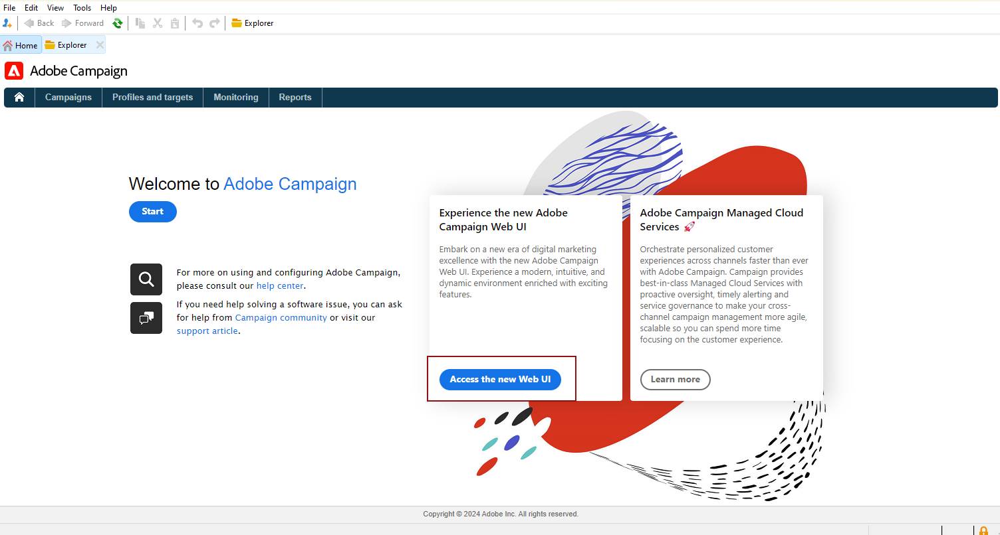

# Descubrimiento de la interfaz de usuario {#ui-client-console}

Puede acceder a Adobe Campaign a través de su consola de cliente o de su interfaz de usuario web. También puede utilizar las API para administrar datos y realizar tareas en la plataforma de Campaign.

* **Consola de cliente**: la consola de cliente de Campaign es una aplicación nativa que se comunica con el servidor de aplicaciones de Adobe Campaign a través de protocolos de internet estándar, como SOAP y HTTP. La consola del cliente de Campaign centraliza todas las funcionalidades y configuraciones y requiere un ancho de banda mínimo, ya que depende de una caché local. Diseñada para facilitar su implementación, la consola de cliente de Campaign se puede implementar desde un explorador de internet, se puede actualizar automáticamente y no requiere ninguna configuración de red específica porque solo genera tráfico HTTP(S). [Más información](#ui-access)

  Obtenga información sobre cómo instalar y configurar la consola del cliente en [esta sección](../start/connect.md).

* **Acceso web**: las funcionalidades de acceso web de Adobe Campaign le permiten acceder a un subconjunto de funciones de Campaign con un explorador web mediante una interfaz de usuario HTML. Utilice esta interfaz web para acceder a informes, controlar y validar mensajes, acceder a paneles de control de monitorización y mucho más.  Obtenga más información sobre el acceso web a Campaign [en esta sección](../start/connect.md#web-access).

* **API**: para abordar más casos de uso, se puede llamar al sistema desde aplicaciones externas utilizando las API de servicios web expuestas mediante el protocolo SOAP. Obtenga más información sobre las API de Campaign [en esta página](../dev/api.md).

* **Interfaz de usuario web**: como usuario de la versión 8 de Campaign, a partir de la versión 8.6.1, ahora tendrá acceso a un entorno web, disponible a través de la interfaz de usuario central de Adobe Experience Cloud. A continuación, podrá conectarse a Adobe Campaign desde un explorador web. Esta nueva interfaz le permite crear, administrar y ejecutar acciones clave de marketing. Sin embargo, no todas las funcionalidades de Campaign están disponibles. [Más información](#ac-web-ui).

  >[!AVAILABILITY]
  >
  >La interfaz de usuario web de Campaign solo está disponible para los usuarios de Campaign v8 que se conecten a Campaign con su Adobe ID. Obtenga más información sobre el [sistema de administración de identidades (IMS) de Adobe](https://helpx.adobe.com/es/enterprise/using/identity.html){target="_blank"}.
  >

>[!CAUTION]
>
>Esta documentación se centra en el uso de la consola del cliente de Campaign. Como usuario de Campaign v8, si utiliza la interfaz de usuario web de Campaign, consulte [esta documentación](https://experienceleague.adobe.com/docs/campaign-web/v8/campaign-web-home.html?lang=es){target="_blank"}.

## Trabajo con la consola del cliente {#ui-access}

La consola de cliente de Campaign es una aplicación nativa que se comunica con el servidor de aplicaciones de Adobe Campaign a través de protocolos de internet estándar, como SOAP y HTTP. La consola del cliente de Campaign centraliza todas las funcionalidades y configuraciones y requiere un ancho de banda mínimo, ya que depende de una caché local. Diseñada para facilitar su implementación, la consola de cliente de Campaign se puede implementar desde un explorador de internet, se puede actualizar automáticamente y no requiere ninguna configuración de red específica porque solo genera tráfico HTTP(S).  [Obtenga más información sobre la consola del cliente de Campaign](../start/connect.md).

>[!BEGINTABS]

>[!TAB Versión 8 de Campaign]

Una vez que esté conectado a Campaign, acceda a la página principal de Adobe Campaign. En Campaign v8, utilice las tarjetas centrales para navegar por la nueva interfaz de usuario web de Campaign y el Panel de control de Campaign.

>[!NOTE]
>
>Si no se muestra la tarjeta de la interfaz de usuario web, asegúrese de que los siguientes campos no queden vacíos en la cuenta externa de A[Adobe Experience Cloud](../config/external-accounts.md): **Servidor**, **Inquilino**, **Servidor de devolución de llamada** y **Marca de asociación**.

También puede acceder al [Panel de control de Campaign de Campaign](../config/self-service.md) desde la página de inicio.

>[!TAB Campaign Classic v7]

Una vez que esté conectado a Campaign, acceda a la página principal de Adobe Campaign con vínculos y accesos directos para acceder a las funcionalidades, la documentación, el sitio web de asistencia y la comunidad de Campaign.

>[!ENDTABS]

También puede utilizar un explorador web para acceder a Campaign. En este contexto, solo está disponible un subconjunto de las funcionalidades de Campaign. [Más información](#web-browser)

### Exploración de la interfaz {#ui-browse}

Una vez que esté conectado a la consola del cliente de Campaign, examine las pestañas de la sección superior para acceder a las funcionalidades clave de Campaign:

>[!NOTE]
>
>La lista de funciones principales a las que puede acceder depende de los permisos y de la implementación.

Para cada funcionalidad, puede acceder al conjunto de características clave en la sección **[!UICONTROL Browsing]**. El vínculo **[!UICONTROL More]** le permite acceder a todos los demás componentes.

Por ejemplo, al navegar a la pestaña **[!UICONTROL Profiles and targets]**, podrá acceder a las listas de destinatarios, los servicios de suscripción, los flujos de trabajo de segmentación existentes y los accesos directos para crear todos estos componentes.

Al seleccionar un elemento en la pantalla, este se carga en una nueva pestaña para que pueda examinar fácilmente el contenido.

### Creación de un elemento {#create-an-element}

Utilice los accesos directos de la sección **[!UICONTROL Create]** a la izquierda de la pantalla para añadir nuevos elementos. También puede utilizar el botón **[!UICONTROL Create]** situado encima de la lista para añadir nuevos elementos a la lista actual.

Por ejemplo, en la página de entrega, utilice el botón **[!UICONTROL Create]** para crear una nueva entrega.

<!--
## Use a web browser {#web-browser}

You can also access a subset of Campaign capabilities through the a web browser.

The web access interface is similar to the console interface. From a browser, you can use the same navigation and display features as in the console, but you can perform only a reduced set of actions on campaigns. For example, you can view and cancel campaigns, but you cannot modify campaigns. 

[Learn more about Campaign web access](../start/connect.md#web-access).-->

### Acceso al explorador de Campaign {#ac-explorer-ui}

Examine el explorador de Campaign para acceder a todas las funcionalidades y configuraciones de Adobe Campaign.

Este espacio de trabajo permite acceder al árbol del Explorador para examinar todas las funciones y opciones.

* La sección izquierda muestra el árbol del explorador de Campaign y le permite examinar todos los componentes y la configuración de la instancia en función de sus permisos. Puede añadir y personalizar carpetas tal como se explica en [esta página](../audiences/folders-and-views.md).

* La sección superior muestra la lista de registros de la carpeta actual. Estas listas son totalmente personalizables. [Más información](../config/ui-settings.md)

* La sección inferior muestra los detalles del registro seleccionado.

## Interfaz de usuario web de Campaign {#ac-web-ui}

Como usuario de Campaign v8, a partir de la versión v8.6.1, tiene acceso a un entorno web disponible a través de la interfaz de usuario central de Adobe Experience Cloud. Experience Cloud es la familia integrada de aplicaciones, productos y servicios de marketing digital de Adobe. Desde su intuitiva interfaz, puede acceder rápidamente a sus aplicaciones, funciones de productos y servicios en la nube.

>[!AVAILABILITY]
>
>La interfaz de usuario web de Campaign solo está disponible para los usuarios de Campaign v8 que se conecten a Campaign con su Adobe ID. Obtenga más información sobre el [sistema de administración de identidades (IMS) de Adobe](https://helpx.adobe.com/es/enterprise/using/identity.html){target="_blank"}.
>

Obtenga más información sobre la nueva interfaz de usuario web de Campaign en [esta documentación](https://experienceleague.adobe.com/docs/campaign-web/v8/campaign-web-home.html?lang=es){target="_blank"}. También puede visitar la [página de preguntas frecuentes](https://experienceleague.adobe.com/es/docs/campaign-web/v8/start/faq){target="_blank"} dedicada en la documentación de la interfaz de usuario web de Campaign.

Las funciones adicionales y avanzadas, la configuración y los ajustes solo están disponibles en la consola del cliente. Obtenga más información sobre las funcionalidades disponibles en ambas interfaces de usuario [en la documentación de la interfaz de usuario web de Campaign](https://experienceleague.adobe.com/docs/campaign-web/v8/start/capability-matrix.html?lang=es){target="_blank"}.

## Idiomas admitidos {#languages}

Los idiomas admitidos dependen de la interfaz de usuario.

* Para la interfaz de la consola del cliente de Campaign, los idiomas admitidos son:

   * Inglés (RU)
   * Inglés (EE. UU.)
   * Francés
   * Alemán
   * Japonés

  >[!CAUTION]
  >
  >El idioma se selecciona durante el proceso de instalación y **no se puede cambiar** posteriormente.

* Para los idiomas compatibles con la interfaz de usuario web de Campaign, [consulte esta página](https://experienceleague.adobe.com/docs/campaign-web/v8/start/connect-to-campaign.html?lang=es#language-pref){target="_blank"}.

## Formato

El idioma afecta a los formatos de fecha y hora.

Las principales diferencias entre el inglés de EE. UU. y el inglés de Reino Unido son:

<table> 
 <thead> 
  <tr> 
   <th> Formato  </th> 
   <th> Inglés (EE. UU.)  </th> 
   <th> Inglés (EN)  </th> 
  </tr> 
 </thead> 
 <tbody> 
  <tr> 
   <td> Fecha  </td> 
   <td> La semana empieza el domingo  </td> 
   <td> La semana empieza el lunes  </td> 
  </tr> 
  <tr> 
   <td> Fecha corta  </td> 
   <td> 
%2M%2D/%4Y

<strong>ex: 25/09/2025</strong>
 </td> 
   <td> 
%2D/%2M/%4Y

<strong>ex: 25/09/2025</strong>
 </td> 
  </tr> 
  <tr> 
   <td> Fecha corta con hora  </td> 
   <td> 
%2M/%2D/%4Y %I:%2N:%2S %P

<strong>ex: 25/09/2025 10:47:25 PM</strong>
 </td> 
   <td> 
%2D/%2M/%4Y %2H:%2N:%2S

<strong>ex: 25/09/2025 22:47:25</strong>
 </td> 
  </tr> 
 </tbody> 
</table>

## Unidades predeterminadas {#default-units}

En los campos que expresan una duración (por ejemplo, un periodo de validez de los recursos de una entrega, un plazo de aprobación para una tarea, etc.), el valor se puede expresar en las siguientes **unidades**:

* **[!UICONTROL s]** para segundos,
* **[!UICONTROL mn]** para minutos,
* **[!UICONTROL h]** para horas,
* **[!UICONTROL d]** para días.

## Enumeración {#enumeration}

Utilizando los campos de entrada con una lista desplegable, puede introducir un valor de enumeración, que se puede almacenar y, a continuación, proponer como opción en la lista desplegable.

Por ejemplo, en el campo **[!UICONTROL City]** de la ficha **[!UICONTROL General]** de un perfil de destinatario, puede introducir Londres. Cuando pulse Intro para confirmar este valor, aparecerá un mensaje en el que se le preguntará si desea guardar este valor para la enumeración asociada al campo.  Si hace clic en **[!UICONTROL Yes]**, este valor estará disponible en el menú desplegable del campo correspondiente.

El administrador administra las enumeraciones (también conocidas como &quot;listas desglosadas&quot;) mediante la sección **[!UICONTROL Administration > Platform > Enumerations]**.

Aprenda a [trabajar con enumeraciones](../dev/enumerations.md)

Más información sobre [Enumeraciones en esquemas](../dev/schema-structure.md#enumerations)