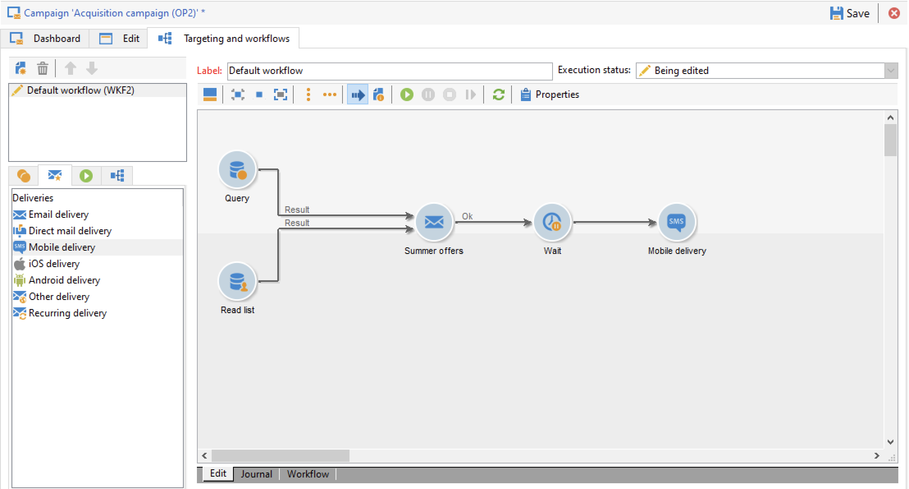
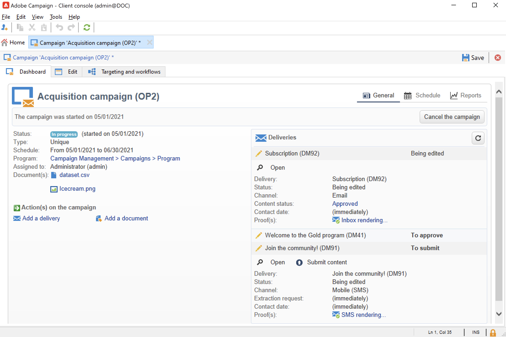

# Introducción a las campañas de marketing{#gs-ac-campaigns}

Adobe Campaign ofrece un conjunto de soluciones que le ayudan a personalizar y entregar campañas en todos sus canales en línea y sin conexión. Puede crear, configurar, ejecutar y analizar campañas de marketing. Todas las campañas de marketing se pueden administrar desde un centro de control unificado. Descubra cómo examinar y crear campañas de marketing en esta sección.

Las campañas incluyen acciones (envíos) y procesos (importación o extracción de archivos), así como recursos (documentos de marketing, descripciones de envíos). Todos ellos se utilizan en las campañas de marketing. Las campañas son parte de un programa y los programas se incluyen en un plan de campaña.

## Organización de campañas en canales múltiples{#cross-channel-orchestration}

Adobe Campaign le permite diseñar y organizar campañas dirigidas y personalizadas en varios canales: correo electrónico, correo directo, SMS, notificaciones push. Una sola interfaz proporciona todas las funcionalidades necesarias para programar, organizar, configurar, personalizar, automatizar, ejecutar y medir todas las campañas y comunicaciones.

### Conceptos básicos{#ac-core-concepts}

Antes de comenzar a implementar campañas de marketing, debe estar familiarizado con los siguientes conceptos:

* **Campaña de marketing**: una campaña unifica todos los elementos relacionados con una campaña de marketing, como envíos, reglas de direccionamiento, costes, archivos de exportación, documentos relacionados, etc. Cada campaña se adjunta a un programa.

* **Programa**: un programa permite definir acciones de marketing para un periodo de calendario (lanzamiento, escrutinio, lealtad, etc.). Cada programa contiene campañas vinculadas a un calendario, que proporciona una vista general.

* **Plan**: el plan de marketing puede contener varios programas. Está vinculado a un periodo, tiene un presupuesto asignado y también puede estar vinculado a documentos y objetivos.

* **Flujo de trabajo de la campaña**: un flujo de trabajo de campaña contiene actividades para crear la lógica de campaña. Utilice flujos de trabajo de la campaña para definir audiencias y crear envíos para todos los canales disponibles.

* **Campañas recurrentes**: las campañas recurrentes se crean a partir de una plantilla específica que define la plantilla de flujo de trabajo que se va a ejecutar y la programación de ejecución.

* **Campaña periódica**: una campaña periódica es una campaña creada automáticamente según la programación de ejecución de su plantilla.

## Espacio de trabajo de campañas de marketing{#ac-workspace}

Adobe Campaign permite crear, configurar, ejecutar y analizar todas las campañas de marketing desde un centro de control unificado.

 Descubra cómo acceder e implementar campañas de marketing en la [documentación de Campaign Classic v7](https://experienceleague.adobe.com/docs/campaign-classic/using/orchestrating-campaigns/about-marketing-campaigns/accessing-marketing-campaigns.html?lang=es#orchestrating-campaigns){target=&quot;_blank&quot;}

## Pasos clave para comenzar{#gs-ac-start}

Los pasos clave para crear una campaña de marketing multicanal son estos:

1. **Planificar y diseñar programas y campañas de marketing**

   Defina la jerarquía y la programación, establezca el presupuesto, añada recursos, y seleccione operadores.

    Obtenga información sobre cómo crear un plan de marketing y configurar campañas en la [documentación de Campaign Classic v7](https://experienceleague.adobe.com/docs/campaign-classic/using/orchestrating-campaigns/orchestrate-campaigns/setting-up-marketing-campaigns.html?lang=es#creating-plan-and-program-hierarchy){target=&quot;_blank&quot;}

   Todas las campañas de marketing se basan en una plantilla que almacena las configuraciones y capacidades principales. Se proporciona una plantilla para crear una campaña sin ninguna configuración específica definida. Puede crear y configurar las plantillas de campañas y luego crear campañas a partir de estas plantillas.

    Aprenda a usar plantillas de campaña en la [documentación de Campaign Classic v7](https://experienceleague.adobe.com/docs/campaign-classic/using/orchestrating-campaigns/orchestrate-campaigns/marketing-campaign-templates.html?lang=es#orchestrating-campaigns){target=&quot;_blank&quot;}

    Descubra campañas recurrentes y cómo configurarlas en la [documentación de Campaign Classic v7](https://experienceleague.adobe.com/docs/campaign-classic/using/orchestrating-campaigns/orchestrate-campaigns/setting-up-marketing-campaigns.html?lang=es#recurring-and-periodic-campaigns){target=&quot;_blank&quot;}

1. **Definir audiencias**

   Puede crear la audiencia en un flujo de trabajo o seleccionar un grupo existente, como una lista de destinatarios, suscriptores de un boletín informativo, destinatarios de una entrega anterior o cualquier condición de filtrado.

   

    Aprenda a definir la audiencia de sus mensajes en la [documentación de Campaign Classic v7](https://experienceleague.adobe.com/docs/campaign-classic/using/orchestrating-campaigns/orchestrate-campaigns/marketing-campaign-target.html?lang=es#orchestrating-campaigns){target=&quot;_blank&quot;}

1. **Creación de entregas**

   Seleccione los canales, defina el contenido del mensaje e inicie las entregas.

   

    Obtenga información sobre cómo crear e iniciar entregas de campañas de marketing en la [documentación de Campaign Classic v7](https://experienceleague.adobe.com/docs/campaign-classic/using/orchestrating-campaigns/orchestrate-campaigns/marketing-campaign-deliveries.html?lang=es#creating-deliveries){target=&quot;_blank&quot;}

   Puede asociar varios documentos a una campaña: informe, foto, página web, diagrama, etc.

    Obtenga más información acerca de los documentos asociados en la [documentación de Campaign Classic v7](https://experienceleague.adobe.com/docs/campaign-classic/using/orchestrating-campaigns/orchestrate-campaigns/marketing-campaign-assets.html?lang=es#adding-documents){target=&quot;_blank&quot;}

1. **Configuración del proceso de aprobación**

   Adobe Campaign permite configurar los procesos de aprobación de las etapas principales de la campaña de marketing en modo de colaboración. Para cada campaña, puede aprobar el objetivo de entrega, los contenidos y los costes. Los operadores de Adobe Campaign responsables de la aprobación pueden recibir notificaciones por correo electrónico y aceptar o rechazar la aprobación a través de la consola o de una conexión web.

    Obtenga información sobre cómo configurar y administrar aprobaciones en la [documentación de Campaign Classic v7](https://experienceleague.adobe.com/docs/campaign-classic/using/orchestrating-campaigns/orchestrate-campaigns/marketing-campaign-approval.html?lang=es#orchestrating-campaigns){target=&quot;_blank&quot;}

## Complemento de marketing distribuido{#distributed-marketing-add-on}

Adobe Campaign ofrece un complemento de **Marketing distribuido** para implementar campañas cooperativas entre entidades centrales (sede central, departamentos de marketing, etc.) y entidades locales (tiendas, agencias regionales, etc.). Esta cooperación se basa en un espacio de trabajo compartido denominado **[!UICONTROL List of campaign packages]**, donde las entidades locales pueden encontrar plantillas de campañas diseñadas por entidades centrales.

>[!NOTE]
>
>Esta capacidad está disponible a partir de la versión 8.3 de Campaign. Para comprobar su versión, consulte [esta sección](compatibility-matrix.md#how-to-check-your-campaign-version-and-buildversion)

 Obtenga información sobre cómo configurar y utilizar las funcionalidades de marketing distribuido de Campaign en [Documentación de la versión 7 de Campaign Classic](https://experienceleague.adobe.com/docs/campaign-classic/using/distributed-marketing/about-distributed-marketing.html?lang=es){target=&quot;_blank&quot;}

## Complemento de gestión de respuestas{#response-manager-add-on}

Adobe Campaign ofrece un complemento de **gestión de respuestas** que le permite medir el éxito y la rentabilidad de las campañas de marketing u ofrecer propuestas para todos los canales de comunicación: correo electrónico, móvil, correo directo, etc.

>[!NOTE]
>
>Esta capacidad está disponible a partir de la versión 8.3 de Campaign. Para comprobar su versión, consulte [esta sección](compatibility-matrix.md#how-to-check-your-campaign-version-and-buildversion)

 Obtenga información sobre cómo configurar y utilizar el Gestor de respuestas de Campaign en la [Documentación de la versión 7 de Campaign Classic](https://experienceleague.adobe.com/docs/campaign-classic/using/response-manager/about-response-manager.html?lang=es){target=&quot;_blank&quot;}

